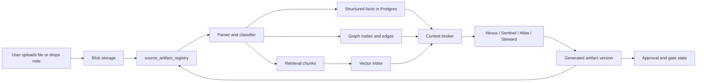

# Next Slice: Source Artifact Ingestion and AMS Pricing Intelligence

Date: 2026-04-30
Status: planned
Scope: Source event document ingestion, context-aware artifact generation, AMS pricing intelligence, and approval-ready outputs

## 1. Purpose

AbarVa Source must treat uploaded sourcing documents and generated artifacts as first-class knowledge objects, not file attachments sitting beside the workflow.

This slice defines the capability contract for:

- uploading sourcing documents into tenant-owned blob storage,
- parsing and classifying those documents into a source artifact registry,
- extracting facts, chunks, graph relationships, and pricing structures,
- making those objects available to Nexus, Sentinel, Atlas, and Steward,
- generating RFI, RFP, BAFO, pricing workbook, scorecard, and decision artifacts,
- persisting generated artifacts back to the event with versioning and approval state,
- keeping every answer, artifact, and recommendation grounded in evidence.

The product goal is simple: a sourcing lead should be able to run a real AMS sourcing event without leaving Source for process discipline, document assembly, pricing normalization, or next-step guidance.

## 2. Product Principle

Document generation is not the feature. Governed sourcing work is the feature.

The app must make these five things work together:

| Layer | Role | Source example |
| --- | --- | --- |
| Blob storage | Durable file storage | Vendor proposal PDF, pricing workbook XLSX, workshop notes DOCX |
| Registry + Postgres | Structured facts and workflow state | Artifact version, stage, owner, approval state, parsed pricing fields |
| Graph | Relationship and dependency reasoning | Vendor -> proposal -> exception -> gate blocker -> approval owner |
| Vector index | Semantic retrieval over chunks | Find relevant transition risk language even if the user asks about KT or takeover |
| Agents | Synthesis, coaching, and artifact drafting | Generate BAFO questions, RFP sections, pricing traps, decision brief |

Agents should never cite raw uploaded files directly. They cite parsed, classified, and provenance-bearing registry entries, chunks, facts, graph paths, or artifact versions.

## 3. End-to-End Ingestion Flow

Required flow:

Ingestion should be asynchronous and visible. Upload completion is not the same as knowledge availability.

## 4. Artifact Registry Contract

Every uploaded or generated document should create or update a registry row.

Minimum registry fields:

| Field | Meaning |
| --- | --- |
| `artifact_id` | Stable artifact identity. |
| `tenant_key` | Tenant isolation key. Required for every query and vector filter. |
| `source_event_id` | Source event ownership. |
| `stage_key` | Current or intended stage, such as intake, RFI, RFP, BAFO, selection. |
| `artifact_family` | RFI, RFP, BAFO, scorecard, pricing_workbook, proposal, meeting_notes, workshop_output, decision_brief. |
| `artifact_kind` | Specific type, such as AMS RFP package or vendor pricing workbook. |
| `source_origin` | uploaded, generated, reuploaded, imported, note_capture. |
| `source_format` | pdf, docx, xlsx, pptx, html, markdown, csv, txt. |
| `blob_uri` | Storage pointer. Not exposed to the model unless explicitly allowed. |
| `parse_status` | pending, parsing, parsed, failed, needs_review. |
| `embedding_status` | pending, embedded, failed, not_applicable. |
| `graph_status` | pending, projected, failed, not_applicable. |
| `classification_status` | pending, classified, ambiguous, rejected. |
| `data_classification` | Public, Internal, Confidential, Restricted. |
| `evidence_state` | unparsed, parsed_uncited, cited, challenged, superseded. |
| `approval_state` | not_required, draft, in_review, approved, rejected, locked. |
| `version` | Current version number. |
| `supersedes_artifact_version_id` | Prior version when applicable. |
| `created_by` | User or agent. |
| `validated_by` | Human or agent validation owner. |
| `created_at` | Timestamp. |
| `updated_at` | Timestamp. |

The Source UI should expose this state as a receipt: uploaded, parsing, parsed, chunked, embedded, graph-linked, available to agents, cited in output.

## 5. Parsed Object Types

The parser should produce typed objects that agents can reason over.

| Object type | Examples |
| --- | --- |
| `source_document_chunk` | RFP scope paragraph, vendor transition-plan excerpt, legal exception text. |
| `source_fact` | Base run cost, transition cost, app count assumption, SLA credit cap. |
| `source_pricing_component` | Fixed run fee, optional service line, setup fee, rate escalation. |
| `source_commercial_exception` | Excluded release support, excluded minor enhancements, uncapped change-order rate. |
| `source_requirement` | Security requirement, SOC 2 requirement, coverage window, KT requirement. |
| `source_vendor_commitment` | Price-down commitment, automation target, staffing mix, SLA promise. |
| `source_meeting_outcome` | Decision, action item, parking lot, dissent, approval ask. |
| `source_graph_edge` | Proposal cites evidence; vendor has exception; artifact blocks gate; owner approves artifact. |

Every extracted object must retain provenance:

- artifact id,
- artifact version,
- page/sheet/section when available,
- source excerpt hash,
- parser confidence,
- data classification,
- human validation status.

## 6. Context Broker Requirements

The Source context bundle must include event-local deterministic state before it reaches for broader tenant or worldview context.

Priority order:

1. Source event facts and stage state.
2. Uploaded and generated artifact registry entries for the current event.
3. Parsed pricing facts, commercial exceptions, requirements, and commitments.
4. Gate criteria, approval status, and blocker state.
5. Vendor records and proposal comparisons.
6. Related program facts and source-to-program dependencies.
7. Tenant context from Postgres/graph/vector.
8. Pattern corpus and AMS sourcing doctrine.
9. Worldview or strategy context only when the user asks strategic questions.

The broker should return a typed `SourceContextBundle` with:

- `eventFacts`,
- `stageState`,
- `artifactVersions`,
- `pricingFacts`,
- `commercialExceptions`,
- `vendorCommitments`,
- `requirements`,
- `graphPaths`,
- `semanticChunks`,
- `patternMatches`,
- `approvalState`,
- `missingEvidence`,
- `contextUsedReceipt`.

If a page visibly renders vendor/pricing data, the agent must have that same data in the bundle. A user should never see a vendor tile while Sentinel says the vendor responses are not loaded.

## 7. RFI / RFP Generation Capability

Generated RFI/RFP artifacts should be section-aware, stage-aware, and evidence-aware.

Minimum generated artifacts for AMS:

| Artifact | Required stage | Required inputs |
| --- | --- | --- |
| Sourcing strategy memo | Intake / plan | trigger, owner, business objective, scope boundary, stop condition. |
| AMS scope document | Scope / RFI | app inventory, service towers, support hours, retained team model, exclusions. |
| RFI package | RFI | sourcing thesis, vendor qualification criteria, response template, minimum evidence. |
| RFP package | RFP | locked scope, requirements, pricing template, scorecard weights, legal/security asks. |
| Vendor response template | RFP | required response sections, pricing schema, evidence checklist. |
| Pricing workbook | RFP / responses | normalized pricing fields and required assumptions. |
| Evaluation scorecard | Shortlist / responses | criteria, weights, evidence rules, disqualifiers. |
| BAFO negotiation pack | BAFO | normalized comparison, exceptions, traps, walkaway, negotiation asks. |
| Executive decision brief | Selection | preferred vendor, runner-up, economics, risks, dissent, approval ask. |
| Transition risk register | Award / onboard | KT plan, retained team load, critical apps, exit criteria. |

Generation rules:

- A rich artifact requires required inputs or explicit waivers.
- Missing inputs create a `Needs Inputs` artifact, not fabricated content.
- Every generated claim must cite a registry object, parsed fact, chunk, graph edge, or pattern id.
- Generated artifacts are persisted as artifact versions.
- External edits create new versions when re-uploaded.
- Locked/issued versions cannot be silently overwritten.

## 8. AMS Pricing Intelligence Requirements

The product should support AMS pricing intelligence without requiring licensed benchmark data.

Primary data sources:

- client ITSM history,
- application/service inventory,
- incumbent run cost,
- retained team baseline,
- vendor proposal pricing,
- vendor staffing plan,
- vendor transition plan,
- commercial exceptions,
- AbarVa AMS pattern pack.

Parsed pricing fields:

| Field | Why it matters |
| --- | --- |
| Base annual run cost | Recurring steady-state comparison. |
| Transition cost | Prevent hidden year-one economics. |
| Setup cost | Separates implementation from run economics. |
| App count assumption | Normalizes portfolio scope. |
| Ticket volume assumption | Tests whether price covers actual demand. |
| Severity mix assumption | Tests critical incident support economics. |
| Support hours | Finds after-hours and global coverage gaps. |
| Service tower coverage | Prevents omitted towers from looking cheaper. |
| Onshore/offshore/nearshore mix | Tests delivery feasibility and transition risk. |
| Role rate card | Supports labor-rate and change-order negotiation. |
| Fixed/variable split | Shows where demand risk sits. |
| Automation productivity assumption | Tests whether savings are committed or aspirational. |
| Escalation and price-down schedule | Shows year-two and year-three economics. |
| Retained team assumptions | Captures hidden client-side workload. |
| Exclusions and optional services | Makes non-comparable bids visible. |

## 9. AMS Pricing Outputs

The pricing engine/read model should produce:

- year 1 / year 2 / year 3 vendor cost,
- transition-inclusive cost,
- run-rate-only cost,
- cost per application,
- cost per ticket,
- cost per severity band where data exists,
- cost by service tower,
- retained-team burden estimate,
- fixed-versus-variable exposure,
- rate-card exposure,
- normalized comparable cost,
- risk-adjusted commercial posture,
- commercial traps,
- negotiation levers,
- BAFO questions,
- value ledger impact.

This does not require the agent to know a universal market price. The first win is comparability and negotiation discipline.

## 10. Labor Rate and Delivery Mix Intelligence

Source should model onshore/offshore/nearshore labor explicitly.

Required dimensions:

| Dimension | Examples |
| --- | --- |
| Location mix | US onshore, Canada/Mexico nearshore, India offshore, Eastern Europe offshore. |
| Role mix | Service manager, L1 analyst, L2 engineer, L3 SME, transition lead, automation engineer. |
| Pricing basis | fixed fee, T&M rate card, capacity unit, ticket band, application band, outcome/gainshare. |
| Criticality mapping | critical apps require higher onshore or named SME coverage during transition. |
| KT maturity | offshore ramp allowed only after KT and runbook criteria are met. |
| Time-zone coverage | follow-the-sun, business-hours, 24x7, major incident only. |

Agent guidance:

- Heavy offshore mix is not automatically bad.
- Heavy offshore mix during a weak-KT transition is a risk.
- Low onshore transition staffing can indicate hidden retained-client burden.
- Fixed price is good only when scope, volume bands, exclusions, and change-order rules are locked.
- Variable pricing is good only when demand volatility is real and unit rules are transparent.

## 11. Negotiation Strategy Outputs

For each vendor, Source should generate:

- `topCommercialRisks`,
- `mustClarifyBeforeBAFO`,
- `mustLockBeforeAward`,
- `contractingCanHandle`,
- `walkawayConsiderations`,
- `pricingAsk`,
- `scopeAsk`,
- `transitionAsk`,
- `automationAsk`,
- `SLAAsk`,
- `retainedTeamAsk`,
- `evidenceNeeded`.

Example output:

> Vendor A is lowest on base run cost, but not comparable until transition, release support, and minor enhancement assumptions are priced. Nexus should ask for transition-inclusive pricing, a minor-enhancement capacity bank, and a year-two automation price-down tied to ticket deflection. Steward should block selection until the pricing workbook and exception log are locked.

## 12. Agent Responsibilities

| Agent | Responsibility |
| --- | --- |
| Nexus | Runs the workflow, asks one focused question, drafts artifacts, recommends next action. |
| Sentinel | Verifies claims against parsed evidence, flags unsupported pricing and missing context. |
| Atlas | Produces executive tradeoff views and portfolio/value implications. |
| Steward | Enforces gate, approval, version, classification, and lock discipline. |

Agents must act like consulting partners:

- short responses,
- 3-4 choices plus custom input when collecting data,
- one focused follow-up question,
- no long intake essays,
- clear next-step coaching after every user action,
- refusal when evidence is missing or restricted.

## 13. UX Requirements

The Source event page should show:

- paperclip in the chat composer,
- upload status and ingestion receipt,
- context-used drawer per agent turn,
- artifact generation drawer,
- artifact preview and export actions,
- pricing workbook preview,
- gate/approval state beside artifact status,
- right-rail progress: "what good looks like" and event readiness percent,
- next-step coaching after upload, meeting note sync, generated artifact, or approval.

The user should be able to ask:

- "Generate the RFP package."
- "Create the pricing workbook."
- "Which bid is weakest commercially?"
- "What should we ask in BAFO?"
- "What should I cover in the vendor workshop?"
- "Sync these meeting notes and update gates."
- "Can I move to Selection?"

The answer should be grounded in event artifacts and should update the right pane dynamically.

## 14. Data Model Additions

Likely tables or logical models:

- `source_artifacts`
- `source_artifact_versions`
- `source_artifact_chunks`
- `source_artifact_facts`
- `source_pricing_components`
- `source_commercial_exceptions`
- `source_vendor_commitments`
- `source_requirements`
- `source_meeting_outcomes`
- `source_artifact_approvals`
- `source_graph_edges`
- `source_context_receipts`

These should follow the same tenant isolation and provenance rules as the pattern and enterprise-context data layers.

## 15. Implementation Slices

Recommended order:

1. Artifact registry schema and event attachment model.
2. Blob upload from Source chat composer and Add Evidence form.
3. Async ingestion receipt states: uploaded, parsing, parsed, chunked, embedded, graph-linked.
4. Parser output contract with deterministic fixture parser for AMS proposal/pricing files.
5. Source context broker extension for event-local artifacts and pricing facts.
6. Artifact generation endpoint that persists HTML/Markdown versions first.
7. DOCX/XLSX export for RFP package and pricing workbook.
8. Pricing normalization read model for AMS.
9. BAFO negotiation pack generation.
10. Approval/lock/reopen workflow for generated artifacts.
11. Context-used drawer and right-rail readiness updates.
12. Crawler test: create event, upload docs, generate RFP/pricing workbook, approve, advance gate.

## 16. Acceptance Criteria

This capability is ready for an end-to-end crawl when:

- upload creates a blob object and registry row,
- parse status is visible in the UI,
- parsed facts/chunks/edges are queryable by the Source context broker,
- Sentinel cites artifact/chunk/fact IDs rather than raw file names,
- Nexus can generate an RFP package from available evidence,
- Nexus can generate a pricing workbook from parsed pricing components,
- generated artifacts persist as versions,
- approval/lock state is visible and enforceable,
- BAFO questions are generated from normalized pricing gaps and commercial exceptions,
- context-used drawer lists event facts, artifacts, chunks, graph paths, and pattern ids used,
- missing evidence blocks rich artifacts and stage advancement unless waived,
- every step gives the team guidance on how to prepare for the next step.

## 17. Explicit Non-Goals

This slice does not require:

- paid market benchmark feeds,
- perfect parsing of every arbitrary document format,
- live procurement system write-back,
- autonomous vendor communication,
- legal advice,
- final contract drafting without human review.

It does require the app to make uploaded and generated documents part of the same knowledge layer as patterns: blob, registry, chunks, vectors, graph, Postgres facts, provenance, and agent context.
