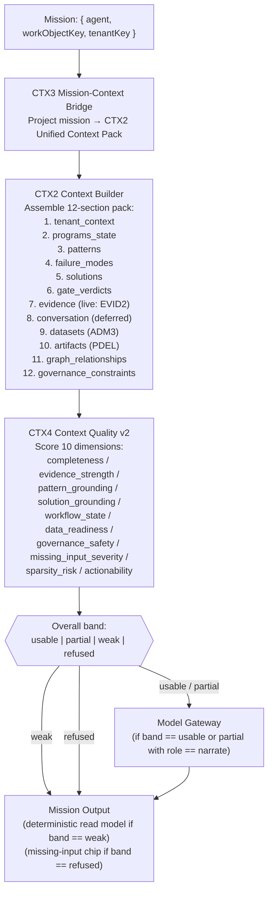

# AbarVa Agent Mission Runtime

Slice ID: ARCH3
Document: ABARVA_AGENT_MISSION_RUNTIME.md
Status: code_complete
Authored: 2026-04-26
Author: Code (sole)
Type: Specification / architecture document — no application code,
no runtime modification, no migrations, no model calls.

This document covers the AbarVa Agent Mission Runtime: the four
canonical agents, the mission queue, context injection, output
constraints, and the audit trail that closes every agent action.

---

## 1. Agent design philosophy

AbarVa's agentic spine is **calm and bounded**. Each agent has:

1. A **single job** — named in one sentence.
2. A **refusal contract** — what the agent explicitly refuses to do.
3. A **read contract** — which read models and sources it consults.
4. An **emit contract** — what typed outputs it produces.
5. **No direct provider access** — all model calls through the gateway.

A calm agentic spine earns user trust by being boring at runtime.
Deterministic read models compose first; the model augments narrative
second. The model never displaces the deterministic source of truth
(ARCH1 §2.5).

---

## 2. The four agents

### 2.1 Nexus — Mastermind

**Job.** Compose program-level recommendations, frame use cases,
sequence phases, recommend next workshops, surface next deliverables.

**Refuses.**
- To compose against a `low_context` bundle.
- To recommend a value figure without a value-ledger row.
- To fabricate a gate verdict (that is Steward's job).
- To call a provider directly (every call routes through the gateway).
- To auto-promote a deliverable past its current tier without user intent.

**Reads.**
- Programs read model (S9 / S9b–g).
- Context bundle (S1 / S2).
- Evidence ledger (E-### citations).
- Sentinel detections (I1).
- Steward gate verdicts.
- Solution archetypes (SOL2) via failure-mode mapping.
- Workshop readiness (MW2).

**Emits.**
- Recommendations flagged `createdFrom: 'gateway_compose'`.
- Narrative for deliverables (Stub → Outline → Rich).
- Draft workshop agendas.
- Draft charter prose.
- All emits carry provenance ribbon and missing-input chips.

**Surface home.** Programs (`/tenant/<slug>/programs/...`),
Maestro (`/tenant/<slug>/maestro`).

### 2.2 Sentinel — Intelligence

**Job.** Detect patterns (I1) and failure modes (PF1). Surface
recurrence. Compose Sentinel briefs (I2). Render pattern detail (I3 /
I4).

**Refuses.**
- To name a cross-program operating-model gap from a single program
  (I1 confidence calibration — single-program max `medium`).
- To claim `high` confidence on seed alone without cross-program
  recurrence.
- To fabricate a detection that the seed does not justify.
- To call a provider directly.

**Reads.**
- S9e control-tower signals.
- Seed plan / evidence ledger.
- Programs read model.
- I1 pattern pack.
- PF1 failure-mode catalog.

**Emits.**
- Pattern detections flagged `createdFrom: 'deterministic_seed'` (v0).
- Failure-mode flags.
- Sentinel briefs (I2).
- Pattern detail cards (I3 / I4).
- All emits carry `sourceSignalIds` — detections without a source signal
  id are in violation.

**Surface home.** Intelligence (`/tenant/<slug>/intelligence`).

### 2.3 Atlas — Control Tower

**Job.** Compose the executive Tower brief (ACT1). Surface top three
pressure cards. Sequence the next steering decision. Render the AI
operating brief.

**Refuses.**
- To exceed five scorecards on a single Tower.
- To exceed three pressure cards on a single Tower.
- To narrate a value figure without a ledger row.
- To claim portfolio-level conclusions from sub-portfolio scope.
- To present a metrics wall (the Tower answers three questions in
  three minutes).
- To call a provider directly.

**Reads.**
- Tower dimensions read models (ACT2 → ACT8).
- Sentinel detections.
- Steward gate verdicts.
- Programs read model (cross-program roll-up).

**Emits.**
- Tower brief flagged `createdFrom: 'gateway_compose'` (narrative) or
  `createdFrom: 'deterministic_read_model'` (dimensions).
- Pressure cards.
- Lens projections.
- Steering-decision next step.

**Surface home.** Tower (`/tenant/<slug>/tower`).

### 2.4 Steward — Governance

**Job.** Evaluate gates (G1 Charter, G2 Architecture, G3 Build / Risk,
G4 Adopt / Scale). Issue gate verdicts. Surface RAI / risk / regulatory
constraints. Author governance review prompts.

**Refuses.**
- To issue a `pass` verdict on a gate whose criteria are not met.
- To compose a verdict without naming the criterion.
- To hide an RAI flag.
- To issue a verdict without citing at least one E-### evidence row.
- To call a provider directly.

**Reads.**
- Gate criteria pack (deterministic).
- Context bundle.
- Evidence ledger.
- Programs read model.
- RAI / risk flags.
- Dataset approval states (TRUST3).

**Emits.**
- Gate verdicts: `pass` / `pass_with_conditions` / `block` /
  `needs_review`. Each carries `criteriaMet[]`, `raiFlags[]`, `remedy`.
- RAI flags.
- Governance review notes.
- Steward escalation guidance.

**Surface home.** Admin (`/tenant/<slug>/admin`), Programs gate panels.

---

## 3. Mission queue

The AG10 mission queue is the typed list of pending agent missions.
Each mission carries:

```
AgentMission {
  missionId: string
  agent: 'nexus' | 'sentinel' | 'atlas' | 'steward'
  surface: SurfaceKind
  workObjectKind: WorkObjectKind
  workObjectKey: string
  tenantKey: string
  status: MissionStatus
    // proposed | queued | in_progress | awaiting_context
    // awaiting_human | completed | blocked | deferred | cancelled
  priority: 'critical' | 'high' | 'medium' | 'low'
  trigger: MissionTrigger
    // user_request | platform_event | scheduled | agent_handoff | manual
  contextReadiness: ContextReadiness
    // ready | partial | low | refused
  handoffMetadata?: CrossAgentHandoff
  outputConstraints: MissionOutputConstraints
  auditBasis: AuditBasis
  createdFrom: 'deterministic_seed'  // v0; future: runtime_event
}
```

### 3.1 Mission lifecycle

```mermaid
stateDiagram-v2
    [*] --> proposed: user request / platform event / schedule
    proposed --> queued: context readiness check passes
    proposed --> awaiting_context: context readiness low or partial
    awaiting_context --> queued: evidence / state added; re-check passes
    queued --> in_progress: dispatcher picks up mission
    in_progress --> awaiting_human: human approval required (gate review / waiver)
    awaiting_human --> in_progress: human approves
    awaiting_human --> blocked: human blocks
    in_progress --> completed: mission output emitted + audit row appended
    in_progress --> blocked: SEC1 policy deny or unrecoverable tool failure
    in_progress --> deferred: cost budget exceeded / latency budget exceeded
    completed --> [*]
    blocked --> [*]: requires manual resolution
    deferred --> queued: cost / latency conditions met
    cancelled --> [*]: user or admin cancels
```

### 3.2 Cross-agent handoffs

An agent may hand off to another agent when the work object's needs
exceed its bounded job. AG13 defines 22 canonical handoffs:

| Source | Target | Canonical reason |
|---|---|---|
| Nexus | Steward | `governance_review_needed` — deliverable at gate boundary |
| Nexus | Sentinel | `pattern_signal_detected` — program signals match I1 pattern |
| Sentinel | Atlas | `executive_escalation_needed` — pattern at portfolio severity |
| Sentinel | Steward | `governance_review_needed` — pattern implies gate implication |
| Atlas | Nexus | `program_action_needed` — pressure card requires program-level action |
| Atlas | Steward | `governance_review_needed` — Tower posture requires gate check |
| Steward | Nexus | `artifact_review_needed` — gate verdict requires deliverable revision |

Every handoff carries `sourceAgent !== targetAgent` invariant and a
typed audit basis with rationale and expected resolution.

---

## 4. Context injection

Every agent mission is context-injected before any model call. The
context injection flow:



The agent never calls the gateway if the context quality band is
`refused`. It may call the gateway with role `narrate` if the band is
`partial` — narrate is the permissive role that augments a deterministic
read model with prose. Compose and score roles require `usable` minimum.

---

## 5. Output constraints

Every agent output carries:

| Constraint | Description |
|---|---|
| `createdFrom` marker | `deterministic_seed` / `deterministic_pattern_pack` / `deterministic_read_model` / `gateway_compose` |
| `tier` | For deliverables: `stub` / `outline` / `rich` |
| `renderMode` | `html_render` / `markdown_render` / `pdf_export` / `docx_export` / `ppt_export` / `no_render` |
| Evidence binding count | Number of resolved E-### citations |
| Missing-input chips | Named gaps; every gap has a `remedy` field |
| Provenance ribbon | `agent`, `model` (when gateway used), `agentVersion`, `gatewayVersion` |

An agent output that:
- Has no `createdFrom` marker — is in violation (ARCH1 §2.3).
- Names a dollar value without a value-ledger row — is in violation (ARCH1 §2.7).
- Cites an E-### not in the evidence ledger — is in violation (ARCH1 §12.7).
- Claims `high` confidence on a single-program Sentinel detection — is in violation (ARCH1 §12.9).

---

## 6. Audit trail

Every agent mission closes with an audit row. The audit trail captures:

```
AgentAuditTrail {
  missionId: string
  tenantKey: string
  agent: AgentKind
  surface: SurfaceKind
  workObjectKind: WorkObjectKind
  workObjectKey: string
  contextBundleHash: string
  contextQualityBand: ContextQualityBand
  gatewayCallCount: number          // 0 for fully deterministic missions
  totalTokensIn: number
  totalTokensOut: number
  totalCostUsd: number
  toolCallIds: string[]
  handoffs: CrossAgentHandoffId[]
  outputKind: AgentOutputKind
  createdFrom: ProvenanceMarker
  startedAt: ISO8601
  completedAt: ISO8601
  auditRowIds: string[]
}
```

The audit trail is the full reconstruction of the mission from
`proposed` to `completed`. It enables:

- **Reproducibility** — re-running the same context bundle hash
  through the gateway to verify response consistency.
- **Cost attribution** — per-mission cost breakdown.
- **Compliance review** — complete record of what the agent did, what
  it read, and what it emitted.

---

## 7. Platform event loop

Every completed mission emits a `PlatformEvent` that may trigger
downstream recomputation:

| Event type | Triggered by | Downstream effect |
|---|---|---|
| `phase_advanced` | Nexus program state write | S9e signal recompute; I1 pattern recompute; ACT1 Tower recompose |
| `gate_verdict_changed` | Steward gate verdict | S9 gate state update; Atlas Tower posture update |
| `deliverable_tier_promoted` | Nexus deliverable promotion | PDEL evidence trace update |
| `value_ledger_updated` | Program state write with value | Tower value lens update; Atlas pressure card recompute |
| `evidence_added` | Evidence pipeline persist | Context bundle quality upgrade for affected work objects |
| `rai_flag_raised` | Steward RAI detection | Gate verdict forces `block`; Tower surfaces flag |
| `workshop_scheduled` | Nexus workshop scheduling | MW2 readiness update |
| `pattern_detected` | Sentinel pattern detection | Atlas pressure card; Nexus recommended action |
| `pattern_resolved` | Sentinel pattern resolution | Atlas pressure card removed |
| `failure_mode_flagged` | PF1 mapping | Nexus recommended intervention; Steward gate implication |

The event loop is deterministic at v0 (seed-bounded). Live event
persistence and cross-steering recurrence detection land in future slices.

---

## 8. What is live today vs. production target

| Component | Today | Target |
|---|---|---|
| Nexus read-model | Fully wired (S9 / S9b–g) | Live gateway narrate/compose |
| Sentinel detection | Fully wired (I1 seed) | Live recurrence promotion |
| Atlas Tower | Fully wired (ACT1 dimensions) | Live gateway compose |
| Steward gate verdicts | Deterministic (S9 gate state) | Live evaluator |
| Mission queue | AG10 seed (deterministic) | Live runtime event queue |
| Mission panel | AG11 / AG12 wired to seed | Live queue mount |
| Cross-agent handoffs | AG13 seed (22 entries) | Live runtime dispatch |
| Context injection | CTX2 / CTX3 / CTX4 wired | Live EVID2 + conversation binding |
| Gateway dispatch | Contract defined | `src/lib/gateway/dispatch.ts` |
| Tool dispatch | TOOL2 / TOOL3 / SEC1 wired | TOOL4 live dispatcher |
| Audit trail | Audit row schema defined | AUD2 live append-only ledger |
| Platform event loop | Deterministic signal recompute | Live event bus + persistence |

---

## End of ABARVA_AGENT_MISSION_RUNTIME

This concludes the ARCH3 AbarVa Architecture Overview Pack. For the
top-level overview read ABARVA_ARCHITECTURE_OVERVIEW. For the execution
flow read ARCH2 (NEXUS_END_TO_END_EXECUTION_FLOW). For the non-
negotiable technical principles read ARCH1 (AGENTIC_PLATFORM_ARCHITECTURE_CONTRACT).
