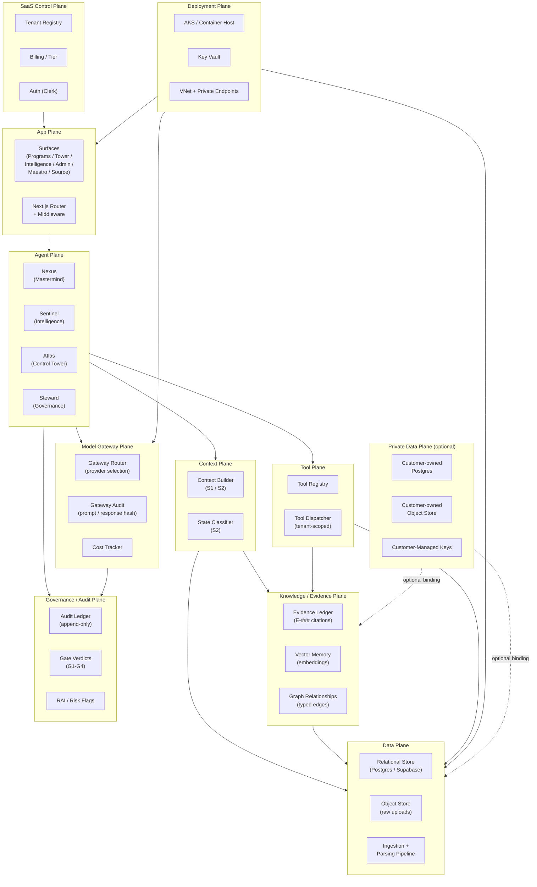

# AbarVa Architecture Overview

Slice ID: ARCH3
Document: ABARVA_ARCHITECTURE_OVERVIEW.md
Status: code_complete
Authored: 2026-04-26
Author: Code (sole)
Type: Specification / architecture overview — no application code,
no runtime modification, no migrations, no model calls.

This document is the top-level architectural overview of the AbarVa
platform. It names every architectural plane, shows how they compose,
and gives a reader a map to navigate the detailed per-plane
documentation in the ARCH3 pack.

ARCH1 governs the non-negotiable technical principles. ARCH2 governs
the end-to-end execution flow. ARCH3 (this pack) provides a
system-wide plane map and per-plane deep dives for founders, board
reviewers, enterprise architects, and security reviewers who need the
full topology before evaluating a deployment.

---

## 1. What AbarVa is

AbarVa is a **SaaS operating experience with a governed intelligence
fabric and optional private data plane**.

A single sentence for the boardroom: AbarVa helps a CIO / CFO / CAIO /
CTO / Value Office run AI programs with discipline — from origination
to verified value realization — without losing the narrative chain from
a steering question to the evidence behind every recommendation.

AbarVa is not a chat app. It is not generic RAG. It is a calm
intelligence layer whose agentic spine enforces evidence citation,
provenance tracing, and governance gating on every surface.

---

## 2. Architectural planes

AbarVa composes eleven canonical architectural planes. Each plane has a
bounded job, a set of key components, and defined interfaces to adjacent
planes. No plane has a circular dependency; the dependency graph is a
directed acyclic graph flowing from the SaaS Control Plane at the top
to the Private Data Plane as an optional extension at the bottom.

| Plane | Short name | Primary job |
|---|---|---|
| App Plane | APP | Render surfaces; enforce auth; route requests |
| Agent Plane | AGENT | Execute bounded agent missions (Nexus, Sentinel, Atlas, Steward) |
| Context Plane | CTX | Assemble typed context bundles from all downstream planes |
| Knowledge / Evidence Plane | KE | Evidence ledger, vector memory, graph relationships |
| Data Plane | DATA | Raw uploads, relational state, object store |
| Model Gateway Plane | MG | Single chokepoint for all model calls; routing, audit, cost |
| Tool Plane | TOOL | Typed, tenant-scoped side-effect surface for agents |
| Governance / Audit Plane | GOV | Gate verdicts, RAI flags, audit ledger, compliance |
| Deployment Plane | DEPLOY | Container hosting, infrastructure, DNS, TLS |
| SaaS Control Plane | SCP | Multi-tenant onboarding, billing, tier enforcement |
| Private Data Plane | PDP | Optional customer-owned data residency extension |

---

## 3. Top-level plane map

---

## 4. How planes interact

### 4.1 Request path (inbound)

A user request enters at the **App Plane**. The App Plane authenticates
the user through the SaaS Control Plane (Clerk), resolves the tenant
key from the route slug, and enforces S7 tenant isolation before any
downstream call.

The App Plane dispatches to the **Agent Plane**. The lead agent for the
surface (Nexus for Programs, Sentinel for Intelligence, Atlas for Tower,
Steward for Governance) receives a typed `UserInput` and begins the
sixteen-step ARCH2 execution flow.

### 4.2 Context assembly

The agent calls the **Context Plane** (Context Builder, S1 / S2). The
Context Builder calls downstream planes in parallel:

- **Knowledge / Evidence Plane**: resolves E-### citations from the
  evidence ledger; composes vector memory + graph relationships behind
  the ledger abstraction.
- **Data Plane**: reads the relational state (programs, phases, gates,
  deliverables, signals).
- **Governance / Audit Plane**: reads gate verdicts and RAI flags from
  Steward.

The Context Builder emits a typed `ContextBundle` with a state
classifier and quality scorecard.

### 4.3 Model call path

When composition is required, the agent calls the **Model Gateway
Plane**. The gateway is the single chokepoint: no agent imports a
provider SDK directly. The gateway:

- Assembles the provider-agnostic prompt from the context bundle.
- Routes to the selected provider (Anthropic, OpenAI, Azure OpenAI,
  or future local model).
- Logs the audit row to the **Governance / Audit Plane**.
- Returns a typed `GatewayResponse`.

### 4.4 Side-effect path

When the user mutates state (promotes a deliverable, opens a gate
review, schedules a workshop), the agent calls the **Tool Plane**. The
Tool Dispatcher is tenant-scoped, audited, and refusable. Every mutation
routes through the Tool Plane — never directly from a page component.

### 4.5 Deployment

The **Deployment Plane** hosts all planes. In the standard SaaS
configuration this is AKS (or equivalent container hosting) with VNet
isolation, private endpoints, and Key Vault for secrets. In the optional
Private Data Plane configuration, the Data Plane and Knowledge / Evidence
Plane are extended into customer-owned infrastructure.

### 4.6 Private Data Plane (optional)

Enterprise customers with strict data residency requirements can attach
the **Private Data Plane** as an extension of the Data and Knowledge /
Evidence Planes. Customer-managed keys (CMK) in the customer's Key Vault
encrypt all data at rest. The SaaS Control Plane retains only the
metadata needed to route requests; all tenant payload data stays in the
customer's environment.

---

## 5. Planes not yet production-wired (honest status)

This overview is honest about what is contractually defined vs. live:

| Plane | Today (v0) | Production target |
|---|---|---|
| App Plane | Fully wired; all surfaces render; S7 isolation enforced | Live auth, route smoke, DNS |
| Agent Plane | Deterministic read models; no live gateway routing | Live gateway dispatch |
| Context Plane | S1 / S2 contracts wired; evidence sections honest-empty | Live EVID2 ingest |
| Knowledge / Evidence Plane | Ledger contract defined; seed evidence bound | Live ingest pipeline |
| Data Plane | Relational seed wired; object store not live | Live Supabase + storage |
| Model Gateway Plane | Contract defined; dispatch deferred | Live gateway module |
| Tool Plane | Registry wired (TOOL2); dispatch deferred | Live TOOL4 dispatcher |
| Governance / Audit Plane | Gate verdicts deterministic; audit ledger contract defined | Live audit ledger |
| Deployment Plane | Vercel SaaS; CLOUD4 local lab | AKS reference target (ARCH3) |
| SaaS Control Plane | Clerk auth wired; tenant registry seeded | Full onboarding flow |
| Private Data Plane | TEN4 adapter contract defined | Live per-tenant adapter |

---

## 6. Document map for this pack

| Document | Covers |
|---|---|
| ABARVA_ARCHITECTURE_OVERVIEW.md (this file) | Top-level plane map and interaction model |
| ABARVA_PLANES_ARCHITECTURE.md | Per-plane deep dive: purpose, components, interfaces, status |
| ABARVA_REQUEST_TO_CONTEXT_FLOW.md | Request → Context → Agent → Output sequence diagram |
| ABARVA_DATA_EVIDENCE_FLOW.md | Data ingestion → evidence usability flowchart |
| ABARVA_AZURE_REFERENCE_TARGET.md | Azure target reference architecture |
| ABARVA_PRIVATE_DATA_PLANE_MODEL.md | Private data plane model and trust boundaries |
| ABARVA_MODEL_GATEWAY_AND_TOOL_PLANE.md | Model Gateway + Tool Plane deep dive |
| ABARVA_AGENT_MISSION_RUNTIME.md | Agent Mission Runtime: Nexus / Sentinel / Atlas / Steward |

---

## End of ABARVA_ARCHITECTURE_OVERVIEW

Read ABARVA_PLANES_ARCHITECTURE next for the per-plane deep dive.
