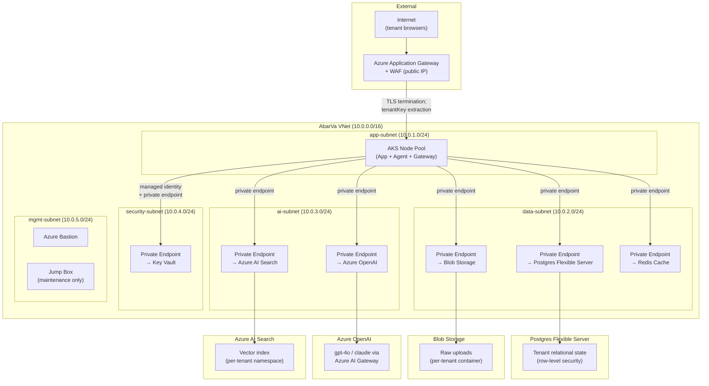
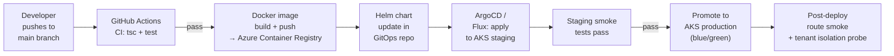

# AbarVa Azure Reference Target Architecture

Slice ID: ARCH3
Document: ABARVA_AZURE_REFERENCE_TARGET.md
Status: code_complete
Authored: 2026-04-26
Author: Code (sole)
Type: Specification / architecture document — no application code,
no runtime modification, no migrations, no model calls.

This document defines the Azure reference target architecture for
AbarVa. It covers VNet layout, private endpoints, AKS / container
hosting, Key Vault, Azure OpenAI, and Postgres Flexible Server. This is
the target topology for customers requiring production-grade deployment
with full network isolation.

---

## 1. Design principles

1. **No data plane component is publicly reachable.** Postgres, blob
   storage, vector index, Redis, and the audit store are all accessible
   only through private endpoints inside the VNet.
2. **Secrets never leave Key Vault.** Connection strings, API keys,
   and CMK references are fetched at runtime by the app's managed
   identity; they are never stored in environment variable files or
   container images.
3. **Every data store is tenant-isolated.** Row-level security on
   Postgres; tenant-scoped blob containers; per-tenant namespace in
   the vector index.
4. **Azure OpenAI is the default model provider for enterprise
   deployments.** Data does not leave the Azure subscription boundary
   for model inference. Other providers (Anthropic, OpenAI) are
   routed through the Model Gateway behind a private endpoint or
   approved egress.
5. **The Model Gateway is the only component that calls providers.**
   All other components call the gateway, not providers directly.

---

## 2. Resource group layout

| Resource Group | Purpose |
|---|---|
| `rg-abarva-control` | App tier: AKS cluster, container registry, API management |
| `rg-abarva-data` | Data tier: Postgres Flexible Server, Blob Storage, Redis |
| `rg-abarva-intelligence` | Intelligence tier: Azure OpenAI, Cognitive Search / vector |
| `rg-abarva-security` | Security tier: Key Vault, Managed Identity, Private DNS Zones |
| `rg-abarva-network` | Network tier: VNet, NSGs, Private Endpoints, Azure Firewall |
| `rg-abarva-observability` | Observability tier: Application Insights, Log Analytics, Alerts |

For single-subscription deployments these can collapse to fewer groups.
For enterprise multi-tenant deployments with dedicated data planes, the
`rg-abarva-data` pattern is replicated per tenant.

---

## 3. VNet layout

---

## 4. Component specifications

### 4.1 AKS Cluster

| Parameter | Value |
|---|---|
| SKU | Standard or Premium (depends on tenant tier) |
| Node pools | System pool (3 nodes × Standard_D4s_v5); User pool (autoscale 2–10 × Standard_D8s_v5) |
| Networking | Azure CNI with overlay; network policies enabled |
| Identity | System-assigned managed identity per node pool |
| Workload identity | AbarVa app pods use workload identity to authenticate to Key Vault |
| Ingress | NGINX ingress controller behind Application Gateway |
| TLS | Cert-manager + Let's Encrypt (or BYO certificate) |
| Container registry | Azure Container Registry (Premium, geo-replicated) |

### 4.2 Postgres Flexible Server

| Parameter | Value |
|---|---|
| SKU | General Purpose, Standard_D4ds_v5 (scale up for production) |
| Storage | Premium SSD v2, 512 GB minimum |
| HA | Zone-redundant standby in a secondary availability zone |
| Private access | VNet integration (no public endpoint) |
| Encryption | Service-managed keys (default) or customer-managed keys (CMK, enterprise) |
| Extensions | `pgcrypto`, `uuid-ossp`, `pg_trgm` (for text search), `vector` (pgvector for embeddings) |
| Row-level security | Enabled on all tenant tables; `tenant_key` column on every row |
| Connection pooler | PgBouncer sidecar or Azure native connection pooling |

### 4.3 Blob Storage

| Parameter | Value |
|---|---|
| Account kind | StorageV2 (general purpose v2) |
| Replication | ZRS (zone-redundant) or GRS (geo-redundant) for enterprise |
| Access tier | Hot (recent uploads); Cool (archives > 90 days) |
| Container layout | One container per tenant key (`tenant-<slug>-uploads`); SAS tokens never issued; access via managed identity only |
| Encryption | SSE with service-managed keys (default) or CMK (enterprise) |
| Soft delete | Enabled (30-day retention); versioning enabled |
| Private endpoint | Yes — no public blob endpoint |

### 4.4 Key Vault

| Parameter | Value |
|---|---|
| SKU | Standard (secrets + keys); Premium (HSM-backed keys for CMK) |
| Access model | RBAC (not access policies); AbarVa pods have `Key Vault Secrets User` role |
| CMK keys | RSA 4096, per-tenant for enterprise deployments; AbarVa never holds raw key material |
| Secrets stored | Postgres connection string, Blob Storage connection string, Redis connection string, Azure OpenAI API key, Clerk secret key, provider API keys |
| Soft-delete + purge protection | Enabled (90-day retention) |
| Private endpoint | Yes — Key Vault not accessible from public internet |
| Diagnostic logs | All secret reads / writes logged to Log Analytics |

### 4.5 Azure OpenAI

| Parameter | Value |
|---|---|
| Deployment type | Regional (data residency in chosen region) |
| Models | `gpt-4o` (default `compose`/`critique` role), `gpt-4o-mini` (default `narrate`/`summarize` role) |
| Endpoint access | Private endpoint inside VNet; no public endpoint |
| Rate limits | Per-deployment TPM / RPM limits configured in Model Gateway policy |
| Content filtering | Azure OpenAI content filters enabled; AbarVa Model Gateway adds additional output validation |
| Audit | All API calls logged via Azure Monitor + Application Insights |

### 4.6 Azure AI Search (vector index)

| Parameter | Value |
|---|---|
| SKU | Standard S2 (for production scale) |
| Index layout | One index per tenant or shared index with tenant namespace filter (logical_namespace model per DATA6 contract) |
| Private endpoint | Yes |
| Semantic ranking | Enabled for hybrid search (keyword + vector) |
| Encryption | CMK optional for enterprise |

### 4.7 Redis Cache

| Parameter | Value |
|---|---|
| SKU | Enterprise E5 (for session + rate-limit cache) |
| Clustering | Disabled for MVP; enable for high-throughput tenants |
| TLS | TLS 1.2+ enforced; no plaintext access |
| Private endpoint | Yes |
| Encryption at rest | Enabled |

---

## 5. Network security groups (NSGs)

| NSG | Inbound allow | Inbound deny | Outbound |
|---|---|---|---|
| app-subnet NSG | Application Gateway (443); Azure Load Balancer health probes | All internet direct | data-subnet, ai-subnet, security-subnet (all via private endpoints) |
| data-subnet NSG | app-subnet (5432 Postgres, 6379 Redis, 443 Blob) | All internet | None |
| ai-subnet NSG | app-subnet (443 OpenAI, 443 Search) | All internet | None |
| security-subnet NSG | app-subnet (443 Key Vault) | All internet | None |
| mgmt-subnet NSG | Azure Bastion (22, 3389) | All internet direct | All internal subnets |

---

## 6. Observability

| Component | Tool |
|---|---|
| App metrics | Application Insights (SDK instrumented in Next.js) |
| Logs | Azure Log Analytics Workspace; all AKS pod logs forwarded |
| Alerts | Azure Monitor alerts on: 5xx rate, Postgres connection errors, OpenAI rate limit hits, Key Vault secret access failures |
| Distributed tracing | OpenTelemetry SDK → Application Insights |
| Audit logs | AbarVa audit ledger (Governance / Audit Plane) → Postgres → Log Analytics export |

---

## 7. Deployment pipeline

---

## 8. Disaster recovery

| Objective | Target |
|---|---|
| RTO (Recovery Time Objective) | 4 hours (standard); 1 hour (enterprise) |
| RPO (Recovery Point Objective) | 1 hour (standard, Postgres point-in-time); 15 minutes (enterprise, geo-redundant) |
| Postgres backup | Automated backups + point-in-time restore; geo-redundant for enterprise |
| Blob Storage backup | Soft-delete + versioning; geo-redundant replication |
| AKS failover | Cluster autoscaler + zone-redundant node pools |
| Key Vault | Soft-delete + purge protection; geo-replicated for enterprise |

---

## End of ABARVA_AZURE_REFERENCE_TARGET

Read ABARVA_PRIVATE_DATA_PLANE_MODEL next for the private data plane
model and trust boundary details.
