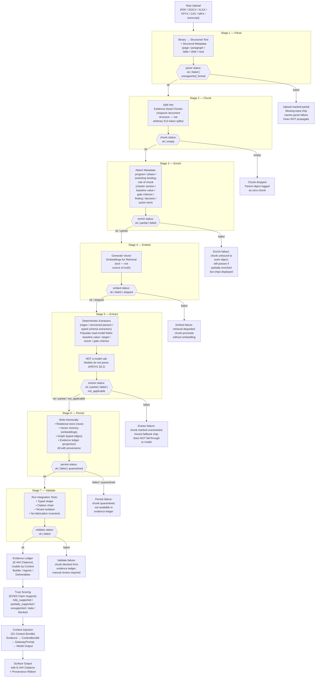

# AbarVa Data and Evidence Flow

Slice ID: ARCH3
Document: ABARVA_DATA_EVIDENCE_FLOW.md
Status: code_complete
Authored: 2026-04-26
Author: Code (sole)
Type: Specification / architecture document — no application code,
no runtime modification, no migrations, no model calls.

This document traces the journey from a raw tenant upload to an
evidence-usable, E-### citable chunk in the AbarVa evidence ledger.
It is the canonical reference for teams implementing the live ingestion
pipeline (deferred from ARCH1 §11.2).

---

## 1. Overview

AbarVa's evidence model is built on a strict principle: **every claim
must trace to a named chunk, and every chunk must pass all seven
pipeline stages before it is citable**.

The pipeline is intentionally deterministic. Models are not parsers
(ARCH1 §3.2). Every extraction that names a value — a dollar baseline,
a gate criterion, an owner name, a phase binding — flows through a
typed deterministic extractor, not through a model completion.

---

## 2. Seven-stage ingestion pipeline

---

## 3. Evidence ledger projection

Once a chunk passes all seven stages and is written to the evidence
ledger, it is projected as a typed `EvidenceCitation`:

| Field | Description |
|---|---|
| `citationId` | E-### — unique, tenant-scoped, stable across re-extractions |
| `chunkId` | Link back to the relational chunk row |
| `tenantKey` | Tenant isolation — cross-tenant ledger queries are forbidden |
| `sourceObjectId` | Link back to the raw uploaded object |
| `sourceLocator` | Page / row / paragraph / slide — exact location in the source |
| `extractedFields` | Typed extracted values (baseline value, owner, criterion, etc.) |
| `citationTier` | `primary` / `corroborating` / `unverified` |
| `confidenceCap` | Maximum confidence any surface may claim for this citation |
| `evidenceUsability` | `usable` / `partial` / `unusable` |
| `createdFrom` | `human_authored` (all ingested chunks) |
| `extractorVersion` | `v1` — enables re-extraction without losing provenance |

---

## 4. Trust scoring (EVID3)

After a chunk enters the evidence ledger, the EVID3 Claim-Support
Evaluator assigns a trust status over any claim that references the
chunk:

| Status | Meaning |
|---|---|
| `fully_supported` | The chunk directly evidences the claim; citationTier primary |
| `partially_supported` | The chunk is corroborating; citationTier corroborating |
| `unsupported` | No matching chunk in the ledger |
| `stale` | The chunk's source object is older than the claim's reference date |
| `blocked` | The chunk is quarantined or validate-failed |
| `pending_extraction` | The chunk is in the pipeline but not yet validate-ok |
| `not_applicable` | The claim type does not require evidence (e.g., process definition) |

EVID3 is deterministic over the current ledger state. It does not call
a model. It does not fabricate support status.

---

## 5. Context injection

The Context Builder (S1) calls the evidence ledger tool to resolve
citations bound to the current work object. The ledger tool:

1. Calls vector search internally to find candidate chunk ids.
2. Resolves each hit against the relational ledger row.
3. Filters to chunks with `evidenceUsability: usable | partial`.
4. Projects the `EvidenceCitationSet` (typed array of citations).

The `EvidenceCitationSet` flows into the `ContextBundle`. The Model
Gateway attaches the citations as a structured `evidence_block` in the
`GatewayPrompt`. The model may only cite E-### ids that appear in the
`evidence_block`. Any E-### in the response that does not resolve
through the ledger is stripped with a warning (ARCH1 §12.7).

---

## 6. Output layer

Every surface that names a claim attaches its resolved E-### citations
as citation chips. Every gap (unusable evidence, partial evidence, stale
citation) surfaces as a missing-input chip naming the remedy.

Fabricated dollar amounts are forbidden (ARCH1 §12.6). Fabricated
E-### citations are forbidden (ARCH1 §12.7). A surface that displays a
value figure with no E-### citation is in violation.

---

## 7. What is live today vs. production target

| Stage | Today | Production target |
|---|---|---|
| Parse | Contract defined; no live binary parser | Live PDF / DOCX / XLSX / CSV parsers |
| Chunk | Contract defined; seed chunks only | Live chunker respecting document structure |
| Enrich | Contract defined; seed metadata only | Live enricher with program / phase binding |
| Embed | Contract defined; DATA6 vector provider contract | Live pgvector / Azure AI Search adapter |
| Extract | Extractor library contract defined | Live typed extractors per document kind |
| Persist | Seed rows in relational store | Live atomic write (relational + vector + graph + ledger) |
| Validate | Seed validation in integration tests | Live validate-pass gate before ledger projection |
| Evidence Ledger | EVID2 seed entries; EVID3 evaluator wired | Live tenant-bound ingest |
| Context Injection | CTX2 evidence section honestly-empty pending live ingest | Live EVID2 → CTX2 binding (CTX3 bridge in place) |

---

## End of ABARVA_DATA_EVIDENCE_FLOW

Read ABARVA_AZURE_REFERENCE_TARGET next for the Azure deployment
topology and VNet layout.
