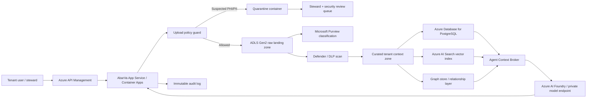

# AbarVa Data Protection Controls — Current Product + Azure Target State

Date: 2026-05-14
Audience: internal product, engineering, client security, Azure architecture review

## Position

AbarVa does not need named PHI, customer PII, payment-card data, or raw account-level records for the current product to work. The current decision OS needs enterprise context: org structure, systems, vendors, contracts, KPI pressure, budget/spend bands, program evidence, sourcing artifacts, operating telemetry, and policy/control context. Those datasets can be de-identified, aggregated, and tenant-scoped.

The control posture is therefore simple:

1. Accept aggregate, de-identified, internal, confidential business, and restricted financial business context.
2. Block suspected PHI/PII/direct identifiers before storage, vector indexing, graph extraction, or evidence ingestion.
3. Preserve a path for future private-data-lane use cases where a client explicitly wants regulated data processing under their Azure controls.

## Current-State App Enforcement

The app now enforces a shared upload guard before bytes are persisted or indexed.

| Control | Current implementation |
|---|---|
| Required posture | Uploads default to `confidential_business` unless a caller declares a different classification. |
| PHI/PII detection | Server-side scanner checks the uploaded filename and the first 1 MB of decoded content for high-risk identifiers. |
| High-risk patterns | SSN, medical record/patient/member IDs, DOB labels with date values, bank routing/account number labels, and Luhn-valid payment card numbers. |
| Medium-risk patterns | Email and phone numbers are detected and surfaced, but do not block by themselves because business documents often include contacts. |
| Block decision | Declared `regulated_phi_pii_suspected` or any high-risk identifier match returns `422 sensitive_data_quarantined`. |
| Storage | Quarantined uploads are stopped before Supabase Storage writes. |
| Indexing | Quarantined uploads are stopped before Pinecone/vector, graph, portfolio CSV ingestion, or program evidence extraction. |
| Tenant isolation | Existing tenant gates still run first; upload classification does not weaken tenant scoping. |

### Protected Ingestion Paths

| Path | What it protects |
|---|---|
| `/api/data/upload` | Data-console file ingestion before tenant context indexing. |
| `/api/admin/upload-dataset` | Admin dataset uploads before dataset storage and KPI metric persistence. |
| `/api/tower/upload` | Tower files before storage, uploaded-file metadata, and portfolio CSV ingestion. |
| `/api/programs/[id]/attachments/upload` | Move/program attachments before storage and synchronous evidence extraction. |
| `/api/v1/source/[eventId]/artifacts/upload` | Source event artifacts before storage, registry creation, parse, graph/vector states, and gate evidence. |

## Day-One Dataset Policy

Day one should focus on context that is valuable to decision-making without needing direct regulated identifiers.

| Dataset family | Day-one stance | Examples |
|---|---|---|
| Enterprise profile | Allowed | Legal entity, size bands, strategy, operating model, regulatory posture. |
| Org structure | Allowed | Roles, reporting lines, function ownership, sponsor maps. Avoid HR personal identifiers beyond demo/business contact names. |
| IT systems / CMDB | Allowed | Systems, owners, lifecycle, data domains, risk tier, integration dependencies. |
| IT financials / budgets | Allowed as confidential/restricted business data | Budget bands, vendor spend, run/change/transform split, contract exposure. |
| KPI dictionary | Allowed | KPI name, owner, target, baseline, trend, attribution notes. Use aggregate measures. |
| Program inventory | Allowed | Initiative names, phase, sponsor, value case, risks, blockers. |
| Sourcing artifacts | Allowed with review | RFPs, scorecards, pricing models, rate cards, redlined terms. Treat as confidential/restricted. |
| Evidence ledger | Allowed | Evidence snippets, citations, decision records, artifact lineage. Avoid raw regulated records. |
| Policies and procedures | Allowed | Security policy, AI governance, procurement policy, model risk standards. |
| Operating telemetry | Allowed in aggregate | Volumes, cycle times, adoption, incident counts, queue backlogs. No named-patient/customer records. |

## Day-Two Automation

Day two should reduce manual uploads and turn the context layer into a governed data product.

| Integration mode | Best fit | Control model |
|---|---|---|
| Scheduled exports | ERP, contract systems, ITFM, PMO tools | Land into private raw zone, classify, transform, publish curated context tables. |
| API connectors | ServiceNow, Jira, Workday, Coupa, SAP, Snowflake, Databricks, Epic operational extracts where permitted | OAuth/service principal, least-privilege scopes, tenant-bound secrets, incremental sync, audit. |
| Event streams | Portfolio status changes, sourcing milestones, critical incidents | Queue/event hub with schema validation, tenant partitioning, replay controls. |
| Steward uploads | Executive decks, RFP packs, board materials | App-side DLP gate, steward review, evidence lineage. |
| Industry corpus feeds | Benchmarks, vendor signals, regulatory updates, market research | Separate non-tenant corpus with provenance, freshness, source-license metadata. |
| Real-time signals | News, security events, vendor health, public filings | Signal normalization and scoring; never commingle with tenant-private data without provenance tags. |

## Azure Target-State Architecture

The Azure design should express the same product controls in cloud-native form.

### Azure Control Mapping

| Product control | Azure-native implementation |
|---|---|
| Private ingress | Private Endpoint + API Management + WAF policy. |
| Tenant identity | Entra ID / B2B or Clerk-to-Entra federation, tenant claims, managed identities. |
| Secret control | Key Vault with managed identity access; no long-lived connector secrets in app config. |
| Storage isolation | ADLS Gen2 containers or paths partitioned by tenant; private endpoint only. |
| Classification | Microsoft Purview scans plus AbarVa domain classifier for business semantics. |
| DLP/quarantine | Defender for Cloud / Purview DLP policy plus quarantine container and review workflow. |
| Curated context | Medallion pattern: raw, classified, curated, published. Only published context reaches agents. |
| Vector isolation | Tenant-scoped Azure AI Search indexes or strict tenant filters with negative tests. |
| Model egress | Azure AI Foundry private endpoint, no public model egress for private tenant context. |
| Audit | Append-only audit events in Log Analytics / Event Hub, mapped to upload id, tenant, user, classification, decision. |
| Retention | Lifecycle policies by classification; quarantine auto-expiry unless legal hold applies. |

## Why This Matters

This is the infosec argument clients need to hear:

- AbarVa can deliver value without regulated raw data.
- If someone uploads regulated data by mistake, the app blocks it before indexing.
- The same control model scales cleanly into Azure private data lanes.
- The knowledge/context layer becomes stronger over time, but only curated context is promoted to agents.
- Future specialized industry corpora and real-time signals can be added without weakening tenant-private controls because they stay separated by provenance, tenant scope, and classification.
