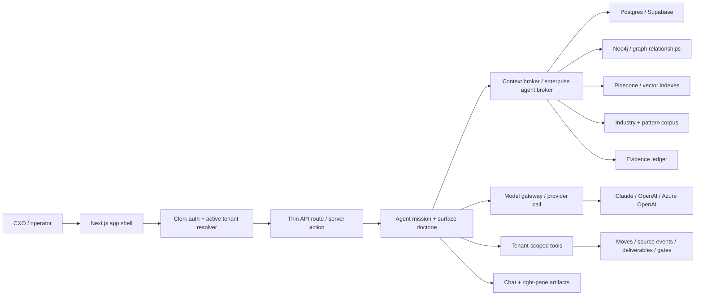
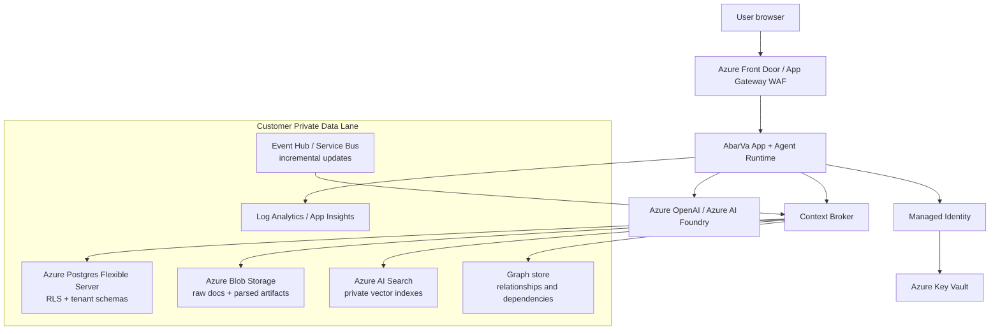

# AbarVa Internal Product Architecture Packet

Date: 2026-05-14
Audience: internal product, engineering, architecture, security, investor diligence
Status: detailed working artifact

This packet explains how AbarVa is designed today, what the context
layer currently does, and how it can expand into an enterprise-grade
private data lane on Azure. It should be read with the existing
architecture pack:

- `docs/architecture/ABARVA_ARCHITECTURE_OVERVIEW.md`
- `docs/architecture/ABARVA_REQUEST_TO_CONTEXT_FLOW.md`
- `docs/architecture/ABARVA_PRIVATE_DATA_PLANE_MODEL.md`
- `docs/architecture/ABARVA_AZURE_REFERENCE_TARGET.md`
- `docs/platform-architecture/runtime/*`

## 1. Product vision

AbarVa is a decision operating system for enterprise AI and business
transformation. It turns a client's private context into CXO-grade
advice, structured decisions, executable moves, sourcing events,
portfolio oversight, and value tracking.

The product is built on one belief: the LLM becomes useful to an
enterprise only when it is wrapped in the client's context, evidence,
policies, economics, systems, people, and decision rights. Without that
layer, the model is a fluent generalist. With that layer, the model can
behave like a specialized advisor who knows the client.

## 2. Design principles

| Principle | Meaning in AbarVa |
|---|---|
| Context before cognition | Every serious answer should be preceded by tenant context assembly. |
| Evidence before assertion | Specific claims should resolve to a source, record, graph node, or stated inference. |
| Mission-bounded agents | Sentinel, Nexus, Source/Sentinel, Atlas, and Steward have different jobs, tools, and output contracts. |
| Tenant isolation by architecture | Routes should resolve active tenant server-side; app-tier code should not reach vector, graph, or data-room internals directly. |
| Workflow over chat | Chat is the interaction layer; the product outcome is a Move, source event, decision memo, gate, evidence record, or portfolio intervention. |
| Opinionated executive posture | Agents form a view, calibrate confidence, dissent when needed, and avoid generic option lists. |
| Day 1 useful, Day 2 connected | Dataset packs make the system useful immediately; APIs and event streams keep it fresh later. |
| Azure-native enterprise path | Target-state enterprise deployments can run with private endpoints, customer-managed keys, Azure OpenAI, Azure AI Search, and customer-owned data stores. |

## 3. Current product surfaces

| Surface | Primary agent | User question it answers | Current output |
|---|---|---|---|
| Home / Setup | Steward + product shell | What is loaded, missing, and ready? | Readiness tiles, data trust, setup panels, action queue. |
| Intelligence | Sentinel | Which AI/business bets should leadership decide now? | Brief, map, art of possible, enterprise context, vendors, pattern-to-Move funnel. |
| Strategic Moves | Nexus | How do we shape a decision into an executable move? | P0-P5 phase journey, gated artifacts, sponsor/evidence/value discipline. |
| Source | Sentinel on sourcing | Which vendor/SI path should we choose and how should we structure the decision? | Chat-driven intake, sourcing event, comparison, BAFO and decision artifacts. |
| Tower | Atlas | Is the portfolio creating value, and what needs executive action? | Value map, risk/pressure, renewals, adoption gaps, evidence map, executive brief. |
| Learn | Atlas / guide surface | How should a CXO use the system? | Guided product education, example questions, module orientation. |

## 4. Runtime architecture

Current implementation notes:

- Next.js App Router powers the product shell and route handlers.
- React renders the surfaces and agent panes.
- Clerk resolves identity; active tenant resolution is hardened so demo
  client personas do not pivot through URL/body client IDs.
- Supabase/Postgres carries tenant records, programs, source events,
  evidence, setup packs, and relational state.
- Pinecone and graph layers support retrieval and relationship context
  where wired; some routes are still being moved behind broker adapters.
- The Agent C refactor is progressively enforcing: routes stay thin,
  context stores sit behind broker adapters, and app-tier code does not
  import graph/vector internals directly.

## 5. Context layer: what exists today

The current context layer has three practical forms:

1. Setup data packs: structured files and seed loaders that create a
   useful Day 1 tenant layer.
2. Enterprise agent context broker: typed bundles for agents, with
   tenant key, items, citations, warnings, graph summary, and source
   basis.
3. Context-bundle panel: retrieval receipt surfaced to the UI so users
   can understand what evidence was assembled.

### 5.1 Canonical context segments

| Segment | What it contains | Agent value today | Day 2 automation source |
|---|---|---|---|
| Enterprise profile | Legal entity, footprint, industry, revenue band, strategy | Grounds company identity and scale | CRM, ERP, annual report, admin upload |
| Org structure | C-suite, SVP/VP/director layers, reporting lines, decision rights | Sponsor mapping, blocker mapping, approval paths | Workday, HRIS, Entra ID, org API |
| IT system landscape | ERP/EHR/core systems, data platforms, apps, integration depth | Architecture fit, dependencies, migration risk | ServiceNow CMDB, LeanIX, Apptio, EA tools |
| IT financials | run/change/transform spend, budgets, cloud/SaaS/SI costs | Value sizing, cost takeout, sourcing posture | ERP, Apptio, cloud billing, procurement |
| KPI dictionary | business metrics, owners, baselines, measurement grain | Outcome discipline, value realization | BI catalog, metric store, finance systems |
| Program inventory | active initiatives, phases, risks, sponsors, blockers | Move overlap, sequencing, portfolio tension | Jira, ADO, ServiceNow SPM, PMO tools |
| Sourcing artifacts | RFPs, BAFOs, proposals, scorecards, vendor notes | Source shortlists, RFP questions, negotiation posture | Coupa, Ariba, procurement drives |
| Program deliverables | charters, roadmaps, decision memos, gate packets | Gate evidence and continuity | SharePoint, Google Drive, Confluence |
| Evidence ledger | citations, source artifacts, confidence, approval state | Claim discipline and auditability | Auto-projection from all ingested docs |
| Operating telemetry | incidents, SLA, adoption, cycle time, meeting notes | Tower pressure and intervention logic | ServiceNow, Datadog, Jira, Teams notes |
| Vendor contracts | spend, renewal, terms, risks, concentration | Vendor risk, renewal clock, Source strategy | CLM, procurement, AP, vendor master |
| Compliance/regulatory | policies, controls, audit findings, model-risk rules | Governance, restricted output, readiness | GRC, Archer, ServiceNow IRM, policy store |
| Industry context | peer patterns, benchmark ranges, vendor landscape | Expert posture beyond tenant data | AbarVa corpus, licensed research, signal feeds |
| Cross-program signals | conflicts, duplicate efforts, shared blockers, dependencies | Atlas/Tower portfolio pressure | Derived from graph + PMO/financial telemetry |

### 5.2 Why this changes the model

The context layer changes a model from "answer from training data" to
"reason against a tenant-specific operating model." The same Claude or
OpenAI model can answer very differently when the system provides:

- the client's executive bench;
- the client's budget and vendor exposure;
- the client's systems and architectural constraints;
- active programs and phase gates;
- evidence quality and missing data;
- industry patterns and peer signals;
- policy, regulatory, and access constraints.

That is the core product insight. The LLM is not the platform. The
client context layer plus governance plus workflow is the platform.

## 6. Current versus future context capability

| Capability | Current state | Target state |
|---|---|---|
| Data onboarding | Seed packs and CSV/JSON/MD loaders | Admin-guided templates plus APIs, scheduled sync, change detection. |
| Retrieval | Broker bundles, vector-ready paths, selected graph neighborhoods | Unified broker with private vector, graph, relational, and real-time signal retrieval. |
| Provenance | Evidence IDs, source-basis labels, warnings | Full lineage from source system to chunk to answer to artifact to decision. |
| Readiness | Segment trust ladder and setup panels | Capability-specific readiness: what Sentinel/Nexus/Source/Tower can safely answer. |
| Updates | Manual seed/load scripts and admin upload | Incremental sync through APIs, webhooks, queues, and reconciliation jobs. |
| Industry knowledge | Seeded pattern corpus and demo knowledge | Specialized retail/healthcare/financial services corpora plus licensed feeds. |
| Real-time signals | Limited operating telemetry and vendor data | News, market data, vendor health, regulatory updates, cloud cost, incident streams. |
| Specialized models | General frontier LLMs | Optional SLMs/LLMs tuned for sourcing, population health, model risk, merchandising, cloud economics. |

## 7. Day 1 / Day 2 data loading plan

| Data family | Day 1 plan | Day 2 automation | Enterprise scale concern |
|---|---|---|---|
| Profiles and strategy | Upload profile pack and executive brief | Refresh from admin portal, annual plan docs, board packs | Avoid stale strategic claims. |
| Org | Upload org chart / executive bench | HRIS and Entra ID sync | Respect HR sensitivity and role-based visibility. |
| Systems/CMDB | Upload system inventory | ServiceNow CMDB / EA API | Normalize system ownership and criticality. |
| Financials | Upload budget/spend extracts | ERP, Apptio, cloud billing APIs | Enforce restricted financial visibility. |
| KPIs | Upload KPI dictionary | BI semantic layer / metric store | Prevent fake baselines and inconsistent grain. |
| Programs | Upload initiative registry | PMO/Jira/ADO/SPM sync | Reconcile duplicate program IDs and phase states. |
| Sourcing | Upload RFPs, scorecards, contracts | CLM/procurement API | Keep confidential pricing and terms gated. |
| Evidence | Auto-create from uploaded artifacts | Continuous projection from docs and systems | Preserve source and approval status. |
| Policies | Upload policy/control pack | GRC / policy store API | Version policies and retire superseded controls. |
| Real-time signals | Curated static signal pack | News/vendor/regulatory/cloud feeds | Separate signal from verified tenant fact. |

## 8. Target-state Azure private data lane

Enterprise deployment posture:

- public ingress terminates at WAF;
- all data stores have private endpoints;
- Key Vault holds secrets and customer-managed keys;
- App/agent runtime uses managed identity;
- Azure OpenAI / Foundry is the preferred regulated-enterprise model
  lane;
- external providers are optional and routed only through policy-gated
  model gateway egress;
- tenant payload data can stay in the customer subscription for private
  data plane deployments.

## 9. Specialized industry corpus and real-time signal expansion

The future corpus should have four layers:

| Layer | Examples | Use |
|---|---|---|
| AbarVa pattern corpus | AI failure modes, Strategic Move archetypes, sourcing playbooks, value patterns | Stable expert method. |
| Industry corpus | Healthcare VBC/RCM/EHR, retail merchandising/supply chain, financial services model risk/fraud/AML | Domain expertise. |
| Tenant corpus | Org, systems, budgets, KPIs, policies, contracts, programs, evidence | Client-specific reasoning. |
| Real-time signals | Vendor health, regulatory updates, cloud pricing, security events, market news | Current situational awareness. |

Signal governance rule: real-time signals should influence hypotheses
and warnings, but should not be treated as verified tenant fact unless
linked to an approved tenant record or evidence item.

## 10. Page-level design intent

| Page / module | Design job | Data contract | What makes it executive-grade |
|---|---|---|---|
| Home | Tell the CXO where the tenant stands and what to do next | Readiness, action queue, loaded/missing data, recent activity | Immediate orientation and next action. |
| Intelligence Brief | Force the quarter's AI/business bet decision | Patterns, value at stake, blockers, evidence, tenant context | Strong point of view, confidence, dissent, path to Move. |
| Intelligence Map | Show relationships between patterns, systems, sponsors, risks | Graph nodes/edges, evidence and readiness | Makes hidden dependencies visible. |
| Art of Possible | Expand imagination without losing realism | Use cases, peer patterns, tenant constraints | Inspires action but stays grounded. |
| Enterprise Context | Show what the system knows and what is missing | Context segments, records, facts, confidence, gaps | Trust builder for the client. |
| Vendors | Connect market landscape to tenant fit | Vendor contracts, spend, evidence, market corpus | Independent advocacy, not vendor catalog. |
| Strategic Moves Index | Show the Move portfolio and phase pressure | Programs, phase state, value, blockers | Portfolio view, not PMO noise. |
| Move Originate | Convert an idea into a P0 brief | Sponsor, scope, value hypothesis, evidence family | Fast guided intake with right-pane progress. |
| Move Detail / Phase | Produce gate-ready artifacts | Deliverables, evidence, approvals, risks | Traceable progress and clear exit criteria. |
| Source Portfolio | Show sourcing decisions and commercial exposure | Events, stages, spend, blockers, renewals | Procurement decisions tied to value and risk. |
| Source New | Turn conversation into a sourcing event | Trigger, owner, scope, baseline evidence, stop condition | Chat-driven intake; form fills itself. |
| Tower | Answer whether the portfolio is creating value | ROI, pressures, renewals, adoption, evidence | CFO/CIO-grade portfolio cockpit. |
| Setup/Data Trust | Show data readiness and ingestion path | Segment trust ladder, uploads, gaps | Honest view of what agents can and cannot know. |
| Learn | Teach the CXO how to use AbarVa | Product guidance and examples | Reduces first-session friction. |

## 11. Current engineering gaps to keep closing

| Gap | Why it matters | Current remediation path |
|---|---|---|
| Direct app-tier access to graph/vector/context internals | Increases tenant leakage and route-level drift risk | Agent C staged PRs: move route logic behind broker adapters and add boundary tests. |
| Incomplete transformer discipline | DB shape can leak into UI/API contracts | Roll out `types.db.ts`, `types.ui.ts`, and transformers module-by-module. |
| Manual dataset refresh | Context can get stale between demos or client updates | Day 2 API/webhook sync plan plus readiness deltas. |
| Mixed model-provider paths | Harder to prove enterprise governance | Model gateway as single egress and audit point. |
| Sparse multi-CXO roster | Limits business-CXO positioning demos | Provision CEO/CFO/COO/CDO/CIO seats per tenant. |

## 12. Scale confidence

AbarVa can scale for enterprise customers if the architecture keeps
three separations clean:

1. SaaS control plane versus tenant data plane.
2. App route shell versus broker/service internals.
3. Model reasoning versus governed tools and evidence.

The current app already demonstrates the product loop. The next
enterprise-readiness work is not "more chat." It is hardening the
data/control boundaries, automating context refresh, expanding
specialized corpora, and proving that every answer can be traced back
to tenant context, shared corpus, or explicit judgment.

