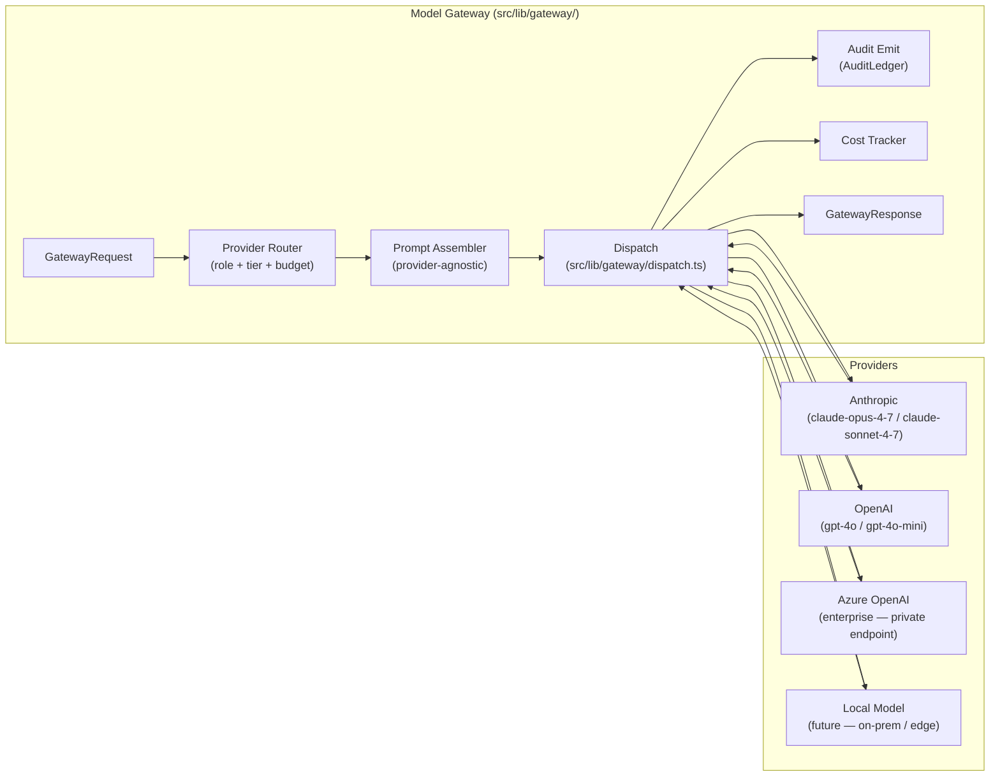
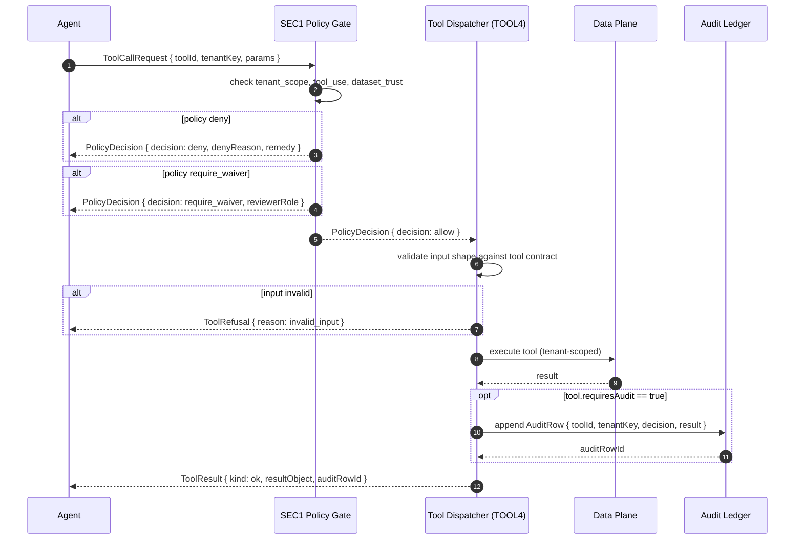

# AbarVa Model Gateway and Tool Plane

Slice ID: ARCH3
Document: ABARVA_MODEL_GATEWAY_AND_TOOL_PLANE.md
Status: code_complete
Authored: 2026-04-26
Author: Code (sole)
Type: Specification / architecture document — no application code,
no runtime modification, no migrations, no model calls.

This document covers the Model Gateway Plane and the Tool Plane in
depth — model routing, provider abstraction, tool registry, invocation
audit, and rate limiting.

---

## 1. Why a gateway and a tool layer exist

### 1.1 Model Gateway

Without a gateway, every agent would import a provider SDK directly.
The result:

- Provider coupling in every agent module.
- No central audit trail.
- No cost tracking.
- No fallback contract.
- Provider swap requires rewriting every agent.

The Model Gateway is the **single chokepoint** (ARCH1 §2.2, §6). Every
model call passes through it. Nothing outside `src/lib/gateway/**` may
import `anthropic`, `@anthropic-ai/sdk`, `openai`, or any provider SDK.

### 1.2 Tool Layer

Without a tool layer, agents and page components would write directly to
Postgres, trigger side effects from read models, and bypass the audit
ledger. The Tool Layer is the **only side-effect surface** (ARCH1 §8).
Every mutation, every export, every external-effect action passes
through a typed, tenant-scoped, audited tool.

---

## 2. Model Gateway: deep dive

### 2.1 Gateway contract

The gateway accepts:

```
GatewayRequest {
  contextBundle: ContextBundle      // S1 typed bundle
  role: GatewayRole                 // narrate | critique | summarize | score | compose
  intent: Intent                    // view | narrate | recommend | critique | export | mutate | gate_review
  outputSchema: OutputSchema        // text | json | json_with_citations
  costBudgetUsd: number             // max spend for this call
  latencyBudgetMs: number           // max latency acceptable
  tenantKey: string
  agentVersion: string
}
```

It emits:

```
GatewayResponse {
  promptHash: string
  responseHash: string
  modelName: string
  providerName: ProviderName        // anthropic | openai | azure_openai | local
  tokensIn: number
  tokensOut: number
  costUsd: number
  latencyMs: number
  output: GatewayOutput             // text | json | json_with_citations
  warnings: GatewayWarning[]
  createdFrom: 'gateway_compose'
}
```

Or a typed refusal:

```
GatewayRefusal {
  reason: GatewayRefusalReason      // context_too_low | vanilla_response_risk | cost_budget_exceeded | provider_transient | provider_unrecoverable | schema_invalid
  remedy: string
  tenantKey: string
  role: GatewayRole
}
```

### 2.2 Provider abstraction



The Prompt Assembler produces a **provider-agnostic** `GatewayPrompt`
structure. The `dispatch` layer translates this into the provider's
native API format. Swapping providers requires only updating the
dispatch layer — no agent or surface code changes.

### 2.3 Model routing

The Provider Router selects the provider + model class based on:

| Input | Effect |
|---|---|
| `role == narrate` | Low-cost model class (`claude-sonnet-4-7` or `gpt-4o-mini`) |
| `role == compose` | High-capability model class (`claude-opus-4-7` or `gpt-4o`) |
| `role == critique` | High-capability model class |
| `role == summarize` | Low-cost model class |
| `role == score` | Mid-tier model class |
| Tenant tier `enterprise` | Prefers Azure OpenAI private endpoint |
| Tenant tier `standard` | Routes to approved public provider |
| `costBudgetUsd` exceeded | Returns `GatewayRefusal { reason: cost_budget_exceeded }` |
| MG4 policy blocks provider | Routes to next approved provider; if all blocked, returns `GatewayRefusal` |

### 2.4 Prompt assembly

The Prompt Assembler takes the `ContextBundle` (S1) and `role` and
builds a `GatewayPrompt`:

```
GatewayPrompt {
  gatewayVersion: string
  promptHash: string                  // SHA-256 of the full prompt for audit
  contextBundleHash: string           // SHA-256 of the context bundle for audit
  role: GatewayRole
  modelClass: ModelClass
  resolvedModelName: string
  systemPrompt: string                // role-specific system prompt
  instructionBlock: string            // task instructions
  evidenceBlock: EvidenceCitationSet  // resolved E-### citations
  signalsBlock: SignalsBlock          // patterns + failure modes + solutions + gate verdicts
  gapsBlock: MissingInputChip[]       // explicit gaps from context bundle
  outputSchema: OutputSchema
  costBudgetUsd: number
  latencyBudgetMs: number
}
```

The prompt is assembled from the context bundle deterministically.
Two identical `(contextBundle, role)` pairs produce byte-equal prompts.

### 2.5 Rate limiting

Rate limiting is enforced at two levels:

1. **Per-tenant rate limit** — set by the tenant's tier; enforced by the
   Provider Router before dispatch. If the tenant's token budget for the
   current minute / hour is exceeded, the gateway returns
   `GatewayRefusal { reason: cost_budget_exceeded }`.

2. **Per-provider rate limit** — Azure OpenAI and public providers
   enforce their own TPM / RPM limits. If a provider returns HTTP 429,
   the gateway:
   - Waits the `Retry-After` header duration (capped at 30 seconds).
   - Retries once.
   - If the second attempt also fails, returns
     `GatewayRefusal { reason: provider_transient }`.

### 2.6 Audit logging

Every gateway call appends an `AuditRow` to the Governance / Audit
Plane:

```
AuditRow {
  auditRowId: string
  tenantKey: string
  userId: string
  surface: SurfaceKind
  workObjectKind: WorkObjectKind
  workObjectKey: string
  eventKind: 'gateway_call' | 'gateway_refusal'
  agent: AgentKind
  modelName: string
  promptHash: string
  contextBundleHash: string
  responseHash: string
  tokensIn: number
  tokensOut: number
  costUsd: number
  latencyMs: number
  provenance: 'gateway_compose'
  createdAt: ISO8601
  agentVersion: string
  gatewayVersion: string
}
```

The audit row is append-only and tenant-isolated. It is the canonical
evidence that a given model call occurred with a given context bundle and
produced a given response. The `promptHash` + `contextBundleHash` +
`responseHash` triple enables replay for reproducibility verification.

---

## 3. Tool Plane: deep dive

### 3.1 Canonical tool registry (TOOL2)

AbarVa defines sixteen canonical tools:

| Tool ID | Mode | Allowed agents | Description |
|---|---|---|---|
| `vector_search` | read | Nexus, Sentinel, Atlas, Steward | Semantic search over evidence chunks |
| `graph_traversal` | read | Nexus, Sentinel, Atlas, Steward | Typed graph edge traversal |
| `file_retrieval` | read | Nexus, Sentinel, Atlas, Steward | Fetch parsed chunk by id |
| `program_state_read` | read | Nexus, Sentinel, Atlas, Steward | Typed program / phase / gate read |
| `evidence_ledger_query` | read | Nexus, Sentinel, Atlas, Steward | E-### citation resolution |
| `pattern_detection_read` | read | Nexus, Atlas, Steward | Sentinel pattern detection read |
| `failure_mode_read` | read | Nexus, Atlas, Steward | PF1 failure mode read |
| `solution_archetype_read` | read | Nexus, Atlas | SOL2 solution component read |
| `program_state_write` | write | Nexus, Steward | Advance phase; open gate review |
| `deliverable_promotion` | write | Nexus | Promote Stub → Outline → Rich |
| `workshop_scheduling` | write | Nexus | Schedule MW1 workshop |
| `audit_emit` | audit | Nexus, Sentinel, Atlas, Steward, system | Append audit row |
| `export_pdf` | export | Nexus, system | Render pdf_export |
| `export_docx` | export | Nexus, system | Render docx_export |
| `export_pptx` | export | Nexus, system | Render ppt_export |
| `dataset_write` | write | Steward | Dataset domain write |

All read tools are tenant-scoped but do not require an audit row. All
write, export, and audit tools require an audit row.

### 3.2 Tool invocation flow



### 3.3 Tool refusal contract

Every tool returns one of three shapes:

| Shape | Meaning |
|---|---|
| `ToolResult { kind: 'ok', resultObject, auditRowId }` | Tool succeeded |
| `ToolResult { kind: 'partial', resultObject, warnings, auditRowId }` | Tool partially succeeded; warnings name the gaps |
| `ToolRefusal { reason, remedy }` | Tool refused; surface renders missing-input chip |

Tools never throw unhandled exceptions. Every error path is a typed
refusal.

### 3.4 SEC1 policy gate

Before every tool call, the SEC1 Runtime Policy Gate checks:

| Check kind | Deny condition |
|---|---|
| `tenant_scope` | `tenantKey` mismatch |
| `tool_use` | Tool not in allowed list for calling agent |
| `model_gateway_use` | Model call without MG3 approval (deferred) |
| `evidence_use` | Citation tier `unverified` on steering-deliverable surface |
| `dataset_trust` | L4 sensitive raw data without `explicit_approved` |
| `export_download` | Export without `explicit_approved` (returns `require_waiver`) |
| `agent_handoff` | Cross-agent handoff to non-approved target |

The policy gate decisions are:

- `allow` — proceed.
- `deny` — hard stop; typed `PolicyDecision` with reason and remedy.
- `require_waiver` — governance reviewer must approve; deferred pending TOOL4.
- `require_review` — tenant admin review required; deferred pending TOOL4.

---

## 4. Anti-patterns

| Anti-pattern | Why forbidden | Correct approach |
|---|---|---|
| Direct provider SDK import outside gateway | Bypasses audit, cost tracking, fallback, tenant isolation | All model calls through `src/lib/gateway/**` |
| Page component calling Supabase directly | Bypasses tool layer, audit ledger, tenant scoping invariants | All mutations through typed tool calls |
| Tool returning a raw DB row | Exposes untyped data; breaks evidence ledger projection | Every tool returns a typed read-model projection |
| Tool that swallows errors | Hides failures; breaks missing-input chip contract | Every error path is a typed `ToolRefusal` |
| Rate limit retry loop without backoff | Floods provider; can cause tenant cost spike | Follow the Retry-After header; cap at one retry per gateway call |

---

## 5. Production readiness status

| Component | Today | Target |
|---|---|---|
| Gateway contract | Fully defined (ARCH1 §6) | — |
| MG4 tenant policy matrix | Wired | — |
| Live gateway dispatch | Deferred | `src/lib/gateway/dispatch.ts` |
| Live provider routing | Deferred | Provider adapters per MG4 policy |
| Live cost tracker | Deferred | Per-call cost recording to audit ledger |
| TOOL2 registry | Wired (16 tools) | — |
| TOOL3 audit read model | Wired (26 seed records) | — |
| SEC1 policy gate | Wired | — |
| TOOL4 dispatcher | Deferred | `src/lib/tools/dispatcher.ts` |
| AUD2 live audit ledger | Deferred | Append-only Postgres audit table |

---

## End of ABARVA_MODEL_GATEWAY_AND_TOOL_PLANE

Read ABARVA_AGENT_MISSION_RUNTIME next for the agent mission runtime
covering Nexus / Sentinel / Atlas / Steward roles in detail.
