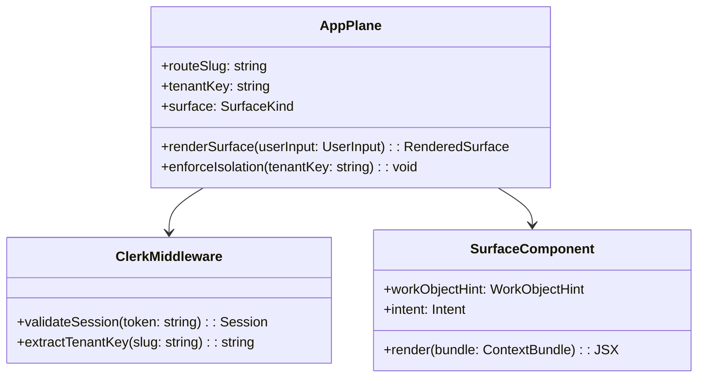
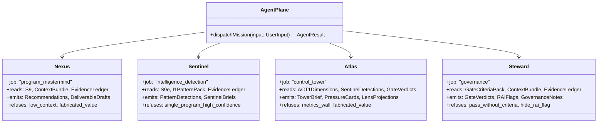
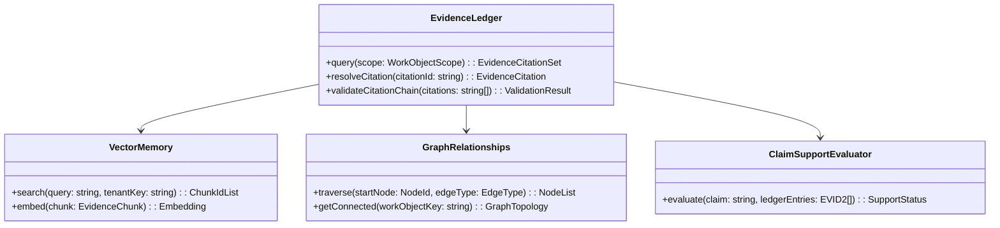

# AbarVa Planes Architecture — Per-Plane Deep Dive

Slice ID: ARCH3
Document: ABARVA_PLANES_ARCHITECTURE.md
Status: code_complete
Authored: 2026-04-26
Author: Code (sole)
Type: Specification / architecture document — no application code,
no runtime modification, no migrations, no model calls.

This document provides a per-plane deep dive for each of the eleven
AbarVa architectural planes. For each plane: purpose, key components,
interfaces to adjacent planes, and honest AbarVa implementation status.

Read ABARVA_ARCHITECTURE_OVERVIEW first for the top-level plane map.

---

## Plane 1 — App Plane (APP)

### Purpose

Render tenant-scoped UI surfaces. Enforce authentication and tenant
isolation at the route layer. Translate user actions into typed
`UserInput` events that flow to the Agent Plane.

### Key components

- **Next.js App Router** — file-based routing with middleware for
  tenant key extraction from route slugs.
- **Clerk auth middleware** — validates session tokens; enforces S7
  tenant isolation before any read model is consulted.
- **Surface components** — Programs (`/tenant/<slug>/programs/...`),
  Tower (`/tenant/<slug>/tower`), Intelligence
  (`/tenant/<slug>/intelligence`), Maestro (`/tenant/<slug>/maestro`),
  Admin (`/tenant/<slug>/admin`), Source (`/source/...`).
- **Design system shell** — DES1 / DES2 AbarVa design canon;
  `#F8F7F4` background, Georgia serif headings, DM Sans body.
- **Missing-input chip renderer** — surfaces gaps, fallbacks, and
  promote-to-next-tier prompts from Context Bundle state classifier.

### Interfaces

- **Inbound**: user browser request; Clerk session token.
- **Outbound → Agent Plane**: typed `UserInput` with `tenantKey`,
  `routeSlug`, `surface`, `workObjectHint`, `intent`, `userId`,
  `userRole`.
- **Outbound → SaaS Control Plane**: Clerk session validation;
  tenant tier enforcement.

### AbarVa implementation status

- Fully wired. All surfaces render with seed data.
- S7 tenant isolation enforced at route layer.
- DES1 / DES2 design canon applied.
- Live auth redirects and route smoke: production target.

---

## Plane 2 — Agent Plane (AGENT)

### Purpose

Execute bounded agent missions. Each agent has a job, a refusal
contract, and a set of read sources. No agent imports a provider SDK
directly — all model calls route through the Model Gateway Plane.

### Key components

- **Nexus** — program-level mastermind; composes recommendations,
  sequences phases, surfaces next deliverable.
- **Sentinel** — intelligence agent; detects patterns (I1) and failure
  modes (PF1); surfaces Sentinel briefs (I2).
- **Atlas** — control tower agent; composes the executive Tower brief
  (ACT1); surfaces pressure cards and lens projections.
- **Steward** — governance agent; evaluates G1–G4 gates; issues typed
  verdicts; surfaces RAI / risk flags.
- **Work-object resolver** — deterministic resolver from `UserInput`
  hint to typed `WorkObject`.
- **Mission queue** — AG10 typed seed of pending missions per agent,
  surface, and work object.

### Interfaces

- **Inbound ← App Plane**: typed `UserInput`.
- **Outbound → Context Plane**: `WorkObject` + tenant context to
  assemble `ContextBundle`.
- **Outbound → Model Gateway Plane**: `ContextBundle` + role →
  `GatewayPrompt` → `GatewayResponse`.
- **Outbound → Tool Plane**: mutation requests with typed parameters.
- **Outbound → Governance / Audit Plane**: gate evaluation requests;
  audit row emits.

### AbarVa implementation status

- All four agents implemented as deterministic read-model modules.
- AG10 mission queue wired; AG11 / AG12 mission panel surfaces wired.
- Live gateway routing, cross-agent handoffs, and runtime trigger
  wiring deferred (ARCH1 §11.2).

---

## Plane 3 — Context Plane (CTX)

### Purpose

Assemble the typed `ContextBundle` (S1) that the Agent Plane and Model
Gateway Plane use as the sole input to any model composition. The
Context Plane is the determinism guarantee: two calls with the same
`(tenant, workObject, seedSnapshot)` produce byte-equal output.

### Key components

- **Context Builder** (S1) — orchestrates retrieval from all downstream
  planes; emits typed `ContextBundle`.
- **State Classifier** (S2) — classifies bundle as `low_context` /
  `partial_context` / `usable_with_gaps` / `usable` / `rich`.
- **Quality Scorecard** (S2) — six-dimension quality scoring across
  evidence, pattern, governance, value, workflow integration, change.
- **Vanilla-response risk flag** — boolean; when true, forces the
  gateway to refuse or downgrade composition.
- **Context Quality v2** (CTX4) — ten-dimension scorer returning
  overall band (usable / partial / weak / refused) for runtime gating.
- **Mission-context bridge** (CTX3) — projects AG10 missions into CTX2
  unified context packs.

### Interfaces

- **Inbound ← Agent Plane**: `WorkObject` + `UserInput` + tenant context.
- **Outbound → Knowledge / Evidence Plane**: evidence ledger query;
  graph traversal.
- **Outbound → Data Plane**: relational state reads; program signals.
- **Outbound → Governance / Audit Plane**: gate verdicts + RAI flags.
- **Returns to Agent Plane**: typed `ContextBundle` with classifier,
  scorecard, risk flag.

### AbarVa implementation status

- S1 / S2 contracts fully wired.
- CTX2 unified context builder wired; evidence / conversation /
  datasets sections honestly-empty pending live ingest.
- CTX3 mission-context bridge wired.
- CTX4 context quality v2 wired.
- Live EVID2 retrieval integration: production target.

---

## Plane 4 — Knowledge / Evidence Plane (KE)

### Purpose

Be the **only** surface for evidence retrieval used by the Context
Builder, agents, and deliverable composers. Every E-### citation
resolves through the evidence ledger. Vector memory and graph
relationships are tools behind the ledger abstraction — never surfaced
directly.

### Key components

- **Evidence Ledger** — projects every cited chunk with: `citationId`
  (`E-###`), `chunkId`, `tenantKey`, `sourceObjectId`,
  `sourceLocator`, `extractedFields`, `citationTier` (primary /
  corroborating / unverified), `confidenceCap`, `evidenceUsability`,
  `createdFrom`.
- **Vector Memory** — stores embeddings of evidence chunks for
  retrieval. Every hit resolves through the ledger before surfacing.
- **Graph Relationships** — typed edges between work objects: program
  → phase → workshop → deliverable → evidence; pattern →
  failure-mode → solution-component. All edges are typed — no
  free-form graph labels.
- **EVID3 Claim-Support Evaluator** — deterministic evaluator over
  EVID2 entries; returns one of seven canonical support statuses.

### Interfaces

- **Inbound ← Context Plane**: evidence query by work object scope.
- **Inbound ← Tool Plane**: evidence-ledger tool calls.
- **Outbound → Data Plane**: chunk reads from relational store +
  object store.
- **Returns**: typed `EvidenceCitationSet`.

### AbarVa implementation status

- Evidence ledger contract fully defined (ARCH1 §4.5).
- EVID2 ledger entries seeded for demo tenants.
- EVID3 claim-support evaluator wired.
- Live ingest pipeline (§3 lifecycle) deferred.
- Vector provider contract wired (DATA6); live retrieval deferred.
- Graph provider contract wired (GRAPH1); live graph binding deferred.

---

## Plane 5 — Data Plane (DATA)

### Purpose

Hold the canonical persistence layer: relational state, raw uploaded
objects, and the ingestion + parsing pipeline that turns uploads into
evidence chunks. All rows carry `tenant_key`; RLS policies enforce
isolation at the persistence layer.

### Key components

- **Relational Store** (Postgres / Supabase) — programs, phases, gates,
  deliverables, decisions, action items, scorecards, briefs, detections,
  audit rows. Every row carries `tenant_key`.
- **Object Store** — raw uploaded binaries (PDF, DOCX, XLSX, PPTX, CSV,
  PNG, MP4, transcripts). Every object has hash + tenant binding +
  chunk-set link.
- **Ingestion + Parsing Pipeline** — seven-stage lifecycle (parse →
  chunk → enrich → embed → extract → persist → validate). Deterministic
  extractors; models are not parsers (ARCH1 §3.2).
- **Extractor Library** — pure, typed, unit-tested extractors in
  `src/lib/extractors/**`.

### Interfaces

- **Inbound ← Tool Plane**: write mutations through read-model write API.
- **Inbound ← Ingestion**: new uploads flow through the pipeline.
- **Outbound → Knowledge / Evidence Plane**: chunk + evidence ledger
  projection.
- **Outbound → Context Plane**: relational state reads.

### AbarVa implementation status

- Seed data fully wired for demo tenants (Apex Retail, Meridian).
- CLOUD4 local docker-compose lab (Postgres + MinIO) for dev validation.
- Live evidence ledger ingest, live object store, and live Supabase RLS
  enforcement: production targets.

---

## Plane 6 — Model Gateway Plane (MG)

### Purpose

Be the **single chokepoint** for every model call. No agent, page
component, or read model may import a provider SDK directly. The gateway
enforces audit, cost tracking, prompt assembly, fallback, and provider
abstraction.

### Key components

- **Gateway Router** — selects provider + model class based on role,
  tenant tier, cost budget, latency budget. Roles: `narrate`,
  `critique`, `summarize`, `score`, `compose`.
- **Prompt Assembler** — provider-agnostic prompt from typed
  `ContextBundle` + role. Structured: system, instructions, evidence
  block, signals block, gaps block, output schema.
- **Cost Tracker** — records tokens in/out, dollar cost, model name,
  latency per call.
- **Gateway Audit** — appends prompt hash, context bundle hash,
  response hash, cost, latency to the Governance / Audit Plane.
- **Fallback Handler** — retries once on transient error; emits typed
  `GatewayRefusal` on permanent failure.
- **Tenant Model Provider Policy** (MG4) — per-tenant approved /
  blocked / deferred / requires-review provider decisions.

### Interfaces

- **Inbound ← Agent Plane**: `ContextBundle` + `role` + `intent`.
- **Outbound → Provider**: dispatches `GatewayPrompt` to Anthropic /
  OpenAI / Azure OpenAI / future local model.
- **Outbound → Governance / Audit Plane**: appends `AuditRow`.
- **Returns to Agent Plane**: typed `GatewayResponse`.

### AbarVa implementation status

- Contract fully defined (ARCH1 §6; MG4 tenant policy matrix wired).
- Live gateway module and provider dispatch: deferred (production target).

---

## Plane 7 — Tool Plane (TOOL)

### Purpose

Be the **only side-effect surface** for agents. Every read or mutation
an agent performs on persistent state flows through a typed, tenant-
scoped, audited tool.

### Key components

- **Tool Registry** (TOOL2) — sixteen canonical tools with allowed
  agents, mode (read / write / export / audit), tenant scope, audit
  requirement, production status.
- **Tool Dispatcher** (TOOL4, deferred) — consults SEC1 policy gate
  before dispatching; emits TOOL3 audit row on every call.
- **Tool Invocation Audit** (TOOL3) — deterministic audit read model of
  all tool invocations across all agents; names the shape the live
  dispatcher must emit.
- **Runtime Policy Gate** (SEC1) — seven canonical check kinds
  (tenant_scope, tool_use, model_gateway_use, evidence_use,
  dataset_trust, export_download, agent_handoff); four canonical
  decisions (allow, deny, require_waiver, require_review).

### Interfaces

- **Inbound ← Agent Plane**: typed tool call with `tenantKey` +
  tool-specific parameters.
- **Outbound → Data Plane**: relational writes.
- **Outbound → Knowledge / Evidence Plane**: evidence ledger writes.
- **Outbound → Governance / Audit Plane**: audit row emits.
- **Returns to Agent Plane**: typed `ToolResult` (ok / partial /
  refusal).

### AbarVa implementation status

- TOOL2 registry wired (16 canonical tools).
- TOOL3 audit read model wired (26 seed audit records).
- SEC1 policy gate wired.
- Live TOOL4 dispatcher: deferred (production target).

---

## Plane 8 — Governance / Audit Plane (GOV)

### Purpose

Hold the platform's defensibility layer: gate verdicts, RAI flags, the
audit ledger. Every recommendation, gate verdict, mutation, and model
call is traceable through this plane.

### Key components

- **Gate Verdicts** — Steward-issued verdicts for G1 Charter /
  G2 Architecture / G3 Build-Risk / G4 Adopt-Scale. Typed: `pass` /
  `pass_with_conditions` / `block` / `needs_review`. Each verdict names
  criterion id, evidence chain, remedy.
- **RAI / Risk Flags** — typed risk flags with severity (info / medium /
  high / critical). A `critical` flag forces a `block` gate verdict
  regardless of other criteria.
- **Audit Ledger** — append-only, tenant-isolated ledger of every model
  call, gate verdict, mutation, and event emission. Each row carries
  tenant key, work object, surface, role, agent, model, prompt hash,
  response hash, tokens, cost, latency, provenance, time.
- **Tenant Isolation Boundary** (TEN2) — storage / vector / graph /
  model_gateway / audit isolation contract that all live ingest must
  respect.

### Interfaces

- **Inbound ← Agent Plane**: gate evaluation requests.
- **Inbound ← Model Gateway Plane**: gateway audit rows.
- **Inbound ← Tool Plane**: tool audit rows.
- **Outbound → Context Plane**: gate verdicts + RAI flags.
- **Outbound → App Plane**: gate state for surface rendering.

### AbarVa implementation status

- Gate verdicts deterministic through S9 / S9b–g read models.
- RAI flag primitives defined.
- Audit ledger contract defined (ARCH1 §9.2); live persisted ledger
  deferred.
- TEN2 isolation boundary contract wired.

---

## Plane 9 — Deployment Plane (DEPLOY)

### Purpose

Host all planes in a secure, isolated infrastructure. In the SaaS
configuration: Vercel / AKS container hosting with VNet, private
endpoints, Key Vault, TLS termination. In the Private Data Plane
configuration: extends customer-owned infrastructure through the TEN4
adapter contract.

### Key components

- **Container Host** — AKS or Vercel serverless hosting for the App
  Plane. Stateless; secrets injected via Key Vault.
- **VNet + Private Endpoints** — all data plane calls (Postgres,
  object store, vector index) flow through private endpoints inside
  the VNet. No data plane component is exposed to the public internet.
- **Key Vault** — tenant secrets (connection strings, CMK references,
  API keys) managed centrally; no secrets in environment variable
  files committed to source.
- **TLS Termination** — all inbound traffic over TLS 1.2+. Certificates
  managed by the deployment plane.
- **DNS** — tenant-scoped subdomains or path-based routing.

### Interfaces

- **Inbound**: HTTPS requests from tenant browsers.
- **Internal**: private VNet peering to data plane components.
- **Outbound → SaaS Control Plane**: billing metering events.

### AbarVa implementation status

- Vercel SaaS deployment live; 16 routes 200.
- CLOUD4 local docker-compose lab for dev validation.
- AKS reference target documented in ABARVA_AZURE_REFERENCE_TARGET.md.

---

## Plane 10 — SaaS Control Plane (SCP)

### Purpose

Manage multi-tenant onboarding, authentication, billing, and tier
enforcement. The SaaS Control Plane is the trust root for tenant
identity — every plane downstream trusts the `tenantKey` issued here.

### Key components

- **Tenant Registry** — maps tenant slug to tenant key, tier, allowed
  surfaces, and billing state.
- **Auth (Clerk)** — OTP-based authentication; session tokens; role
  claims (`cio`, `cfo`, `caio`, `cto`, `value`, `risk`,
  `transformation`, `tenant_admin`, `platform_admin`).
- **Billing / Tier** — usage metering; enforces which model classes and
  surfaces are available per tenant tier.
- **Tenant Onboarding** — provisions tenant registry entry; seeds
  canonical read models; configures default patterns and failure-mode
  packs.

### Interfaces

- **Outbound → App Plane**: session validation + tenant key.
- **Outbound → Model Gateway Plane**: tier-based model class limits.
- **Outbound → Deployment Plane**: provisioning events.

### AbarVa implementation status

- Clerk auth wired; demo tenants seeded (Apex Retail, Meridian,
  Arcturus).
- Full onboarding flow and billing metering: production targets.

---

## Plane 11 — Private Data Plane (PDP, optional)

### Purpose

Allow enterprise customers with strict data residency, sovereignty, or
compliance requirements to run the Data Plane and Knowledge / Evidence
Plane on customer-owned infrastructure. AbarVa SaaS provides the App,
Agent, Context, Model Gateway, Tool, and Governance planes; the
customer's environment hosts the persistence layer.

### Key components

- **Customer-Owned Postgres** — relational state in customer's
  Flexible Server instance; accessible to AbarVa over private endpoint
  or VPN.
- **Customer-Owned Object Store** — raw uploads in customer's Blob
  Storage / S3-compatible store.
- **Customer-Managed Keys (CMK)** — encryption keys in customer's Key
  Vault; AbarVa never holds the raw key material.
- **TEN4 Data Plane Adapter** — provider-agnostic adapter contract for
  relational_store, object_store, vector_search, graph_provider,
  evidence_ledger, model_gateway_provider, audit_store. Each adapter
  declares provider, capabilities, required env vars, and safety
  constraints.
- **Tenant Isolation Boundary** (TEN2) — enforces storage / vector /
  graph / audit isolation inside the customer's environment.

### Interfaces

- **Inbound ← AbarVa SaaS**: API calls from Context Plane and Tool
  Plane through the TEN4 adapter contract.
- **Internal**: CMK wraps all data at rest inside customer environment.
- **Outbound → Governance / Audit Plane**: audit rows flow back to AbarVa
  Governance Plane (redacted per tenant policy if required).

### AbarVa implementation status

- TEN4 adapter contract wired (7 adapter interfaces; no live runtime).
- TEN2 isolation boundary contract wired.
- TEN3 dedicated tenant deployment blueprint documented.
- Live per-tenant adapter provisioning and CMK binding: production target.

---

## End of ABARVA_PLANES_ARCHITECTURE

Read ABARVA_REQUEST_TO_CONTEXT_FLOW next for the sequence diagram of
a full request through all eleven planes.
