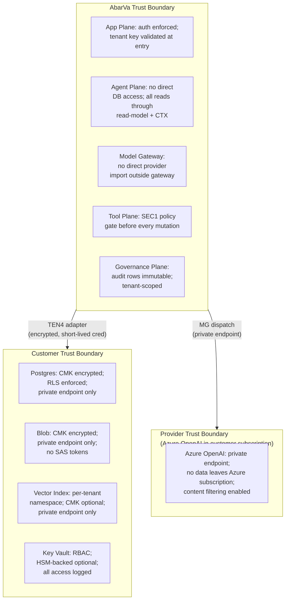

# AbarVa Private Data Plane Model

Slice ID: ARCH3
Document: ABARVA_PRIVATE_DATA_PLANE_MODEL.md
Status: code_complete
Authored: 2026-04-26
Author: Code (sole)
Type: Specification / architecture document — no application code,
no runtime modification, no migrations, no model calls.

This document defines the AbarVa Private Data Plane model — the
optional extension for enterprise customers requiring data residency,
customer-managed encryption, and full tenant isolation inside their own
infrastructure. It covers SaaS Control vs. Private Data Plane
separation, data residency, customer-managed keys, tenant isolation, and
trust boundaries.

---

## 1. Two deployment modes

AbarVa supports two deployment modes:

| Mode | Description |
|---|---|
| **Shared SaaS** | All planes run in AbarVa's infrastructure. Tenant isolation is logical (row-level security, tenant-scoped containers, per-tenant namespace in the vector index). Data resides in AbarVa's Azure subscription. |
| **Private Data Plane** | The SaaS Control Plane, App Plane, Agent Plane, Context Plane, Model Gateway Plane, Tool Plane, and Governance Plane run in AbarVa's infrastructure. The Data Plane and Knowledge / Evidence Plane are deployed in the customer's own infrastructure and never leave the customer's environment. |

The Private Data Plane mode is enabled for enterprise customers under a
dedicated-tenant agreement. It is governed by the TEN4 Data Plane
Adapter Contract (ARCH1 §4, TEN4 slice).

---

## 2. SaaS Control Plane vs. Private Data Plane separation

```mermaid
graph TD
    subgraph ABARVA_SAAS["AbarVa SaaS (Anthropic-owned infrastructure)"]
        scp["SaaS Control Plane\n(Tenant Registry / Auth / Billing)"]
        app["App Plane\n(Surfaces / Router)"]
        agent["Agent Plane\n(Nexus / Sentinel / Atlas / Steward)"]
        ctx["Context Plane\n(Context Builder / Classifier)"]
        mg["Model Gateway Plane\n(Router / Audit / Cost)"]
        tool["Tool Plane\n(Registry / Dispatcher)"]
        gov["Governance / Audit Plane\n(Gate Verdicts / Audit Ledger)"]
    end

    subgraph CUSTOMER_ENV["Customer Environment (customer-owned infrastructure)"]
        direction TB
        subgraph PDP["Private Data Plane"]
            pg["Postgres Flexible Server\n(customer-managed)"]
            blob["Blob Storage\n(customer-managed)"]
            vector["Vector Index\n(customer-managed)"]
            graph["Graph Store\n(customer-managed)"]
            evid["Evidence Ledger\n(customer-managed)"]
            audit_store["Audit Store\n(customer-managed)"]
        end
        kv["Customer Key Vault\n(CMK keys)"]
        vnet["Customer VNet\n(Private Endpoints)"]
    end

    scp -->|"tenant key issuance"| app
    app -->|"UserInput"| agent
    agent -->|"context query"| ctx
    ctx -->|"TEN4 adapter contract"| PDP
    tool -->|"TEN4 adapter contract"| PDP
    gov -->|"audit row write\n(TEN4 adapter)"| audit_store
    mg -->|"model call\n(customer-approved provider)"| PROVIDER

    PDP -->|"encrypt at rest"| kv
    PDP -->|"accessible only via\nprivate endpoint"| vnet

    subgraph PROVIDER["Model Provider\n(Azure OpenAI in customer subscription\nor approved external)"]
        aoai["Azure OpenAI\n(customer-owned deployment)"]
    end
```

### 2.1 What stays in AbarVa infrastructure

- All app surfaces (rendering, routing, auth).
- All agent logic (Nexus, Sentinel, Atlas, Steward).
- Context Builder and quality scoring.
- Model Gateway routing, prompt assembly, and cost tracking.
- Tool Plane registry and policy gate.
- Gate verdicts and RAI flag logic.
- The audit ledger **schema** — the ledger **rows** are written to the
  customer's audit store through the TEN4 adapter.

### 2.2 What stays in customer infrastructure

- All tenant payload data: programs, phases, deliverables, evidence
  chunks, conversation history, uploaded documents.
- All vector embeddings.
- All graph relationships.
- The evidence ledger projected from the customer's chunks.
- The audit ledger rows for every model call, gate verdict, and
  mutation that touches tenant data.
- All encryption keys (CMK) — AbarVa never sees raw key material.

---

## 3. Data residency

### 3.1 Shared SaaS residency

In Shared SaaS mode, tenant data resides in the AbarVa-designated
Azure region (e.g., East US 2). Tenants on a shared deployment agree
to AbarVa's data processing agreement (DPA) which specifies the region,
retention policies, and AbarVa's sub-processor obligations.

### 3.2 Private Data Plane residency

In Private Data Plane mode, tenant payload data never leaves the
customer's environment. The customer selects the Azure region for their
Postgres, Blob, and vector instances. AbarVa's planes interact with
the customer's data through the TEN4 adapter contract — encrypted at
the network layer (TLS), with short-lived credentials issued by the
customer's Key Vault.

AbarVa's planes do not cache, store, or replicate customer payload data
in AbarVa infrastructure. The only data that flows back to AbarVa
infrastructure from the Private Data Plane is:

- **Audit row schemas** (not row content) — for compatibility
  validation.
- **Anonymized telemetry** for platform health monitoring (opt-out
  available).
- **Gate verdict outcomes** (without underlying evidence content) —
  to render the Governance Plane surface.

---

## 4. Customer-managed keys (CMK)

CMK is available for both Shared SaaS (premium tier) and Private Data
Plane mode.

### 4.1 Key hierarchy

```
Customer Master Key (CMK)
  ├── Postgres data encryption key (DEK)
  │     └── encrypted per table-space by CMK
  ├── Blob Storage encryption key
  │     └── Azure Storage Service Encryption with CMK
  ├── Vector index encryption key
  │     └── Azure AI Search customer-managed encryption
  └── Audit store encryption key
        └── per-row symmetric key wrapped by CMK
```

### 4.2 Key rotation

- CMK rotation is triggered by the customer in their Key Vault.
- AbarVa's credential fetcher detects key version changes at the next
  credential refresh (15-minute TTL on cached credentials).
- Postgres and Blob Storage re-encrypt data encryption keys against the
  new CMK version automatically.
- No downtime is required for CMK rotation (Azure handles re-wrapping
  of DEKs transparently).

### 4.3 Key revocation

- If the customer revokes the CMK (deletes or disables the key in Key
  Vault), AbarVa's planes lose access to the tenant's data within the
  credential TTL (max 15 minutes).
- The tenant's data is NOT deleted on key revocation — it remains in the
  customer's environment, encrypted, inaccessible to AbarVa until the
  key is restored or a new key is provisioned.
- Key revocation is the customer's emergency data lockdown mechanism.

---

## 5. Tenant isolation

Tenant isolation is enforced at four levels regardless of deployment
mode:

| Level | Mechanism | Enforced by |
|---|---|---|
| **Persistence (RLS)** | Every Postgres row carries `tenant_key`; RLS policies reject cross-tenant reads | Postgres + TEN2 contract |
| **Read-model (S7)** | Every read-model module passes the S7 isolation probe tests | Integration tests |
| **Tool layer** | Every tool call carries `tenantKey`; dispatcher rejects missing or mismatched keys | TOOL4 dispatcher + SEC1 policy gate |
| **Audit ledger** | Every audit row is tenant-scoped; replay cannot leak across tenants | Audit ledger + GOV Plane |

In Private Data Plane mode, a fifth level is added:

| Level | Mechanism |
|---|---|
| **Network isolation** | Tenant data accessible only via private endpoint inside customer VNet |

### 5.1 S7 isolation probe tests

The S7 tenant isolation probe tests run on every PR and enforce that:

1. No read model returns data for a tenant key other than the one
   supplied.
2. No read model can be called without a `tenantKey`.
3. Cross-tenant queries at the database layer throw a typed isolation
   error.

---

## 6. Trust boundaries



### 6.1 AbarVa trust boundary assertions

- AbarVa planes do not store raw tenant payload data outside the
  designated data store (Postgres / Blob / Vector).
- AbarVa's Model Gateway does not log prompt content to AbarVa
  infrastructure logs in Private Data Plane mode — only the prompt hash,
  token counts, cost, and latency are retained.
- AbarVa's source code is auditable; no hidden data exfiltration path
  exists in the App, Agent, Context, Gateway, Tool, or Governance planes.

### 6.2 Customer trust boundary assertions

- Customer Key Vault is the root of trust for all data at rest.
- Customer network team controls the NSGs and private endpoint policies;
  AbarVa has no ability to open inbound connections to the customer VNet.
- Customer can revoke access at any time by revoking the CMK or removing
  AbarVa's managed identity from the Key Vault RBAC role.

### 6.3 Provider trust boundary assertions

- Azure OpenAI in a customer subscription processes prompts within the
  customer's Azure subscription boundary; no data is sent to Microsoft
  for training.
- For non-Azure providers (Anthropic, OpenAI), the Model Gateway
  enforces the MG4 tenant model provider policy (per-tenant approved /
  blocked / deferred / requires_review). A tenant that has blocked
  non-Azure providers will receive a `GatewayRefusal` for any call
  that would route to a blocked provider.

---

## 7. Evidence manifest mode (no raw copy)

AbarVa supports an Evidence Manifest mode (TRUST4) for clients who do
not wish to upload raw data to AbarVa at all.

In this mode:
- The client supplies evidence by **manifest** — a structured record
  naming a metric, a labelled value, the named source owner (role +
  system), a bounded date range, and the verification posture.
- `rawRetainedByClient` is structurally `true` on every manifest entry.
- AbarVa cites the manifest entry as evidence without storing the
  underlying raw data.

Evidence Manifest mode is compatible with both Shared SaaS and Private
Data Plane deployments.

---

## End of ABARVA_PRIVATE_DATA_PLANE_MODEL

Read ABARVA_MODEL_GATEWAY_AND_TOOL_PLANE next for the Model Gateway
and Tool Plane deep dive.
