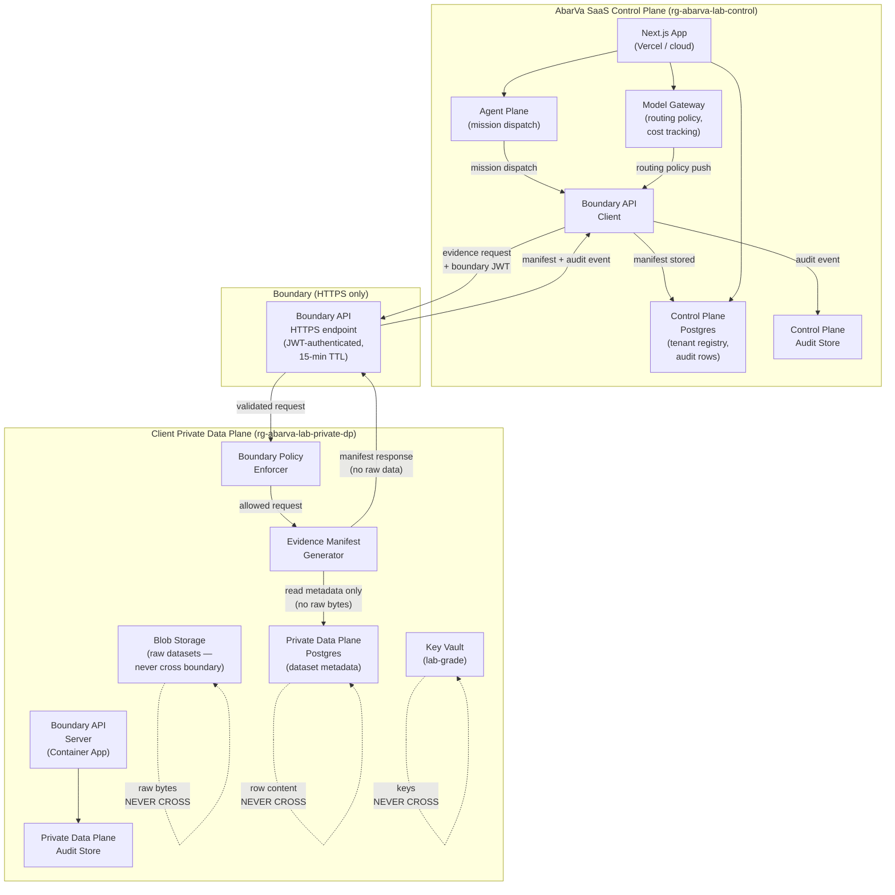

# AZLAB1: SaaS Control Plane + Private Data Plane Lab Blueprint

Slice ID: AZLAB1
Document: AZLAB1_SAAS_CONTROL_PLANE_PRIVATE_DATA_PLANE_BLUEPRINT.md
Status: code_complete
Authored: 2026-04-26
Author: Code (sole)
Type: Architecture / lab blueprint — no application code, no runtime
modification, no migrations, no model calls.

This document defines the AZLAB1 lab blueprint: a simulated two-plane
deployment that proves the AbarVa boundary architecture before a full
enterprise deployment. The AbarVa SaaS Control Plane is simulated on
Vercel/cloud infrastructure. The Client Private Data Plane is simulated
on an Azure subscription under controlled lab conditions.

---

## 1. What this lab proves and does not prove

### 1.1 What the lab proves

| Claim | How proved |
|---|---|
| Boundary API works end-to-end | Evidence manifest request from Control Plane reaches Private Data Plane stub; structured response returns without error |
| Evidence manifests flow correctly | Manifest payload (metric name, labelled value, source owner, date range, verification posture) crosses the boundary; raw file content does not |
| Audit events flow from both planes | Audit rows from Control Plane actions and Private Data Plane boundary calls land in their respective audit stores |
| No raw data exfiltration | Blob contents, Postgres rows, and vector embeddings do not appear in Control Plane logs, responses, or storage |
| Boundary policy enforcement works | Requests missing the boundary API token are rejected; oversized payloads are rejected; raw-data fields are stripped at the boundary adapter |
| Azure resource groups are correctly scoped | `rg-abarva-lab-control` and `rg-abarva-lab-private-dp` are network-isolated from each other except via the boundary API endpoint |

### 1.2 What the lab does NOT prove

| Non-claim | Reason deferred |
|---|---|
| Production SLA (99.9% uptime) | Lab uses minimal SKUs; no zone-redundant standby, no auto-scaling |
| Real enterprise key management | Lab uses Azure Key Vault with service-managed keys, not HSM-backed CMK |
| Real data residency compliance | Lab data has no PII; no DPA, no regulatory audit scope |
| Production-grade network isolation | Lab uses permissive NSGs for iteration speed; production requires locked-down NSG rules per ABARVA_AZURE_REFERENCE_TARGET §5 |
| Real tenant isolation at scale | Single synthetic tenant in lab; multi-tenant RLS and S7 probe suite not run against lab data |
| Local inference in the Private Data Plane | Azure OpenAI deployment deferred to AZLAB3; lab uses a model stub |

---

## 2. Control Plane responsibilities

The AbarVa SaaS Control Plane is the AbarVa-operated layer. In this
lab it is simulated on Vercel (Next.js app) backed by a Postgres
Flexible Server in `rg-abarva-lab-control`.

| Responsibility | Implementation in lab |
|---|---|
| Tenant configuration | Tenant registry row in Control Plane Postgres; slug, tier, private-dp-enabled flag |
| Mission dispatch | Agent mission queue record; dispatches boundary API call to Private Data Plane |
| Evidence requests | Boundary API POST to Private Data Plane `/boundary/evidence-request`; receives manifest response |
| Audit event recording | Audit rows written to Control Plane audit table; tenant-scoped |
| No raw data storage | Control Plane Postgres and Blob Storage contain zero raw client dataset content |
| Model gateway routing | Routing policy record (provider, model, tier); model weights/API keys never stored in Control Plane |

---

## 3. Private Data Plane responsibilities

The Client Private Data Plane is the client-operated layer. In this
lab it is simulated in `rg-abarva-lab-private-dp` inside an Azure
subscription controlled by the AbarVa lab operator (not a real
enterprise customer).

| Responsibility | Implementation in lab |
|---|---|
| Raw dataset storage | Synthetic datasets in Azure Blob Storage (`rg-abarva-lab-private-dp`) |
| Local inference (future) | Deferred to AZLAB3; lab uses a model stub container |
| Evidence manifest generation | Container App receives evidence request; generates manifest from synthetic dataset; returns manifest (not raw data) |
| Artifact metadata | Metadata records (artifact ID, type, size, hash) stored in Private Data Plane Postgres; full artifact bytes never sent to Control Plane |
| Boundary policy enforcement | Request validator middleware: rejects requests without boundary token; strips any raw-data fields before response leaves the plane |

---

## 4. Azure resource groups

| Resource Group | Plane | Purpose |
|---|---|---|
| `rg-abarva-lab-control` | SaaS Control Plane simulation | Next.js/Vercel equivalent services, Control Plane Postgres, Control Plane Blob, Control Plane audit table, boundary API client |
| `rg-abarva-lab-private-dp` | Private Data Plane simulation | Private Data Plane Container App (boundary API server), Private Data Plane Postgres, Private Data Plane Blob (synthetic datasets), Key Vault (lab-grade), Private DNS Zone |

Both resource groups reside in the same Azure subscription for the lab.
In production, `rg-abarva-lab-private-dp` would be in the client's own
subscription and tenant.

---

## 5. Data boundary

### 5.1 What crosses the boundary (Control Plane → Private Data Plane)

| Item | Direction | Format |
|---|---|---|
| Evidence request payload | CP → PDP | JSON: `{ missionId, tenantKey, requestedMetrics[], dateRange, verificationPosture }` |
| Boundary API authentication token | CP → PDP | HTTP Authorization header (short-lived JWT, 15-minute TTL) |
| Mission dispatch metadata | CP → PDP | JSON: `{ missionId, agentRole, taskType }` |

### 5.2 What crosses the boundary (Private Data Plane → Control Plane)

| Item | Direction | Format |
|---|---|---|
| Evidence manifest | PDP → CP | JSON: `{ manifestId, entries[{ metricName, labelledValue, sourceOwner, dateRange, verificationPosture, rawRetainedByClient: true }] }` |
| Artifact metadata | PDP → CP | JSON: `{ artifactId, type, sizeBytes, sha256, createdAt }` — no content bytes |
| Boundary audit event | PDP → CP | JSON: `{ eventId, eventType, tenantKey, timestamp, outcome }` — no payload content |

### 5.3 What never crosses the boundary

| Item | Reason |
|---|---|
| Raw file bytes (CSV, PDF, XLSX) | Stays in Private Data Plane Blob Storage |
| Postgres row content (dataset records) | Stays in Private Data Plane Postgres |
| Vector embeddings | Stays in Private Data Plane vector store |
| Encryption keys or Key Vault secrets | Never leaves client infrastructure |
| Model weights or API keys | Per-plane; not shared across boundary |

---

## 6. Evidence boundary

The evidence boundary governs what evidence-related data crosses the
plane boundary.

**Crosses:** Citation locator — a structured reference that identifies
the source (named system, role-owner, metric name, date range). The
locator enables the Control Plane to display a citation without
possessing the underlying content.

**Does not cross:** Raw file content. The actual bytes of the source
document, spreadsheet, or database export remain in the Private Data
Plane. `rawRetainedByClient` is structurally `true` on every manifest
entry (see ABARVA_PRIVATE_DATA_PLANE_MODEL §7 — Evidence manifest mode).

---

## 7. Model gateway boundary

The model gateway boundary governs what model-related configuration
crosses the plane boundary.

**Crosses:** Routing policy record — provider name, model identifier,
per-tenant allowed/blocked/deferred disposition, token budget, cost
centre tag. This policy is authored in the Control Plane and pushed to
the Private Data Plane model stub as configuration.

**Does not cross:** Model weights, fine-tune adapters, API keys, or
provider credentials. Each plane holds its own credentials. The Control
Plane Model Gateway key is stored in Control Plane Key Vault. Any
future Private Data Plane Azure OpenAI deployment would hold its own
key in the Private Data Plane Key Vault.

---

## 8. Network boundary

| Layer | Control |
|---|---|
| Plane-to-plane transport | HTTPS only (TLS 1.2+); no plaintext path exists |
| Boundary API endpoint | Single HTTPS endpoint exposed by Private Data Plane Container App; no other inbound port open from Control Plane |
| Internal Private Data Plane connectivity | Private endpoints within `rg-abarva-lab-private-dp` VNet; Postgres and Blob not publicly reachable |
| Internal Control Plane connectivity | Vercel/cloud hosted for lab; production equivalent would use `rg-abarva-control` VNet with private endpoints per ABARVA_AZURE_REFERENCE_TARGET §3 |
| Boundary API auth | Short-lived JWT (15-minute TTL) issued by Control Plane auth service; Private Data Plane validates signature and expiry before processing any request |

---

## 9. Architecture diagram

**Legend:**
- Solid arrows: data flows that DO cross (or stay within) the boundary
- Dashed self-loops: data that NEVER leaves the Private Data Plane

---

## 10. May 4 target path

The following steps bring the lab to a running, demonstrable state by
May 4, 2026.

### Step 1 — Azure subscription (Day 1: Apr 27)

- Confirm Azure subscription is active and billing is enabled.
- Assign Contributor role to lab operator service principal.
- Enable required resource providers: `Microsoft.ContainerInstance`,
  `Microsoft.App`, `Microsoft.DBforPostgreSQL`, `Microsoft.Storage`,
  `Microsoft.KeyVault`, `Microsoft.Network`.

### Step 2 — Resource groups (Day 1: Apr 27)

- Create `rg-abarva-lab-control` in chosen region (e.g., eastus2).
- Create `rg-abarva-lab-private-dp` in same region.
- Apply tags: `env=lab`, `project=azlab1`, `owner=abarva-lab`.
- Confirm NSG defaults: all inbound blocked except explicit allow rules.

### Step 3 — Container apps and data stores (Days 2–3: Apr 28–29)

- Deploy Private Data Plane Container App (boundary API server stub)
  to `rg-abarva-lab-private-dp`.
  - Expose single HTTPS endpoint: `/boundary/evidence-request`.
  - Wire JWT validation middleware (RS256, 15-minute TTL).
  - Wire boundary policy enforcer (strip raw-data fields, reject
    oversized payloads).
- Deploy Postgres Flexible Server to `rg-abarva-lab-private-dp`
  (Basic SKU for lab).
- Deploy Blob Storage account to `rg-abarva-lab-private-dp`.
  - Upload synthetic dataset (no PII).
- Deploy Key Vault to `rg-abarva-lab-private-dp` (Standard SKU,
  service-managed keys for lab).
- Deploy Postgres Flexible Server to `rg-abarva-lab-control`
  (Basic SKU for lab).
- Populate Control Plane tenant registry row (synthetic tenant).

### Step 4 — Boundary API stub wiring (Day 4: Apr 30)

- Implement evidence manifest generator in Private Data Plane
  Container App.
  - Reads metadata from Private Data Plane Postgres.
  - Returns manifest JSON with `rawRetainedByClient: true` on all
    entries.
  - Does not read Blob Storage bytes (reads metadata fields only).
- Implement boundary API client in Control Plane.
  - Issues short-lived JWT (Control Plane signing key in Control Plane
    Key Vault).
  - POST to Private Data Plane boundary endpoint.
  - Parses manifest response; stores in Control Plane Postgres.
  - Writes audit event to Control Plane audit store.
- Smoke test: `curl -X POST https://<pdp-boundary-url>/boundary/evidence-request` with valid JWT returns manifest.

### Step 5 — Evidence manifest demo (Days 5–6: May 1–2)

- Run end-to-end flow: Control Plane agent mission → boundary API
  request → Private Data Plane manifest generation → manifest returned
  → Control Plane audit event written.
- Verify: Private Data Plane Blob bytes are not present in Control
  Plane Postgres or logs.
- Verify: Boundary API rejects request with expired or missing JWT.
- Verify: Boundary policy enforcer strips any raw-data field injected
  into test request.
- Capture evidence: screenshot of Control Plane showing manifest
  citation (locator only, no raw content).

### Step 6 — Demo walkthrough (Day 7: May 3–4)

- Prepare two-panel demo view:
  - Left panel: Control Plane (Vercel/Next.js) showing agent mission,
    evidence manifest, audit event — no raw data visible.
  - Right panel: Azure portal showing `rg-abarva-lab-private-dp`
    with Blob Storage containing raw synthetic data that never crossed
    the boundary.
- Narrate: "The raw data stayed in the Private Data Plane. The Control
  Plane received only the evidence manifest. This is the boundary
  architecture."
- Record walkthrough video for investor and enterprise prospect use.

---

## 11. Deferred items (post-lab)

| Item | Target slice |
|---|---|
| Azure OpenAI deployment in Private Data Plane | AZLAB3 |
| HSM-backed CMK key management | AZLAB4 |
| Zone-redundant standby for Postgres | AZLAB5 |
| Multi-tenant RLS probe against lab data | AZLAB2 |
| Production NSG lockdown | AZLAB5 |
| Real enterprise customer subscription | Post-AZLAB5 |

---

## End of AZLAB1_SAAS_CONTROL_PLANE_PRIVATE_DATA_PLANE_BLUEPRINT

Read ABARVA_PRIVATE_DATA_PLANE_MODEL for the canonical private data
plane model that this lab validates. Read ABARVA_AZURE_REFERENCE_TARGET
for the production-grade Azure topology this lab approximates.
