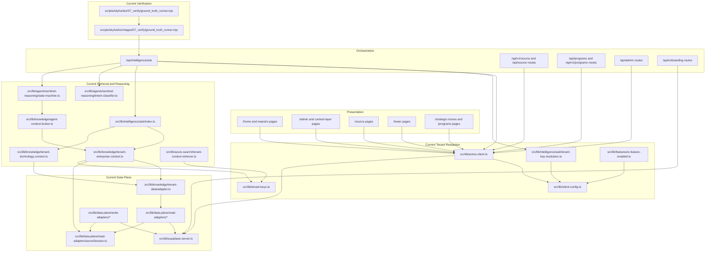
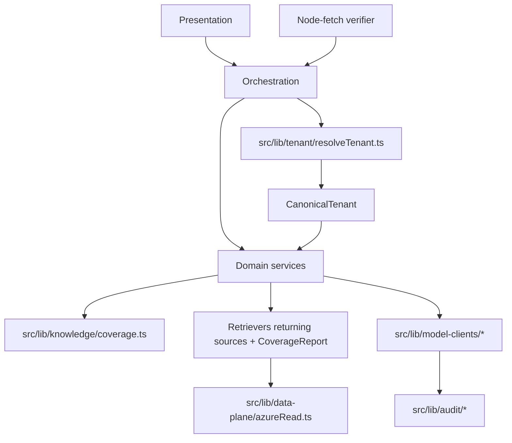

# Consolidation Dependency Graph

Date: 2026-05-28
Packet: Packet 30 Phase 0
Status: Audit-only

## Target Graph After Packet 30

## Gaps Represented

- `CanonicalTenant` does not exist yet.
- `resolveTenant()` does not exist yet.
- `coverage.ts` does not exist yet.
- Runtime data plane still has Supabase compatibility paths.
- Verifier still calls the live route without the Packet 30 harness/product taxonomy.
