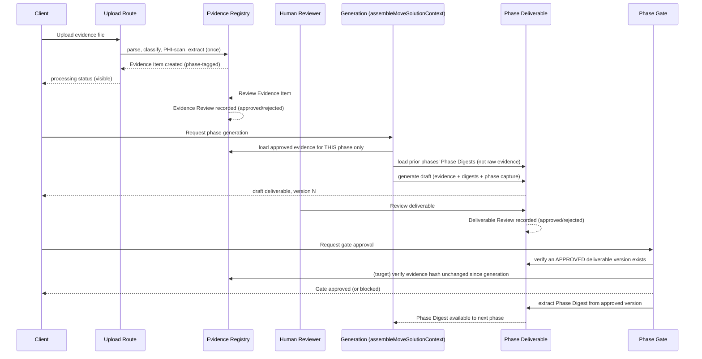

# Moves Operating Model — Domain Objects, Approval Separation, and the Evidence→Knowledge→Decision→Approval Loop

## Status

`proposed — not yet frozen`

This document exists because implementation work on Moves evidence handling (the phase-scoping fix
in `2026-07-25-moves-evidence-phase-scoping`) surfaced a deeper problem: the product does not yet
have a deterministic, written definition of how a Move is supposed to work. Before continuing
workstreams #4/#6/#7/#8/#9/#10 (evidence hashing, coverage view, cross-phase tagging, staleness
detection, structured-digest redesign, gate freshness checks), this document must be read, corrected
where wrong, and explicitly frozen. Everything below is written against the **actual current code**
(cited by file/table), not aspiration — where a section describes a target state instead of what
exists today, it says so explicitly.

## The core reframe

The system currently organizes itself around phase numbers:

```
P0 → P1 → P2 → P3 → P4 → P5
```

That's an execution index, not the operating model. The actual repeating unit of work inside every
phase is:

```
Evidence → Knowledge → Decision → Approval
```

Every phase is one iteration of this loop. P2 runs it once to produce the current-state picture;
P3 runs it again to produce the architecture; P4 runs it again for the roadmap. The loop doesn't
change — only its inputs (what evidence is relevant to this phase) and its output (which
deliverable type it produces) change per phase.

Internally the engine can keep P0–P5 as its execution index. The client-facing language should
describe the work, not the index:

| Internal phase | Client-facing name (target — not yet in UI) |
|---|---|
| P1 | Charter |
| P2 | Current State |
| P3 | Architecture |
| P4 | Roadmap |
| P5 | Execution Readiness |

This is a UI/copy change, not a data-model change, and is explicitly **not in scope** for this
document's freeze — it's listed here so it isn't lost, and because the domain objects below should
be named so that renaming the client-facing labels never requires renaming the underlying tables.

## The three approvals — and where they already live in code

The most important structural correction: **evidence approval, deliverable approval, and gate
approval are three different objects with three different owners.** They already exist as three
separate things in the codebase today, but they are not documented as separate, so they keep
getting treated as one thing in product conversations (this is exactly how the MEMBER AI ASSIST
P2→P3 fabrication incident happened: gate approval was granted without deliverable content and
evidence linkage being verified as the same fact).

| Approval | What it certifies | Table / mechanism today | Who decides |
|---|---|---|---|
| **Evidence approval** | This uploaded file is real, sensitivity-cleared, and usable as input | `program_evidence_reviews.decision` (`pending`/`approved`/`rejected`), one row per `program_evidence_items.id` | Any authorized program user (pilot); should tighten as roles harden |
| **Deliverable approval** | This generated draft is accurate and ready to stand behind | `artifact_review_decisions` (`src/lib/programs/deliverables/artifact-review-decisions.ts`), one row per deliverable version, `hasPriorPhaseDraftApproval` checks this | Reviewer role for that deliverable type |
| **Gate approval** | This phase, as a whole, is done and the Move may advance | `programs.gates_passed` (JSONB array) + `phase-gate-approval` route + `governance.ts`'s `evaluateGate`/`decideApproval` | Approver role, separation-of-duties enforced (`ApprovalSeparationOfDutiesError`) |

These are already three separate tables/mechanisms. What's missing is an explicit, enforced rule
that **gate approval requires deliverable approval, which requires the deliverable's cited evidence
to itself be approved** — right now a gate can be approved with no code-level check that the
deliverable it's gating even exists in an approved state, which is the root cause class behind the
MEMBER AI ASSIST incident (`104: MEMBER AI ASSIST remediation record`, `100: Fix core fabrication
bug in preparePhaseGateApprovalRecords`, `102: Build explicit override governance` — all prior
point-fixes to symptoms of this same missing invariant).

## Domain objects

Six objects. For each: what creates it, who owns it, what's immutable vs. mutable, whether it's
versioned, what carries forward to later phases, and what today's source of truth is.

### 1. Evidence Item

- **Created by:** an upload (`ingestUploadedMoveEvidence`, unified in Workstream 1) or a captured
  session/workshop note. One row per uploaded file.
- **Owner:** the Evidence Registry (see below) — not any single phase.
- **Immutable:** `id`, `attachment_id` (FK to `program_attachments`), `extracted_text`, `phase`
  (the phase it was uploaded against), `created_at`. Once parsed, the extraction result does not
  change in place.
- **Mutable:** none of substance today. `summary`/`extracted_structured` are written once at
  ingest. There is currently no supported "re-parse" or "edit" path — a correction requires a new
  Evidence Item, which is consistent with immutability but is not yet an explicit product rule.
- **Versioned:** no — an Evidence Item is a single immutable fact. If a corrected file replaces an
  earlier upload, that should be a *new* Evidence Item with a `supersedes` link (see Known Gaps),
  not a mutation.
- **Inherited by later phases:** no, by design (this is the phase-scoping fix just shipped) — a
  later phase does not see this phase's raw Evidence Items directly.
- **Source of truth:** `program_evidence_items` table.

### 2. Evidence Review

- **Created by:** a human decision (approve/reject) on one Evidence Item.
- **Owner:** the Evidence Registry.
- **Immutable:** the fact that a specific decision was made at a specific time by a specific actor.
- **Mutable:** the *current* decision can change (re-review), but the prior decision's history
  should be kept, not overwritten. Today the schema is a single row keyed by `evidence_id`
  (upserted), which loses re-review history — flagged as a gap below.
- **Versioned:** effectively no (see above) — should become an append-only decision log.
- **Inherited by later phases:** no directly — only through what it gates (an item is only visible
  to *any* generation, in-phase or not, once `decision = 'approved'`).
- **Source of truth:** `program_evidence_reviews` table.

### 3. Evidence Registry (concept — not yet a discrete object)

- **What it is today:** not a table or a named object in the codebase. It is a *query pattern* —
  `listProgramEvidenceForPrompt` (`evidence-context.ts`) and `loadEvidencePacketsForMove`
  (`evidence-packets.ts`) — that joins Evidence Items to Evidence Reviews and applies the
  phase filter. Every caller re-derives "the registry" by calling this pattern.
- **What it should own (per this session's redirection):** evidence hashing (#8), coverage state
  (#10), and — most importantly — the phase-tagging/cross-phase-relevance rules (#6). Right now
  those would each be bolted onto Moves-specific code; they belong one layer down, as properties of
  the registry itself, so Home/Tower/Source/Intelligence can eventually read the same registry
  without re-implementing Moves' rules.
- **Recommendation:** promote this from "a query pattern two files share" to an explicit module
  (`src/lib/evidence-registry/` or similar) with its own types, before adding hashing/coverage/
  cross-phase-tag logic to it. This is new infrastructure, not a rename — flagged as the first
  concrete follow-up once this document is frozen.

### 4. Phase Deliverable

- **Created by:** generation (`createMovesGenerateArtifactDeps`'s `callModel`, via
  `assembleMoveSolutionContext`).
- **Owner:** the phase that generated it.
- **Immutable:** each version's `structured_data`/rendered HTML, once written.
- **Mutable:** the deliverable's overall status (draft/approved/superseded) as new versions arrive.
- **Versioned:** yes — `deliverable_versions.version`, linked to `deliverables_v2.id`, with
  `signed_off_version` marking the client-approved one. This is the one object that already has a
  clean versioning story.
- **Inherited by later phases:** yes, in two forms — (a) its own approved version's
  `structured_data` is read forward by `loadPriorDigests` (see Phase Digest below), and (b) its
  citations should resolve back to the specific Evidence Items that grounded it (this citation
  path exists in the schema — `SolutionEvidencePacket.citations` — but is not yet wired into the
  rendered Source Register appendix; known gap from Workstream 1).
- **Source of truth:** `deliverables_v2` + `deliverable_versions`.

### 5. Phase Digest

- **Created by:** extraction from an approved Phase Deliverable's `structured_data`
  (`structuredDigest()` in `moves-generate-deps.ts`), not a separate authored object.
- **Owner:** the phase whose deliverable it summarizes.
- **Immutable:** yes, once written into the deliverable version it's derived from.
- **Mutable:** no — a change requires a new deliverable version, hence a new digest.
- **Versioned:** implicitly, via the deliverable version it's extracted from.
- **Inherited by later phases:** this **is** the inheritance mechanism — `loadPriorDigests` folds
  every prior approved phase's digest into the next phase's `SolutionContext` via
  `applyPhaseDigest`. This is the "structured digest, not raw evidence" carry-forward the user
  specified, and it already works this way.
- **Source of truth:** derived, not stored independently — lives inside
  `deliverable_versions.structured_data.solutionContextDigest`.
- **Gap:** today's `PhaseDigest` shape (`currentState`, `baselineMetrics`, `gaps`, `rootCauses`,
  `humanApprovalNotes`, `decisions`, `evidencePackets`, …) does not have the
  `finding_id`/`finding`/`evidence_ids`/`confidence`/`assumptions`/`contrary evidence`/
  `decision impact` structure the user specified (workstream #7). That is a real schema
  redesign, correctly sequenced *after* this document freezes, since the shape of "digest" is a
  domain-object decision, not an incidental data-model tweak.

### 6. Phase Gate

- **Created by:** a gate-approval decision (`decideApproval` in `governance.ts`) once the phase's
  criteria (`gateCriteriaForPhase`) are met.
- **Owner:** the phase transition itself (fromPhase → toPhase).
- **Immutable:** the historical record of a specific approval decision.
- **Mutable:** `programs.gates_passed` is appended to, not rewritten, for normal advancement; an
  override is a separate, explicitly logged action (`102: Build explicit override governance`).
- **Versioned:** no — a gate is approved once per phase transition (override is an exception path,
  not a new version).
- **Inherited by later phases:** yes — `gatesPassedContains()` is read by later-phase logic to know
  what's already been approved.
- **Source of truth:** `programs.gates_passed` (existence) + whatever produced the approval
  decision (`phase-gate-approval` route, `evaluateGate`).
- **Gap:** per the user's #9, the gate should validate **readiness and freshness**, not perform
  first-time extraction or interpretation. Freshness checking requires the Evidence Registry's hash
  (item #8) to exist first — this is the clearest example of "once the operating model is frozen,
  a workstream becomes simpler," because #9 is blocked on #8, and #8 belongs to the registry, not
  to Moves' gate code.

## Sequence diagram — one phase's full loop



The two `(target)` lines are not implemented yet (evidence-hash freshness check, workstream #8/#9)
— everything else in this diagram reflects real, shipped code paths.

## Evidence Registry as a platform layer (target — explicitly not frozen by this document)

The longer-range architectural shift the user is pointing at:

```
Evidence Registry → Knowledge Graph → Phase Knowledge → Deliverables → {Home, Tower, Source, Moves, Intelligence}
```

Today, evidence is Moves-private: it lives in Moves-specific tables, is read by Moves-specific
query functions, and nothing outside `src/lib/programs/` and `src/lib/deliverables/` touches it.
`AGENTS.md`'s existing V6 graph substrate guidance (`intelligence_v6.graph_nodes`/`graph_edges`,
tenant-scoped, evidence-backed, quality-scored) is the closest existing infrastructure to what this
would need — the Evidence Registry becoming a real object (per item 3 above) is the prerequisite
step, not the graph work itself. This section is recorded so it isn't lost, but it is **out of
scope** for the freeze this document is asking for; it should become its own ADR once the six
domain objects above are settled and in use for one full pilot cycle.

## The Golden Move

Agreed: MEMBER AI ASSIST should not be used for any further testing. It is a real, disputed Move
under an active fabrication-incident remediation record (`104: MEMBER AI ASSIST remediation
record`) — every additional write to it, even a read-only evidence upload, adds noise to a record
that needs to stay clean for the incident review.

**Proposal** (needs your confirmation before I create it):

- One new Move, created under a dedicated internal/non-billable tenant workspace — not any real
  client tenant (Meridian, SkyHarbor, Lakeshore, Apex, First Capital) and not a new synthetic
  "client" that could be mistaken for one. Suggest an explicit tenant key like
  `internal-golden` so no scanner, loader, or client-facing report ever has to special-case it —
  it fails every "real tenant" check by construction.
- Synthetic but realistic content — following the existing "Synthetic substrate volumetric
  standard" ($50B+ scale, 180–220 apps, 35–50 initiatives) so it's a fair regression target, not a
  toy.
- Runs the full P0–P5 lifecycle once, with real (synthetic) evidence uploaded and approved at
  multiple phases specifically so cross-phase-scoping tests have real data forever, instead of the
  "which Move do I test against" question recurring every time.
- Explicitly labeled in-product (a visible "Golden Move — regression fixture, not a client
  engagement" marker) so no human ever mistakes it for a real client's work, and excluded from
  client-facing portfolio views/reports by construction (tenant key, not a status flag, so it
  can't be un-excluded by accident).
- Used for: regression (does a code change break the lifecycle), demo (safe to screenshot), and this
  session's specific need (proving evidence phase-scoping) — not for training data, which should
  come from real, consented client engagements per the pilot's actual data-use terms.

I have not created this yet. Confirm the approach (or redirect it) and I'll build it.

## What is frozen by this document, and what happens next

**Not proceeding on workstreams #4, #6, #7, #8, #9, #10 until this document is reviewed and
corrected.** The upload → approve → phase-scoping fix already shipped (`2026-07-24-moves-evidence-
generation-context`, `2026-07-25-moves-evidence-phase-scoping`) is being treated as sufficient
pilot baseline for now, per your direction.

Once you've corrected/confirmed this document, the natural next sequence is:

1. Promote the Evidence Registry from "shared query pattern" to an explicit module (owns hashing,
   coverage, cross-phase tagging — items #4, #6, #10).
2. Redesign the Phase Digest shape to the finding-based structure (item #7) — this is a breaking
   schema change to `PhaseDigest`, so it should land once, deliberately, not incrementally.
3. Build the gate freshness check (item #9) on top of the registry's hash (item #8), enforcing the
   three-approvals rule explicitly in code (gate approval requires an approved deliverable version;
   an approved deliverable version's cited evidence must still match its hash at gate time).
4. Build the Golden Move, and re-point every regression/demo/proof activity at it instead of any
   real client Move.

## Known gaps not otherwise covered above

- Evidence Review is currently upsert-per-item, not an append-only decision log — re-review history
  is lost. Should become append-only before hashing/staleness (item #8) is layered on top, or a
  "waived staleness" decision would have the same lost-history problem.
- No `supersedes`/`also_relevant_to` link exists on Evidence Item yet (needed for both corrected
  re-uploads and the user's controlled cross-phase access mechanism, item #6).
- Client-facing phase naming (Current State / Architecture / Roadmap / Execution Readiness) is not
  implemented in the UI; internal phase numbers are still shown to users today.
