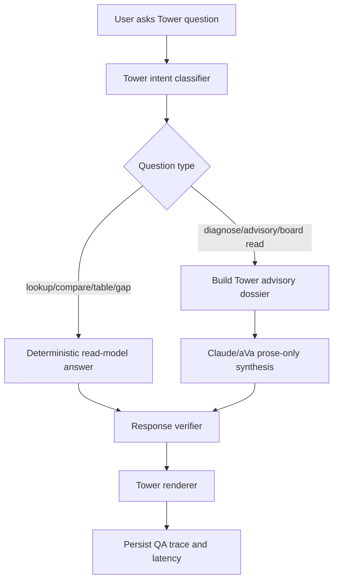

# Tower Semantic Mart End-to-End Design

Date: 2026-06-26

Status: Review draft

Scope: Tower data design, dashboard truth, chat boundaries, dossiers, and the rebuild plan.

## Executive Summary

Tower must become the CIO command center. It should explain where IT money is going, what it is producing, which vendors/programs/risks need attention, and what evidence is missing before leadership acts.

The current failure mode is clear:

- Dashboard reads one field or read model.
- Chat reads another field or lets Claude infer from a broader packet.
- Dossiers can be assembled from partially bound substrate.
- Numbers become plausible but inconsistent.

The permanent design is:

```text
Source files
  -> source registry and parsed rows
  -> canonical entities
  -> atomic facts and graph
  -> Tower semantic mart
  -> Tower read models
  -> dashboard and factual chat
  -> advisory dossier
  -> Claude/aVa synthesis
  -> verified Tower response
```

One metric contract must serve the dashboard, factual chat, advisory dossiers, and evaluation bank.

## Non-Negotiable Product Contract

| Rule                                               | Meaning                                                                                                      |
| -------------------------------------------------- | ------------------------------------------------------------------------------------------------------------ |
| Dashboard and chat use the same metric definitions | A number visible on the dashboard must match the number spoken by chat.                                      |
| Factual Tower questions do not call Claude         | Top initiatives, budget rollups, vendor spend, renewals, run/change, CapEx/OpEx, and gaps are deterministic. |
| Claude receives dossiers, not raw substrate        | Advisory questions get a curated, bounded packet with facts, gaps, options, caveats, and citations.          |
| Dossiers are not alternate truth                   | Dossiers are generated from the semantic mart/read models, not hand-maintained truth.                        |
| Every numeric claim is traceable                   | Each number must map to metric definition, source file, row, field, period, and tenant.                      |
| Missing data is specific                           | Say "run/change line-item split is not loaded", not "data is unavailable."                                   |
| Question routing is explicit                       | Tower routes each question to lookup, explain, compare, diagnose, advisory, or handoff.                      |
| Latency is gated                                   | Factual answers target 2-3 seconds. Advisory answers target 10-15 seconds.                                   |

## Purpose Boundaries

| Surface         | Job                               | Uses Tower Mart?                      | Uses Claude?                   |
| --------------- | --------------------------------- | ------------------------------------- | ------------------------------ |
| Home / Explorer | What do we know?                  | Reads broad context/coverage          | Only for short prose if needed |
| Intelligence    | What does it mean?                | Can reference Tower facts as evidence | Yes, with intelligence dossier |
| Tower           | Is IT spend producing value?      | Primary source                        | Only for advisory mode         |
| Source          | Which vendor/source path and why? | Can consume vendor/contract slices    | Yes, sourcing-specific         |
| Moves           | What should we do next?           | Consumes approved decisions/evidence  | Yes, execution-specific        |

Tower should not become a generic enterprise chatbot. It owns CIO portfolio performance.

## Source File Layer

Tower source files should be explicit and tenant-owned. Each file must include a README or instructions tab explaining required fields, optional fields, examples, and which dashboard/chat answers depend on it.

| File                        | Purpose                                                 | Key Required Fields                                             |
| --------------------------- | ------------------------------------------------------- | --------------------------------------------------------------- |
| `tower_portfolio_companies` | Holding-company and portfolio-company IT budget rollups | tenant, company, fiscal period, revenue, total IT budget        |
| `tower_it_programs`         | Major IT programs and portfolios                        | program, function, owner role, budget, status                   |
| `tower_initiatives`         | Initiatives, including AI and non-AI work               | initiative, program, function, owner, budget, value status      |
| `tower_budget_lines`        | Budget decomposition                                    | company, program, run/change, CapEx/OpEx, labor/vendor/platform |
| `tower_vendors_contracts`   | Vendor spend and renewals                               | vendor, contract, spend, renewal date, supported program        |
| `tower_value_realization`   | Benefits and ROI evidence                               | initiative, benefit metric, realized value, period, confidence  |
| `tower_risks_controls`      | RAID, controls, blockers                                | program, risk, severity, owner, mitigation, status              |
| `tower_operating_metrics`   | Adoption, delivery, service, and business metrics       | metric, entity, value, period, source                           |

These files should not directly power the dashboard. They feed governed layers.

## Parsing And Source Registry

Every uploaded source file produces:

| Object            | Stored Content                                                                             |
| ----------------- | ------------------------------------------------------------------------------------------ |
| Source registry   | tenant, source name, source type, file hash, upload run, row count, freshness, trust level |
| Parsed rows       | raw payload, sheet/table, row number, parser version                                       |
| Validation report | missing required fields, invalid types, duplicate keys, confidence                         |
| Lineage map       | file, sheet, row, column, field, parser mapping                                            |

This is what lets us answer "where did this number come from?"

## Canonical Entity Layer

Parsed rows are resolved into enterprise entities.

| Entity            | Examples                                                      |
| ----------------- | ------------------------------------------------------------- |
| Tenant            | Lakeshore, SkyHarbor, Meridian, First Capital, Apex           |
| Portfolio company | Lakeshore Shared Services, Northline Logistics Group          |
| Function          | Operations, Treasury, Procurement, Enterprise Shared Services |
| Program           | Warehouse automation, vendor consolidation                    |
| Initiative        | Demand sensing, cash visibility standardization               |
| Vendor            | SAP, AWS, ServiceNow, Microsoft                               |
| Contract          | renewal, term, spend exposure                                 |
| Metric            | IT budget, realized value, ROI, adoption, risk severity       |
| Risk/control      | value lag, governance gap, data quality blocker               |

The entity layer is where aliases are resolved. There should be one canonical tenant name and one canonical portfolio-company identity.

## Atomic Fact Layer

Every important value becomes an atomic, source-backed fact.

```text
tenant = lakeshore
entity_type = portfolio_company
entity_name = Lakeshore Shared Services
field = total_it_budget_usd
value = 12000000
period = FY26
source_file = tower_portfolio_companies.xlsx
source_row = 6
confidence = high
```

Atomic facts preserve source truth. They are not the dashboard layer yet.

## Enterprise Graph Layer

Relationships are stored separately from facts.

| Edge                        | Example                                                             |
| --------------------------- | ------------------------------------------------------------------- |
| company funds program       | Lakeshore Shared Services funds spend transparency                  |
| program contains initiative | Shared services IT transparency contains cost allocation initiative |
| initiative owned_by role    | Spend transparency owned by CIO                                     |
| vendor supports program     | SAP supports finance modernization                                  |
| contract renews_for vendor  | AWS renewal within 90 days                                          |
| risk blocks initiative      | Missing value proof blocks funding approval                         |
| metric measures initiative  | realized value measures demand sensing                              |

Graph is needed for cross-dimension questions:

- Which vendors support high-risk programs?
- Which portfolio companies fund AI initiatives with no value proof?
- Which owners sit across the highest spend and highest risk work?

## Tower Semantic Mart

The semantic mart is the stable analytical layer for Tower. It can be physical tables, materialized views, or views backed by governed SQL. The important part is that it owns metric definitions.

### Dimensions

| Dimension               | Purpose                                       |
| ----------------------- | --------------------------------------------- |
| `dim_tenant`            | canonical tenant/client identity              |
| `dim_period`            | fiscal year, quarter, month                   |
| `dim_portfolio_company` | company, revenue, industry, parent            |
| `dim_function`          | IT/business function taxonomy                 |
| `dim_program`           | program hierarchy                             |
| `dim_initiative`        | initiative metadata, AI/non-AI, owner, status |
| `dim_vendor`            | vendor identity and category                  |
| `dim_contract`          | contract and renewal metadata                 |
| `dim_risk`              | risk/control taxonomy                         |
| `dim_source`            | source file and lineage                       |

### Facts

| Fact                      | Purpose                                                          |
| ------------------------- | ---------------------------------------------------------------- |
| `fact_it_budget`          | budget by tenant, company, function, program, initiative, period |
| `fact_it_spend`           | actual, YTD, forecast spend                                      |
| `fact_budget_split`       | run/change, CapEx/OpEx, labor/vendor/platform                    |
| `fact_vendor_exposure`    | vendor spend by contract/program/company                         |
| `fact_contract_renewal`   | renewal exposure and timing                                      |
| `fact_ai_investment`      | AI spend, maturity, use case, dependency                         |
| `fact_value_realization`  | realized value, forecast value, benefit confidence               |
| `fact_risk_control`       | risk severity, blocker, mitigation, owner                        |
| `fact_operational_metric` | adoption, volume, productivity, service metrics                  |

### Metric Definitions

| Metric                | Formula                                                      |
| --------------------- | ------------------------------------------------------------ |
| Loaded IT budget      | Sum of `fact_it_budget.amount_usd` scoped to total IT budget |
| Loaded program budget | Sum of program/initiative budget facts                       |
| Spend at risk         | Sum of budget facts where linked risk/status is at-risk      |
| Vendor exposure       | Sum of contract/vendor spend facts by vendor                 |
| Renewal exposure      | Sum of contract spend renewing within configured window      |
| AI spend              | Sum of budget facts tagged AI-specific                       |
| Measured value        | Sum of realized value facts with accepted confidence         |
| ROI                   | measured value / loaded spend, only when both fields exist   |
| Run/change split      | Only from `fact_budget_split`; never inferred                |
| CapEx/OpEx split      | Only from `fact_budget_split`; never inferred                |
| Value gap             | Budget linked to initiatives with no measured value fact     |

## Tower Read Models

Read models are what dashboard and factual chat consume.

| Read Model                       | Consumed By                                  |
| -------------------------------- | -------------------------------------------- |
| `tower_overview_read_model`      | KPI strip, daily read, overview chat         |
| `tower_portfolio_company_rollup` | Portfolio view, company comparison chat      |
| `tower_program_rankings`         | Top programs/initiatives table and chat      |
| `tower_budget_slice_view`        | Budget view, run/change, CapEx/OpEx          |
| `tower_vendor_exposure_view`     | Vendors dashboard and vendor chat            |
| `tower_renewal_risk_view`        | Renewal dashboard and renewal chat           |
| `tower_ai_roi_view`              | AI ROI dashboard and AI questions            |
| `tower_value_gap_view`           | Outcomes dashboard and value proof questions |
| `tower_risk_control_view`        | Risks dashboard and diagnosis questions      |
| `tower_gap_register_view`        | Missing data banners and gap answers         |

Dashboard never computes its own totals from raw rows. It renders these read models.

## Dashboard Design

The dashboard is visual, fast, and deterministic.

| View      | Questions It Answers                                              |
| --------- | ----------------------------------------------------------------- |
| Overview  | What is the CIO read today?                                       |
| Portfolio | Which portfolio companies carry IT spend?                         |
| Budget    | How is budget split by function, company, run/change, CapEx/OpEx? |
| Programs  | Which programs/initiatives are largest or most pressured?         |
| Vendors   | Who holds contract exposure?                                      |
| AI ROI    | Which AI spend has measured value?                                |
| Outcomes  | What value has been realized and where is proof missing?          |
| Risks     | Which risks block value or funding?                               |
| Board     | What should the CIO show leadership?                              |

Dashboard outputs are the visual truth. Chat must match them.

## Chat Design

Tower chat has two paths.

### Fast Deterministic Path

Used for factual questions.

| Intent  | Example                            | Source            | Expected Latency |
| ------- | ---------------------------------- | ----------------- | ---------------- |
| lookup  | What are the top IT initiatives?   | read model        | < 2s             |
| compare | Compare spend by portfolio company | read model        | < 3s             |
| explain | Why is spend at risk high?         | metric provenance | < 3s             |
| table   | Table vendors by exposure          | read model        | < 3s             |
| gap     | What data is missing?              | gap register      | < 2s             |

This path must not call Claude.

### Advisory Dossier Path

Used for judgment questions.

| Intent     | Example                            | Source           | Expected Latency |
| ---------- | ---------------------------------- | ---------------- | ---------------- |
| diagnose   | Why is value proof weak?           | dossier + Claude | < 10s            |
| advisory   | What should the CIO inspect first? | dossier + Claude | < 15s            |
| board_read | What should go to the board?       | dossier + Claude | < 15s            |

Claude writes prose only. The backend assembles facts, tables, citations, gaps, and options.

## Dossier Design

Dossiers are not deleted. They are repurposed as advisory packets.

| Dossier                    | Purpose                                               |
| -------------------------- | ----------------------------------------------------- |
| Budget/spend dossier       | Spend concentration, splits, missing budget fields    |
| Portfolio company dossier  | Company rollups, shared-services allocation, outliers |
| Program/initiative dossier | Top programs, owners, value proof, blockers           |
| Vendor/renewal dossier     | Vendor concentration, renewals, contract risk         |
| AI ROI dossier             | AI spend, measured value, maturity, proof gaps        |
| Risk/control dossier       | RAID, blockers, governance, controls                  |
| CIO board-read dossier     | Executive narrative built from governed metrics       |

Dossiers are generated from Tower read models and semantic mart tables. They are not a second source of truth.

## Question Bank And Evaluation Harness

Tower should have a generated question bank across datasets and intents. The first execution artifact generates 6,330 questions, including 3,840 metric-specific prompts, so the gate is large enough to catch field drift instead of proving only a small demo path.

| Category                  |                  Example Count | Pass Criteria                                            |
| ------------------------- | -----------------------------: | -------------------------------------------------------- |
| Metric questions          |                          3,840 | metric values match read models and dashboard formulas   |
| Dataset questions         |                            900 | rows, tables, charts, and gaps bind to the right dataset |
| Cross-dimension questions |                            800 | joins are correct and cited                              |
| Gap questions             |                            180 | missing data is precise and field-specific               |
| Advisory questions        |                            600 | dossier grounded, no fabricated numbers                  |
| Fence/safety questions    | 10 starter adversarial prompts | tenant isolation, no raw IDs, no internal jargon         |

This is not LLM training. It is product capability testing.

## End-To-End Runtime Flow



## Rebuild At Speed

The rebuild should be staged so we stop chasing symptoms.

### Phase 0: Freeze And Audit

Duration: 0.5 day

Deliverables:

- List every Tower source file and current loaded table.
- List every dashboard metric and current field source.
- List every chat answer path and whether it calls Claude.
- Mark old/legacy Tower paths as deprecated.

Exit criteria:

- One inventory document.
- One set of approved canonical tenant names.
- Known gap list.

### Phase 1: Tower Data Contract

Duration: 1 day

Deliverables:

- Source file templates and README tabs.
- Canonical entity schema.
- Fact schema.
- Graph edge schema.
- Metric definition table.

Exit criteria:

- Every dashboard number has a declared formula.
- Every formula names allowed source fields.

### Phase 2: Load And Validate

Duration: 1-2 days

Deliverables:

- Parse files.
- Commit source registry, parsed rows, entities, facts, graph edges.
- Generate validation receipts.
- Reject rows with invalid critical fields.

Exit criteria:

- Volumetric report by tenant/source/dimension.
- No duplicate tenant aliases.
- No portfolio-company name drift.

### Phase 3: Semantic Mart And Read Models

Duration: 1-2 days

Deliverables:

- Dimensions and facts.
- Tower read models.
- Gap register.
- Metric provenance.

Exit criteria:

- Dashboard can render without local math.
- All KPI cards cite read-model fields.

### Phase 4: Dashboard Rewire

Duration: 1 day

Deliverables:

- Overview, Portfolio, Budget, Programs, Vendors, AI ROI, Outcomes, Risks, Board views read from mart/read models.
- No hardcoded totals.
- No fallback to old dashboard math.

Exit criteria:

- Screenshot proof for Lakeshore and SkyHarbor.
- KPI audit table: card value -> read model -> source rows.

### Phase 5: Chat Rewire

Duration: 1-2 days

Deliverables:

- Deterministic factual answer path.
- Advisory dossier builder.
- Claude/aVa prose-only path.
- Response verifier.

Exit criteria:

- Factual questions under 3 seconds.
- Advisory questions under 15 seconds.
- Chat numbers match dashboard.

### Phase 6: Evaluation Bank

Duration: 1-2 days for first 300, then expand to 1,000

Deliverables:

- 6,330-question bank by dataset and intent.
- Deterministic judge.
- Latency, citation, and consistency gates.
- HTML report with failures.

Exit criteria:

- 95%+ factual accuracy.
- 0 raw ID leaks.
- 0 dashboard/chat contradictions.
- 0 unsupported numeric claims.

### Phase 7: Production Proof

Duration: 0.5-1 day

Deliverables:

- Deploy via ACA main path.
- Signed-in browser proof.
- Downloadable HTML report.
- Release record.

Exit criteria:

- Approved ACA revision and digest.
- Dashboard/chat proof by tenant.
- Rollback revision documented.

## Speed Principles

- Build one canonical metric contract first.
- Do not polish UI while metric truth is unstable.
- Use deterministic answers for facts.
- Use Claude only after the dossier is correct.
- Generate HTML evidence every run.
- Keep legacy paths disabled instead of patched around.

## Definition Of Done

Tower is rebuilt when:

- Source files and rows have lineage.
- Facts and graph are committed.
- Semantic mart metrics are populated.
- Dashboard uses read models only.
- Factual chat uses read models only.
- Advisory chat uses generated dossiers only.
- Claude never performs source-of-truth math.
- The Tower question bank is green enough for release.
- Browser proof shows no contradictions across target tenants.
