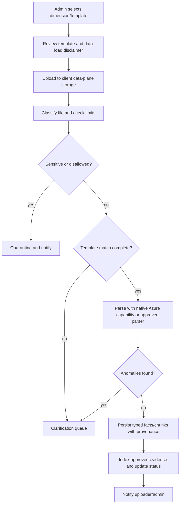

# ADR-0008: Context Ingestion Guardrails

## Status

Accepted

## Date

2026-06-01

## Context

Pilot setup needs a reliable way to accept client context files, classify them by business dimension, parse them into evidence-ready records, and stop when the uploaded data is sensitive, malformed, or outside the approved template. The architecture already contains ingestion contracts and partial implementation surfaces:

- `src/lib/context-ingestion/template-registry.ts` defines dimension templates, accepted formats, required fields, owner roles, and refresh cadence.
- `src/lib/context-ingestion/file-classifier.ts` classifies uploaded files into templates and extraction strategies.
- `src/lib/context-ingestion/validation-engine.ts` emits structured findings for missing required fields, invalid numeric values, and enum mismatches.
- `src/lib/ingestion/azure-landing-zone-types.ts` defines the Azure landing-zone message contract for tenant-scoped blob ingestion events.
- `docs/architecture/ABARVA_DATA_EVIDENCE_FLOW.md` documents the upload-to-evidence journey and quarantine outcomes.
- `docs/architecture/ARCH1_AGENTIC_PLATFORM_ARCHITECTURE_CONTRACT.md` documents the broader agentic platform upload and evidence-fabric contract.

The missing architecture decision is the guardrail policy for the future admin/setup workflow: what a user is allowed to upload, when the system must quarantine, when it must ask for clarification, and when processing can proceed.

This ADR is architecture-only. It does not claim that the full private data-plane setup UI, Azure Document Intelligence processing, or tenant-specific persistence workflow is shipped.

## Decision

All pilot context ingestion must follow a template-first, consent-gated, quarantine-capable workflow:

1. The user selects or confirms a context dimension before processing begins.
2. The upload surface shows the template, required fields, accepted formats, refresh owner, and downstream surfaces unlocked by that dimension.
3. The user confirms a data-load disclaimer before the file is accepted for processing.
4. Files land in the client data plane, not in the shared control plane.
5. The control plane may receive processing status and health metadata, but not raw client content.
6. Sensitive or policy-disallowed files are quarantined and excluded from retrieval, evidence ledgers, agent context, and generated deliverables.
7. Files that cannot be mapped to an approved template must enter a metadata clarification queue instead of being parsed optimistically.
8. Parsed outputs must be reusable: the same uploaded binary hash should not be reparsed unless the template version, parser version, or data-classification policy changed.
9. Processing completion, quarantine, clarification requests, and failures must notify the responsible admin/operator and leave an audit trail.

## Guardrail Matrix

| Condition                                                               | Required outcome                                                     |
| ----------------------------------------------------------------------- | -------------------------------------------------------------------- |
| Accepted format and template-required fields present                    | Process and persist typed facts/chunks with provenance               |
| Accepted format but missing required columns or fields                  | Stop processing and request user clarification or corrected template |
| File extension or MIME type not in template                             | Stop before parsing and ask for template/context confirmation        |
| File appears to contain PHI, PII, secrets, or policy-disallowed content | Quarantine; do not index or expose to agents                         |
| File exceeds configured limit                                           | Reject before parsing with a clear reason                            |
| Duplicate hash with same template/parser/policy versions                | Reuse previous parsed outputs and audit the reuse                    |
| Duplicate hash with changed template/parser/policy versions             | Reprocess as a new version and retain lineage                        |
| Parser emits anomalies against the template                             | Hold in clarification queue; do not silently coerce                  |

## Supported Format Baseline

The baseline accepted formats are the formats already represented in `src/lib/context-ingestion/template-registry.ts` and `src/lib/context-ingestion/file-classifier.ts`:

| Family            | Formats                        | Intended parser posture                                                                     |
| ----------------- | ------------------------------ | ------------------------------------------------------------------------------------------- |
| Structured tables | `csv`, `xlsx`, `json`, `jsonl` | Validate headers and required fields before persistence                                     |
| Documents         | `pdf`, `docx`, `markdown`      | Extract facts with page/section provenance and sensitivity scan                             |
| Slides            | `pptx`                         | Extract slide facts with slide-level provenance                                             |
| Archives          | `zip`                          | Treat as batch container; each child file must pass its own template and sensitivity checks |
| Unknown           | `unknown`                      | Reject or route to metadata clarification before parsing                                    |

### Pilot Format Matrix

For pilot context ingestion, the dimension-template matrix uses a narrower
set than the Source artifact registry. `src/lib/source/artifact-registry/*`
already allows Source event artifacts such as `txt`, `image/png`, and
`image/jpeg`; that is a separate sourcing-event evidence workflow. Context
ingestion should not treat those formats as template-ready until the table
below says so.

| Requested format  | Context-ingestion decision                                        | Rationale                                                                                                                                                                                 |
| ----------------- | ----------------------------------------------------------------- | ----------------------------------------------------------------------------------------------------------------------------------------------------------------------------------------- |
| `pdf`             | Supported when listed by the selected template                    | Document fact extraction with page provenance is part of the target ingestion posture.                                                                                                    |
| `docx`            | Supported when listed by the selected template                    | Document fact extraction with paragraph/section provenance is part of the target ingestion posture.                                                                                       |
| `xlsx`            | Supported when listed by the selected template                    | Workbook sheets can be validated against required columns before persistence.                                                                                                             |
| `pptx`            | Supported when listed by the selected template                    | Slide-level fact extraction is allowed for board packs, strategy decks, and quarterly-report artifacts.                                                                                   |
| `csv`             | Supported when listed by the selected template                    | Structured rows can be validated against required fields before persistence.                                                                                                              |
| `md` / `markdown` | Supported when listed by the selected template                    | Markdown can carry structured narrative facts with paragraph provenance.                                                                                                                  |
| `txt`             | Metadata-only intake until a template explicitly allows it        | Plain text has weak structure; it may be attached as evidence or routed for clarification, but should not be parsed into tenant context without a declared dimension and expected fields. |
| `png`             | Evidence attachment or OCR queue only, not template-ready context | Image files require OCR, image provenance, and confidence handling before facts can enter retrieval or evidence ledgers.                                                                  |
| `jpg` / `jpeg`    | Evidence attachment or OCR queue only, not template-ready context | Same posture as `png`; image content must not be silently converted into context facts.                                                                                                   |

Any unsupported or metadata-only file may still be stored as an uploaded
artifact in a module-specific registry when that module allows it. It must not
enter approved context chunks, indexes, graph projections, or generated
deliverables until a human confirms the dimension, metadata, parser path, and
data classification.

## Upload Limits

Until client-specific contracts override them, pilot ingestion should use conservative default limits:

| Limit                             | Default                                                                     |
| --------------------------------- | --------------------------------------------------------------------------- |
| Single file size                  | 100 MB                                                                      |
| PDF/DOCX/PPTX page or slide count | 500 pages/slides                                                            |
| Spreadsheet rows per sheet        | 250,000 rows                                                                |
| Archive size                      | 500 MB compressed and 2 GB uncompressed                                     |
| Archive child file count          | 250 files                                                                   |
| Batch concurrency                 | One active processing batch per client dimension unless explicitly approved |

Large loads can be approved as planned batch jobs, but they should not be initiated through the normal self-serve button without an operator-reviewed plan.

## Template and Metadata Requirements

Every processed file must carry:

- `client_id` or canonical client key.
- Template id and dimension.
- Declared data classification.
- Uploading actor and approving actor.
- Source filename, content type, size, and SHA-256 hash.
- Parser version and template version.
- Processing outcome.
- Provenance locators for extracted facts, rows, chunks, pages, slides, or cells.

If a user uploads content that is not part of a known template, the workflow must ask for the business dimension, source system, owner role, expected fields, refresh cadence, and downstream use before parsing.

## Processing Flow

## Consequences

### Positive

- Prevents raw client content from leaking into the shared control plane.
- Gives admins one explorer-style place to understand templates before loading data.
- Makes sensitive-data quarantine a first-class outcome instead of an exception path.
- Avoids silent schema coercion when columns or metadata do not match expectations.
- Reduces cost and inconsistency by reusing parsed outputs for duplicate binaries.
- Produces audit evidence for consent, approval, processing, quarantine, and clarification.

### Negative

- Users may need to answer clarification questions before a load completes.
- The first implementation requires more workflow state than a simple upload button.
- Large file and archive limits may require operator-assisted batch loading for some pilots.
- Template versioning becomes part of ingestion governance and must be maintained.

## Alternatives

### Parse First, Validate Later

Rejected. It creates a path for sensitive or malformed files to enter indexes before policy checks run.

### Free-Form Uploads Without Templates

Rejected. The application needs dimension-specific provenance and required fields to support evidence-led decisions across Moves, Source, Tower, and Atlas.

### Control-Plane Storage for Raw Uploads

Rejected. Raw client content belongs in the client data plane. The shared control plane should receive only status, health metadata, and approved summaries.

### Always Reparse Every Upload

Rejected. Reprocessing duplicate content wastes cost and can create inconsistent evidence if parser behavior changes without lineage.

## References

- `src/lib/context-ingestion/template-registry.ts`
- `src/lib/context-ingestion/file-classifier.ts`
- `src/lib/context-ingestion/types.ts`
- `src/lib/context-ingestion/validation-engine.ts`
- `src/lib/ingestion/azure-landing-zone-types.ts`
- `src/lib/source/artifact-registry/mime.ts`
- `src/lib/source/artifact-registry/upload-contract.ts`
- `docs/architecture/ABARVA_DATA_EVIDENCE_FLOW.md`
- `docs/architecture/ARCH1_AGENTIC_PLATFORM_ARCHITECTURE_CONTRACT.md`
