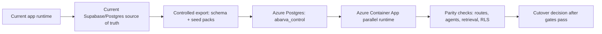

# AbarVa Azure Lab Database Migration + Parallel Run Foundation

Status: implemented and verified for lab execution on 2026-05-15  
Subscription: `abarva-lab-sub` / `701a8554-a166-46e9-bf13-743bc50e3b20`  
Data posture: synthetic/no-client-data only

## Purpose

This stage turns the private Azure Postgres lane from an empty managed database into a migration target that can run the current AbarVa Supabase/Postgres schema in parallel with the existing hosted database.

The goal is not an immediate cutover. The goal is a controlled parallel run:

1. Keep the current production/demo database as source of truth.
2. Apply the same schema to Azure Postgres.
3. Load synthetic tenant packs into Azure.
4. Run read-only parity checks for Home, Intelligence, Moves, Source, Tower, and agent retrieval.
5. Cut traffic only after parity, latency, and security gates are clean.

## What This Adds

| Capability | Artifact | Why it matters |
|---|---|---|
| Supabase compatibility bootstrap | `src/scripts/bootstrap-azure-postgres-compat.ts` | Creates the roles and helper functions Supabase migrations expect: `anon`, `authenticated`, `service_role`, `auth.jwt()`, `auth.role()`, `auth.uid()`, and `storage.foldername`. |
| Azure migration job | `infra/azure/database-migration-foundation.bicep` + `database-migration-job.bicep` | Runs schema migration from the same ACR app image inside the private Container Apps environment. |
| Key Vault DB URI writer | `scripts/azure/set-postgres-database-url-secrets.mjs` | Builds URL-encoded Azure Postgres connection strings from Key Vault-held admin credentials without printing secrets. |
| Lab params | `infra/azure/parameters/database-migration.lab.bicepparam` | Points the migration job at `abarva_control` first. |
| Migration-capable image | `Dockerfile` runtime copies `src/scripts`, `scripts`, and `supabase/migrations` | Lets the same built artifact run both the web app and one-off operational jobs. |
| Azure extension allow-list | `postgresAllowedExtensions = 'PGCRYPTO,UUID-OSSP'` | Lets the current schema create the extensions it already expects on Supabase. |
| Controlled destructive bypass | `run-migrations.ts --allow-destructive` | Allows historical destructive-looking migrations only for empty-database bootstrap; normal migration runs remain protected. |
| Azure schema verifier | `src/scripts/verify-azure-postgres-schema.ts` | Runs inside Container Apps to prove the private Azure Postgres schema state without opening the database publicly. |
| Tenant context copy harness | `src/scripts/copy-tenant-context-to-azure.ts` | Copies synthetic tenant context rows from the current Postgres source into private Azure Postgres, including engagement dependencies, inventory records, context chunks, graph nodes/edges, and Source events. |
| Source DB URI writer | `scripts/azure/set-source-database-url-secret.mjs` | Projects the current source Postgres URI into Key Vault as a one-way migration input without printing the secret value. |
| Tenant copy job params | `infra/azure/parameters/database-tenant-copy.lab.bicepparam` | Runs the tenant context copy plus verifier inside the same private Container Apps job pattern. |

## Why Compatibility Bootstrap Is Required

The current migrations were authored for Supabase Postgres. They use database roles, auth helper functions, storage helper functions, and extension assumptions that plain Azure Database for PostgreSQL does not ship by default.

The bootstrap is intentionally minimal. It makes the schema portable and lets the migration run. It is not a final identity design.

Compatibility bridges added for the lab:

- Supabase roles: `anon`, `authenticated`, `service_role`
- Supabase auth helpers: `auth.jwt()`, `auth.role()`, `auth.uid()`
- Supabase Storage surface: `storage.buckets`, `storage.objects`, `storage.foldername(text)`
- Historical text/UUID tolerance for older migrations that compare legacy text IDs to UUID client/program IDs
- Text overloads for tenant helper functions such as `can_read_tenant_by_id(text)`

## Clerk Decision

Clerk remains useful for the current SaaS/demo control-plane lane because it is already wired through the app and demo roster.

For enterprise Azure deployments, Clerk should not be a hard dependency. The target identity posture is:

| Lane | Recommended identity |
|---|---|
| AbarVa SaaS demo / founder demos | Clerk remains acceptable. |
| AbarVa-managed SaaS with enterprise SSO | Clerk or direct OIDC/SAML can front the session, but the app must receive normalized `tenant_key`, `role`, and `sub` claims. |
| Client private data plane / client VPC | Customer Entra ID or approved customer IdP should be supported directly. |

The durable app contract is not "Clerk." The durable contract is a verified identity context with `sub`, `tenant_key`, `role`, optional `person_id`, and optional `client_id`.

## Parallel Run Model



## Migration Execution Order

1. Set Key Vault database URI secrets:

   ```bash
   set -a
   source /Users/anand/Projects/nexus/.env.azure.local
   set +a
   node scripts/azure/set-postgres-database-url-secrets.mjs
   ```

2. Deploy the migration job:

   ```bash
   az deployment sub create \
     --name azlab18-db-migration-job-$(date +%Y%m%d%H%M%S) \
     --location eastus \
     --template-file infra/azure/database-migration-foundation.bicep \
     --parameters infra/azure/parameters/database-migration.lab.bicepparam
   ```

3. Start the manual job:

   ```bash
   az containerapp job start \
     --resource-group rg-abarva-controlplane-lab-eastus \
     --name job-abarva-db-migrate-lab-eastus
   ```

## Verified Run

The schema migration job completed successfully from the private Container Apps environment on 2026-05-15.

| Proof point | Value |
|---|---:|
| Applied migrations | 149 |
| Public base tables | 234 |
| Storage buckets | 2 |
| Clients seeded by migrations | 3 |
| Engagements seeded by migrations | 3 |
| `enterprise_context_chunks` | 0 |
| `enterprise_graph_nodes` | 0 |
| `enterprise_graph_edges` | 0 |
| `source_events` | 0 |
| `gate_criteria` | 0 |

Interpretation: Azure Postgres first reached schema parity and migration-history parity. At that point it did not yet have tenant setup-pack parity. Context chunks, graph rows, Source events, and gate criteria were empty until the Day-1 synthetic seed/export harness ran.

## Tenant Context Copy Run

The tenant context copy job completed successfully from the private Container Apps environment on 2026-05-15.

| Proof point | Value |
|---|---:|
| ACR image | `acrabarvalab001.azurecr.io/abarva/web:lab-db-copy-20260515-r6` |
| Image digest | `sha256:a6d94ab6b32a0f0352b20174deffc1a51604a94ceca65bbeb62171fd46bb4337` |
| Job | `job-abarva-db-copy-lab-eastus` |
| Successful execution | `job-abarva-db-copy-lab-eastus-c1o7k0e` |
| Source clients mapped | 4 source rows to 3 target tenant clients |
| Source engagement rows | 48 |
| Referenced people carried for engagement FKs | 36 |
| Referenced teams carried for engagement FKs | 1 |
| `tenant_expected_baselines` copied | 69 |
| `data_inventory_segments` copied | 69 |
| `data_inventory_records` copied | 3,299 |
| `enterprise_graph_nodes` copied | 1,313 |
| `enterprise_graph_edges` copied | 1,568 |
| `enterprise_context_chunks` copied | 6,567 |
| `data_inventory_audit_log` copied | 85 |
| `data_ingestion_runs` copied | 43 |
| `source_events` copied | 23 |

The post-copy verifier ran in the same job and reported:

| Azure Postgres verifier count | Value |
|---|---:|
| Applied migrations | 149 |
| Public base tables | 234 |
| Storage buckets | 2 |
| Clients | 3 |
| Engagements | 48 |
| `enterprise_context_chunks` | 6,567 |
| `enterprise_graph_nodes` | 1,313 |
| `enterprise_graph_edges` | 1,568 |
| `source_events` | 23 |
| `gate_criteria` | 0 |

Interpretation: Azure Postgres now has schema parity plus synthetic tenant context parity for the primary setup-layer tables needed by Home, Intelligence, Moves, Source, Tower, and agent retrieval smoke testing. `gate_criteria` remains zero because the current source dataset has no rows in that table for the copied engagement set.

## Migration Edge Cases Resolved

The tenant copy run surfaced three useful parallel-run edge cases before succeeding:

| Edge case | Resolution |
|---|---|
| Legacy First Capital aliases still exist in source data (`arcturus`, `brindlemark`) while Azure clients use canonical `first-capital`. | The copy harness treats tenant aliases as source selectors and maps them to the canonical Azure client row. |
| Some JSON/JSONB values arrived from Postgres as native JS objects and needed explicit casting on insert. | The copy harness serializes JSON/JSONB values and casts placeholders to the target column type. |
| Existing migration-seeded engagement rows collided by `graph_node_id`, while engagement rows also reference people/team FKs. | Engagements use `graph_node_id` as the natural copy key; referenced `persons` and `teams` are copied/mapped before engagements. |

## Gates Before Parallel Runtime Reads From Azure Postgres

| Gate | Required proof |
|---|---|
| Schema migration | `schema_migrations` count equals repo migration count. |
| Supabase compatibility | RLS policies compile; `auth.jwt()` and role functions exist. |
| Tenant seed parity | Apex, Meridian, and First Capital setup pack counts match current source. Completed for copied core tables on 2026-05-15. |
| Graph parity | `enterprise_graph_nodes` and `enterprise_graph_edges` match copied source counts. Completed for core graph tables on 2026-05-15. |
| Route smoke | `/api/health`, `/home`, `/intelligence`, `/source`, `/strategic-moves`, `/tower` render against Azure DB. |
| Isolation probe | SEC-P0 curl suite returns 403/404 for cross-tenant probes. |
| Performance | Container Apps to Azure Postgres p50/p95 recorded for core queries. |

## What Still Comes After This

| Next item | Why |
|---|---|
| App parallel runtime smoke | Point a non-prod `ca-abarva-web-lab-eastus` revision at `azure-postgres-control-database-url` and run `/api/health`, sign-in, and tenant retrieval smoke. |
| Config switch for Azure Postgres runtime | Container App currently still projects `DATABASE_URL` from the old `database-url` secret; parallel app revision should point to `azure-postgres-control-database-url`. |
| Entra ID/OIDC auth adapter | Removes Clerk as enterprise hard dependency. |
| Graph projection job | Rebuild Cosmos Gremlin from Postgres edge tables instead of treating graph as hand-seeded. |
| Search index contracts | AI Search needs deterministic tenant indexes before retrieval parity. |
