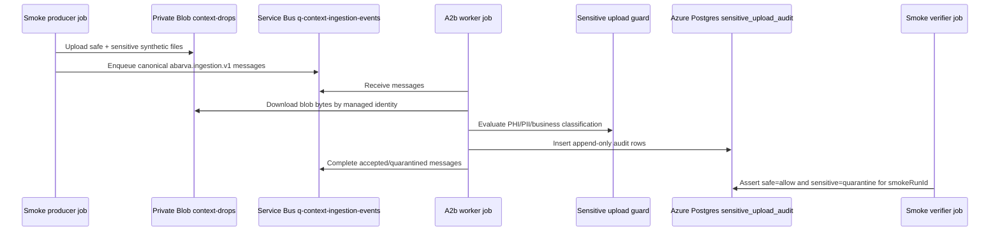

# AZLAB22 — Ingestion E2E Smoke

Status: passed
Date: 2026-05-15
Data posture: synthetic smoke files only

## Purpose

AZLAB21 proved the A2b worker can boot inside Container Apps, authenticate with the lab managed identity, connect to Service Bus, and exit cleanly on an idle queue.

AZLAB22 closes the next proof point: a fully synthetic end-to-end ingestion smoke for the Day-2 context-refresh lane.

The smoke does not use real client data. It writes two tiny synthetic files:

- `safe-enterprise-profile.txt` — expected to pass the sensitive-upload guard.
- `sensitive-quarantine-sample.txt` — fake SSN/MRN/DOB patterns, expected to quarantine.

## Flow



## Repo Artifacts

| Artifact | Purpose |
|---|---|
| `src/scripts/azure-ingestion-e2e-smoke.ts` | Producer/verifier script used by Container Apps Jobs. |
| `infra/azure/parameters/ingestion-smoke-producer.lab.bicepparam` | Deploys `job-a2b-smoke-send-eus`. |
| `infra/azure/parameters/ingestion-smoke-verifier.lab.bicepparam` | Deploys `job-a2b-smoke-verify-eus`. |
| `src/scripts/azure-context-ingestion-worker.ts` | Existing A2b worker under test. |

The smoke jobs reuse `ingestion-worker-foundation.bicep`; only the command and environment differ.

## Runbook

Set one explicit run id per execution so verifier results cannot pass from stale rows:

```bash
export RUN_ID="azlab22-$(date -u +%Y%m%d%H%M%S)"
export IMAGE="acrabarvalab001.azurecr.io/abarva/web:lab-ingestion-e2e-smoke-20260515-r1"
```

Deploy or update the producer and verifier jobs with the same `RUN_ID`:

```bash
az deployment sub create \
  --name "azlab22-smoke-producer-${RUN_ID}" \
  --location eastus \
  --template-file infra/azure/ingestion-worker-foundation.bicep \
  --parameters infra/azure/parameters/ingestion-smoke-producer.lab.bicepparam \
  --parameters imageName="$IMAGE" \
  --parameters plainRuntimeEnv="[
    {\"name\":\"INGESTION_SMOKE_MODE\",\"value\":\"produce\"},
    {\"name\":\"INGESTION_SMOKE_RUN_ID\",\"value\":\"$RUN_ID\"},
    {\"name\":\"INGESTION_SMOKE_TENANT_CLIENT_KEY\",\"value\":\"apex-retail\"},
    {\"name\":\"INGESTION_SMOKE_STORAGE_ACCOUNT_NAME\",\"value\":\"stabarvaprivatedplab001\"},
    {\"name\":\"INGESTION_SMOKE_CONTAINER_NAME\",\"value\":\"context-drops\"},
    {\"name\":\"SERVICE_BUS_NAMESPACE\",\"value\":\"sb-abarva-lab-eastus\"},
    {\"name\":\"SERVICE_BUS_QUEUE_NAME\",\"value\":\"q-context-ingestion-events\"},
    {\"name\":\"AZURE_CLIENT_ID\",\"value\":\"3b6e0c9d-2265-499f-af46-965e0ad78b95\"}
  ]"
```

Repeat for the verifier, preserving the same `RUN_ID`:

```bash
az deployment sub create \
  --name "azlab22-smoke-verifier-${RUN_ID}" \
  --location eastus \
  --template-file infra/azure/ingestion-worker-foundation.bicep \
  --parameters infra/azure/parameters/ingestion-smoke-verifier.lab.bicepparam \
  --parameters imageName="$IMAGE" \
  --parameters plainRuntimeEnv="[
    {\"name\":\"INGESTION_SMOKE_MODE\",\"value\":\"verify\"},
    {\"name\":\"INGESTION_SMOKE_RUN_ID\",\"value\":\"$RUN_ID\"},
    {\"name\":\"AZURE_CLIENT_ID\",\"value\":\"3b6e0c9d-2265-499f-af46-965e0ad78b95\"}
  ]"
```

Then run the three jobs in order:

```bash
az containerapp job start \
  --resource-group rg-abarva-controlplane-lab-eastus \
  --name job-a2b-smoke-send-eus

az containerapp job start \
  --resource-group rg-abarva-controlplane-lab-eastus \
  --name job-a2b-ingest-lab-eus

az containerapp job start \
  --resource-group rg-abarva-controlplane-lab-eastus \
  --name job-a2b-smoke-verify-eus
```

Expected verifier log:

```json
{"event":"ingestion_smoke_verified","smokeRunId":"azlab22-...","observed":{"safe":"allow","sensitive":"quarantine"}}
```

## What This Proves

- Managed identity can write synthetic blobs into the private context landing container.
- Managed identity can enqueue canonical ingestion messages.
- The A2b worker can read Service Bus, download private blobs, run the sensitive-upload guard, and write audit rows to Azure Postgres.
- The quarantine path is not theoretical: a fake regulated sample produces `final_decision = quarantine`.
- The safe path remains open for non-regulated business context.

## What This Does Not Yet Prove

- Broker rebuild/chunking beyond `audit_only` mode.
- Azure AI Search indexing.
- Purview classification enrichment.
- Real Event Grid system-event normalization. The producer sends canonical queue messages directly.

Those belong to the next slices after the data-access adapter and Purview service are fully wired.

## Execution Evidence

Image:

- `acrabarvalab001.azurecr.io/abarva/web:lab-ingestion-e2e-smoke-20260515-r1`
- Digest: `sha256:b18a3abb8e91a7fded29c78b6aa68ef8dae1568798c2f99f8388792fed7ca962`

First attempted verifier run failed because Azure Postgres had not yet received the B5c `sensitive_upload_audit` migration:

```text
relation "sensitive_upload_audit" does not exist
```

Remediation:

- Re-deployed `job-abarva-db-migrate-lab-eastus` with the current image.
- Ran migration execution `job-abarva-db-migrate-lab-eastus-vx03psu`.
- Execution status: `Succeeded`.

Passing smoke run:

| Step | Execution | Result |
|---|---|---|
| Producer | `job-a2b-smoke-send-eus-8xee4nn` | Succeeded |
| Worker | `job-a2b-ingest-lab-eus-za46ite` | Succeeded |
| Verifier | `job-a2b-smoke-verify-eus-2f8ozq7` | Succeeded |

Run id: `azlab22-20260515133350`

Verifier evidence:

```json
{"event":"ingestion_smoke_verified","smokeRunId":"azlab22-20260515133350","observed":{"safe":"allow","sensitive":"quarantine"}}
```

Worker evidence:

```json
{"event":"ingestion_message_processed","messageId":"azlab22-20260515133350-safe","status":"accepted","auditRowId":"30f0e0db-af16-4ddf-bc20-084f1c85b217","durationMs":17}
{"event":"ingestion_message_processed","messageId":"azlab22-20260515133350-sensitive","status":"quarantined","auditRowId":"76580698-9ec1-4663-a7bc-e1e945427547","durationMs":16}
```

## Follow-Up Finding

The same worker execution also rejected raw storage/Event Grid messages created by the Blob uploads. That is expected given today's worker contract: it accepts canonical `abarva.ingestion.v1` messages, not raw `Microsoft.Storage.BlobCreated` payloads.

Close path:

- Add an Event Grid normalizer before the canonical queue, or
- Change the Event Grid subscription target to a raw-event queue and add a normalizer worker, or
- Adopt a strict blob path convention that lets the worker derive tenant/segment/classification safely before canonicalization.

Do not treat raw Event Grid events as accepted context updates until that normalizer exists.

Update 2026-05-15: this gap is closed by `AZLAB23-event-grid-normalizer.md` for metadata-bearing BlobCreated events. The producer can now run with `INGESTION_SMOKE_SEND_CANONICAL=false`, upload blobs only, and the worker normalizes Event Grid events from blob metadata before running the same guard/audit path.
