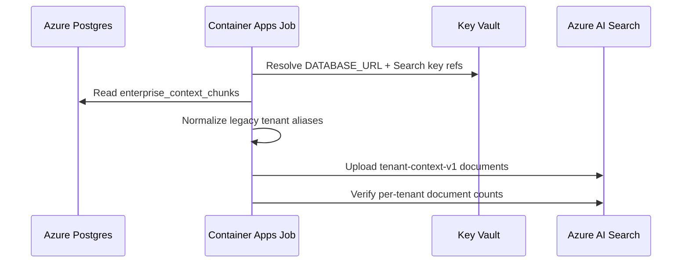

# AZLAB25 — Azure AI Search Tenant Context Backfill

Status: passed
Date: 2026-05-15
Data posture: synthetic setup/context chunks only; no real client data

## Purpose

AZLAB24 created the Azure AI Search index contracts. AZLAB25 proves the first retrieval-plane backfill: Azure Postgres `enterprise_context_chunks` into `tenant-context-v1`.

This is still not full agent retrieval cutover. It proves that the lab can move synthetic tenant context from the private database lane into the Azure-native retrieval lane with tenant filters preserved.

## Flow



## Repo Artifacts

| Artifact | Purpose |
|---|---|
| `src/lib/azure-search/tenant-context-backfill.ts` | Maps Postgres chunk rows into `tenant-context-v1` documents and normalizes legacy tenant aliases. |
| `src/scripts/azure-ai-search-backfill.ts` | `plan`, `apply`, and `verify` runner for the Search backfill. |
| `infra/azure/parameters/search-backfill.lab.bicepparam` | Container Apps Job parameter file for `job-a24-search-backfill-eus`. |
| `src/lib/azure-search/__tests__/tenant-context-backfill.test.ts` | Guards tenant alias normalization and document mapping. |

## Live Execution

Image:

- `acrabarvalab001.azurecr.io/abarva/web:lab-search-backfill-20260515-r2`
- Digest: `sha256:8ab476a878220eb04cf550469558520a810b1923e48dc2d841a88f9e29fb18fd`

Job:

- Container Apps Job: `job-a24-search-backfill-eus`
- Execution: `job-a24-search-backfill-eus-g0i69hi`
- Status: `Succeeded`
- Start: `2026-05-15T14:53:10Z`
- End: `2026-05-15T14:54:06Z`

Verified output:

```json
{"event":"azure_search_backfill_verified","observed":{"apex-retail":2075,"first-capital":2070,"meridian-health":2422}}
```

Total documents indexed: `6,567`.

## Tenant Alias Finding

The first backfill surfaced legacy tenant keys still present in copied synthetic data:

| Legacy key | Canonical key |
|---|---|
| `apexretail` | `apex-retail` |
| `arcturus` | `first-capital` |
| `meridian` | `meridian-health` |

The final backfill deletes stale alias-key Search documents and uploads all rows under canonical tenant keys. This keeps Search filters aligned with the tenant-resolution work from the audit remediation cycle.

## Security Finding

The Search backfill currently uses a Key Vault-projected Search admin key because Azure AD data-plane writes returned `403` during AZLAB24.

Target posture before customer-private lanes:

- assign the runtime managed identity a least-privilege Azure AI Search data-plane role
- remove admin-key use from routine index writes
- keep the admin key as break-glass only

## Operational Finding

The Node Postgres driver emitted an SSL-mode warning because `sslmode=require` will change semantics in a future major release. Update the Azure Postgres connection string to explicitly use `sslmode=verify-full` if we want to preserve current verification semantics.

## What This Proves

- The Azure-native retrieval lane has real synthetic tenant context loaded.
- Tenant filters can now be tested against Search.
- Legacy tenant aliases can be normalized before retrieval exposure.
- Container Apps Jobs can safely bridge private Postgres and Azure AI Search with Key Vault-projected secrets.

## What Remains

- Add the AgentContextBroker Azure Search query adapter.
- Add backfill lanes for `evidence-ledger-v1`, `source-vendor-v1`, `industry-corpus-v1`, and `signals-v1`.
- Add embeddings once the Azure model lane is finalized.
- Replace Search admin-key bootstrap with managed-identity Search data-plane RBAC.
