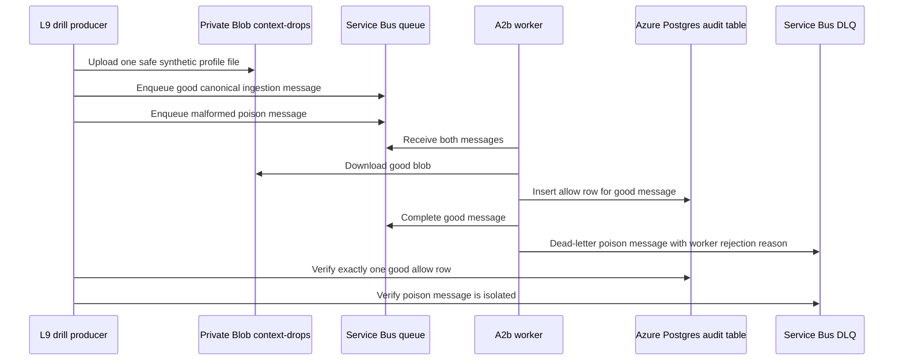

# AZLAB50 - L9 Service Bus Mixed-Batch Drill

Status: implemented in repo  
Date: 2026-05-15  
Layer: L9 - Resilience / DR

## Why This Matters

AZLAB40 proved a malformed ingestion message can be rejected into the Service Bus dead-letter queue. The next enterprise resilience question is sharper: if a poison message and a valid business-context upload land in the same queue cycle, does the bad message delay or block the good one?

This slice extends the existing L9 drill to prove mixed-batch behavior.

## What Changed

| Artifact | Change |
|---|---|
| `src/scripts/azure-servicebus-dlq-drill.ts` | Adds `produce-mixed` and `verify-mixed` modes. |
| `npm run azure:servicebus:dlq-drill` | Same operator command now supports the single-poison drill and the mixed-batch drill. |

## Mixed-Batch Flow



## Runbook

Generate one run id:

```bash
RUN_ID="l9-mixed-$(date -u +%Y%m%d%H%M%S)"
```

Produce the mixed batch:

```bash
npm run azure:servicebus:dlq-drill -- \
  --mode produce-mixed \
  --run-id "$RUN_ID" \
  --storage-account-name stabarvaprivatedplab001 \
  --container-name context-drops \
  --tenant-client-key apex-retail
```

Run the A2b worker once:

```bash
npx tsx src/scripts/azure-context-ingestion-worker.ts
```

Verify both outcomes:

```bash
npm run azure:servicebus:dlq-drill -- \
  --mode verify-mixed \
  --run-id "$RUN_ID" \
  --tenant-client-key apex-retail
```

Expected output:

```json
{
  "status": "pass",
  "event": "l9_mixed_batch_drill_verified",
  "goodMessage": { "finalDecision": "allow" },
  "poisonMessage": { "deadLetterReason": "missing_tenantClientKey" }
}
```

The verifier abandons the matching DLQ message by default so it remains inspectable. Add `--complete-dlq-message` when the evidence has been captured and the queue should be cleaned.

## Required Environment

Producer mode needs managed identity or local Azure auth with:

- Blob write permission to the context landing container.
- Service Bus send permission on `q-context-ingestion-events`.

Verifier mode needs:

- `DATABASE_URL` for the Azure Postgres database.
- Service Bus receive permission on the dead-letter subqueue.

The script accepts either:

- `SERVICE_BUS_CONNECTION_STRING`, or
- `SERVICE_BUS_NAMESPACE` / `SERVICE_BUS_FULLY_QUALIFIED_NAMESPACE` plus Azure identity.

## Pass Criteria

- One and only one good audit row exists for `metadata.metadata.l9DrillRunId`.
- The good row has `tenant_client_key = apex-retail` and `final_decision = allow`.
- The poison message is present in the dead-letter subqueue.
- The poison `deadLetterReason` is a worker rejection reason, not `MaxDeliveryCountExceeded`.

## What This Proves

- A malformed event does not crash the A2b worker loop.
- A malformed event does not prevent a valid synthetic context upload from being accepted.
- DLQ evidence and Postgres audit evidence can be reconciled by the same run id.

## What Remains

This still does not simulate provider outages or database disruption. Those remain separate L9 drills: LLM overload/fallback, Postgres private endpoint disruption, and PITR restore timing.
