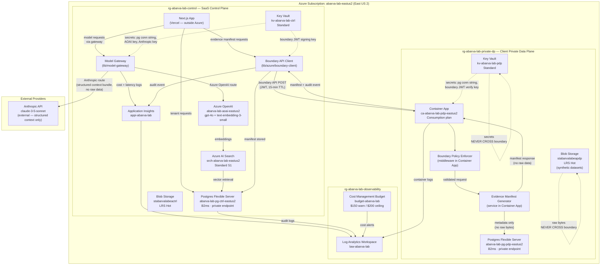

# AbarVa Azure Lab — Target Architecture Diagram

Slice ID: AZLAB6
Document: AZLAB6-azure-target-architecture.md
Status: code_complete
Authored: 2026-04-26
Author: Code (sole)
Type: Architecture document — docs only, no runtime code, no migrations, no model calls.

Decisions locked (2026-04-26):
- azureSubscription: dedicated AbarVa lab subscription (ADR-001)
- aiProvider: BOTH — Azure OpenAI + Anthropic API multi-provider gateway (ADR-002)
- searchEmbeddings: Azure AI Search (ADR-003)
- monthlyCostCeiling: $200/month (ADR-004)
- azureRegion: East US 2 (ADR-005)

---

## 1. Two-Plane Lab Overview

The AbarVa lab demonstrates a two-plane architecture:

- **SaaS Control Plane** — AbarVa-operated; hosted on Vercel (Next.js) + Azure lab resources
- **Client Private Data Plane** — simulated in `rg-abarva-lab-private-dp`; represents a Fortune 500 customer's own Azure subscription

In production the Private Data Plane would be in the customer's own Azure tenant and subscription. In the lab, both planes share one subscription but are in separate resource groups with network isolation.

---

## 2. Full Architecture Diagram

**Legend:**
- Solid arrows: active data flows
- Dashed arrows: secret/key reads (runtime only; secrets never leave Key Vault)
- Dashed self-loops: data that NEVER crosses the boundary

---

## 3. Data flow summary

### Evidence manifest flow (happy path)

1. Vercel app calls `CP_BC` with a structured evidence request (metric names, date range, verification posture).
2. `CP_BC` fetches a short-lived JWT signing key from `CP_KV`, signs a 15-minute JWT.
3. `CP_BC` POSTs to `PDP_CA` boundary endpoint with JWT in `Authorization` header.
4. `PDP_POLICY` in `PDP_CA` validates JWT signature and expiry. Rejects if invalid.
5. `PDP_MANIF` reads metadata (not bytes) from `PDP_PG`. Generates evidence manifest JSON.
6. Manifest crosses boundary: `{ manifestId, entries[{ metricName, labelledValue, sourceOwner, dateRange, verificationPosture, rawRetainedByClient: true }] }`.
7. `CP_BC` stores manifest in `CP_PG` and writes audit event to `CP_APPINS`.

### Model inference flow (Azure OpenAI)

1. `CP_MG` receives inference request from Vercel app.
2. Checks routing policy for tenant + task type.
3. Fetches Azure OpenAI key from `CP_KV`.
4. Calls `CP_AI` with context bundle (structured, no raw data).
5. Logs token count, latency, cost estimate to `CP_APPINS`.

### Model inference flow (Anthropic)

1. Same as above; routing policy routes to Anthropic.
2. `CP_MG` fetches Anthropic API key from `CP_KV`.
3. Sends structured context bundle to Anthropic API (HTTPS, no raw customer data).
4. Logs to `CP_APPINS`.

---

## 4. Resource summary

| Resource Name | Type | Resource Group | SKU | Est. Monthly |
|---|---|---|---|---|
| `abarva-lab-pg-ctrl-eastus2` | Postgres Flexible Server | rg-abarva-lab-control | B2ms | $30 |
| `srch-abarva-lab-eastus2` | Azure AI Search | rg-abarva-lab-control | S1 | $75 |
| `stabarvalabeactrl` | Storage Account | rg-abarva-lab-control | LRS Hot | $1 |
| `kv-abarva-lab-ctrl` | Key Vault | rg-abarva-lab-control | Standard | $1 |
| `abarva-lab-aoai-eastus2` | Azure OpenAI | rg-abarva-lab-control | Pay-per-use | $20 |
| `appi-abarva-lab` | Application Insights | rg-abarva-lab-observability | Pay-per-use | $5 |
| `ca-abarva-lab-pdp-eastus2` | Container App | rg-abarva-lab-private-dp | Consumption | $5 |
| `abarva-lab-pg-pdp-eastus2` | Postgres Flexible Server | rg-abarva-lab-private-dp | B2ms | $30 |
| `stabarvalabeapdp` | Storage Account | rg-abarva-lab-private-dp | LRS Hot | $1 |
| `kv-abarva-lab-pdp` | Key Vault | rg-abarva-lab-private-dp | Standard | $1 |
| `law-abarva-lab` | Log Analytics Workspace | rg-abarva-lab-observability | Pay-per-use | $5 |
| Anthropic API | External | N/A | Pay-per-use | $10 |
| **TOTAL** | | | | **~$184/month** |

---

## 5. Related documents

- ADR-001: `docs/architecture/azure/ADR-001-azure-subscription-strategy.md`
- ADR-002: `docs/architecture/azure/ADR-002-ai-provider-strategy.md`
- ADR-003: `docs/architecture/azure/ADR-003-search-embeddings-strategy.md`
- ADR-004: `docs/architecture/azure/ADR-004-cost-ceiling-strategy.md`
- ADR-005: `docs/architecture/azure/ADR-005-azure-region-strategy.md`
- Naming convention: `docs/architecture/azure/AZLAB6-resource-naming-convention.md`
- Cost breakdown: `docs/architecture/azure/AZLAB6-cost-breakdown.md`
- Bicep stubs: `docs/architecture/azure/bicep-stubs/`
- Private data plane design: `docs/architecture/azure/AZLAB7-private-data-plane-design.md`
- Multi-provider gateway: `docs/architecture/azure/AZLAB8-multi-provider-model-gateway-design.md`
- Foundation: `docs/architecture/AZLAB1_SAAS_CONTROL_PLANE_PRIVATE_DATA_PLANE_BLUEPRINT.md`
