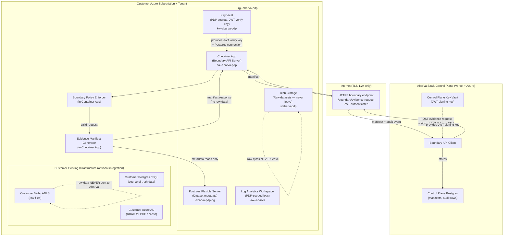

# AbarVa Private Data Plane Design — Fortune 500 Deployment

Slice ID: AZLAB7
Document: AZLAB7-private-data-plane-design.md
Status: code_complete
Authored: 2026-04-26
Author: Code (sole)
Type: Architecture document — docs only, no runtime code, no migrations, no model calls.

---

## 1. Purpose

This document answers the question: **How would a Fortune 500 customer run the AbarVa Private Data Plane in their own Azure subscription?**

It covers:
- What the Private Data Plane is and what it does
- Infrastructure requirements in the customer's Azure subscription
- What AbarVa installs vs what the customer operates
- The trust boundary: what crosses it and what does not
- Installation and configuration playbook
- Identity and access model
- Ongoing operations

---

## 2. What is the Private Data Plane?

The AbarVa Private Data Plane (PDP) is a lightweight service that runs entirely inside the customer's Azure subscription. It:

1. **Receives evidence requests** from the AbarVa SaaS Control Plane via a single HTTPS boundary endpoint
2. **Reads metadata** from the customer's datasets to generate evidence manifests (never the raw bytes)
3. **Returns structured manifest JSON** to the Control Plane — citation locators only, not content
4. **Enforces boundary policy** — strips any raw-data fields before any response leaves the PDP

The customer's raw data (CSV files, database exports, spreadsheets, model results) stays entirely in the customer's Azure subscription at all times. The AbarVa Control Plane never sees, stores, or has access to raw data.

---

## 3. Architecture



---

## 4. What AbarVa provides

| Component | Who provides | Notes |
|---|---|---|
| Boundary API Server container image | AbarVa | Published to Azure Container Registry; customer pulls at install |
| Bicep/Terraform deployment template | AbarVa | Customer deploys into their own subscription |
| Boundary JWT signing key (Control Plane half) | AbarVa | Stored in AbarVa Key Vault; never shared |
| Boundary JWT verification key (PDP half) | AbarVa | Shared with customer at onboarding; stored in customer Key Vault |
| Evidence manifest schema definition | AbarVa | Fixed contract; customer data mapped to this schema |
| Dataset adapter configuration | AbarVa (per tenant) | Maps customer dataset fields to manifest schema fields |
| Boundary policy rules | AbarVa | Embedded in Container App; updated via new image version |

---

## 5. What the customer operates

| Component | Who operates | Notes |
|---|---|---|
| Azure subscription | Customer | AbarVa never has Owner/Contributor on this sub |
| Resource group `rg-<customer>-abarva-pdp` | Customer (with AbarVa guidance) | Customer's IT/Cloud team deploys from AbarVa template |
| Key Vault `kv-<customer>-abarva-pdp` | Customer | Customer stores secrets; AbarVa has no Key Vault access |
| Postgres Flexible Server | Customer | Metadata store; not raw data |
| Blob Storage (raw datasets) | Customer | Raw data never leaves; AbarVa cannot access |
| Log Analytics Workspace | Customer | Customer-scoped; AbarVa has no access |
| Container App (image pull only) | Customer (AbarVa image) | Customer pulls image; AbarVa cannot exec into container |
| Network security | Customer | Customer controls NSG rules, private endpoints |
| Azure AD RBAC | Customer | Customer grants PDP managed identity minimum permissions |

---

## 6. AbarVa access model — zero standing access

AbarVa never has:
- Owner, Contributor, or User Access Administrator role on the customer subscription
- Access to the customer Key Vault (no get/list secret permissions)
- Access to the customer Postgres server or Blob Storage
- SSH/RDP access to any resource in the customer resource group
- Access to the customer Log Analytics Workspace

AbarVa only has:
- The JWT signing key in the AbarVa Control Plane Key Vault
- The ability to POST to the `/boundary/evidence-request` HTTPS endpoint that the customer exposes
- Access to the evidence manifest JSON that the boundary endpoint returns

This means: if the customer cancels their AbarVa subscription, they delete the Container App and revoke the boundary endpoint. AbarVa immediately loses all access to customer data because they never had access in the first place.

---

## 7. Evidence manifest contract

The boundary API returns exactly this structure. Nothing else:

```json
{
  "manifestId": "manifest-<uuid>",
  "generatedAt": "2026-04-26T14:30:00Z",
  "tenantKey": "<customer-tenant-slug>",
  "requestId": "<original-evidence-request-id>",
  "entries": [
    {
      "metricName": "Total Contract Value",
      "labelledValue": "Redacted — available on request",
      "sourceOwner": "Finance — Procurement",
      "dateRange": "2025-Q1 to 2025-Q4",
      "verificationPosture": "management-attested",
      "rawRetainedByClient": true,
      "citationLocator": {
        "systemName": "SAP Ariba",
        "reportName": "AMS Outsourcing 2025 Annual Spend",
        "fieldPath": "total_contract_value",
        "recordCount": null
      }
    }
  ],
  "boundaryAuditEvent": {
    "eventId": "<uuid>",
    "eventType": "evidence-manifest-returned",
    "tenantKey": "<customer-tenant-slug>",
    "timestamp": "2026-04-26T14:30:00Z",
    "outcome": "success",
    "strippedFields": []
  }
}
```

**Key constraints:**
- `labelledValue` is a human-readable label, not the raw numeric value (unless the customer's dataset adapter is configured to include it — customer choice)
- `rawRetainedByClient: true` is structurally always true — the boundary policy enforcer cannot set it to false
- `citationLocator` contains enough information to find the source without transmitting the content
- `strippedFields` lists any fields that the boundary policy enforcer removed from the dataset adapter output before sending the response

---

## 8. Boundary policy enforcer

The boundary policy enforcer is a middleware layer inside the Container App that runs on every boundary response before it leaves the Private Data Plane.

Rules enforced:
1. Strip any field with a name matching: `content`, `rawContent`, `fileBytes`, `base64`, `csvData`, `jsonData`, `xmlData`, `fileUrl` (signed URL), `sasUrl`, `downloadUrl`
2. Strip any field with a value size > 10 KB (prevents accidental large payload transmission)
3. Reject any request where the JWT is expired, invalid, or missing
4. Reject any request where the payload size > 50 KB
5. Log every strip and rejection to the customer's Log Analytics Workspace

If the enforcer strips fields, it adds them to `boundaryAuditEvent.strippedFields`. The Control Plane logs this and flags the manifest as `integrity: partial`.

---

## 9. Installation playbook

### Step 1 — Customer prerequisites

- [ ] Active Azure subscription with at least 5 resource providers enabled: `Microsoft.App`, `Microsoft.DBforPostgreSQL`, `Microsoft.Storage`, `Microsoft.KeyVault`, `Microsoft.OperationalInsights`
- [ ] Azure AD tenant configured
- [ ] Contributor role for installer (one-time; can be revoked post-install)

### Step 2 — AbarVa onboarding

- [ ] AbarVa creates tenant record in Control Plane with `privateDataPlane: enabled`
- [ ] AbarVa generates boundary JWT key pair (RS256, 4096-bit)
- [ ] AbarVa shares: JWT verification key (public key only), Container App image tag, Bicep template, dataset adapter configuration
- [ ] AbarVa does NOT share: JWT signing key (private key stays in AbarVa Key Vault)

### Step 3 — Customer deploys PDP

- [ ] Customer stores JWT verification key in `kv-<customer>-abarva-pdp` as secret `boundary-jwt-public-key`
- [ ] Customer deploys Bicep template into their subscription
- [ ] Customer confirms boundary endpoint URL: `https://ca-<customer>-abarva-pdp.<region>.azurecontainerapps.io/boundary/evidence-request`
- [ ] Customer provides boundary endpoint URL to AbarVa for Control Plane configuration

### Step 4 — Smoke test

- [ ] AbarVa Control Plane sends a test evidence request with a valid JWT
- [ ] PDP returns a test manifest (no real data in test request)
- [ ] AbarVa confirms manifest received and audit event logged
- [ ] Customer confirms no raw data in AbarVa-visible response

### Step 5 — Dataset adapter configuration

- [ ] AbarVa configures dataset adapter for the customer's schema (field mapping to manifest schema)
- [ ] Customer reviews adapter configuration and approves
- [ ] First real evidence manifest generated and reviewed by customer

---

## 10. Ongoing operations

| Activity | Who | Frequency |
|---|---|---|
| Container App image updates | AbarVa pushes new image tag; customer updates Container App | Per AbarVa release |
| Key rotation (JWT key pair) | AbarVa generates new pair; shares new verify key; customer updates Key Vault secret | Annually or on demand |
| Postgres schema migrations | AbarVa provides migration script; customer runs against PDP Postgres | Per AbarVa schema version |
| Cost monitoring | Customer reviews PDP resource costs | Monthly |
| Log review | Customer reviews PDP logs; AbarVa reviews boundary audit events in Control Plane | Weekly |
| Decommission | Customer deletes resource group; AbarVa removes tenant from Control Plane | On contract end |

---

## 11. Frequently asked questions

**Q: Can AbarVa see our raw data?**
A: No. AbarVa can only see the evidence manifest JSON that the boundary API returns. The manifest contains citation locators, not content. Raw bytes stay in the customer's Blob Storage.

**Q: What if the boundary API Container App is down?**
A: The AbarVa Control Plane handles this gracefully: evidence requests are queued and retried. The Control Plane surface shows evidence as `status: pending-pdp` until the PDP responds. No evidence is fabricated.

**Q: Can we use our own container registry instead of AbarVa's?**
A: Yes. The customer can pull the Container App image and push to their own Azure Container Registry. The image is signed; the customer should verify the signature before deployment (image signing policy TBD for production).

**Q: Do we need to expose the boundary endpoint to the public internet?**
A: For the lab, yes (Container App public ingress). For production, the customer can use a private endpoint with Azure Private Link, and AbarVa's Control Plane connects via an Azure VNet peering or an approved egress path. This is the recommended production posture.

**Q: What happens to the PDP if we cancel our AbarVa subscription?**
A: The customer deletes the resource group (or just the Container App). AbarVa's Control Plane immediately loses the ability to call the boundary endpoint. There is no data lock-in — all customer data remains in the customer's Blob Storage and Postgres. AbarVa retains only the evidence manifests that were already transmitted.

---

## 12. Related documents

- Foundation blueprint: `docs/architecture/AZLAB1_SAAS_CONTROL_PLANE_PRIVATE_DATA_PLANE_BLUEPRINT.md`
- Production Azure reference: `docs/architecture/ABARVA_AZURE_REFERENCE_TARGET.md`
- Private data plane model: `docs/architecture/ABARVA_PRIVATE_DATA_PLANE_MODEL.md`
- Target architecture diagram: `docs/architecture/azure/AZLAB6-azure-target-architecture.md`
- Bicep stubs: `docs/architecture/azure/bicep-stubs/private-data-plane.bicep`
