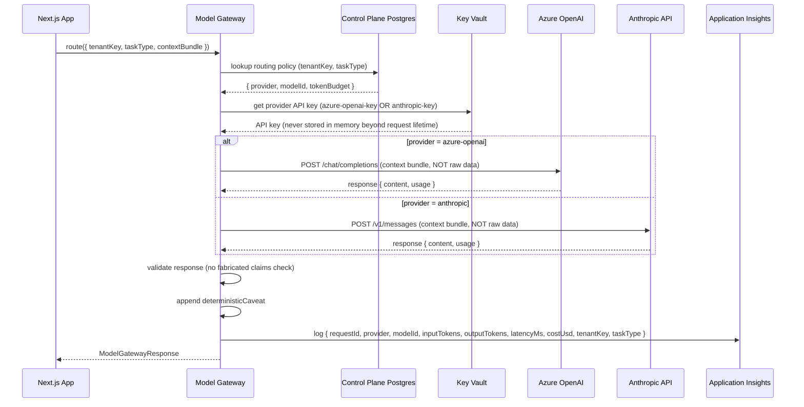

# AbarVa Multi-Provider Model Gateway Design

Slice ID: AZLAB8
Document: AZLAB8-multi-provider-model-gateway-design.md
Status: code_complete
Authored: 2026-04-26
Author: Code (sole)
Type: Architecture document — docs only, no runtime code, no migrations, no model calls.

---

## 1. Purpose

This document specifies how the AbarVa multi-provider model gateway routes inference requests between **Azure OpenAI** and **Anthropic API** at runtime.

It covers:
- Gateway interface contract (provider-agnostic)
- Routing policy data model
- Request lifecycle (routing decision → provider call → response validation)
- Per-tenant and per-task-type configuration
- Cost tracking
- Failover behaviour
- Provider isolation (no raw data leaves the Control Plane)

---

## 2. Gateway interface contract

All application code calls the gateway through a single interface. No application code imports Azure OpenAI SDK or Anthropic SDK directly.

```typescript
// lib/model-gateway/types.ts (contract — not implementation)

export type ModelProvider = 'azure-openai' | 'anthropic';

export type TaskType =
  | 'compose'       // Draft deliverable content
  | 'critique'      // Review and score agent output
  | 'narrate'       // Generate narrative summary
  | 'summarize'     // Condense evidence manifest
  | 'synthesize'    // Multi-step pattern reasoning
  | 'classify';     // Confidence classification

export interface ModelGatewayRequest {
  tenantKey: string;
  taskType: TaskType;
  contextBundle: ContextBundle;   // Structured context — never raw data
  tokenBudget?: number;           // Max tokens for this request
  costCentreTag?: string;         // For cost attribution
}

export interface ModelGatewayResponse {
  requestId: string;
  provider: ModelProvider;
  modelId: string;
  output: string;
  inputTokens: number;
  outputTokens: number;
  latencyMs: number;
  costUsd: number;
  deterministicCaveat: string;    // Always present — no live model claims
}

export interface ModelGateway {
  route(request: ModelGatewayRequest): Promise<ModelGatewayResponse>;
}
```

The `ContextBundle` type is defined in `lib/context-builder/types.ts` — it contains structured evidence, signals, and programme data. It never contains raw file bytes or database row content.

---

## 3. Routing policy data model

Routing policies are stored in the Control Plane Postgres table `model_gateway_routing_policies`.

```sql
-- Schema (informational — not a migration)
-- model_gateway_routing_policies

-- tenantKey   TEXT NOT NULL
-- taskType    TEXT NOT NULL   -- matches TaskType union
-- provider    TEXT NOT NULL   -- 'azure-openai' | 'anthropic'
-- modelId     TEXT NOT NULL   -- e.g. 'gpt-4o', 'claude-3-5-sonnet-20241022'
-- tokenBudget INTEGER         -- max tokens per request; NULL = use default
-- enabled     BOOLEAN NOT NULL DEFAULT true
-- PRIMARY KEY (tenantKey, taskType)
```

Default routing policy (applied when no tenant-specific policy exists):

| Task Type | Default Provider | Default Model |
|---|---|---|
| `compose` | `azure-openai` | `gpt-4o` |
| `critique` | `azure-openai` | `gpt-4o` |
| `narrate` | `azure-openai` | `gpt-4o` |
| `summarize` | `azure-openai` | `gpt-4o` |
| `synthesize` | `anthropic` | `claude-3-5-sonnet-20241022` |
| `classify` | `azure-openai` | `gpt-4o` |

Rationale for defaults:
- `synthesize` routes to Anthropic because multi-step pattern reasoning benefits from Claude's longer context and extended thinking capability
- All other tasks default to Azure OpenAI to minimise external egress for enterprise tenants
- Tenant-specific overrides allow a customer to pin all tasks to Azure OpenAI (for strict data residency)

---

## 4. Request lifecycle



**Key enforcement points:**
1. The context bundle passed to either provider contains only structured evidence manifest data — never raw file bytes
2. The API key is fetched from Key Vault on every request and discarded after the request. It is never cached in application memory or environment variables
3. Every response is validated by the no-fabrication checker before returning to the caller
4. Every invocation is logged to Application Insights — cost, token count, provider, tenant

---

## 5. No-raw-data enforcement

The gateway enforces that context bundles do not contain raw data before calling either provider:

```typescript
// Pseudocode — enforcement check in gateway implementation
function validateContextBundle(bundle: ContextBundle): void {
  // Reject if any evidence entry has rawContent populated
  for (const entry of bundle.evidenceEntries ?? []) {
    if (entry.rawContent !== undefined) {
      throw new GatewayRawDataViolation('rawContent field present in evidence entry');
    }
  }
  // Reject if bundle size exceeds 200KB (proxy for raw data inclusion)
  const bundleSizeBytes = JSON.stringify(bundle).length;
  if (bundleSizeBytes > 200_000) {
    throw new GatewayBundleSizeViolation(`Context bundle too large: ${bundleSizeBytes} bytes`);
  }
}
```

---

## 6. Deterministic caveat

Every `ModelGatewayResponse` includes a `deterministicCaveat` string. This is set by the gateway — the provider cannot override it.

Default caveat:
```
"Output generated by AbarVa model gateway using [provider]/[model]. 
Results are based on structured evidence manifests from the tenant's 
private data plane. Raw source data was not transmitted to the model 
provider. No live model inference claims are made."
```

The UI layer renders this caveat alongside every agent output. It cannot be suppressed.

---

## 7. Cost tracking

Every invocation logs to Application Insights with a custom event `ModelGatewayInvocation`:

```json
{
  "requestId": "<uuid>",
  "tenantKey": "<slug>",
  "taskType": "synthesize",
  "provider": "anthropic",
  "modelId": "claude-3-5-sonnet-20241022",
  "inputTokens": 2500,
  "outputTokens": 800,
  "latencyMs": 3200,
  "costUsd": 0.0195,
  "costCentreTag": "rd-lab",
  "timestamp": "2026-04-26T14:35:00Z"
}
```

Cost calculation (approximate, used for tracking not billing):

| Provider | Model | Cost formula |
|---|---|---|
| azure-openai | gpt-4o | `(inputTokens * 2.50 + outputTokens * 10.00) / 1_000_000` |
| anthropic | claude-3-5-sonnet-20241022 | `(inputTokens * 3.00 + outputTokens * 15.00) / 1_000_000` |

Monthly cost aggregation query (Application Insights KQL):

```kusto
customEvents
| where name == "ModelGatewayInvocation"
| where timestamp > startofmonth(now())
| extend props = todynamic(customDimensions)
| summarize totalCostUsd = sum(todouble(props.costUsd)), 
            totalInputTokens = sum(toint(props.inputTokens)),
            totalOutputTokens = sum(toint(props.outputTokens)),
            invocations = count()
    by provider = tostring(props.provider), tenantKey = tostring(props.tenantKey)
| order by totalCostUsd desc
```

---

## 8. Failover behaviour

If the primary provider fails (5xx, timeout > 30s, rate limit):

1. Gateway logs the failure to Application Insights as `ModelGatewayProviderError`
2. Gateway checks routing policy for a `fallbackProvider` field (optional)
3. If `fallbackProvider` is set: retry once with fallback provider
4. If no fallback or fallback also fails: return a `ModelGatewayError` to the caller

**No automatic cross-provider failover without explicit policy.** Automatic failover could route a tenant configured for Azure OpenAI (data residency requirement) to Anthropic (external). This must be an explicit operator decision.

```typescript
// Routing policy with explicit fallback
// { tenantKey: 'apex-retail', taskType: 'synthesize', provider: 'anthropic', fallbackProvider: 'azure-openai' }
```

For enterprise tenants with strict Azure-only policy:
```typescript
// { tenantKey: 'fortune500-client', taskType: '*', provider: 'azure-openai', fallbackProvider: null }
```
`fallbackProvider: null` means no fallover — return error rather than route to external provider.

---

## 9. Provider isolation summary

| Isolation property | Azure OpenAI | Anthropic |
|---|---|---|
| Data stays in Azure subscription | Yes | No (external HTTPS call) |
| AbarVa has no standing access to key | Yes (KV RBAC) | Yes (KV RBAC) |
| Context bundle validated before send | Yes | Yes |
| Raw data never sent | Yes | Yes |
| Response validated after receive | Yes | Yes |
| Cost logged to Application Insights | Yes | Yes |
| Enterprise data residency option | Yes (Azure-only policy) | Not applicable |
| BAA / compliance certification | Azure compliance | Anthropic BAA |

---

## 10. Configuration checklist for Wave 24 lab

- [ ] Azure OpenAI resource provisioned: `abarva-lab-aoai-eastus2`
- [ ] GPT-4o deployment created with 10K TPM capacity
- [ ] text-embedding-3-small deployment created with 50K TPM capacity
- [ ] Azure OpenAI key stored in `kv-abarva-lab-ctrl` as `abarva-azure-openai-key`
- [ ] Anthropic API key stored in `kv-abarva-lab-ctrl` as `abarva-anthropic-api-key`
- [ ] Default routing policy rows inserted into `model_gateway_routing_policies` table (all 6 task types)
- [ ] Application Insights custom event `ModelGatewayInvocation` verified in portal
- [ ] No-fabrication check unit tested (see Wave 25 QA30)
- [ ] Monthly cost query validated in Application Insights KQL

---

## 11. Related documents

- ADR-002: `docs/architecture/azure/ADR-002-ai-provider-strategy.md`
- Target architecture diagram: `docs/architecture/azure/AZLAB6-azure-target-architecture.md`
- Model gateway contract (existing): `docs/architecture/ABARVA_MODEL_GATEWAY_AND_TOOL_PLANE.md`
- Context builder: `lib/context-builder/` (application code)
- Cost breakdown: `docs/architecture/azure/AZLAB6-cost-breakdown.md`
