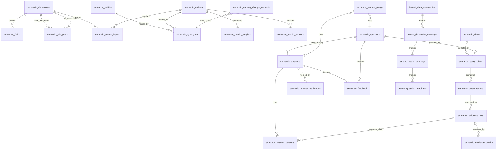
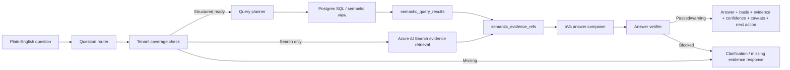

# Enterprise Semantic Question Layer Azure Data Plane Design

## Executive Summary

The Enterprise Semantic Question Layer is AbarVa's universal plain-English question service across Home, Moves, Source, Control Tower, operational evidence, enterprise context, artifacts, vendors, programs, risks, value, architecture, data quality, governance, and aVa.

The governing principle is deterministic facts first, LLM narrative second:

1. Route the question to intent, module, dimensions, metrics, filters, joins, and missing context.
2. Inspect tenant coverage before answering.
3. Run structured SQL/views first for metrics, rankings, comparisons, trends, root cause, and recommendations.
4. Retrieve citations from structured evidence and sanitized Azure AI Search chunks.
5. Let aVa compose the human answer.
6. Verify every number, ranking, metric, citation, caveat, and synthetic label.

This design extends the current Context Layer instead of creating a separate data product. Raw files remain in controlled storage. Structured facts, semantic metadata, volumetrics, evidence references, query results, and answer verification live in Azure/Postgres. Sanitized summaries and source excerpts are indexed in Azure AI Search for supporting evidence only.

## Current-State Schema Audit

| Area | Current assets to reuse | Gap this design closes |
|---|---|---|
| Enterprise context | `enterprise_context_sources`, `enterprise_context_source_files`, `enterprise_context_records`, `enterprise_context_facts`, `enterprise_context_relationships`, `enterprise_context_evidence`, quality/stewardship/snapshot tables | No persisted semantic catalog, metric registry, synonym registry, query-plan/result ledger, or tenant readiness inventory. |
| Operational evidence | `operational_evidence_sources`, load runs, file manifests, work items, events, process observations, system-service maps, automation opportunities, human-agent responsibilities, value estimates, insights, relationships, semantic snapshots, `move_evidence_slot_coverage` | Process-intelligence records are queryable, but universal semantic catalog, tenant metric readiness, answer citation, and feedback loops are not yet persisted. |
| Source | Source artifacts, chunks, facts, pricing, commercial exceptions, vendor commitments, requirements, meeting outcomes, graph edges, context receipts | Sourcing data exists as module entities but needs semantic metrics, vendor/TCO definitions, award recommendation evidence, and cross-module usage tracking. |
| Moves | Deliverable lifecycle tables, evidence readiness gates/contracts, solution context, artifact prompts | Moves artifact context can bind evidence, but semantic question readiness, queryable context coverage, and answer verification are not centralized. |
| Tower | AI Control Tower substrate/read-model tables, Jira/CMDB/ITSM/cloud/workforce/program-financial ingest tables | Tower answers need shared metric definitions, freshness/caveat rules, and the same verifier used by aVa/Home/Moves/Source. |
| Retrieval | Azure AI Search chunking/indexing patterns and enterprise context chunk queue | Search supports evidence lookup, but structured questions still need Postgres-first query planning and search results must map back to `semantic_evidence_refs`. |
| Coverage | `coverage.ts`, SegmentId mappings, V4 aliases, template registry | Coverage answers are segment-oriented, not tenant-volumetric or question-readiness-oriented. SegmentId alignment must continue moving toward the 19-dimension semantic catalog. |
| Tenant isolation | `tenant_key`, `client_id`, `can_read_tenant_by_key`, `can_write_tenant_by_key`, source RLS patterns | Semantic global defaults and tenant overrides need explicit RLS behavior to avoid cross-tenant catalog or evidence leakage. |

### Dimension Readiness Snapshot

| Question | Current answer |
|---|---|
| Which of the 19 dimensions have templates? | The 19 universal dimensions are represented in `UNIVERSAL_CONTEXT_TEMPLATES` and `SEMANTIC_DIMENSION_CATALOG`; tests assert 19 contracts and 95 golden questions. |
| Which have structured tables/views? | All can land in generic `enterprise_context_records/facts/relationships/evidence`; operational/service dimensions also have typed operational tables. Dedicated semantic views are newly designed in this document. |
| Which have retrieval support? | Enterprise context chunks and Azure AI Search patterns exist; this design requires chunk metadata to include tenant, dimension, source, evidence type, freshness, synthetic, and sensitivity flags. |
| Which have semantic aliases? | Code-level synonyms exist in `SEMANTIC_DIMENSION_CATALOG`; this design persists them in `semantic_synonyms` with global and tenant-custom sources. |
| Which have metric definitions? | Code-level `SEMANTIC_METRIC_REGISTRY` exists; this design persists metrics, inputs, weights, and versions. |
| Which have citation rules? | Code-level citation rules exist; this design persists evidence refs and claim-to-citation mappings. |
| Which have freshness/owner/caveat metadata? | Enterprise context and operational evidence rows carry freshness/confidence/owner/caveats; this design aggregates them into tenant coverage and evidence quality. |
| Which have answer verification? | Code-level verifier blocks unsupported numbers; this design persists verification results and issues. |
| Which are missing from `coverage.ts`? | Recent aliases cover newer V4 families, but `coverage.ts` remains legacy SegmentId-oriented. It should become a consumer of `tenant_dimension_coverage` and `tenant_question_readiness`. |
| Which are only document-searchable? | Any dimension loaded only as chunks without structured rows/views must be marked `searchable_unstructured=true`, `queryable_structured=false`, and answered with caveats. |
| Which have tenant-level volumetric tracking? | Operational proof creates counts in runtime proof; this design formalizes them in `tenant_data_volumetrics`, `tenant_dimension_coverage`, `tenant_metric_coverage`, and `tenant_question_readiness`. |
| Which tenant datasets are queryable vs only searchable? | The new readiness views answer this per tenant, source, dimension, metric, and question pattern. |

## Target ERD



## Table-by-Table Data Dictionary

### Semantic Catalog Core

| Table | Purpose | Key columns |
|---|---|---|
| `semantic_dimensions` | Defines every business dimension users can ask about. Supports global defaults and tenant overrides. | `tenant_key`, `dimension_key`, `family_key`, `business_name`, `primary_grain`, `default_source_table`, `default_search_index`, `is_global`. |
| `semantic_fields` | Defines queryable/filterable fields within a dimension. | `dimension_id`, `field_key`, `data_type`, `source_table`, `source_column`, `allowed_filter`, `sensitivity_classification`, `pii_phi_flag`, `citation_required`. |
| `semantic_synonyms` | Maps business language to dimensions, fields, metrics, entities, filters, and intents. | `synonym_text`, `target_type`, `target_key`, `confidence`, `source`. |
| `semantic_entities` | Defines canonical entities such as application, vendor, initiative, ticket, opportunity, process, artifact, metric. | `entity_key`, `entity_type`, `source_table`, `primary_key_field`, `display_field`, `owner_field`. |

### Metric and Definition Registry

| Table | Purpose | Key columns |
|---|---|---|
| `semantic_metrics` | Reusable metric definitions. | `metric_key`, `formula_type`, `formula_text`, `unit`, `default_grain`, `required_fields`, `finance_validated_flag`. |
| `semantic_metric_inputs` | Required fields/tables/dimensions/evidence for each metric. | `metric_id`, `dimension_id`, `field_id`, `input_role`, `required`, `missing_behavior`. |
| `semantic_metric_weights` | Composite metric components such as app friction score. | `metric_id`, `component_metric_id`, `component_name`, `weight`, `normalization_method`. |
| `semantic_metric_versions` | Approved metric definition history. | `metric_id`, `version`, `formula_text`, `change_reason`, `approved_by`, `effective_from`. |

### Semantic Joins and Query Planning

| Table | Purpose | Key columns |
|---|---|---|
| `semantic_join_paths` | Approved join paths across dimensions/entities. | `join_key`, `from_dimension_id`, `to_dimension_id`, `from_table`, `to_table`, `from_column`, `to_column`, `join_type`, `relationship_cardinality`. |
| `semantic_views` | Registered SQL/materialized views used by the planner. | `view_key`, `sql_definition`, `dimensions_supported`, `metrics_supported`, `refresh_mode`, `refresh_frequency`. |
| `semantic_questions` | Raw question and interpreted routing metadata. | `tenant_key`, `user_id`, `raw_question`, `intent_type`, `target_modules`, `target_dimensions`, `target_metrics`, `filters_json`, `clarification_needed`. |
| `semantic_query_plans` | Generated query plans before execution. | `question_id`, `selected_dimensions`, `selected_metrics`, `selected_join_paths`, `selected_view`, `generated_sql`, `planner_confidence`, `unsupported_reason`. |
| `semantic_query_results` | Computed result sets/summaries used by aVa and verifier. | `query_plan_id`, `result_json`, `row_count`, `numeric_values_json`, `ranking_values_json`, `confidence_score`, `caveats`. |

### Evidence, Citations, and Verification

| Table | Purpose | Key columns |
|---|---|---|
| `semantic_evidence_refs` | Source references used to support answers. | `query_result_id`, `source_type`, `source_table`, `source_record_id`, `source_file_id`, `excerpt_or_summary`, `freshness_at`, `synthetic_demo_flag`, `pii_phi_flag`, `citation_label`. |
| `semantic_answer_citations` | Maps each answer claim to supporting evidence. | `answer_id`, `claim_text`, `citation_id`, `claim_type`, `verification_status`. |
| `semantic_evidence_quality` | Freshness, completeness, confidence, caveats, and action per evidence ref. | `evidence_ref_id`, `freshness_status`, `completeness_score`, `confidence_score`, `source_reliability`, `recommended_action`. |
| `semantic_answers` | Generated answer and verification status. | `question_id`, `query_plan_id`, `answer_text`, `confidence_score`, `verification_status`, `unsupported_reason`, `synthetic_demo_flag`. |
| `semantic_answer_verification` | Verifier results by type. | `answer_id`, `verification_type`, `status`, `issue`, `recommended_fix`. |

### Tenant Volumetrics and Coverage

| Table | Purpose | Key columns |
|---|---|---|
| `tenant_data_volumetrics` | Per-tenant record counts, time coverage, freshness, quality, and coverage by source/dimension/evidence type. | `tenant_key`, `source_type`, `dimension_key`, `evidence_type`, `record_count`, `date_min`, `date_max`, `freshness_status`, `coverage_status`, `synthetic_demo_flag`, `finance_validated_flag`. |
| `tenant_dimension_coverage` | Whether a dimension is available/queryable/searchable/metric-ready for a tenant. | `tenant_key`, `dimension_key`, `available`, `queryable_structured`, `searchable_unstructured`, `metric_ready`, `citation_ready`, `answer_verification_ready`, `missing_required_fields`, `caveats`. |
| `tenant_metric_coverage` | Whether a metric can be computed for a tenant. | `tenant_key`, `metric_key`, `computable`, `required_fields_available`, `source_data_available`, `required_join_paths_available`, `citation_ready`, `fallback_used`, `finance_validated_flag`. |
| `tenant_question_readiness` | Whether common question patterns are answerable. | `tenant_key`, `question_pattern`, `intent_type`, `required_dimensions`, `required_metrics`, `readiness_status`, `missing_data`, `suggested_next_action`. |

### Feedback and Usage

| Table | Purpose | Key columns |
|---|---|---|
| `semantic_feedback` | User feedback and corrections. | `answer_id`, `question_id`, `feedback_type`, `feedback_text`, `proposed_synonym`, `proposed_definition`, `status`. |
| `semantic_catalog_change_requests` | Proposed changes to metrics, synonyms, dimensions, fields, joins, caveats, owners, freshness rules. | `change_type`, `target_id`, `proposed_change`, `reason`, `approval_status`. |
| `semantic_module_usage` | Which modules used semantic questions/answers and for what. | `module`, `object_type`, `object_id`, `question_id`, `answer_id`, `used_for`. |

## Relationship Model

- Catalog relationships: dimensions define fields; metrics reference dimensions/fields; synonyms point to dimensions, fields, metrics, entities, filters, or intents.
- Query relationships: questions produce plans; plans produce results; results produce evidence refs.
- Citation relationships: answers cite evidence refs claim-by-claim; verifier checks answer claims.
- Coverage relationships: volumetrics feed dimension coverage; dimension coverage feeds metric coverage; metric coverage feeds question readiness.
- Learning relationships: feedback creates catalog change requests; approved requests update synonyms, metrics, joins, caveats, owners, or freshness rules.
- Module relationships: module usage records where the answer was consumed: display, artifact context, decision support, readiness, export, or recommendation.

## Tenant Volumetrics and Readiness Views

Required views:

- `tenant_context_inventory_vw`: loaded context by tenant/source/dimension/evidence type.
- `tenant_dimension_readiness_vw`: dimension availability, structured queryability, metric/citation/verifier readiness.
- `tenant_metric_readiness_vw`: metric computability, fallback/finance status, caveats.
- `tenant_question_readiness_vw`: question pattern readiness, missing data, confidence, next action.

Behavior before answering:

1. Check `tenant_question_readiness` for the pattern.
2. Check `tenant_dimension_coverage` for required dimensions.
3. Check `tenant_metric_coverage` for required metrics.
4. If structured coverage exists, run the planner SQL.
5. If only unstructured evidence exists, answer with evidence-summary caveats.
6. If data is missing, explain what is missing and which template/evidence unlocks it.
7. If data is synthetic, label it.
8. If finance/rate-card data is not validated, use ROM/planning language.

## Semantic Query Flow



## Example SQL Queries

### 1. Top Apps by Friction Score

```sql
SELECT
  app.application_id,
  app.application_name,
  COUNT(w.id) AS work_item_count,
  SUM(CASE WHEN w.sla_breached THEN 1 ELSE 0 END) AS sla_breaches,
  SUM(w.reopen_count) AS reopens,
  SUM(w.handoff_count) AS handoffs,
  COUNT(e.id) AS recurring_events,
  (
    COUNT(w.id)
    + SUM(CASE WHEN w.sla_breached THEN 1 ELSE 0 END) * 4
    + SUM(w.reopen_count) * 3
    + SUM(w.handoff_count) * 1.5
    + COUNT(e.id)
  ) AS app_friction_score
FROM operational_system_service_maps app
LEFT JOIN operational_work_items w
  ON w.tenant_key = app.tenant_key AND w.application_id = app.application_id
LEFT JOIN operational_events e
  ON e.tenant_key = app.tenant_key AND e.application_id = app.application_id
WHERE app.tenant_key = $1
GROUP BY app.application_id, app.application_name
ORDER BY app_friction_score DESC;
```

### 2. ServiceNow Ticket Volume by Category

```sql
SELECT category, COUNT(*) AS ticket_count
FROM operational_work_items
WHERE tenant_key = $1 AND source_system = 'servicenow'
GROUP BY category
ORDER BY ticket_count DESC;
```

### 3. SLA Breach Rate by App

```sql
SELECT application_id,
       COUNT(*) AS total_items,
       SUM(CASE WHEN sla_breached THEN 1 ELSE 0 END) AS breached_items,
       ROUND(SUM(CASE WHEN sla_breached THEN 1 ELSE 0 END)::numeric / NULLIF(COUNT(*),0), 4) AS sla_breach_rate
FROM operational_work_items
WHERE tenant_key = $1
GROUP BY application_id;
```

### 4. Reassignment / Handoff Rate by Process

```sql
SELECT business_service, AVG(handoff_count)::numeric(10,2) AS avg_handoffs
FROM operational_work_items
WHERE tenant_key = $1
GROUP BY business_service
ORDER BY avg_handoffs DESC;
```

### 5. Jira Cycle Time by Team

```sql
SELECT owner_team,
       AVG(EXTRACT(EPOCH FROM (resolved_at - opened_at)) / 86400)::numeric(10,2) AS avg_cycle_days
FROM operational_work_items
WHERE tenant_key = $1 AND work_item_type IN ('bug','task','story')
GROUP BY owner_team;
```

### 6. Automation Opportunities by Value / Feasibility / Risk

```sql
SELECT opportunity_name, priority, value_score, feasibility_score, risk_score, readiness_score
FROM operational_automation_opportunities
WHERE tenant_key = $1
ORDER BY value_score DESC, feasibility_score DESC, risk_score ASC;
```

### 7. Normalized TCO by Vendor

```sql
SELECT vendor_id,
       SUM((payload->>'annual_value_usd')::numeric) AS normalized_tco
FROM enterprise_context_records
WHERE tenant_key = $1 AND record_type IN ('vendor','contract','renewal')
GROUP BY vendor_id
ORDER BY normalized_tco DESC;
```

### 8. Source Award Recommendation Evidence

```sql
SELECT vendor_id, requirement_id, score, rationale, evidence_refs
FROM source_requirements
WHERE tenant_key = $1 AND event_id = $2
ORDER BY score DESC;
```

### 9. Moves Evidence Readiness by Phase

```sql
SELECT phase, readiness_tier, status, COUNT(*) AS slot_count
FROM move_evidence_slot_coverage
WHERE tenant_key = $1 AND move_id = $2
GROUP BY phase, readiness_tier, status
ORDER BY phase, readiness_tier;
```

### 10. Tenant Data Coverage Inventory

```sql
SELECT *
FROM tenant_context_inventory_vw
WHERE tenant_key = $1
ORDER BY dimension_key, source_type;
```

### 11. Tenant Metric Readiness

```sql
SELECT metric_key, computable, confidence_score, fallback_used, finance_validated_flag, caveats
FROM tenant_metric_readiness_vw
WHERE tenant_key = $1
ORDER BY metric_key;
```

### 12. Question Readiness for "Apps Causing Friction"

```sql
SELECT readiness_status, missing_data, confidence_score, suggested_next_action
FROM tenant_question_readiness_vw
WHERE tenant_key = $1
  AND question_pattern = 'apps causing friction';
```

## RLS / Tenant Isolation Model

Rules:

- All runtime rows include `tenant_key`; most also include `client_id` where the client UUID is available.
- Global/default catalog rows use `tenant_key IS NULL` and `is_global = true`.
- Tenant overrides use `tenant_key = active tenant` and `is_global = false`.
- Authenticated reads use `tenant_key IS NULL OR can_read_tenant_by_key(tenant_key)`.
- Writes should use service-role loaders or future tenant-admin writer policies; the initial migration only grants authenticated SELECT through RLS.
- Query planner SQL must always include `tenant_key = active tenant`.
- Azure AI Search filters must always include `tenant_id` or `tenant_key`.
- Evidence citations must never expose another tenant's source records.

RLS example:

```sql
CREATE POLICY semantic_answers_authenticated_read
ON semantic_answers
FOR SELECT TO authenticated
USING (can_read_tenant_by_key(tenant_key));
```

Global fallback example:

```sql
SELECT *
FROM semantic_metrics
WHERE (tenant_key = $1 OR is_global = true)
  AND metric_key = 'app_friction_score'
ORDER BY tenant_key NULLS LAST
LIMIT 1;
```

Tenant isolation tests:

- Tenant A cannot read Tenant B answers, questions, evidence refs, volumetrics, coverage, or module usage.
- Tenant A can read global catalog definitions.
- Tenant A override supersedes global definition only for Tenant A.
- Maestro/service role can audit all tenants.
- Search filter without tenant key is rejected by the retrieval adapter.

## Azure AI Search Integration Guide

Structured questions use Postgres first. Azure AI Search is supporting evidence for unstructured documents, artifacts, excerpts, and human-readable context.

Required chunk metadata:

- `tenant_id` / `tenant_key`
- `source_type`
- `dimension_key`
- `evidence_type`
- `source_id`
- `record_id`
- `source_file_id`
- `freshness`
- `confidence`
- `synthetic_demo_flag`
- `pii_phi_flag`
- `sensitivity_classification`
- `citation_label`

Rules:

- Do not index raw sensitive tickets, logs, PHI, credentials, raw comments, or raw documents.
- Index sanitized summaries/chunks only.
- Every search result must map back to `semantic_evidence_refs`.
- Search evidence can support summaries, but cannot create unsupported numbers.
- Search queries must include tenant filters and sensitivity filters.

## aVa Answer Contract

Every answer must include:

1. Direct answer.
2. Basis/definition used.
3. Evidence.
4. Confidence.
5. Caveats.
6. Recommended next action.
7. Ask-next suggestions.

Example:

> The biggest source of operational friction is Advisor Desktop. It has the highest friction score because it combines high incident volume, repeated handoffs, reopens, and recurring integration errors. The issue is repeated operational drag, not one isolated outage. I would pilot ticket intake/routing and KB recommendation first, while keeping P1/P2 routing human-approved.
>
> Basis: App friction score = incident volume + SLA breach rate + reopen rate + reassignment rate + recurring event signals + ownership gap penalty.
>
> Confidence: Medium-high. ServiceNow and Jira evidence are available; log coverage is partial.
>
> Next: Show evidence, create AI opportunity, or break down by assignment group.

## Module Integration Guide

| Module | Uses semantic layer for | Required behavior |
|---|---|---|
| Home | "What do we know?", current-state insights, tenant coverage, stale/missing data | Render tenant coverage, confidence, caveats, and ask-next actions. |
| Moves | Context binding, evidence readiness, artifact prompts, value estimates, risks, roadmap, aVa answers | Bind query results/evidence refs into prompts; never let Claude invent missing metrics. |
| Source | Vendor, RFP, pricing, BAFO, normalized TCO, award recommendation evidence | Use registered scoring/TCO metrics; cite proposal/pricing/risk evidence. |
| Control Tower | Delivery value, adoption, spend, risk, initiative health, benefit realization | Use semantic metrics and freshness windows; label stale or synthetic evidence. |
| aVa | Universal advisor answer composition | Direct answer first, then basis/evidence/confidence/caveats/next action. |
| Context Layer Admin | Data coverage, missing fields, stale evidence, unsafe evidence | Show readiness inventory and client-to-complete actions. |

## Migration Strategy

1. Audit existing schema and SegmentId coverage.
2. Fix SegmentId / `coverage.ts` alignment toward the 19 semantic dimensions.
3. Apply semantic catalog core tables.
4. Apply metric registry tables.
5. Apply join/query planning tables.
6. Apply evidence/citation tables.
7. Apply tenant volumetrics and readiness tables.
8. Apply question/answer/verification tables.
9. Apply feedback/change-request tables.
10. Apply readiness views.
11. Add RLS policies.
12. Seed global 19-dimension semantic catalog.
13. Seed common metrics and metric weights.
14. Load tenant volumetrics for SkyHarbor and Morgan Street synthetic proof.
15. Implement persisted question router.
16. Implement SQL query planner.
17. Implement answer verifier persistence.
18. Wire aVa/Home/Moves/Source/Control Tower to `answerEnterpriseSemanticQuestion`.
19. Add golden question and RLS tests.
20. Run live tenant proof through VNet job.

## Testing and Golden Question Strategy

Required tests:

- Migration creates every semantic table and readiness view.
- RLS blocks cross-tenant rows while allowing global catalog definitions.
- Tenant override wins over global fallback only for that tenant.
- Synonym mapping resolves business language to canonical dimensions/metrics.
- Metric definition resolution uses registered formulas.
- Join path selection uses approved joins.
- Query planner chooses structured SQL before search.
- Answer verifier blocks unsupported numbers and rankings.
- Tenant volumetrics produce coverage/readiness rows.
- Azure AI Search filters include tenant and sensitivity metadata.
- Synthetic data is labeled.
- Finance-unvalidated estimates are caveated as ROM/planning assumptions.
- Golden question set includes at least five questions per universal dimension plus cross-module questions for Home, Moves, Source, Control Tower, and operational evidence.

## Implementation Roadmap

| Horizon | Outcome |
|---|---|
| 0-30 days | Apply schema, seed global catalog/metrics/synonyms, compute tenant coverage from existing enterprise context and operational evidence, expose readiness views. |
| 31-60 days | Persist query plans/results/evidence refs/answers/verifications, wire aVa and Home to the service, add golden question suite. |
| 61-90 days | Wire Moves, Source, and Control Tower; bind semantic results into Claude prompts and artifact context; add feedback/change-request workflow. |
| 91-120 days | Add materialized semantic views, tenant-specific metric overrides, live Azure AI Search citation mapping, cross-tenant isolation proof, and production monitoring. |

## Acceptance Checklist

- Azure/Postgres ERD produced.
- Table-by-table data dictionary produced.
- Tenant volumetrics and coverage model included.
- All 19+ dimensions supported through global semantic catalog.
- Metrics centrally defined and reusable.
- Tenant-specific and global semantic definitions supported.
- Query planner is structured-data-first.
- Evidence retriever supports citations.
- Answer verifier blocks unsupported numbers and hallucinated claims.
- aVa answer format defined.
- Tenant coverage can state missing, stale, partial, synthetic, or finance-unvalidated data.
- RLS and tenant isolation designed.
- Azure AI Search integration designed safely.
- Home, Moves, Source, Control Tower, and aVa usage documented.
- Migration strategy and tests defined.
- SegmentId / `coverage.ts` mismatch called out as a migration item.
