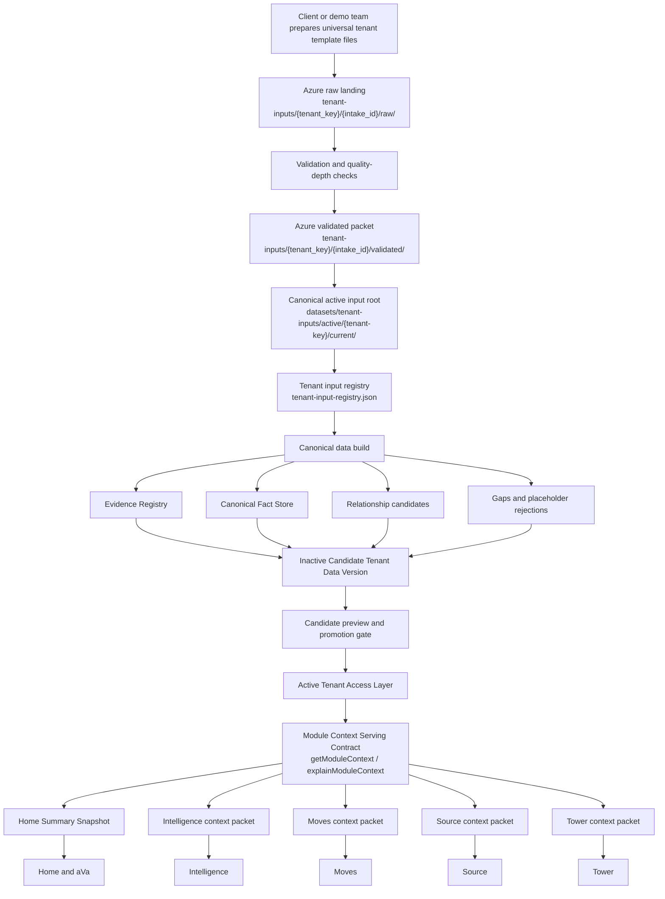

# Enterprise Data Layer Operating Design

Status: official operator-facing design document.

This document answers four operational questions:

1. What is the single tenant input standard?
2. Which actual files are used by the current canonical build?
3. What is the end-to-end flow from client input to module/runtime access?
4. Which data layer does each product page access today and after promotion?

## Non-Negotiable Standard

AbarVa has one tenant data intake standard:

```text
Universal Tenant Input Standard
```

It is not tenant-specific, industry-specific, module-specific, or demo-specific.
Healthcare, airline, retail, financial services, legal operations, sourcing,
and future tenants all use the same universal template standard. Industry
differences are captured as rows, fields, evidence, caveats, and relationships,
not as separate schemas.

The canonical template location is:

```text
datasets/tenant-inputs/templates/universal/standard-2026-07/
```

The canonical active input location is:

```text
datasets/tenant-inputs/active/<tenant-key>/current/
```

The controlling registry is:

```text
datasets/tenant-inputs/tenant-input-registry.json
```

The canonical build process is:

```text
npm run audit:canonical-tenant-inputs
npm run build:canonical-tenant-data
npm run audit:canonical-data-build
npm run build:candidate-version
npm run audit:candidate-version
npm run audit:active-module-context-promotion
npm run audit:module-context-serving
```

No Home, Intelligence, Moves, Source, or Tower page should read scattered legacy
source folders directly. Runtime modules consume governed context through the
Active Tenant Access Layer and module context serving contract.

## Universal Template Standard

The universal standard is a single template set made of required domain CSVs.
These are the only approved template files for new tenant pilots.

| Domain | Template file | Purpose |
| --- | --- | --- |
| Enterprise profile | `00_enterprise_profile.csv` | Company identity, industry, HQ, revenue, employees, locations, mission, vision, strategy, leadership, business model, source, as-of date, and gaps. |
| Business functions | `01_business_functions.csv` | Enterprise functions, capabilities, criticality, budget, FTE, outsourced support, current and target state. |
| Org ownership | `02_org_ownership.csv` | Org units, leaders, decision rights, owned functions, systems, and data domains. |
| Workforce roles | `03_workforce_roles.csv` | Roles, capacity, location model, skills, pain points, vendor support, automation opportunity. |
| Applications and systems | `04_applications_systems.csv` | Application/system inventory, category, deployment model, hosting, lifecycle, criticality, owners, vendor, data domains, interfaces, current/target state. |
| Data assets and integrations | `05_data_assets_integrations.csv` | Data products, marts, warehouses, lakehouses, integrations, platforms, refresh, ownership, quality, regulated data, analytics usage. |
| Infrastructure and platforms | `06_infrastructure_platforms.csv` | Data centers, regions, platforms, hosting model, stack, ownership, scale, constraints, future target flag. |
| Vendors and contracts | `07_vendors_contracts.csv` | Vendors, contracts, services, spend, owners, dates, commercial model, supported functions/systems, risk. |
| Spend and value | `08_spend_value.csv` | Cost baseline, value pools, budget, run/change/transform split, vendor/internal split, savings opportunities, calculation basis. |
| Programs and initiatives | `09_programs_initiatives.csv` | Programs, sponsors, objectives, scope, status, dependencies, risks, budget, expected value. |
| AI and automation use cases | `10_ai_automation_use_cases.csv` | Use cases, business function, process, AI pattern, status, value hypothesis, dependencies, controls. |
| Risks and controls | `11_risks_controls.csv` | Risks, controls, domains, impacted systems, severity, likelihood, ownership, evidence, mitigation. |
| Relationships | `12_relationships.csv` | Explicit graph edges across functions, systems, vendors, data, programs, risks, metrics, and owners. |
| Evidence sources | `13_evidence_sources.csv` | Source inventory, owner, as-of date, sensitivity, domains covered, quality notes, approval. |
| Metrics and outcomes | `14_metrics_outcomes.csv` | KPI definitions, baselines, targets, owners, data source, calculation basis, confidence. |
| Industry context patterns | `15_industry_context_patterns.csv` | Evidence-backed industry patterns and caveats. |
| Expert lenses | `16_expert_lenses.csv` | CIO/CDAO/CFO/CPO/COO-style question lenses, inputs, limits, and decision use. |
| Managed-service scope | `17_service_scope_managed_services.csv` | Service towers, scope, provider, volume, SLA/KPI, run cost, target option. |
| Operational process evidence | `18_operational_process_evidence.csv` | Process evidence, systems used, volume, cycle time, pain points, controls, automation candidates. |

Some current active files retain historical filename prefixes as compatibility
identifiers. That is not the architecture standard. The governing standard is
the universal template set above.

## Azure Landing And Admin Upload Alignment

Target Azure landing convention:

```text
container:  tenant-inputs
raw:        tenant-inputs/{tenant_key}/{intake_id}/raw/
validated:  tenant-inputs/{tenant_key}/{intake_id}/validated/
archive:    tenant-inputs/archive/{tenant_key}/{intake_id}/
filename:   {tenant_key}__{template_name}__{as_of_yyyymmdd}__{source_owner}__r{revision}.csv
```

Admin upload must land files into the same convention. Raw upload is not runtime
truth. A file becomes eligible only after validation creates a validated packet
and the registry points to that packet.

## Actual Files Used Today

The exact active input files used by the latest canonical build are generated
from:

```text
reports/canonical-data-build/latest/tenant-build-index.json
```

The generated operator inventory is:

```text
reports/data-layer-design/active-input-file-inventory.md
reports/data-layer-design/active-input-file-inventory.json
```

That inventory lists, for every active tenant:

- tenant key and display name
- active packet id
- source classification
- canonical domain
- active repo path
- row count
- content fingerprint

Current active tenant summary:

| Tenant | Active input files | Source rows | Candidate records | Relationship candidates | Status |
| --- | ---: | ---: | ---: | ---: | --- |
| Apex Retail | 17 | 4,112 | 3,589 | 1,690 | module proof pass |
| First Capital Financial | 17 | 6,132 | 5,609 | 2,757 | module proof pass |
| Lakeshore Holdings | 19 | 996 | 457 | 183 | module proof pass |
| Lakeshore Industries | 52 | 3,809 | 3,040 | 892 | module proof pass |
| Meridian Health | 60 | 4,697 | 4,078 | 2,177 | module proof pass |
| SkyHarbor Air | 57 | 3,842 | 3,457 | 3,136 | module proof pass |

Northstar is retired/excluded and must not be processed as an active tenant.

## End-To-End Data Flow



## Logical Layers

| Layer | What It Stores Or Serves | Current Proof Artifact |
| --- | --- | --- |
| Tenant Inputs | Universal template files under the canonical active root. | `reports/data-layer-design/active-input-file-inventory.md` |
| Evidence Registry | Source file references, source paths, row evidence, fingerprints, source dates, confidence. | `reports/canonical-data-build/latest/evidence-attachment-summary.json` |
| Canonical Fact Store | Normalized tenant objects and fields across domains. | `reports/canonical-data-build/latest/canonical-records-summary.json` |
| Enterprise Relationship Graph Plan | Relationship candidates and graph-ready edges; not a graph database source of truth. | `reports/canonical-data-build/latest/relationship-candidates-summary.json` |
| Derived Intelligence Store | Deterministic profile, gaps, answerability, quality posture, placeholder rejection, readiness. | `reports/canonical-data-build/latest/home-ava-readiness.json` and `tenant-quality-depth.json` |
| Candidate Tenant Data Version | Inactive candidate metadata and read-model samples. | `reports/candidate-version-build/latest/tenant-candidate-versions.json` |
| Candidate Preview | Explicit, inactive, read-only preview route; never default module truth. | `/admin/candidate-preview` and post-deploy crawl artifact |
| Active Tenant Access Layer | Active metadata pointer used by module context serving. | `reports/active-tenant-access/*/active-tenant-access-record.json` |
| Module Context Serving | Read-only supplier contract for Home, Intelligence, Moves, Source, Tower. | `src/lib/enterprise-data/module-context-serving/module-context-serving.ts` |
| Module Memory | Future module-created decisions, artifacts, and write-back memories. | Contract only; not the default data source for tenant facts. |
| Outcome Ledger | Projected, committed, measured, realized, and attested value. | Contract/target; Tower must not invent realized value from context. |

## Page And Module Access Map

This table is intentionally concrete. It separates current runtime reads from
the target architecture.

| Page or API | Route/code | Current primary data access | Current layer | Target layer |
| --- | --- | --- | --- | --- |
| Home | `src/app/(maestro)/home/page.tsx` | Builds setup control, Home data quality, English summary, Home runtime summary snapshot. Attempts module context first for active mode; falls back to active Home context browser if active module context is unavailable. | Active Tenant Access Layer where available; otherwise compatibility Home context browser and setup-control read model. | Active Tenant Access Layer -> Module Context Serving -> Home Summary Snapshot. |
| Home summary API | `src/app/api/home/summary-snapshot/route.ts` | Builds Home Summary Snapshot from active Home context browser/setup control; supports candidate preview mode only when requested. | Compatibility Home context browser plus setup-control; active module context when available through runtime builder. | Module Context Serving only, active by default. |
| Home aVa | Home surface client and Home ask/KNOW helpers | Reads active Home summary/context scope and must not answer outside loaded active Home context. | Active Home context and summary snapshot; candidate data only in explicit preview. | Claude/audited answer over active Module Context Packet plus citations and guardrails. |
| Intelligence landing | `src/app/(maestro)/intelligence/page.tsx` | Uses enterprise landscape view model for the active tenant. | Compatibility enterprise landscape view model. | Module Context Serving with `moduleKey=intelligence`, `purpose=answer_context` or `context_summary`. |
| Intelligence ask | `src/app/api/intelligence/ask/route.ts` | Uses tenant/context binding and product-truth guards through the Intelligence answer path. | Intelligence-specific context binding plus active tenant guardrails. | Module Context Serving, Evidence Registry, Derived Intelligence, and guarded Claude synthesis. |
| Moves list | `src/app/(maestro)/strategic-moves/page.tsx` | Reads strategic move portfolio and user preferences. | Moves module tables/read models. | Moves module tables plus Module Context Serving for suggested/attached evidence. |
| Moves phase/detail | `src/app/(maestro)/strategic-moves/[moveId]/...` | Reads move, phase, gate, evidence, deliverable state through Moves program queries. | Moves module memory/workspace read model. | Moves module memory plus Module Context Serving for phase-scoped context extract. |
| Source landing | `src/app/(maestro)/source/page.tsx` | Redirects to Source queue/events. | Source module routing. | Same route, with Source context packets available for decisions. |
| Source queue | `src/app/(maestro)/source/queue/page.tsx` | Reads Source events, decision queue with evidence, and Source portfolio metrics. | Source module read models and evidence context. | Source module memory plus Module Context Serving for sourcing context and vendor/system evidence. |
| Tower | `src/app/(maestro)/tower/page.tsx` | Reads CIO Tower CXO view and budget rollups. | Tower-specific view models and budget rollups. | Tower read models plus Outcome Ledger plus Module Context Serving for explanatory context only. |
| Admin Data Layer Explorer | `src/app/(maestro)/admin/data-layer-explorer/page.tsx` | Reads data journey model, tenant quality matrix, candidate version build, and remediation artifacts. | Admin/report artifacts and data quality control plane. | Same control plane, backed by canonical reports and job outputs. |
| Candidate Preview | `src/app/(maestro)/admin/candidate-preview/page.tsx` | Reads inactive candidate version build and enforces explicit preview controls. | Candidate read model only, never active truth. | Same; remains an explicit preview-only control surface. |

## Module Context Serving Contract

Modules must not read tenant CSVs, canonical build artifacts, or Home objects
directly. The supported supplier contract is:

```typescript
getModuleContext({
  tenantKey,
  moduleKey,
  purpose,
  mode,
  scope,
  requestedDomains,
  evidencePolicy,
  relationshipPolicy
})
```

Companion explanation contract:

```typescript
explainModuleContext({
  tenantKey,
  moduleKey,
  purpose,
  mode,
  requestedDomains
})
```

Default mode is `active`. Candidate preview requires explicit
`candidate_preview` mode and must not become the module default.

## Current Truth Split

What is now true:

- All registry-active tenants have canonical input packets under the canonical active root.
- The canonical build processes all active tenants through one process.
- Candidate versions exist for all active tenants.
- Active module-context metadata exists for all active tenants.
- Module context serving can read active context where an active access record exists.
- Post-deploy signed-in crawl passed for app personas that exist today.

What is not yet fully true:

- Historical filename prefixes are not fully renamed to universal template names.
- Some rich tenants still have multiple active packets under `current/`; target state is one validated intake packet per tenant load/run.
- Lakeshore Industries has data-layer proof but no separate signed-in automation persona today.
- Some module pages still have compatibility read paths while module-context adoption is phased in.
- Outcome Ledger and Module Memory are not the only runtime sources for Tower/Moves/Source yet.

## Required Next Corrections

1. Flatten each tenant's current input into one validated universal packet per
   load/run while preserving archive lineage.
2. Rename active files to the universal filename convention after scripts are
   wrapped so runtime does not break.
3. Ensure admin upload writes to the Azure raw/validated convention and emits a
   registry update candidate.
4. Add an app automation persona for every active app tenant that must be
   browser-proven independently.
5. Continue migrating Home, Intelligence, Moves, Source, and Tower off
   compatibility read paths and onto Module Context Serving by default.

## Validation Commands

Use this sequence when the data layer is changed:

```bash
npm run audit:canonical-tenant-inputs
npm run build:canonical-tenant-data
npm run audit:canonical-data-build
npm run build:candidate-version
npm run audit:candidate-version
npm run audit:active-module-context-promotion -- --all-active-tenants
npm run audit:module-context-serving
npx tsx scripts/docs/generate-data-layer-design-report.ts
npm run audit:enterprise-naming
npm run release:check
git diff --check
```
