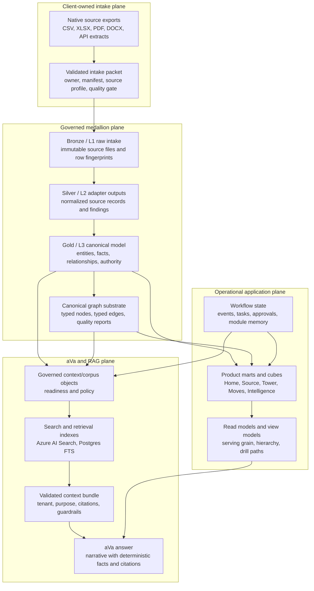
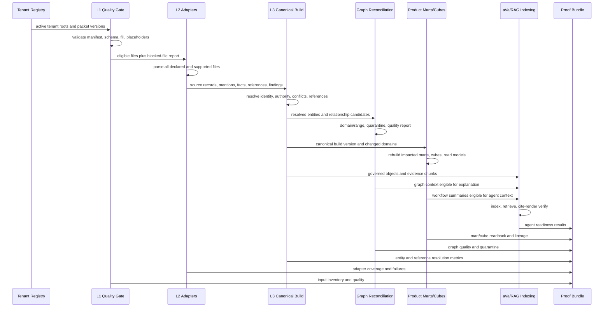
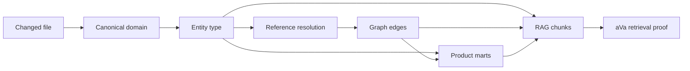
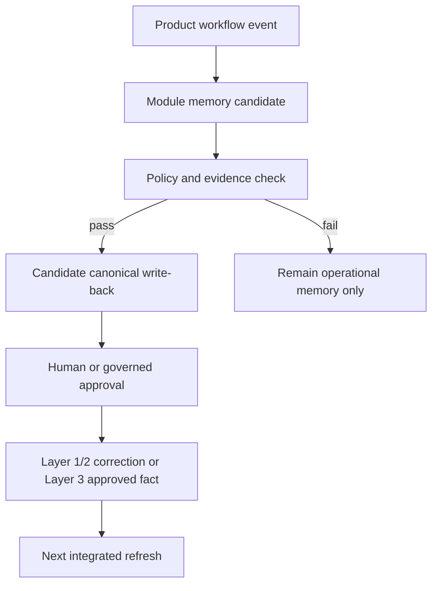
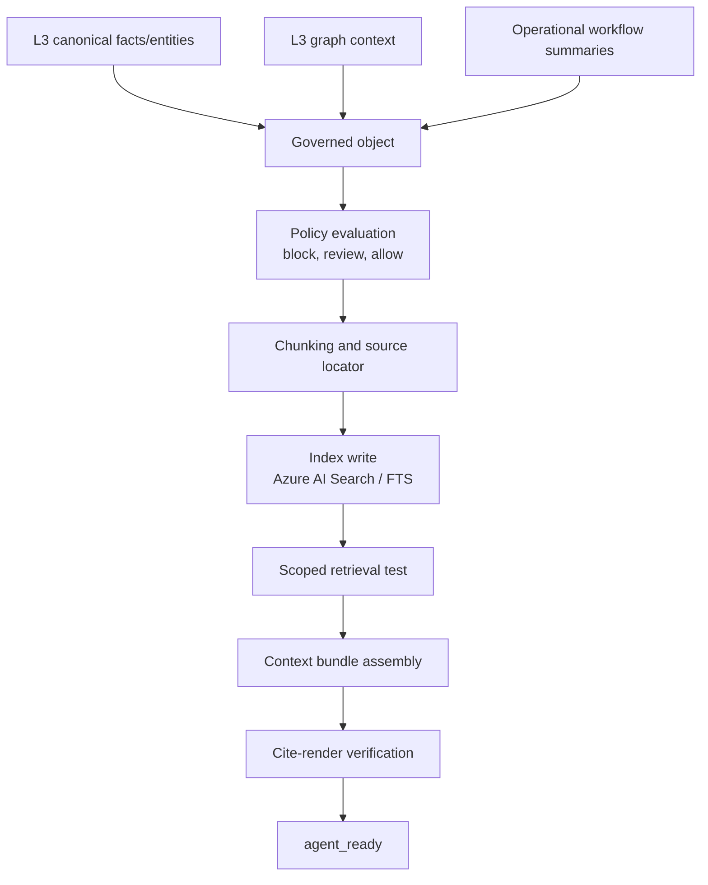

# Integrated Data Engineering Design

Status: review candidate, amended by Claude Code. The sections under **Claude Code Design Delta**
describe work that is merged and deployed. Everything else remains design-only and approves no
data-plane load, registry activation, product routing change, graph activation, index refresh, or
live-client claim.

## Purpose

This document defines the target data-engineering design for AbarVa's integrated enterprise data
stack. It is meant to be reviewed by engineering agents and humans before more implementation work
continues.

The design has one central rule:

> Layer 3 integrates enterprise truth. Product marts, workflow stores, cubes, and RAG indexes are
> downstream serving layers. They may denormalize, cache, and operate, but they must not become the
> source of truth.

This document extends, but does not replace,
`docs/architecture/ENTERPRISE_INFORMATION_ARCHITECTURE.md`. If the two disagree, the Enterprise
Information Architecture wins until amended.

## Executive Summary

AbarVa needs three connected planes:

1. **Governed medallion plane**: intake files become normalized records, then integrated canonical
   entities, facts, and relationships.
2. **Operational application plane**: workflows, approvals, events, tasks, module memory, read
   models, and cubes serve the product experience.
3. **aVa / RAG plane**: governed context, corpus, indexes, retrieval bundles, and citation proof
   serve agent answers.

The planes are connected by explicit contracts and build manifests. They are not interchangeable.
The operational plane cannot repair a weak canonical layer. The RAG plane cannot invent truth when
the canonical layer is missing entities or unresolved references. Product-specific read models are
allowed, but only as projections from the canonical truth and governed workflow state.

## Claude Code Design Delta

This section reconciles the design above with the design Claude Code has been building and, in two
cases, has already shipped. It exists so a reader does not have to hold two documents in their head
and guess which one describes reality.

**The two designs agree on the shape.** Four layers, medallion crosswalk, canonical as source of
truth, products as projections, deterministic numbers with models explaining rather than
calculating. Nothing below disputes that. What differs is the granularity of the product-projection
contract, the definition of a conflict, and — most importantly — which parts are written down versus
running.

### 1. One dimension registry, not one mart contract per product

**This document** gives each mart its own grain and drill path: a Source example, a Home example, a
Tower example, each declaring `projection_name`, `row_grain`, `source_domains`, and so on.

**Claude Code's design** puts a single registry underneath all of them. One list covers all
twenty-six canonical object types; each entry declares the attribute that names an instance, the
advisory section it answers, and — the load-bearing field — the `products[]` that consume it. Adding
a reader is an entry in a list, not a new pipeline.

The reason is the failure mode this whole exercise exists to fix. Today there are three parallel
supply chains: Source has its adapters, Tower has `project-tower-mart.ts` plus ten `ingest-*.ts`
adapters feeding `consumption.tower_*_v` views, and Home had tables with no reader at all. A design
where each product declares its own mart contract is one honest step from becoming the fourth.

**These are not exclusive, and the synthesis matters more than either.** The registry is the spine;
per-mart grain declarations sit on top of it wherever a genuine drill path is required — Tower spend
by cost basis, Source contract portfolio by renewal. But where a product needs counts, named
entities, and evidence status (Home, Intelligence), the shared projection _is_ the whole answer, and
giving it a bespoke mart would recreate the problem.

Status: **shipped.** `scripts/data-build/refresh-home-landscape.ts`, twenty-six dimensions, consumed
by Home and Intelligence, with Moves and Tower named as future consumers in the same list.

### 2. `CONFLICT` is too blunt — facts need a basis

**This document** defines `CONFLICT` as "sources disagree → do not quote; surface decision needed."

That rule discards the most useful thing the data can say. A client workbook declares annual spend of
$44M; metered cloud cost reports $51M. Neither is wrong — one is a budget, the other is consumption,
and the 16% gap is the finding. Under the rule as written, the metric is marked `CONFLICT` and never
quoted.

**Claude Code's amendment:** every canonical fact carries `basis` — `declared`, `observed`, or
`derived`. `CONFLICT` then means _two sources of the same basis disagree_, which is a real problem.
Two different bases differing is `VARIANCE`, and it is the answer rather than the error.

| Status       | Amended meaning                                           |
| ------------ | --------------------------------------------------------- |
| `AGREE`      | Multiple sources, same basis, same value                  |
| `ONE_SOURCE` | One source asserts the value                              |
| `CONFLICT`   | Same basis, sources disagree — do not quote               |
| `VARIANCE`   | Different bases differ — quote both, and quote the gap    |
| `ABSENT`     | No source asserts the value — show the gap, do not invent |

Status: **shipped.** `FactBasis` on `SourceAuthority`, gate `validate:fact-basis`, 5,553 canonical
records all currently `declared`. Nothing carries two bases yet because the ten telemetry collectors
still write to `public.tower_*` rather than canonical; the gate reports that honestly rather than
implying the capability is exercised.

### 3. Readback must happen before commit, not after

**This document** requires `readback_assertion`: "persisted equals readback, filtered by build."

**Amendment:** the readback belongs _inside the writing transaction, before commit_. A readback after
commit detects a bad write. It does not prevent one, and by the time it fires the half-written pack
is already the newest pack a product will read.

Status: **shipped** in the landscape projector — a count mismatch throws, the transaction rolls back,
and the previous build stays newest.

### 4. Counts alone are not proof — acceptance must require names

The first run of the landscape projector returned **every count correctly and every name empty**.
Canonical attributes are `CanonicalValue` wrappers, so reading `attributes[key]` yields an object
rather than a string, and name extraction silently produced nothing.

A proof bundle asserting record counts would have passed. The surface would have rendered a fully
populated landscape with no content in it.

**Amendment to Proof and Acceptance Criteria:** add a required question — _do the counts carry
names?_ — answered by sample entities per dimension. `804 applications` is an inventory total;
`804 applications, including Epic Hyperspace and Kronos` is a landscape, and only the second can be
checked by a human who knows the client.

### 5. Record count and distinct-name count are different numbers

**Amendment:** every projection reports both. On relationship-derived dimensions they differ by
nearly threefold — 825 relationship rows naming roughly 300 distinct systems. Publishing 825 as
"systems" inflates the estate by a factor of three using a number that came from a real table, which
is exactly the kind of error that survives review.

This is also the honest reading of the entity-resolution numbers: of the reduction from 9,676 raw
rows to 5,553 canonical records, only about 196 are genuine entity merges. The rest is relationship
rows collapsing by origin name. The mechanism is proven; the capability is not yet delivered.

Status: **shipped** as a reported field; entity-resolution coverage itself remains open.

### 6. Status of Slice S5 — and a finding this document does not contain

The roadmap lists **S5: Home/Tower/Moves projection fanout** as a future slice. Current state:

| Product          | Reads canonical? | Detail                                                            |
| ---------------- | ---------------- | ----------------------------------------------------------------- |
| **Source**       | Yes              | Pre-existing; the only one that did                               |
| **Home**         | Yes — shipped    | PR #6462, merged and deployed                                     |
| **Intelligence** | Yes — shipped    | PR #6464, merged and deploying                                    |
| **Moves**        | No               | Reads `program_*` operational tables                              |
| **Tower**        | No               | Reads `consumption.tower_*_v`, fed by its own ten ingest adapters |

The finding this document does not contain, and which is worse than the anti-patterns it does list:
**Intelligence rendered no client data at all.** `enterprise-landscape-view-model.ts` is 661 lines
with zero database calls. One tenant received hand-authored sections naming specific platforms and
carrying specific maturity scores; every other tenant received `buildGenericSections`, which emits
sentences like _"the section is ready for client-specific evidence"_ — formatted exactly like an
assessment, under the heading CURRENT STATE ASSESSMENT.

The listed anti-patterns cover a product adapter bypassing Layer 3. This was a surface with no data
path at all, and it is the more dangerous shape: an empty screen announces itself, while a full one
whose content came from a file someone wrote is indistinguishable, to a reader, from a client fact.

### 7. Design-only versus running

**This document** states it is design-only and approves no load, routing change, or live claim. That
is the right posture for a design document and is not a criticism.

It does mean the two documents describe different things, and the difference should be stated
plainly rather than blurred:

| State               | Meaning                                   | Home / Intelligence      |
| ------------------- | ----------------------------------------- | ------------------------ |
| Designed            | Written down and reviewable               | Yes                      |
| Code proven         | Dry-run passes, typecheck and gates clean | Yes                      |
| Merged and deployed | Running in the product                    | Yes                      |
| **Data loaded**     | **The projector has run in write mode**   | **No — pending ACA Job** |
| Live-proven         | Signed-in surface renders it, captured    | No                       |

Until the projector runs as an ACA Job with write approval, Home shows "not available" and
Intelligence falls back to the authored view model. **Merged and deployed is not loaded.** The
distinction is the same one this document already draws for RAG — loaded, indexed, retrievable,
cited — applied to product projections.

## Design Goals

| Goal                                 | Requirement                                                                                                                                   |
| ------------------------------------ | --------------------------------------------------------------------------------------------------------------------------------------------- |
| Integrate all client-supplied files  | Every registry-active intake file is classified, mapped, represented, blocked with a reason, or explicitly declared out of scope by contract. |
| Collapse mentions into real entities | Canonical record count should normally be lower than source mention count when duplicate mentions exist.                                      |
| Resolve references to IDs            | Cross-file references must resolve to canonical IDs, not remain plain strings in gold-layer truth.                                            |
| Preserve lineage                     | Every canonical entity, fact, edge, cube row, index chunk, and answer citation must trace to source file, row, field, build, and authority.   |
| Support product workflows            | Products get marts, cubes, task stores, approval state, event logs, and module memory, but these are downstream operating layers.             |
| Support aVa agents safely            | Agents consume only governed context bundles with readiness, retrieval, and citation proof.                                                   |
| Refresh incrementally                | Changed files trigger an impact graph: affected adapters, entities, references, marts, cubes, indexes, and proofs.                            |
| Scale                                | The same contracts work for 26 sheets, thousands of rows, or large corporate extracts.                                                        |
| Avoid rework                         | Every build has a manifest, idempotency key, dependency graph, proof bundle, rollback behavior, and review checklist.                         |

## Conceptual Architecture



## Medallion Crosswalk

| Common medallion name | AbarVa layer                       | Owner                          | Stores                                                                                            | Must not do                                                      |
| --------------------- | ---------------------------------- | ------------------------------ | ------------------------------------------------------------------------------------------------- | ---------------------------------------------------------------- |
| Raw / Bronze          | Layer 1 client intake              | Data owner and intake registry | Original files, manifests, hashes, row fingerprints, source owner, as-of date, sensitivity        | Normalize into product shapes or infer identity                  |
| Silver                | Layer 2 source adapters            | Adapter framework              | Parsed rows, typed source records, mapping findings, quarantine reasons, lineage                  | Persist final IDs, choose source of record, write product tables |
| Gold                  | Layer 3 canonical enterprise model | Canonical build and governance | Stable entities, facts, declared authority, typed relationships, graph substrate, quality reports | Read from product state, store product-only presentation fields  |
| Serving / Platinum    | Layer 4 products                   | Product projection builders    | Marts, cubes, read models, workflow summaries, drill paths                                        | Become source of truth or read L1/L2 directly                    |
| Agent-ready           | aVa / RAG plane                    | Context/corpus governance      | Governed objects, chunks, indexes, retrieval bundles, citations                                   | Feed raw or ungoverned rows to agents                            |

## Layer Contracts

### Layer 1: Intake and Raw Evidence

Layer 1 is what the client or demo-data factory supplies. It is organized by data ownership, not by
our internal schema.

Required properties:

| Property          | Contract                                                                                   |
| ----------------- | ------------------------------------------------------------------------------------------ |
| Packet identity   | `tenant_key`, `intake_id`, `packet_id`, `template_version`, `source_owner`, `as_of_date`   |
| File identity     | canonical path, original filename, content hash, row count, schema hash                    |
| Template contract | manifest-declared required files, required columns, column order, optional lineage columns |
| Sensitivity       | classification, allowed use, synthetic/real status, public-safe cover-name status          |
| Quality output    | blockers, warnings, mapped rows, unmapped files, fill rate, hollow-row checks              |

Rules:

- A raw file is never runtime truth.
- A workbook, packet, or folder does not imply tenancy. Tenancy comes from the tenant input registry.
- Every file is processed through the same inventory pass. Files cannot disappear because a product
  does not care about them yet.
- If a file is not integrated, the build records why: missing adapter, off-contract schema, blocked
  quality, intentionally out of scope, or unsupported source type.

### Layer 2: Source Adapters and Silver Normalization

Layer 2 is deterministic parsing and mapping. It is disposable and re-runnable.

Adapter input:

| Field              | Meaning                                                              |
| ------------------ | -------------------------------------------------------------------- |
| `tenant_key`       | Registry-declared tenant                                             |
| `packet_id`        | Input packet version                                                 |
| `source_file`      | Layer 1 file path                                                    |
| `source_profile`   | CSV, XLSX, document, API extract, or known enterprise-system profile |
| `mapping_profile`  | Source-to-canonical mapping version                                  |
| `parser_version`   | Code version for parsing                                             |
| `expected_domains` | Canonical domains expected from this file                            |

Adapter output:

| Output            | Meaning                                                                             |
| ----------------- | ----------------------------------------------------------------------------------- |
| Source records    | Typed row-level records with upstream lineage                                       |
| Source facts      | Candidate facts before authority resolution                                         |
| Source mentions   | Mentions of entities, not yet canonical entities                                    |
| Source references | Cross-file references requiring ID resolution                                       |
| Findings          | Mapping gaps, schema defects, suspicious placeholders, generated-ID-in-name defects |
| Quarantine        | Records that cannot proceed without code, mapping, or data remediation              |

Layer 2 does not own:

- canonical IDs
- deduplication across files
- fact authority
- product table grain
- workflow decisions
- retrieval indexes

### Layer 3: Canonical Enterprise Model

Layer 3 is where integration happens. The canonical layer must not be a 1:1 row copy. A real entity
mentioned in many files becomes one canonical entity with many source mentions.

Canonical object identity:

```text
canonical_entity_key = tenant_key + object_type + normalized_declared_identity
```

Not allowed:

```text
tenant_key + file_name + source_row_number
```

The row number is lineage. It is not identity.

Layer 3 stores:

| Store                     | Purpose                                                                |
| ------------------------- | ---------------------------------------------------------------------- |
| Canonical entity registry | One row per distinct entity, with stable typed ID and identity ledger  |
| Source mention ledger     | Every source-file row or field that mentioned the entity               |
| Canonical fact store      | Values, source of record, confidence, conflict status, effective dates |
| Relationship dictionary   | Allowed verbs, domain/range, required evidence, cardinality            |
| Relationship edges        | Resolved `source_entity_id -> target_entity_id` edges                  |
| Graph quality reports     | Orphans, quarantines, ambiguous aliases, wrong-type references         |
| Authority registry        | Which source owns a metric, money value, status, or classification     |

Layer 3 success metrics:

| Metric                          | Meaning                                          |
| ------------------------------- | ------------------------------------------------ |
| `source_mentions_represented`   | Number of source mentions captured from L1/L2    |
| `distinct_entities_accepted`    | Number of canonical entities created or updated  |
| `duplicate_mentions_collapsed`  | Source mentions minus distinct accepted entities |
| `reference_mentions`            | Cross-file references requiring resolution       |
| `references_resolved`           | References resolved to canonical IDs             |
| `reference_resolution_rate`     | `references_resolved / reference_mentions`       |
| `facts_with_declared_authority` | Facts whose source of record is known            |
| `conflicting_facts_blocked`     | Conflicts that did not flow into products        |
| `quarantined_relationships`     | Relationships withheld from graph or products    |

### Layer 4: Product Marts, Cubes, and Read Models

Layer 4 is serving, not integration. Each product can have a different grain because workflows need
different shapes.

Allowed Layer 4 stores:

| Store          | Examples                                                               | Source                                     |
| -------------- | ---------------------------------------------------------------------- | ------------------------------------------ |
| Product mart   | Source vendor portfolio, Home enterprise summary, Tower budget rollup  | L3 plus governed workflow state            |
| Cube view      | contract cube, vendor cube, scope cube, spend cube, opportunity cube   | L3 projection build with build provenance  |
| Workflow state | sourcing event status, gate approval, task assignment, review comments | Product workflow tables                    |
| Module memory  | decisions, artifacts, assumptions, learning writebacks                 | Governed write-back workflow               |
| Outcome ledger | projected, committed, measured, realized, attested value               | Deterministic facts plus approved evidence |

Not allowed:

- Product code reading `datasets/tenant-inputs` directly.
- Product code resolving canonical identity from strings independently.
- Cube rows without `build_version` or equivalent provenance.
- Readback checks that count stale rows without build scoping.
- Product metrics quoted without the owning lineage report.

### aVa and RAG Plane

The aVa/RAG plane is a separate readiness pipeline. It does not replace L3 or L4.

State machine:

```text
loaded -> committed -> indexed -> retrievable -> cite_render_verified -> agent_ready
```

Agent-ready requirements:

| Requirement     | Meaning                                                            |
| --------------- | ------------------------------------------------------------------ |
| Governed object | Conforms to context/corpus policy                                  |
| Provenance      | Source file, row, chunk, build, and authority are available        |
| Classification  | Tenant, sensitivity, client-safe cover identity, policy status     |
| Indexing        | Azure AI Search and/or Postgres FTS index has the object           |
| Retrieval       | A scoped query can retrieve it for the intended tenant and purpose |
| Citation        | The final answer can render a visible citation to the exact source |
| Guardrails      | Unsupported claims are blocked or caveated                         |

Agents may explain and synthesize. They may not calculate spend, invent facts, or use non-ready
objects.

## Integrated Refresh Flow

Every refresh should produce one build manifest that spans all planes. A build can be dry-run,
write, readback, or rollback, but it should always have the same shape.



## Incremental Refresh Design

Incremental does not mean "load one product file." It means the build only recomputes impacted
domains while preserving integrated guarantees.

### Change Detection

Each build records:

| Item                          | Purpose                                                               |
| ----------------------------- | --------------------------------------------------------------------- |
| `input_source_version`        | Git SHA, packet version, Blob version, or source-system extraction ID |
| `file_fingerprint`            | Detect changed file content                                           |
| `schema_fingerprint`          | Detect shape changes separately from row changes                      |
| `row_fingerprint`             | Support row-level diff and lineage                                    |
| `mapping_profile_version`     | Rebuild when mapping logic changes                                    |
| `adapter_version`             | Rebuild when parser logic changes                                     |
| `canonical_contract_version`  | Rebuild when object/fact contract changes                             |
| `projection_contract_version` | Rebuild when mart/cube grain changes                                  |
| `rag_policy_version`          | Recheck agent readiness when governance changes                       |

### Dependency Graph



Examples:

| Change                          | Minimum impacted rebuild                                                                                         |
| ------------------------------- | ---------------------------------------------------------------------------------------------------------------- |
| Vendor contract row changes     | Vendor, contract, spend facts, supported applications, Source marts, vendor/contract cubes, related RAG objects  |
| Application row changes         | Application entity, owner references, vendor references, Home/Tower/Source scope marts, graph edges, RAG context |
| Business function name changes  | Function identity ledger, application/function refs, org ownership refs, all dependent drill paths               |
| Relationship dictionary changes | Relationship validation, graph quality report, graph substrate, any graph-backed product projection              |
| Context policy changes          | Agent-ready validation, index eligibility, retrieval and cite-render proof                                       |

### Write Phases

| Phase                    | Mode               | Gate                                                      |
| ------------------------ | ------------------ | --------------------------------------------------------- |
| Inventory                | Read-only          | No gate beyond repo safety                                |
| Dry-run integration      | Read-only          | Must pass before write                                    |
| L3 write                 | Mutating ACA Job   | Requires approved data-build scope and idempotency key    |
| L3 readback              | Read-only ACA Job  | Required before downstream claims                         |
| L4 projection refresh    | Mutating ACA Job   | Requires same build version or explicit dependency reason |
| L4 readback              | Read-only ACA Job  | Must assert persisted equals readback by build            |
| RAG index refresh        | Mutating index job | Requires governed object eligibility and index scope      |
| Retrieval/citation proof | Read-only          | Required before agent-ready claim                         |

## Canonical Entity Resolution

Entity resolution must be deterministic first and reviewable when human judgment is needed.

Resolution order:

1. Existing canonical ID from source.
2. Approved identity ledger alias.
3. Type-specific normalized natural key.
4. Source-system ID scoped by source system and entity type.
5. Quarantine as ambiguous or missing identity.

Wrong fixes:

- Creating hollow entities only to satisfy an edge.
- Treating generated IDs in name columns as meaningful names.
- Retyping by writing the wrong object into the wrong dimension.
- Letting a product surface carry local aliases that L3 does not know.

Correct fixes:

- Add evidence-backed object rows in the right domain.
- Add approved aliases against existing IDs.
- Retype the relationship when the endpoint type is wrong.
- Quarantine unresolved edges until evidence or approval exists.

## Reference Resolution

Cross-file references must become IDs before they are canonical truth.

| Reference form                      | Treatment                                                  |
| ----------------------------------- | ---------------------------------------------------------- |
| Exact canonical ID                  | Resolve directly                                           |
| Source-system ID                    | Resolve through source-system identity map                 |
| Approved alias                      | Resolve through identity ledger                            |
| Name match with one candidate       | Resolve if domain and tenant match                         |
| Name match with multiple candidates | Quarantine as ambiguous                                    |
| Generated ID in name field          | Block as placeholder or source-key leakage                 |
| Endpoint typed to wrong domain      | Quarantine or retype the relationship                      |
| Endpoint genuinely absent           | Catalogue from evidence or keep quarantined; do not invent |

## Fact Authority

Facts are not all equal. A value from a planning workbook and a value from a ledger may both be
useful, but only one can be source of record for a given metric.

Authority output:

| Status       | Meaning                            | Product behavior                                     |
| ------------ | ---------------------------------- | ---------------------------------------------------- |
| `AGREE`      | Multiple sources assert same value | May quote with lineage                               |
| `ONE_SOURCE` | One source asserts value           | May quote only with one-source caveat where required |
| `CONFLICT`   | Sources disagree                   | Do not quote; surface decision needed                |
| `ABSENT`     | No source asserts value            | Do not invent; show gap                              |

Money, counts, dates, performance metrics, and realized value must be deterministic. Models may
explain the numbers, but must not calculate them.

## Product Mart and Cube Design

Each product projection declares:

| Field                         | Requirement                                  |
| ----------------------------- | -------------------------------------------- |
| `projection_name`             | Stable mart/cube name                        |
| `projection_contract_version` | Versioned grain and fields                   |
| `source_build_version`        | L3 build version used                        |
| `input_source_version`        | L1/L2 source version used                    |
| `tenant_scope`                | Registry-declared tenants only               |
| `row_grain`                   | One row per what                             |
| `source_domains`              | Canonical domains consumed                   |
| `workflow_domains`            | Operational state consumed                   |
| `build_run_id`                | Data-build job run                           |
| `lineage_basis`               | Counting basis for quoted metrics            |
| `readback_assertion`          | Persisted equals readback, filtered by build |

### Source Example

| Cube or mart         | Grain                                    | Required drill path                                                   |
| -------------------- | ---------------------------------------- | --------------------------------------------------------------------- |
| Vendor portfolio     | One row per vendor-contract relationship | vendor -> contract -> service -> application/function -> spend        |
| Contract portfolio   | One row per contract                     | contract -> vendor -> scope -> spend -> renewal/risk                  |
| Contract scope       | One row per contract-scope item          | contract -> system/function/service -> confidence -> source           |
| Spend observation    | Declared observation grain               | tenant -> vendor -> contract -> period/basis -> amount                |
| Opportunity pipeline | One row per sourcing opportunity         | opportunity -> category -> vendor/contract -> value basis -> evidence |

### Home Example

| Mart                   | Grain                                 | Required drill path                                                              |
| ---------------------- | ------------------------------------- | -------------------------------------------------------------------------------- |
| Enterprise summary     | One tenant snapshot per build         | tenant -> function -> capability -> application -> vendor/contract -> risk/value |
| Executive insight list | One insight per deterministic finding | insight -> source metric/fact -> affected entity -> source evidence              |
| Data quality panel     | One domain per tenant                 | domain -> files -> rows -> mapped fields -> gaps                                 |

### Tower Example

| Mart              | Grain                                                      | Required drill path                                           |
| ----------------- | ---------------------------------------------------------- | ------------------------------------------------------------- |
| Spend portfolio   | One cost observation per basis                             | function/vendor/application -> cost basis -> source authority |
| AI value ledger   | One value hypothesis or realized metric per evidence basis | use case -> metric -> source -> status                        |
| Technology estate | One application/system entity                              | app -> function -> owner -> vendor -> risk -> spend           |

## Operational Application Plane

Operational stores are necessary for a full-stack application. They should be treated as workflow
state, not enterprise truth.

| Store              | Purpose                                      | Feeds L3?                                |
| ------------------ | -------------------------------------------- | ---------------------------------------- |
| Task queue         | Work assignment and status                   | Only through approved write-back         |
| Approval ledger    | Human decisions, gates, sign-offs            | Yes, as evidence-backed decisions        |
| Event log          | User and system events                       | Yes, if declared as source events        |
| Module memory      | Product-created observations and assumptions | Candidate write-back only                |
| Outcome ledger     | Value lifecycle state                        | Yes, when supported by declared evidence |
| Artifact store     | Generated docs, packets, exports             | Evidence if governed and cited           |
| Notification state | Emails, reminders, workflow nudges           | No, operational only                     |

Write-back path:



## aVa / RAG Design

The RAG layer has its own stores and proofs because an answer needs more than a cube row.



RAG readiness metrics:

| Metric                     | Meaning                                         |
| -------------------------- | ----------------------------------------------- |
| `objects_loaded`           | Governed objects created                        |
| `objects_policy_allowed`   | Objects not blocked by policy                   |
| `objects_indexed`          | Objects present in search/FTS index             |
| `retrieval_queries_passed` | Tenant-scoped queries retrieve intended objects |
| `citation_render_passed`   | Final answer can show exact citation            |
| `agent_ready_objects`      | Objects that passed all states                  |

No product should claim an aVa answer is ready because L3 or L4 refreshed. L3/L4 refresh is input
eligibility. Agent readiness requires index and citation proof.

## Build Manifest

Every integrated run writes a manifest:

```json
{
  "build_version": "integrated-refresh-<sha>-<timestamp>",
  "input_source_version": "<git-or-packet-version>",
  "idempotency_key": "<stable-key>",
  "tenant_scope": ["registry-active-tenant-keys"],
  "image_digest": "acr...@sha256:<digest>",
  "phases": [
    "l1_quality",
    "l2_adapters",
    "l3_canonical",
    "graph_reconciliation",
    "l4_projections",
    "rag_indexing",
    "readback",
    "lineage"
  ],
  "outputs": {
    "l1_inventory": "<path-or-blob>",
    "adapter_report": "<path-or-blob>",
    "canonical_summary": "<path-or-blob>",
    "graph_quality": "<path-or-blob>",
    "projection_readback": "<path-or-blob>",
    "rag_readiness": "<path-or-blob>",
    "lineage_report": "<path-or-blob>"
  }
}
```

## Proof and Acceptance Criteria

The integrated refresh is not complete until the proof bundle answers these questions.

| Question                         | Required proof                                                                          |
| -------------------------------- | --------------------------------------------------------------------------------------- |
| Which files were considered?     | L1 inventory from registry-active roots                                                 |
| Which files were integrated?     | L2 adapter coverage by file and domain                                                  |
| Which files were blocked?        | Blocked-file report with reason and owner                                               |
| Did rows become entities?        | L3 mention/entity collapse metrics                                                      |
| Did references resolve?          | Reference resolution rate and unresolved breakdown                                      |
| Did graph materialize honestly?  | Graph nodes/edges written, quarantine count, no orphan edges beyond expected quarantine |
| Did marts/cubes refresh?         | Persisted rows equal build-scoped readback rows                                         |
| Do metrics reconcile to sources? | Source lineage report for quoted metrics                                                |
| Did products read current data?  | Product readback or signed-in proof for affected surfaces                               |
| Did RAG refresh?                 | Index, retrieval, and cite-render proof                                                 |
| Is tenant isolation intact?      | RLS/readback proof with zero cross-tenant visibility                                    |

## Commands and Jobs

Local report-only commands:

```bash
npm run audit:canonical-tenant-inputs
npm run audit:canonical-data-build
npm run build:candidate-version
npm run data-build:integrated-layer-refresh -- --tenant <tenant-key> --out-dir <tmp-dir>
npm run audit:integrated-layer-refresh-inventory -- --out-dir <tmp-dir>
npm run validate:context-corpus:agent-readiness
```

Mutating data-plane commands must run as ACA Jobs:

```bash
npm run ops:aca-job -- \
  --image acrabarvalab001.azurecr.io/abarva/web@sha256:<digest> \
  --script data-build:runtime-layer-refresh \
  --env RUNTIME_LAYER_REFRESH_WRITE=1 \
  --env RUNTIME_LAYER_REFRESH_WRITE_APPROVED=true \
  --env RUNTIME_LAYER_REFRESH_BUILD_VERSION=<build-version> \
  --env RUNTIME_LAYER_REFRESH_INPUT_SOURCE_VERSION=<input-version> \
  --env RUNTIME_LAYER_REFRESH_IDEMPOTENCY_KEY=<idempotency-key> \
  --out-dir <proof-dir>
```

Product projection refreshes use the same image digest, build version, and idempotency family.

## Anti-Patterns

These are design failures, even when tests pass:

- "Rows integrated" is the main success metric.
- Gold-layer keys end with row ordinals.
- A product adapter bypasses L3 to make one screen look correct.
- A cube readback does not filter by build.
- A RAG answer uses loaded data that was not indexed and cite-render verified.
- A generated placeholder row is created only to make a graph edge resolve.
- A file is ignored because no product currently consumes it.
- A source metric is quoted from a stale canary or legacy table.
- A workflow state table becomes the source of enterprise fact without write-back review.

## Review Checklist for Claude Code

Claude Code should review this design against the repository and answer with specific file and line
evidence where possible.

1. Does this design preserve the four-layer constitution?
2. Does any current product route still read L1 or L2 directly?
3. Does the canonical build now represent distinct entities, not row ordinals?
4. Are source mentions and canonical entities both retained with lineage?
5. Are cross-file references resolved to IDs before becoming canonical truth?
6. Are fact-authority conflicts blocked from quoted metrics?
7. Are product marts and cubes build-scoped, with stale rows impossible to count as current?
8. Are operational workflow stores correctly separated from canonical facts?
9. Are aVa/RAG readiness states distinct from L3/L4 refresh states?
10. Is there one integrated build manifest that can show what refreshed and what did not?
11. Can the design process all registry-active files, including files no product uses today?
12. Are mutating steps restricted to ACA Jobs with digest-pinned images and proof bundles?
13. Which existing scripts already satisfy this design?
14. Which existing scripts violate or only partially satisfy it?
15. What is the smallest next PR sequence to make implementation match this design?

## Implementation Roadmap

| Slice                                  | Outcome                                                       | Acceptance                                                                        |
| -------------------------------------- | ------------------------------------------------------------- | --------------------------------------------------------------------------------- |
| S1: design review                      | This document accepted or amended                             | Claude Code and Codex review responses reconciled                                 |
| S2: build manifest hardening           | One manifest spans L1/L2/L3/L4/RAG states                     | Dry-run produces complete manifest and no report churn                            |
| S3: L3 identity/reference completion   | Entity IDs and references are first-class outputs             | Distinct entities lower than mentions where duplicates exist; refs resolved by ID |
| S4: product projection registry        | Every mart/cube declares grain, sources, build scope, lineage | Product readback fails on stale unscoped rows                                     |
| S5: Home/Tower/Moves projection fanout | Non-Source products get governed L4 projections               | Signed-in surfaces read L4/L3, not L1/L2                                          |
| S6: RAG/index refresh job              | aVa context objects indexed and cited by same build           | Loaded, indexed, retrievable, cited counts reported separately                    |
| S7: end-to-end proof packet            | One proof answers all acceptance questions                    | Review packet can be inspected without chat history                               |

## Non-Goals

- This document does not choose a graph database.
- This document does not approve live-client claims.
- This document does not approve registry activation or tenant promotion.
- This document does not require products to share the same serving grain.
- This document does not require agents to read product cubes directly.

## Bottom Line

The design is not "load a vendor file, then fix Source, then fix Home." The design is:

1. Inventory every active input.
2. Adapt every supported file.
3. Integrate every represented mention into Layer 3 entities, facts, authority, and relationships.
4. Project product-specific operating views from Layer 3 plus governed workflow state.
5. Build agent-ready context from governed objects, indexes, retrieval, and citation proof.
6. Prove each state independently.

That is the line between a scalable data engineering platform and a collection of product adapters.
