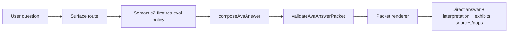

# Ava Answer Architecture

Ava now has one answer contract and one packet validation layer.

The design principle is simple: data proves, graph connects, metrics report, chunks explain, and surface voice controls how the same packet is rendered.
