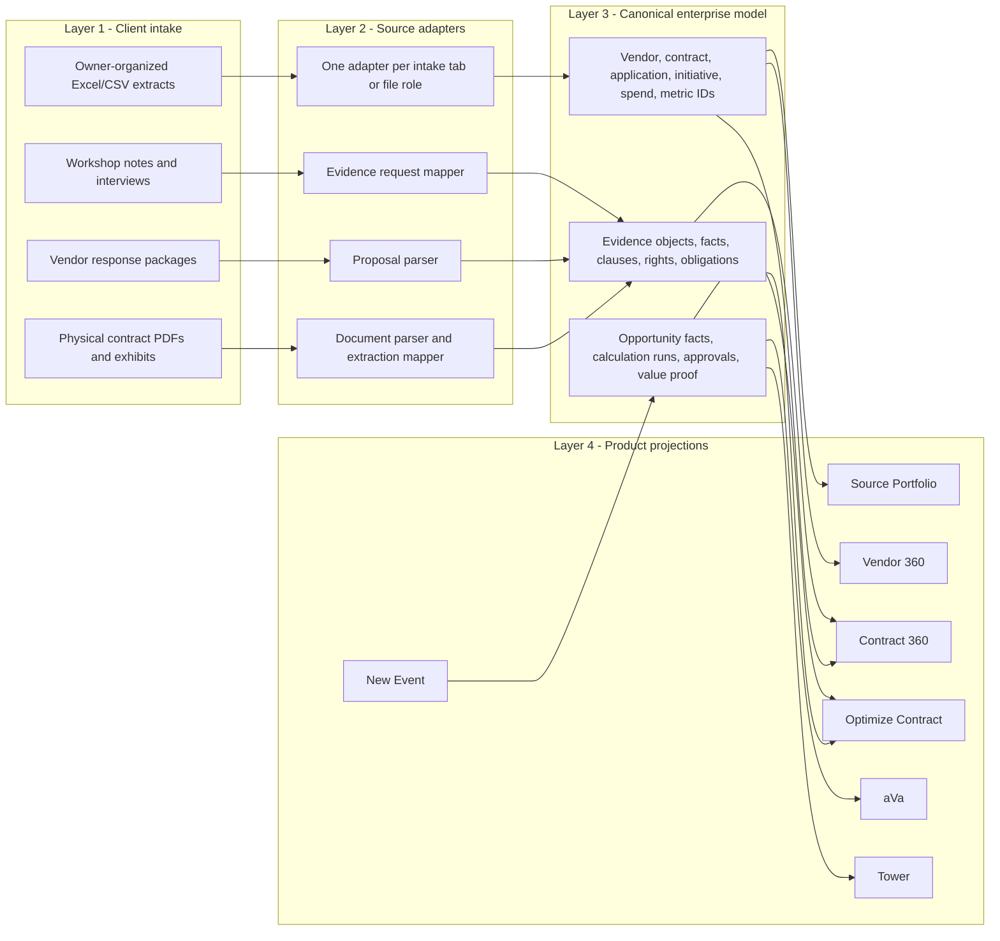
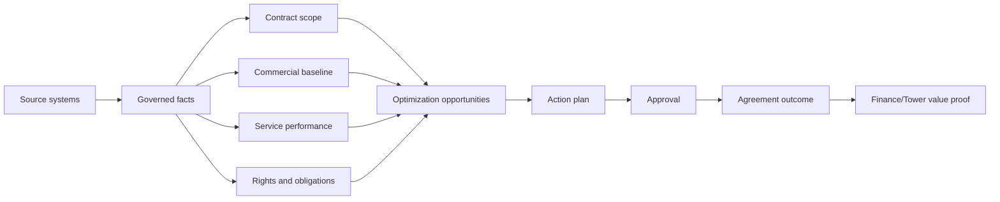
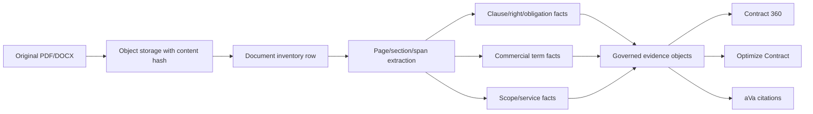
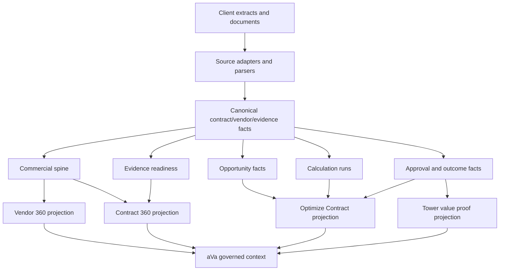

# Source Vendor Value Execution Packet — SVV01/SVV02

Date: 2026-08-12
Status: `candidate-for-review`
Scope: Source holistic IA and Source evidence/data contract
Program: `SOURCE_VENDOR_VALUE_EXCELLENCE_PROGRAM.md`

This packet turns the Source Vendor Value Excellence Program into the first execution-ready
contract. It is deliberately detailed because the failure mode to avoid is building another
screen-by-screen patch set without a shared operating model.

It covers two P0 backlog items:

- `SVV01` — Holistic Source Vendor Value Design.
- `SVV02` — Source Data and Evidence Contract.

It does not claim runtime readiness, QA pass, data load pass, or signed-in product proof. It defines
what must be built, what evidence must exist, and how each slice will be validated before any
product claim is made.

---

## 1. Product Problem

Technology vendor spend is hard to optimize because the proof is split across systems that do not
agree with each other:

- contracts know rights, obligations, terms, notice windows, credits, scope, and pricing language;
- finance knows actual spend, budget, payment, accruals, and confirmed realization;
- procurement knows supplier records, sourcing events, proposals, PO structure, and commitments;
- ITSM knows tickets, severity, SLA performance, service reviews, and recurring pain;
- SaaS, cloud, and engineering platforms know consumption, entitlement, seats, storage, and usage;
- interviews and workshops know business intent, constraints, disputes, and operating context.

Traditional procurement, CLM, ERP, and workflow tools own slices of that evidence. They rarely turn
the full cross-system record into a defensible action: which contract to optimize first, which
levers are provable, what evidence is missing, what to ask the vendor for, what leadership should
approve, and what value Finance later confirms.

Source must solve that whole problem. It is not a document repository, a generic sourcing workflow,
or a contract Q&A bot. It is the governed conversion of fragmented evidence into vendor leverage and
realized value.

The executive promise is:

> Source shows where to act, proves what can be acted on, tells the team what to collect next,
> governs the action, and separates opportunity from realized value.

---

## 2. Market Positioning

Source is the cross-system vendor value intelligence layer.

| Market category | What they usually own | Source stance |
| --- | --- | --- |
| ERP / finance | GL, AP, payments, budgets, cost centers, purchase orders | Use as financial source of record. Do not expect ERP alone to know contract rights, service outcomes, vendor claims, or operational causality. |
| Procurement / S2P | sourcing events, suppliers, POs, approvals, bid submission workflow | Reuse as process and transaction source. Add cross-system analysis, proposal intelligence, and evidence-bound commercial strategy. |
| CLM / contract intelligence | contract documents, metadata, clauses, obligations | Reuse as document source. Add invoice, SLA, usage, benchmark, Tower, and Finance realization context. |
| ITSM / operations | tickets, incidents, service reviews, CMDB, operational telemetry | Use to prove service pressure and SLA/credit eligibility. Do not let incident counts become value without contract and finance proof. |
| Generic AI assistant | summaries and Q&A | aVa must answer from governed Source context, with explicit unknowns and structured table/chart outputs. |

This is why a client does not need to first standardize all procurement or supply-chain processes on
one ERP suite before Source becomes useful. ERP modernization can improve the future source of
record, but Source should work from controlled extracts and documents today.

---

## 3. Layered Architecture

Source must follow the enterprise information architecture:



Rules:

- Client intake is organized by data owner, not by our schema.
- Source adapters emit canonical objects and facts, never product-specific rows.
- Products read projections only.
- Any product correction flows back through intake/adapters, not direct table edits.
- Money, counts, calculation runs, and value states are deterministic; AI may explain them but not
  invent them.

---

## 4. Two Journeys, Not One

Source has two distinct operating paths. They share evidence classes and product services, but they
must not share the same workflow shell.

| Path | User intent | Correct journey | When to use |
| --- | --- | --- | --- |
| Optimize Contract | "This incumbent contract may be leaking value or needs renegotiation." | 7-stage contract optimization case | Renewal, amendment, price reset, SLA recovery, shelfware, rate-card variance, service credit recovery, negotiated improvement. |
| New Sourcing Event | "We need to run a market event or RFP." | 11-stage sourcing/RFP journey | Net-new source, rebid, replacement, competitive event, major outsourcing scope, vendor selection. |

Optimize Contract may escalate into New Event if the decision is to rebid. New Event may reference a
current contract as background evidence. That is different from forcing both journeys into one
11-stage path.

---

## 5. Surface Information Architecture

Every Source surface must answer four things quickly:

1. What question is this page answering?
2. What evidence does it use?
3. What decision or action does it enable?
4. What is missing, stale, conflicted, or not yet proven?

### 5.1 Source Portfolio / Home

Primary question:

> Where should a sourcing leader focus this week?

Required content:

- portfolio verdict in one sentence;
- top contracts/vendors/events needing action;
- renewal and deadline pressure;
- value opportunity by evidence maturity;
- open blockers and next approvals;
- links into Vendor 360, Contract 360, Optimize Contract, and New Event.

Use:

- small top summary, not oversized page headers;
- one main ranked worklist;
- compact filters;
- no debug/provider labels unless expanded.

Failure state:

- no action should appear as `$0` unless zero is finance-confirmed;
- missing evidence should appear as `Evidence required`, not hidden.

### 5.2 Vendor 360

Primary question:

> What is the vendor relationship worth, where is concentration or risk, and which contracts need
> attention first?

Required content:

- vendor-level spend, contract count, categories, functions supported, renewal exposure;
- ranked contracts by optimization fit and reason;
- relationship graph showing vendor -> contracts -> applications/functions -> evidence -> value;
- concentration and dependency indicators;
- evidence maturity by contract;
- active or recommended actions.

Use:

- ranking table for "where to act first";
- relationship graph for "what the vendor touches";
- drilldown to Contract 360;
- no vendor-specific branching logic.

Failure state:

- if a vendor has fragmented records, the UI must show the split and reconciliation need.

### 5.3 Contract 360

Primary question:

> What does this agreement cover, what does the evidence prove, and is it ready for an optimization
> case?

Contract 360 is an evidence cockpit, not the workflow. It should make the selected contract
understandable and actionable in one pass.

Recommended tabs:

| Tab | Business question | Must show | Primary data source |
| --- | --- | --- | --- |
| Story | Why does this contract matter now? | plain-English contract overview, optimization rank, evidence maturity, biggest provable levers, missing blockers | contract register, extracted contract summary, commercial spine, opportunity rows |
| Scope | What is in scope and who depends on it? | scope summary, service/product line items, applications/functions/towers, included/excluded/unknown coverage | contract PDF/SOW/order form, app mapping, service catalog |
| Economics | What did we buy and spend? | contract value, actual spend, committed value, baseline, variance, rate/quantity/payment facts | finance/AP/ERP, PO, pricing schedule, rate cards |
| Performance | Is service pressure commercially useful evidence? | SLA/incident trend, credits earned/claimed/received, service review findings, performance caveats | ITSM, SLA history, service review pack, contract SLA clauses |
| Relationship | How do systems, scope, evidence, and value connect? | interactive graph with source facts as nodes, hover/click details, no separate detached facts panel | canonical graph and evidence objects |
| Evidence | What files/facts support or block the story? | documents, extracts, facts, parser state, citations, conflicts, accepted/rejected state | file cabinet, parser outputs, evidence objects |
| Optimize | What action should be opened? | concise CTA into Optimize Contract with selected contract prefilled; evidence readiness summary | optimization readiness projection |

Design rules:

- The tab strip must be compact.
- Headers must be professional and fit the intended viewport.
- Any number displayed must be formatted as money/count/percent with readable units.
- "Value proof" must be defined on the page as finance-confirmed outcome evidence, not a synonym for
  opportunity.
- If scope rows are missing, the page must say exactly which file/source is required and which
  downstream tabs are blocked.

### 5.4 Optimize Contract

Primary question:

> What action should we take on this incumbent agreement, and what evidence makes that action
> defensible?

Optimize Contract must be a separate first-class module with a compact 7-stage case:

| Stage | User decision | Required output |
| --- | --- | --- |
| 1. Evidence readiness | Do we have enough evidence to size or act? | Evidence readiness packet with missing/blocking rows. |
| 2. Commercial baseline | What did we buy, for what period, at what baseline? | Locked baseline with included/excluded/pending inputs. |
| 3. Opportunity diagnosis | Which atomic opportunities exist? | Opportunity diagnosis with calculation lineage and overlap control. |
| 4. Commercial strategy | What should we ask for and what is the fallback? | Negotiation strategy and vendor ask list. |
| 5. Approval and outreach | Are we authorized to contact the vendor or commit action? | Human approval, rationale, and outreach pack. |
| 6. Negotiation/execution | What changed with the vendor? | Commercial outcome record, amendment/task obligations. |
| 7. Value proof | What value was actually realized? | Finance/Tower handoff with periodized proof. |

Do not show New Event intake when a contract was selected from Contract 360. The selected contract,
vendor, opportunity context, evidence state, and missing rows must be prefilled and persisted.

### 5.5 New Event 11-Stage Journey

Primary question:

> How do we take a new or replacement need to market and produce a defensible supplier decision?

The 11-stage New Event journey remains:

Strategy, Scope, RFP, Responses, Evaluation, Pricing, BAFO, Executive Decision, Selection,
Transition, Value.

Each stage uses one consistent operating pattern:

- stage goal;
- evidence table;
- files and parser state;
- intelligence panel;
- guidebook for current or next session;
- artifact/readiness state;
- approval gate and next unlock.

The stage guidebook is not help text. It is the operating manual for the next workshop:

- who attends;
- what source systems to pull from;
- what templates to use;
- what questions to ask;
- what decisions are needed;
- what output unlocks the next stage.

### 5.6 Files

Primary question:

> What has been uploaded, parsed, accepted, rejected, superseded, cited, or blocked?

Files must be row-based, not card clutter.

Required row columns:

- evidence item;
- required or optional;
- stage/case;
- source system;
- owner role;
- grain/history;
- template link;
- upload action;
- file/version;
- parser state;
- governed facts created;
- citation/index state;
- review/acceptance state;
- artifact or calculation impact;
- next action.

### 5.7 Intelligence

Primary question:

> What did AbarVa learn from the evidence that the client did not already have in one place?

Intelligence should be stage-aware and evidence-bound:

- what changed since the last upload or approval;
- material findings;
- contradictions and gaps;
- commercially useful next actions;
- excluded claims;
- confidence and evidence strength;
- table/chart-ready data when appropriate.

### 5.8 Guidebook

Primary question:

> What should the client team do in the next meeting and what data should they bring?

Guidebooks must be generated from current stage state, missing evidence, use case, and prior
approvals. Each guidebook includes:

- meeting purpose;
- attendee roles;
- pre-read;
- source-system extraction instructions;
- templates and examples;
- agenda;
- decisions to make;
- quality gates;
- outputs expected;
- next-stage impact.

### 5.9 Approvals

Primary question:

> What exactly is being approved and what evidence or exception is it based on?

Approval pages must be compact and professional:

- smaller headers;
- decision card first;
- evidence accepted;
- artifacts accepted;
- exceptions granted;
- value basis and restrictions;
- required approvers;
- rationale;
- co-approval path;
- audit readback.

---

## 6. Visual And UX Standards

Source should feel like a calm operating cockpit, not a dashboard wall.

Standards:

- one primary decision per screen;
- one primary action;
- compact header and page title;
- no oversized serif headers inside workflow pages;
- no all-caps labels except small section metadata;
- use tables for evidence requirements and line items;
- use charts only when they clarify ranking, trend, comparison, funnel, or distribution;
- use relationship graphs for dependency/story navigation, not decoration;
- hide debug/provider details behind a disclosure;
- keep missing evidence visible but visually quiet;
- completed work should recede; current blockers should stand out.

Viewport rule:

- At 1440px desktop, the user must see the page intent, current blocker, core evidence/status rows,
  and primary action without hunting.
- At 1920px desktop, the page should feel spacious, not stretched.

---

## 7. Relationship Graph Contract

The Contract 360 relationship graph must become a storytelling and exploration tool.

It should show the contract journey:



Required graph behaviors:

- source facts are graph nodes, not a detached right-side list;
- hover/click a node to show source system, file, extract timestamp, grain, confidence, and citations;
- show which optimization ledger each node supports;
- show gaps as missing nodes or warning edges;
- show value state: identified, calculated, approved, vendor-agreed, finance-confirmed;
- avoid clutter: show the top journey by default, reveal detail on click.

---

## 8. Source Evidence Contract

### 8.1 Source Systems And Extraction Guidance

| Source system / owner | What to pull | How to pull in real client work | Downstream use |
| --- | --- | --- | --- |
| CLM / contract repository | executed agreement, SOWs, order forms, amendments, pricing schedules, SLA exhibits, DPAs, renewal notices | download PDFs/DOCX and metadata export from CLM; include document type, effective dates, amendment chain, parent document | scope, rights, obligations, pricing terms, notice windows, benchmark rights, termination leverage |
| Procurement / S2P | supplier master, contracts register, POs, sourcing events, awards, supplier responses, approved savings case | export from Coupa/Ariba/Ivalua/Jaggaer/Zip or procurement tracker; one row per PO/contract/event/vendor response | vendor mapping, PO coverage, negotiation history, supplier offer evidence |
| ERP / AP / financial subledger | invoice lines, payments, credits, taxes, pass-throughs, GL coding, cost centers | AP invoice line export and payment/credit memo extract; one row per invoice line/payment/credit | recoverable leakage, actual spend, payment timing, finance proof |
| ITSM / service management | tickets, incidents, severity, SLA breaches, service reviews, credit eligibility | ServiceNow/Jira/ITSM export by month and contract/service tower; include severity and resolution fields | performance trend, SLA credit eligibility, service pressure |
| SaaS/admin portals | entitlements, seats, active users, license tiers, feature adoption, assignment, unused seats | monthly export from admin center or SAM tool; one row per product/user group/month or entitlement line | shelfware, avoided cost, usage baseline |
| Cloud consumption | account/subscription, service, region, cost, commitment, utilization, tags | FinOps export from cloud billing/Apptio/CloudHealth; monthly grain | consumption optimization, commitment coverage, unit economics |
| CMDB / asset / architecture | applications, owners, business functions, dependencies, criticality, lifecycle | ServiceNow CMDB/LeanIX/Ardoq/Apptio export; one row per app/platform/interface | contract scope, business dependency, risk of action |
| Security/risk/GRC | controls, audit findings, compliance obligations, sub-processors, risk acceptances | GRC export and security review artifacts | risk-based sourcing requirements, contract clause leverage |
| Vendor response package | proposal narrative, pricing, staffing, SLA, transition, AI/automation claims, assumptions, exceptions | client/procurement uploads received vendor packages from official sourcing channel | proposal dossiers, evaluation, pricing, BAFO, executive decision |
| Workshop notes / interviews | decisions, disputes, scope interpretation, business constraints, owner judgment | meeting notes template or transcript upload; map to stage/case and attendees by role | human context, guidebook updates, artifact edits, governance rationale |

### 8.2 Critical Evidence Classes

| Evidence class | Minimum grain | Baseline history | Refresh frequency | Required owner | Blocks which decisions | Example facts |
| --- | --- | --- | --- | --- | --- | --- |
| Contract document span | page/section/span | current executed term plus active amendments | on upload/amendment | legal / CLM owner | rights, obligations, scope, renewal, credits | notice period, benchmark right, credit cap, auto-renew |
| Clause/right/obligation | clause-level object | active contract plus amendments | on document change | legal / procurement | negotiation leverage and compliance | termination right, audit right, rate-card right |
| Scope/service line | service/product line | current term | on contract/SOW change | procurement / service owner | scope and baseline | service tower, SKU, region, support level |
| Invoice line | invoice line | 12-24 months | monthly | AP / finance | leakage, actual spend | quantity, billed rate, exception amount |
| PO line | PO line | current fiscal year and active term | monthly or PO change | procurement | coverage, off-contract spend | PO, contract ref, category, amount |
| Payment/credit memo | transaction | 12-24 months | monthly close | finance | realized value | credit received, paid amount |
| Rate-card line | role/SKU/location/tier | current term plus latest amendment | on contract/amendment | procurement / vendor mgmt | rate variance and negotiation target | contracted rate, billed rate, location |
| SLA/incident month | contract/service/month | 12-24 months | monthly | ITSM / service owner | service credit and performance leverage | Sev1 count, target, actual, breach |
| Service credit month | contract/month | 12-24 months | monthly | service manager / AP | recoverable leakage | earned, claimed, received |
| Usage/entitlement month | product/group/month | 12 months | monthly | SaaS admin / SAM | shelfware and avoided cost | seats assigned, active users, consumed units |
| Benchmark point | category/role/region/time | latest benchmark pack | semiannual or event-specific | sourcing / advisor | negotiated improvement | market rate, percentile, source |
| Vendor offer item | vendor/version/line item | proposal/BAFO version | on submission | procurement | evaluation, pricing, BAFO | price, assumption, exception, commitment |
| Approved agreement commitment | commitment/object | final approved documents | on approval/agreement | procurement / legal | execution and obligations | concession, amendment, obligation owner |
| Finance confirmation period | claim/period | realized period | monthly/quarterly close | finance | realized value | actual savings, credit received, validated period |
| Meeting/workshop note | note item / decision | current event/case | after each session | stage owner | guidebooks, artifact context, exceptions | decision, unresolved issue, owner action |

### 8.3 Parser And Readback Lifecycle

Every evidence object must expose a lifecycle, and the lifecycle must be visible to the UI and aVa.

| State | Meaning | Can drive UI? | Can drive aVa? | Can drive calculations? |
| --- | --- | --- | --- | --- |
| `requested` | Evidence row exists but no file/value has been supplied. | yes | yes, as gap | no |
| `uploaded` | File is stored with lineage. | yes | limited, as uploaded-only | no |
| `parse_attempted` | Parser has started or completed attempt. | yes | no | no |
| `parse_failed` | Parser failed with visible reason. | yes | yes, as blocker | no |
| `parsed` | Structured facts extracted. | yes | only if governance allows | no unless governed |
| `governed` | Facts passed policy and lineage checks. | yes | yes | yes if accepted or calculation-eligible |
| `indexed` | Search/citation index is available. | yes | yes with citations | no by itself |
| `cited` | The exact fact can be rendered with source reference. | yes | yes | yes when accepted |
| `accepted` | Human or rule accepted the fact for stage/case use. | yes | yes | yes |
| `superseded` | Replaced by a newer version. | yes as history | no for current answer unless requested | no |
| `stale` | No longer fresh enough for the required decision. | yes as stale warning | yes as stale warning | no unless explicit exception |

File presence alone is never enough. A stage cannot call evidence ready unless the required evidence
rows have reached the target state for that decision.

### 8.4 Conflict And Source-Of-Truth Rules

| Conflict type | Example | Rule |
| --- | --- | --- |
| register versus executed contract | register says notice is 90 days, contract says 120 days | show disagreement; wide views use reviewed/resolved value only |
| invoice versus rate card | billed rate exceeds contracted rate | create exception candidate; do not classify as recoverable until coverage and contract basis are confirmed |
| SLA incidents versus credit claim | credits earned but not claimed | quantify only from SLA clause + monthly incident/breach + credit formula + claim/receipt evidence |
| usage versus entitlement | lower active users than paid entitlement | avoided-cost candidate, not realized value |
| vendor promise versus pricing | proposal claims automation savings but price table does not include it | clarification/BAFO ask, not value |
| finance forecast versus actual | actual below forecast | variance context; not savings until cause is classified |

Wide UI views must never use `max()` or arbitrary selection to resolve a fact. They must either show
a reviewed winner or show a conflict flag with null value where appropriate.

---

## 9. Four-Ledger Value Model

The phrase `value ledger` means four separate, non-additive value classes. It should be called
`Commercial value evidence` in most UI copy because `ledger` is jargon.

| Value class | Plain-English definition | Required proof | What not to do |
| --- | --- | --- | --- |
| Recoverable leakage | Money that should come back or stop because evidence proves overbilling, duplicate billing, missed credits, or off-contract spend. | contract term/rate/SLA + invoice/credit/payment evidence + calculation run | Do not size from a service complaint alone. |
| Avoided cost | Future spend not incurred because scope, seats, consumption, renewal uplift, or demand was reduced before commitment. | baseline + approved change + future commitment avoided | Do not count forecast variance as avoided cost without cause. |
| Negotiated improvement | Commercial gain achieved through price, term, cap, tier, credit, benchmark, or termination leverage. | agreed supplier concession or approved amendment | Do not count a target ask as negotiated. |
| Realized value | Finance-confirmed value in an actual period. | finance confirmation, credit memo, corrected invoice, budget/actual change, Tower claim reference | Do not count identified, negotiated, or modeled value as realized. |

These classes are related but not automatically additive. The UI must show rollups only where overlap
controls and calculation runs make addition safe.

---

## 10. Prompt And aVa Context Contract

aVa and generated artifacts must receive a governed context bundle, not raw files or unreviewed
chunks.

Required context manifest per answer or artifact:

- tenant key and dataset version;
- event/case/contract/vendor identifiers;
- evidence used with IDs, source system, file, row/page/span, state, confidence, timestamp;
- evidence excluded and reason;
- evidence pending;
- accepted human edits and decisions;
- unresolved conflicts;
- calculation runs and included/excluded/pending inputs;
- artifact/source prompt version, model, token budget, and generation timestamp;
- allowed value states;
- prohibited claims.

Hard aVa QA must include:

- source questions;
- contract evidence questions;
- optimize-action questions;
- stage/workflow questions;
- chart and table requests;
- external/outside-in synthesis requests where allowed;
- explicit unknown handling;
- citation rendering and structured payload validation.

---

## 11. Physical Contract PDF Processing

Physical contract PDFs are first-class evidence. They are not legacy or side-channel data.

Required flow:



Required extraction objects:

- document inventory;
- page and section spans;
- parties and contract metadata;
- effective date, expiry, notice, renewal, auto-renew;
- scope and service lines;
- pricing schedules and rate-card references;
- SLA terms, credit formulas, caps, earn-back, exclusions;
- change-order rights;
- benchmark rights;
- termination rights;
- audit/reporting rights;
- obligations and owners;
- DPA/security obligations where applicable;
- citations back to page/section/span.

The original document remains in object storage. Extracted facts live in Postgres with tenant,
dataset, file, page/span, extraction version, reviewer state, and conflict state.

---

## 12. Data Flow To Cubes And Product Metrics



Business rules:

- source tables preserve intake lineage;
- canonical tables own identity;
- projections can denormalize but must be disposable;
- calculation runs store included, excluded, pending, and conflict inputs;
- cube/semantic views expose only governed value states and evidence maturity;
- UI must never calculate value ad hoc from raw rows;
- aVa must cite projections back to governed evidence.

---

## 13. One-Screen Workflow Pattern

For New Event and Optimize Contract task pages, the preferred layout is:

```text
Left rail:
  Journey / stages
  current progress
  files & guidebook shortcuts

Center:
  compact stage header
  current decision
  required/optional evidence table
  active task details
  intelligence summary

Right or drawer:
  approval status
  next unlock
  guidebook / templates / source instructions
```

Evidence rows must show separate upload items. If a task asks for multiple files or data types, each
appears as a row with its own requirement, status, parser result, and next action.

When all required evidence is ready, the primary action must become `Open approval gate` or
equivalent. A user should never reach 100 percent readiness and wonder how to proceed.

---

## 14. GPT / Design Review Signoff Checklist

Before implementation starts for a runtime slice, attach or reference:

| Review area | Required artifact |
| --- | --- |
| current-state proof | screenshots of current live pain points and affected routes |
| desired state | wireframe or screen contract, including empty and blocked states |
| data contract | source systems, grains, required history, ownership, update frequency |
| transformation rules | calculation formulas, exclusion rules, conflict handling, value-state rules |
| UI/UX standards | viewport target, hierarchy, table/graph/chart intent, no-clutter criteria |
| artifact impact | generated documents affected and quality rubric |
| aVa impact | questions, citations, chart/table payload expectations |
| governance | approval gates, human-in-loop, rationale, audit/readback |
| portability | proof no tenant/vendor/contract-specific code is required |
| test plan | unit, integration, browser, data readback, artifact audit, aVa, deployment proof |

Signoff does not mean every future detail is frozen. It means the slice cannot ship a UI or data
model that violates the agreed product story.

---

## 15. First Implementation Slices After This Packet

| Order | Slice | Builds | Tests required before merge | Live proof required after deploy |
| --- | --- | --- | --- | --- |
| 1 | Optimize module identity and routing | distinct `/source/optimize` landing/case shell, selected contract prefill, unselected force-select path | route/view-model tests, no New Event route regression | signed-in selected and unselected browser proof |
| 2 | Evidence readiness table component | row-based required/optional evidence table for Optimize stage 1 and New Event Scope pilot | component tests, parser-state fixtures, accessibility checks | browser proof showing ready, missing, failed, and accepted states |
| 3 | Contract 360 story/scope/performance repair | contract overview, scope line items, performance meaning, relationship graph click details | view-model tests for missing vs loaded evidence | two canary contracts browser proof |
| 4 | Commercial value evidence spine | opportunity rows, calculation runs, value-state definitions, conflict controls | DB/migration tests, calculation fixtures, no additive overlap | readback proof and UI trace proof |
| 5 | PDF contract intelligence extraction | document inventory, spans, clauses/rights/obligations, citations | parser fixtures and policy validation | PDF upload/extract/readback proof |
| 6 | Guidebook and template contract | source-system instructions, grain/history, workshop runbooks | snapshot/content tests | signed-in guidebook proof for Optimize and New Event |
| 7 | aVa hard QA harness | 25 Optimize + 25 New Event questions with chart/table payload validation | structured response tests and transcript export | live signed-in aVa proof |

This order can be adjusted for risk, but no slice may claim completion without its matching proof.

---

## 16. Status Update To Program Backlog

This packet should update:

- `SVV01` from `pending` to `candidate-for-review`.
- `SVV02` from `pending` to `candidate-for-review`.

Runtime implementation remains pending until review/signoff is accepted.
