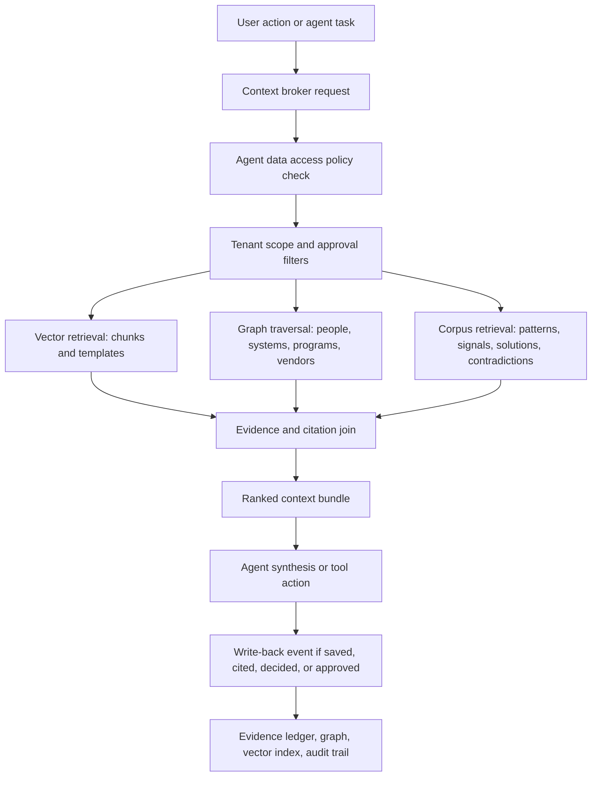

# Knowledge Layer Enterprise Data Room and Dynamic Write-Back Contract

Status: proposed implementation contract
Date: 2026-04-29
Scope: synthetic/demo tenants first; production/private-client data requires a dedicated tenant data plane
Related docs:
- `docs/build/KNOWLEDGE_GRAPH_CONTRACT.md`
- `docs/build/KNOWLEDGE_EVIDENCE_LEDGER_CONTRACT.md`
- `docs/build/KNOWLEDGE_IDENTITY_COUNT_CONTRACT.md`
- `docs/build/KNOWLEDGE_ROUTE_PROVENANCE_MAP.md`
- `docs/build/slices/TRUST2_AGENT_DATA_ACCESS_POLICY_MATRIX.md`
- `docs/build/slices/TEN2_TENANT_ISOLATION_DATA_BOUNDARY_MODEL.md`
- `docs/build/slices/EVID2_EVIDENCE_LEDGER_MVP.md`

## Purpose

AbarVa needs two knowledge-layer capabilities at the same time:

1. Seeded enterprise data rooms that show what good looks like for Programs, Source, Intelligence, and Control Tower.
2. A dynamic write-back path that lets the app accept new data, generate artifacts, record decisions, attach evidence, update graph context, and make that context available to agents safely.

The seed layer makes demos credible. The write-back layer makes the product operational.

This document defines the target contract for both.

## Current repo baseline

The repo already contains useful seed assets, but they are not yet governed as one enterprise data room.

| Asset | Current location | Current use | Gap |
| --- | --- | --- | --- |
| Apex Retail structured tenant data | `src/data/apexretail/` | Rich retail demo data | Needs normalized data-room schema and graph extraction |
| Meridian structured tenant data | `src/data/meridian/` | Healthcare demo data | Needs Programs/Source lifecycle artifacts and org graph |
| First Capital structured tenant data | `src/data/firstcapital/` | Financial-services demo data | Needs data-room registry and tenant graph |
| Arcturus structured tenant data | `src/data/arcturus/` | Secondary financial demo shell | Needs enrichment or clear shell-only status |
| Enterprise seed helper | `src/scripts/seed/_shared/enterprise-data.ts` | Tech stack, project, staff augmentation, volumetrics | Needs org structure, contracts, budget, decisions, evidence linkage |
| Apex Morrison deliverables | `src/content/deliverables/apex-retail/morrison/` | Good program-lifecycle sample artifacts | Needs canonical deliverable taxonomy and evidence linkage |
| Demo dataset registry | `src/lib/demo/demo-dataset-registry.ts` | Surface richness/readiness read model | Needs data-room domain coverage detail |
| Client prompt datasets | `src/lib/knowledge/client-datasets.ts` | Static prompt context | Should be converted to structured facts, nodes, chunks |
| Synthetic RAG docs | `src/lib/knowledge/synthetic-datasets.ts` | Ready-to-vectorize knowledge docs | Needs source registry, vector metadata, chunk IDs |
| Curated text knowledge docs | `scripts/knowledge-data/` | 80 global knowledge documents | Needs pgvector-compatible ingestion path |
| Private evidence manifest demo | `src/lib/architecture/private-evidence-manifest-demo.ts` | No-raw-copy demonstration | Needs production path for tenant-private evidence references |
| Knowledge fabric stores | `src/lib/architecture/knowledge-fabric/` | In-memory vector/graph/evidence placeholders | Needs Postgres-backed implementation later |

## Principles

1. Synthetic/demo data is allowed in the lab subscription. Real client data is not.
2. Seed data and live tenant data must use the same contracts where possible.
3. App writes should be append-first. Do not overwrite truth without an audit trail.
4. Agents do not read raw stores directly. They request context through a governed context broker.
5. Evidence is a first-class object. A recommendation without evidence remains draft or low-confidence.
6. Every record has tenant scope, source basis, sensitivity, approval state, and lifecycle state.
7. Raw client data should remain in the client's private data plane for strict pilots.
8. Global corpus promotion requires human review. Tenant-specific facts do not automatically become global patterns.
9. Vector retrieval and graph traversal must require tenant binding at the helper layer.
10. Templates, examples, generated artifacts, and approved tenant facts are separate object classes.

## Enterprise data room target shape

Each rich tenant should have a complete data room across the following domains.

### 1. Enterprise profile

Required fields:
- Tenant key and display name.
- Industry and sub-industry.
- Region footprint.
- Revenue band and employee count.
- Operating model summary.
- Regulatory posture.
- Strategic priorities.
- Data classification policy.
- Residency mode.
- Source basis.

Example object type:

```ts
interface EnterpriseProfileRecord {
  tenantKey: string;
  legalName: string;
  displayName: string;
  industry: string;
  subIndustry?: string;
  regions: string[];
  employeeCountBand: string;
  revenueBand: string;
  strategicPriorities: string[];
  regulatoryPosture: string[];
  dataClassificationPolicyId: string;
  residencyMode: 'abarva_hosted_synthetic' | 'client_owned_abarva_hosted' | 'client_owned_client_hosted';
  sourceBasis: 'synthetic_seed' | 'client_provided' | 'public_source' | 'derived';
}
```

### 2. People and organization graph

Required sample coverage:
- CEO, CFO, COO, CIO, CTO, CDO, CISO, CHRO, CPO/Procurement leader, GC.
- IT direct reports: infrastructure, applications, enterprise architecture, data, security, platform engineering, service management, PMO.
- Business sponsors by program.
- Procurement/category owners.
- Vendor owners.
- Data owners and evidence approvers.
- Steering committee members.
- Escalation paths.
- Sentiment/political map where synthetic.

Minimum node types:
- `Person`
- `Role`
- `OrgUnit`
- `Committee`
- `DecisionAuthority`

Minimum edge types:
- `REPORTS_TO`
- `HOLDS_ROLE`
- `MEMBER_OF`
- `SPONSORS_PROGRAM`
- `OWNS_SYSTEM`
- `OWNS_VENDOR`
- `APPROVES_EVIDENCE`
- `APPROVES_DECISION`
- `BLOCKS_OR_RISKS`

Gap to close: current seeds name sponsors and functions, but not a full org chart with reporting lines and decision rights.

### 3. IT system landscape

Required sample coverage:
- Systems of record: ERP, CRM, HCM, core industry system, finance, procurement.
- Data platform: warehouse, lakehouse, ETL/ELT, BI, catalog, governance.
- Integration: API gateway, iPaaS, event bus, batch/file transfer.
- Security: IAM, EDR, SIEM, SASE, GRC, DLP.
- Operations: ITSM, observability, CMDB, asset management.
- AI/ML: model providers, MLOps, feature store, vector/search, agent platforms.
- Shadow IT and unsupported tools.

Required fields per system:
- System ID.
- Vendor/product.
- Business capability.
- Owner role/person.
- Data owner.
- Deployment model.
- Annual spend.
- Renewal date.
- Contract ID.
- Integration count.
- Data classification.
- Criticality.
- Lifecycle state.
- Risk flags.
- Source basis.

Minimum edge types:
- `SYSTEM_OWNED_BY`
- `SYSTEM_SUPPORTS_CAPABILITY`
- `SYSTEM_FEEDS_SYSTEM`
- `SYSTEM_STORES_DATA_DOMAIN`
- `SYSTEM_HAS_CONTRACT`
- `SYSTEM_HAS_RISK`
- `SYSTEM_SUPPORTS_PROGRAM`

Gap to close: current system seeds are rich enough to start, but need normalized ownership, integrations, lifecycle, and evidence fields.

### 4. IT financials and vendor spend

Required sample coverage:
- Total IT budget.
- Run/change/transform allocation.
- Cloud spend by provider.
- SaaS spend by category.
- Consulting/professional services spend.
- Staff augmentation spend.
- Renewal exposure by quarter.
- Cost takeout opportunities.
- Business case baselines.
- Forecast and actuals by program.

Minimum node types:
- `Budget`
- `SpendLine`
- `Contract`
- `Vendor`
- `RenewalWindow`
- `BusinessCase`
- `Kpi`

Minimum edge types:
- `SPENDS_ON_VENDOR`
- `CONTRACT_RENEWS_ON`
- `PROGRAM_HAS_BUSINESS_CASE`
- `KPI_BASELINES_PROGRAM`
- `COST_REDUCTION_OPPORTUNITY_FOR`

Gap to close: annual spend exists in several seeds, but budget hierarchy, renewal calendar, and business-case baselines are not yet complete.

### 5. Program lifecycle artifacts

The data room should include both templates and completed examples.

Canonical lifecycle artifacts:
- Program charter.
- Stakeholder map.
- Decision rights map.
- Success metric tree.
- Current-state assessment.
- Intake synthesis.
- Financial baseline.
- Pain-point register.
- Root-cause analysis.
- Benchmark comparison.
- Hypothesis backlog.
- Roadmap.
- Kanban board.
- Intervention portfolio.
- Business case.
- Decision memo.
- Delivery plan.
- Sprint artifacts.
- Change management plan.
- Training/adoption plan.
- Outcome measurement plan.
- Executive readout.
- Post-implementation review.

Artifact states:
- `template`
- `draft_generated`
- `draft_user_edited`
- `reviewed`
- `approved`
- `superseded`
- `archived`

Gap to close: Apex Morrison has a strong sample set; Meridian, First Capital, and Arcturus need equivalent coverage or clear tier labels.

### 6. Sourcing lifecycle artifacts

Canonical sourcing artifacts:
- Sourcing intake brief.
- Category strategy.
- Market scan.
- Supplier longlist.
- Supplier shortlist.
- RFI template.
- RFI response pack.
- RFP template.
- RFP response pack.
- Vendor Q&A log.
- Evaluation scorecard.
- Security/compliance questionnaire.
- Pricing normalization workbook.
- Risk assessment.
- Reference check summary.
- Negotiation tracker.
- BAFO request.
- BAFO response comparison.
- Award recommendation.
- Contract redline summary.
- Implementation handoff.
- Value realization plan.

Required RFP template families:

| Work type | Template focus |
| --- | --- |
| AMS / managed services | Towers, service catalog, SLAs, transition, pricing units, governance |
| SaaS selection | Functional fit, integration, security, implementation, support, exit |
| Data platform | Architecture, migration, governance, observability, FinOps |
| AI/ML platform | Model lifecycle, evals, safety, residency, monitoring, governance |
| Cybersecurity | Control mapping, incident response, SOC evidence, MDR/SIEM handoff |
| ERP/SAP | Process scope, localization, data migration, testing, cutover |
| CRM/CDP | Customer data model, consent, segmentation, activation, integrations |
| Cloud migration | Landing zone, wave plan, app rationalization, cost model, rollback |
| Staff augmentation | Role cards, rate cards, onboarding, IP/security clauses |
| Consulting/SI | Milestones, acceptance criteria, staffing pyramid, deliverable quality |
| Contact center/CX | Channels, workforce, QA, analytics, CRM/telephony integration |
| Supply chain/SCM | Demand planning, inventory, supplier collaboration, ERP integration |

Gap to close: Source currently has scenarios and growing sourcing patterns, but not enough completed sourcing artifact packs tied to a full event lifecycle.

### 7. Evidence and provenance

Every material claim should be traceable to evidence.

Required evidence fields:
- Evidence ID.
- Tenant key.
- Source artifact ID.
- Citation locator.
- Chunk ID or section reference.
- Claim ID.
- Claim text.
- Claim derivation.
- Evidence usability state.
- Data classification.
- Approval state.
- Evidence owner.
- Last reviewed date.
- Linked artifact IDs.
- Linked graph node IDs.

The evidence lifecycle should follow the EVID2 states:
- `loaded`
- `parsed`
- `indexed`
- `classified`
- `scoped`
- `cited`
- `quality_checked`
- `usable_as_evidence`
- `blocked`

Gap to close: the evidence ledger model exists, but application writes do not yet generate ledger entries automatically.

### 8. Decision history and operating telemetry

Required sample coverage:
- Steering committee decisions.
- Approval notes.
- Rejected options.
- Assumption log.
- Risk/issue/action/decision records.
- Meeting notes.
- Workshop outputs.
- Stakeholder sentiment.
- Agent recommendation history.
- User corrections and feedback.
- Smoke-test and outcome measurement records.

These records make the graph useful because they explain why a program or sourcing event moved, not only what exists.

## Static seeds vs dynamic app writes

AbarVa should separate four object classes.

| Class | Examples | Mutable? | Who can create? | Can agents use? |
| --- | --- | --- | --- | --- |
| Canonical template | RFP template, charter template, scorecard rubric | Rarely | AbarVa maintainers | Yes, as generation scaffolding |
| Gold-standard example | Completed Apex RFP, approved business case | Controlled | AbarVa maintainers | Yes, as examples and demos |
| Tenant fact/artifact | Uploaded contract, org chart, approved KPI baseline | Yes, governed | Users, connectors, admin ingest | Yes, subject to approval and scope |
| Generated artifact | Draft RFP, risk memo, award recommendation | Yes, versioned | App/agents/users | Yes, if saved and approved for purpose |

Do not collapse these classes. The UI can make them feel seamless, but the data layer should preserve the distinction.

## Dynamic write-back contract

### Write event envelope

Every app write should create an event first.

```ts
interface KnowledgeWriteEvent {
  eventId: string;
  tenantKey: string;
  actorType: 'user' | 'agent' | 'connector' | 'system';
  actorId: string;
  surface: 'programs' | 'source' | 'intelligence' | 'control_tower' | 'admin' | 'api';
  action:
    | 'create_artifact'
    | 'update_artifact'
    | 'attach_evidence'
    | 'create_fact'
    | 'update_fact'
    | 'create_decision'
    | 'approve_decision'
    | 'reject_decision'
    | 'create_graph_node'
    | 'create_graph_edge'
    | 'index_chunk'
    | 'promote_pattern_candidate';
  targetType: string;
  targetId: string;
  sourceBasis: 'synthetic_seed' | 'client_provided' | 'connector' | 'agent_generated' | 'user_entered' | 'derived';
  approvalState: 'draft' | 'pending_review' | 'approved' | 'rejected' | 'revoked';
  dataClassification: 'public' | 'internal' | 'confidential' | 'restricted' | 'synthetic';
  idempotencyKey: string;
  createdAt: string;
}
```

### Write pipeline

```text
App action or agent action
  -> validate tenant and actor
  -> create KnowledgeWriteEvent
  -> persist draft/fact/artifact
  -> parse and chunk if textual
  -> classify sensitivity and source basis
  -> attach or request evidence
  -> update graph nodes/edges
  -> update vector index if allowed
  -> append evidence/audit ledger entry
  -> return context-ready object reference
```

### Write modes

| Mode | Behavior | Example |
| --- | --- | --- |
| Draft write | Save without evidence approval | Generated RFP draft |
| Fact proposal | Save pending review | User enters renewal date |
| Approved fact | Write to graph and retrievable context | Procurement owner approves renewal date |
| Evidence attachment | Link claim to chunk/source | Attach spreadsheet cell to KPI |
| Pattern candidate | Tenant-only candidate pending global review | Repeated AMS transition risk appears |
| Global pattern promotion | Human-reviewed corpus change | New reusable sourcing pattern |

### Immutable audit requirements

Every write must preserve:
- Previous value or previous artifact version.
- New value or new artifact version.
- Actor.
- Tenant key.
- Surface.
- Source basis.
- Approval state.
- Evidence references.
- Timestamp.
- Idempotency key.

For production/private-client deployments, audit writes must live in the tenant data plane or a tenant-approved audit plane.

## Agent context access model

Agents should not query the database, vector store, graph store, or object store directly. They should request context through a context broker.

### Canonical agents

| Agent | Primary use | Allowed context posture |
| --- | --- | --- |
| Nexus | Program execution, deliverables, workshop synthesis | Program-scoped approved/draft context; can use L4 only with explicit approval |
| Sentinel | Pattern detection, evidence candidates, contradiction surfacing | Evidence candidates, patterns, graph relations; L4 only with explicit approval |
| Atlas | Executive synthesis, portfolio signals | Aggregate/approved executive context; prefer L2 summaries |
| Steward | Governance, readiness, admin, data policy | Metadata, policy, readiness, aggregate context |

This follows the intent of `TRUST2_AGENT_DATA_ACCESS_POLICY_MATRIX`.

### Context request envelope

```ts
interface AgentContextRequest {
  requestId: string;
  tenantKey: string;
  agent: 'nexus' | 'sentinel' | 'atlas' | 'steward';
  purpose:
    | 'summarize'
    | 'recommend'
    | 'cite_as_evidence'
    | 'generate_deliverable'
    | 'evaluate_governance'
    | 'create_mission'
    | 'produce_executive_brief';
  surface: 'programs' | 'source' | 'intelligence' | 'control_tower' | 'admin';
  userQuery?: string;
  programId?: string;
  sourcingEventId?: string;
  artifactId?: string;
  allowedDataLevels: Array<'L0_public_external' | 'L1_metadata_only' | 'L2_summary_aggregate' | 'L3_redacted_extract' | 'L4_sensitive_raw_data'>;
  evidenceRequired: boolean;
  maxChunks: number;
  maxGraphHops: number;
  includeDrafts: boolean;
}
```

### Context response envelope

```ts
interface AgentContextBundle {
  requestId: string;
  tenantKey: string;
  agent: string;
  purpose: string;
  contextItems: AgentContextItem[];
  graphNeighborhood: GraphNeighborhoodSummary;
  citations: EvidenceCitation[];
  blockedItems: BlockedContextItem[];
  disclosure: {
    hasTenantPrivateContext: boolean;
    hasDraftContext: boolean;
    hasUnapprovedEvidence: boolean;
    partialContext: boolean;
    reason?: string;
  };
}
```

### Context item shape

```ts
interface AgentContextItem {
  itemId: string;
  itemType:
    | 'artifact_chunk'
    | 'structured_fact'
    | 'graph_node'
    | 'graph_edge'
    | 'pattern'
    | 'signal'
    | 'solution'
    | 'contradiction'
    | 'template'
    | 'example';
  title: string;
  text: string;
  sourceBasis: string;
  confidence: number;
  dataClassification: string;
  approvalState: string;
  evidenceIds: string[];
  graphNodeIds: string[];
  artifactIds: string[];
  citationLocator?: string;
}
```

### Context broker responsibilities

The broker must:
- Enforce tenant key before any retrieval.
- Consult the agent data access matrix.
- Apply approval-state gates.
- Query vector chunks with tenant filters.
- Query graph neighborhoods with tenant filters.
- Merge deterministic corpus patterns with tenant facts.
- Return blocked context as blocked, not silently dropped, when safe to disclose.
- Attach citations and evidence IDs.
- Write an audit event for context used in deliverables or recommendations.
- Refuse L4 raw context unless explicitly approved for that agent and purpose.

### Agent context flow



## Retrieval composition rules

### Programs context

For a Programs request, retrieve in this order:
1. Program record and phase.
2. Program artifacts and deliverables.
3. Stakeholders, sponsors, and decision rights.
4. KPIs and evidence status.
5. Related systems/vendors/contracts.
6. Risks/issues/actions/decisions.
7. Relevant corpus patterns and solutions.
8. Similar gold-standard examples.
9. Templates for the requested artifact type.

### Source context

For a Source request, retrieve in this order:
1. Sourcing event record.
2. Category strategy and scope.
3. Existing vendors/contracts/spend.
4. RFI/RFP artifacts and Q&A.
5. Vendor proposals and scorecards.
6. Security/compliance evidence.
7. Pricing normalization data.
8. Negotiation and BAFO records.
9. Relevant sourcing patterns.
10. Program linkage and implementation handoff context.

### Intelligence context

For an Intelligence request, retrieve in this order:
1. Corpus patterns/signals/solutions/contradictions.
2. Tenant graph facts that support or conflict with corpus patterns.
3. Evidence-ledger status for candidate claims.
4. Cross-client aggregates only when privacy thresholds are met.
5. Pattern candidates that are tenant-local and not yet global.

### Control Tower context

For a Control Tower request, retrieve in this order:
1. Signals and KPIs.
2. Portfolio/program status.
3. Risks/issues/decisions.
4. Evidence quality and data freshness.
5. Renewal/calendar exposure.
6. Aggregate executive summaries.

## Vector indexing contract

### Chunk metadata

Every indexed chunk should carry:

```ts
interface KnowledgeChunkMetadata {
  tenantKey: string;
  datasetId: string;
  sourceArtifactId: string;
  chunkId: string;
  chunkHash: string;
  sourcePath?: string;
  sourceType: 'template' | 'example' | 'tenant_artifact' | 'seed_doc' | 'public_doc' | 'generated_artifact';
  surface: 'programs' | 'source' | 'intelligence' | 'control_tower' | 'admin' | 'global';
  section?: string;
  pageNumber?: number;
  sourceBasis: string;
  dataClassification: string;
  approvalState: string;
  evidenceState: string;
  linkedNodeIds: string[];
  linkedArtifactIds: string[];
  linkedPatternIds: string[];
  createdAt: string;
}
```

### Index families

| Index family | Scope | Examples |
| --- | --- | --- |
| `global_corpus` | Shared, non-client-private | Patterns, templates, public docs, synthetic examples |
| `tenant_artifacts` | Tenant-scoped | Uploaded docs, generated deliverables, notes |
| `tenant_facts` | Tenant-scoped | Structured org/system/vendor/KPI facts rendered as text chunks |
| `tenant_evidence` | Tenant-scoped | Evidence chunks approved for citation |
| `pattern_candidates` | Tenant-scoped first | Candidate reusable patterns pending review |

For Azure/Postgres, use pgvector-compatible tables with `tenant_key` as a mandatory filter. For existing Pinecone paths, align namespace naming before using it for tenant-private retrieval.

Current issue to fix: existing code uses multiple client namespace conventions (`client_${clientId}`, `client:${clientId}`, and `client-...`). Pick one canonical convention before production use.

## Graph contract

### Node types

Required first-wave node types:
- `Tenant`
- `Person`
- `Role`
- `OrgUnit`
- `System`
- `Vendor`
- `Contract`
- `Program`
- `SourcingEvent`
- `Artifact`
- `Deliverable`
- `Kpi`
- `Risk`
- `Issue`
- `Decision`
- `Evidence`
- `Pattern`
- `Signal`
- `Solution`
- `Contradiction`
- `Template`

### Edge types

Required first-wave edge types:
- `REPORTS_TO`
- `HOLDS_ROLE`
- `SPONSORS_PROGRAM`
- `OWNS_SYSTEM`
- `OWNS_VENDOR`
- `OWNS_CONTRACT`
- `SYSTEM_FEEDS_SYSTEM`
- `SYSTEM_SUPPORTS_PROGRAM`
- `PROGRAM_HAS_DELIVERABLE`
- `PROGRAM_HAS_KPI`
- `PROGRAM_HAS_RISK`
- `SOURCING_EVENT_FOR_PROGRAM`
- `SOURCING_EVENT_HAS_VENDOR`
- `ARTIFACT_CITES_EVIDENCE`
- `EVIDENCE_SUPPORTS_CLAIM`
- `PATTERN_APPLIES_TO_TENANT`
- `PATTERN_RELATED_TO_PATTERN`
- `PATTERN_DERIVED_FROM_PATTERN`
- `CONTRADICTION_AFFECTS_PATTERN`
- `SOLUTION_USES_PATTERN`
- `SIGNAL_AFFECTS_PATTERN`

### Graph extraction order

1. Deterministic extraction from TypeScript seed objects.
2. Deterministic extraction from known markdown headings and frontmatter.
3. User-confirmed extraction from uploads.
4. Agent-suggested extraction as pending review.
5. Human-approved extraction into graph.

Do not make LLM extraction authoritative without review for tenant facts.

## Proposed Postgres tables

This is a target shape, not an instruction to migrate immediately.

```sql
CREATE TABLE knowledge_documents (
  id uuid PRIMARY KEY,
  tenant_key text NOT NULL,
  dataset_id text NOT NULL,
  source_artifact_id text NOT NULL,
  source_type text NOT NULL,
  source_basis text NOT NULL,
  data_classification text NOT NULL,
  approval_state text NOT NULL,
  title text NOT NULL,
  source_uri text,
  content_hash text NOT NULL,
  created_at timestamptz NOT NULL DEFAULT now(),
  updated_at timestamptz NOT NULL DEFAULT now()
);

CREATE TABLE knowledge_chunks (
  id uuid PRIMARY KEY,
  document_id uuid NOT NULL REFERENCES knowledge_documents(id) ON DELETE CASCADE,
  tenant_key text NOT NULL,
  chunk_index int NOT NULL,
  chunk_text text NOT NULL,
  chunk_hash text NOT NULL,
  token_count int,
  section text,
  citation_locator text,
  metadata jsonb NOT NULL DEFAULT '{}'
);

CREATE TABLE knowledge_embeddings (
  id uuid PRIMARY KEY,
  chunk_id uuid NOT NULL REFERENCES knowledge_chunks(id) ON DELETE CASCADE,
  tenant_key text NOT NULL,
  embedding_model text NOT NULL,
  embedding_dimensions int NOT NULL,
  embedding vector,
  metadata jsonb NOT NULL DEFAULT '{}'
);

CREATE TABLE knowledge_nodes (
  id uuid PRIMARY KEY,
  tenant_key text NOT NULL,
  node_type text NOT NULL,
  stable_key text NOT NULL,
  title text NOT NULL,
  properties jsonb NOT NULL DEFAULT '{}',
  source_basis text NOT NULL,
  data_classification text NOT NULL,
  approval_state text NOT NULL,
  created_at timestamptz NOT NULL DEFAULT now(),
  updated_at timestamptz NOT NULL DEFAULT now(),
  UNIQUE (tenant_key, node_type, stable_key)
);

CREATE TABLE knowledge_edges (
  id uuid PRIMARY KEY,
  tenant_key text NOT NULL,
  from_node_id uuid NOT NULL REFERENCES knowledge_nodes(id) ON DELETE CASCADE,
  to_node_id uuid NOT NULL REFERENCES knowledge_nodes(id) ON DELETE CASCADE,
  edge_type text NOT NULL,
  confidence numeric(4,3) NOT NULL DEFAULT 1.000,
  evidence_chunk_ids uuid[] NOT NULL DEFAULT '{}',
  properties jsonb NOT NULL DEFAULT '{}',
  created_at timestamptz NOT NULL DEFAULT now(),
  UNIQUE (tenant_key, from_node_id, to_node_id, edge_type)
);

CREATE TABLE knowledge_write_events (
  id uuid PRIMARY KEY,
  tenant_key text NOT NULL,
  actor_type text NOT NULL,
  actor_id text NOT NULL,
  surface text NOT NULL,
  action text NOT NULL,
  target_type text NOT NULL,
  target_id text NOT NULL,
  source_basis text NOT NULL,
  approval_state text NOT NULL,
  data_classification text NOT NULL,
  idempotency_key text NOT NULL,
  payload jsonb NOT NULL DEFAULT '{}',
  created_at timestamptz NOT NULL DEFAULT now(),
  UNIQUE (tenant_key, idempotency_key)
);
```

Production notes:
- Every tenant-scoped table needs RLS or an equivalent private data-plane boundary.
- Every query helper must require `tenant_key`.
- Embedding dimensions must match the selected model and index type.
- Raw private client text should not be copied into shared indexes or shared metadata.

## Data acceptance paths

### Manual app entry

Examples:
- Add a system.
- Correct an owner.
- Add a contract renewal.
- Approve a KPI baseline.
- Attach evidence to a claim.

Behavior:
- Save as fact proposal unless user role can approve.
- Create write event.
- Update graph only when approved or when draft graph is explicitly requested.
- Index summary text if allowed.

### File upload

Supported target file types:
- Markdown.
- DOCX.
- PDF.
- CSV/XLSX.
- Plain text.

Behavior:
- Create document record.
- Parse into chunks.
- Classify source type and sensitivity.
- Store raw file in tenant storage.
- Store chunk records in tenant DB.
- Embed chunks only if policy allows.
- Suggest graph nodes/edges, pending review.

### Connector ingest

Examples:
- Workday org structure.
- ServiceNow CMDB/incidents.
- Coupa/Ariba sourcing events.
- Salesforce account/opportunity context.
- Jira/ADO delivery telemetry.
- Datadog/Splunk observability signals.

Behavior:
- Treat connector output as tenant-private by default.
- Store connector provenance.
- Use field-level allowlists.
- Create graph nodes and edges only for approved fields.
- Keep source-system IDs for refresh and deletion.

### Agent-generated artifact

Examples:
- Draft RFP.
- Draft award recommendation.
- Draft program charter.
- Draft business case.
- Draft executive readout.

Behavior:
- Save as generated artifact draft.
- Attach the context bundle used.
- Attach citations where available.
- Mark unsupported claims as needing evidence.
- Index only after user saves.
- Allow artifact approval workflow.

### User correction

Examples:
- "This owner is wrong."
- "This vendor is no longer active."
- "Use Finance as the source system."

Behavior:
- Create correction event.
- Preserve previous value.
- Update fact confidence.
- Recompute impacted graph edges.
- Mark prior evidence as superseded if needed.

## Data-room completeness rubric

A rich tenant data room should meet these minimums.

| Domain | Minimum for rich demo tenant |
| --- | --- |
| Enterprise profile | 1 profile with strategy, regulatory, geography, classification |
| Org graph | 25+ people/roles, 4+ org units, reporting lines, decision committee |
| System landscape | 40+ systems, owners, costs, risks, integrations |
| Vendor/contracts | 25+ vendors/contracts, renewal dates, spend, category |
| Financials | IT budget, run/change split, cloud/SaaS/services spend |
| Programs | 5+ programs, lifecycle state, sponsor, KPIs, risks |
| Program artifacts | 20+ artifacts with at least 8 approved examples |
| Sourcing events | 3+ events across different work types |
| Sourcing artifacts | 20+ artifacts with RFP, scorecard, vendor response, award memo |
| Evidence | 50+ evidence entries, 20+ usable, 5+ blocked |
| Graph | 200+ nodes, 350+ edges for rich tenant |
| Vector chunks | 300+ chunks across global + tenant context |
| Templates | 10+ RFP families, 15+ program templates |
| Agent context tests | Nexus/Sentinel/Atlas/Steward each have deterministic sample bundles |

## What should be pre-authored vs generated

### Pre-author

Pre-author these because quality matters and they serve as stable examples:
- Enterprise data-room schema.
- Gold-standard RFP templates by work type.
- Gold-standard program templates.
- Completed Apex examples.
- Evaluation scorecards.
- Pricing normalization workbook shapes.
- Contract clause and redline examples.
- Evidence manifest examples.
- Bad/good artifact pairs.
- Pattern corpus entries.

### Generate dynamically

Generate these from tenant context:
- Client-specific RFP drafts.
- Vendor comparison memo.
- Negotiation position.
- Risk narrative.
- Executive summary.
- Program charter draft.
- Business case draft.
- Implementation handoff.
- Change/adoption plan.
- Decision memo.

Generated artifacts must record the context bundle used.

## Pattern graduation rules

Tenant observations can become global patterns only after review.

Flow:
1. Tenant graph/evidence reveals recurring behavior.
2. Sentinel creates a tenant-local pattern candidate.
3. Candidate is linked to evidence and affected artifacts.
4. Human reviewer checks source basis and generality.
5. Candidate is promoted to global corpus or rejected.
6. Promotion creates a corpus PR, not a hidden runtime write.

Blocked cases:
- Private client-specific facts.
- Claims based on one tenant only unless labelled as anecdotal.
- Pricing or regulatory claims without public evidence.
- Anything sourced from client confidential material unless anonymized and approved.

## Implementation sequence

### Phase 0 - Contract and inventory

Deliverables:
- This contract.
- Dataset inventory report for existing seed assets.
- Gap table by tenant: Apex, Meridian, First Capital, Arcturus.

Acceptance:
- No runtime change.
- No migrations.
- No model calls.

### Phase 1 - Enterprise data room seed schema

Deliverables:
- TypeScript read model for enterprise data-room records.
- Apex Retail data-room pack as first complete tenant.
- Completeness validator.
- Demo dataset registry upgraded with domain-level coverage.

Acceptance:
- Apex has profile, org, systems, vendors, financials, programs, sourcing artifacts, evidence summary.
- Tests prove deterministic output.

### Phase 2 - Context broker read contract

Deliverables:
- `AgentContextRequest` and `AgentContextBundle` types.
- Deterministic broker that reads seed data only.
- Tests for Nexus/Sentinel/Atlas/Steward purpose gating.

Acceptance:
- Agent context is tenant-scoped.
- L4 is blocked unless explicitly approved.
- Atlas receives aggregate context by default.
- Nexus receives program/deliverable context.
- Sentinel receives evidence/pattern context.
- Steward receives policy/readiness context.

### Phase 3 - Graph edge indexing

Deliverables:
- Extend existing corpus indexer to write graph edges for pattern, solution, signal, and contradiction references.
- Add enterprise data-room graph extraction for Apex.

Acceptance:
- Graph node count and edge count are deterministic.
- Broken references fail tests.
- No database persistence required yet.

### Phase 4 - Vector chunking and local ingestion contract

Deliverables:
- Chunker wrapper for templates, examples, tenant artifacts, and structured facts.
- Metadata contract enforced by tests.
- Dry-run ingestion report.

Acceptance:
- No model calls in tests.
- Stable chunk IDs and hashes.
- Tenant key required.
- Raw private text handling documented.

### Phase 5 - Postgres/pgvector implementation

Deliverables:
- Migration draft for documents, chunks, embeddings, nodes, edges, write events.
- Repository methods.
- Tenant-scoped query helpers.

Acceptance:
- `tenant_key` required by helpers.
- RLS/private data-plane posture defined before production.
- No real client data in lab.

### Phase 6 - App write-back MVP

Deliverables:
- Save generated artifact as draft.
- Attach evidence to a claim.
- Approve/reject a fact.
- Context bundle audit write.

Acceptance:
- Every write creates a write event.
- Every generated artifact records its context bundle.
- Approved facts update graph and index.
- Rejected facts remain auditable but unavailable for normal retrieval.

## Workstreams

| Workstream | Owner agent persona | Files likely touched | Notes |
| --- | --- | --- | --- |
| Data room schema | Steward/Nexus | `src/lib/knowledge/`, `src/lib/demo/` | Deterministic read model first |
| Seed enrichment | Nexus/Source | `src/data/`, `src/content/deliverables/` | Apex first, then Meridian/First Capital |
| Context broker | Nexus/Sentinel/Atlas/Steward | `src/lib/knowledge/`, `src/lib/agent/` | Keep route changes minimal |
| Graph indexing | Sentinel | `src/lib/intelligence/indexer.ts`, graph tests | Start with corpus edges |
| Vector ingestion | Steward/Sentinel | `src/scripts/knowledge/`, migrations later | Dry-run before model/API calls |
| Write-back APIs | Nexus | `src/app/api/`, `src/lib/knowledge/` | Gate behind auth/tenant checks |
| Governance | Steward | `docs/build/`, admin read models | Approval and audit visibility |

## Non-goals for first implementation

- Do not ingest real client data into the lab subscription.
- Do not make LLM extraction authoritative for tenant facts.
- Do not let agents bypass the context broker.
- Do not promote tenant-local observations to global corpus automatically.
- Do not add production database migrations until schema and tenant posture are reviewed.
- Do not store production raw client payloads in shared vector metadata.

## Open decisions

1. Postgres vector dimensions: choose one embedding model/dimension per index family before migration.
2. Tenant key convention: standardize `tenant_key`, `client_id`, and namespace naming.
3. Draft visibility: decide which agents can see drafts by default.
4. Approval roles: map who can approve facts, evidence, decisions, and artifacts.
5. Connector scope: choose first connector family for dynamic ingest simulation.
6. Pattern promotion workflow: decide whether global pattern promotion always requires PR review.
7. Azure target: decide when the private data-plane Postgres instance becomes the first real backend.

## Recommended next PRs

1. `docs(knowledge): add enterprise data room write-back contract` - this document.
2. `feat(knowledge): add enterprise data room seed types and completeness validator`.
3. `feat(knowledge): add Apex Retail data room seed pack`.
4. `feat(knowledge): add deterministic agent context broker contract`.
5. `feat(knowledge): index corpus graph edges in knowledge fabric`.
6. `docs(knowledge): specify pgvector graph schema migration`.
7. `feat(knowledge): add synthetic artifact write-back draft path`.
