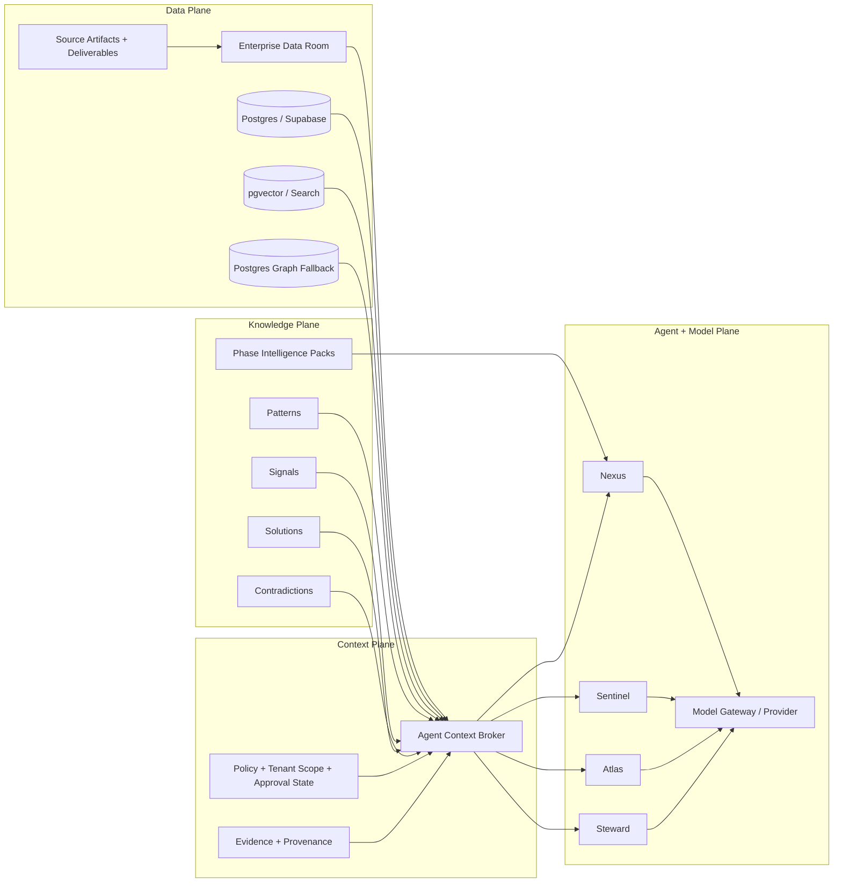
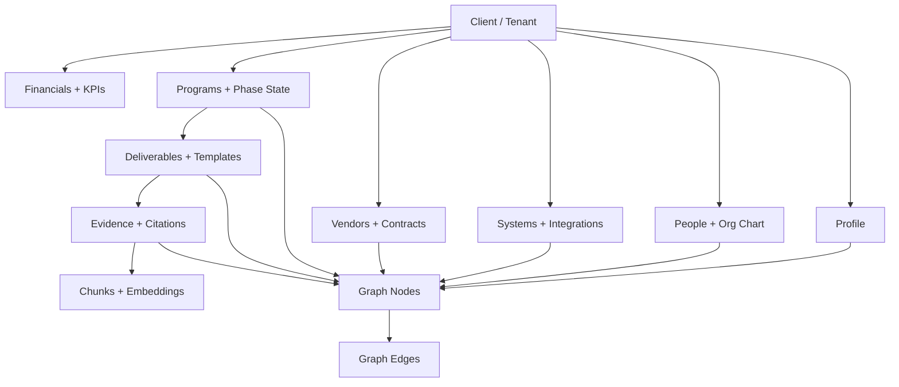
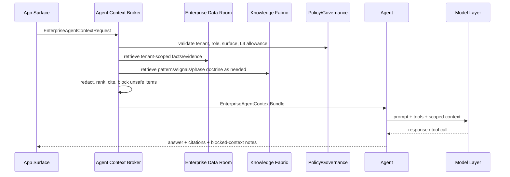
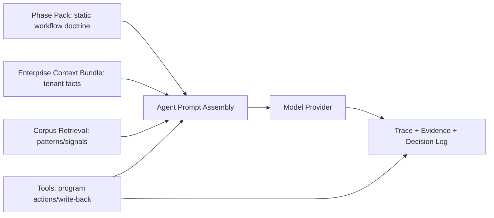

# AbarVa Knowledge Layer Architecture Visuals

Status: current architecture snapshot after Enterprise Data Room, agent context broker, persistence mapper, and phase-pack work.

## Executive View

AbarVa should treat the knowledge layer as four coordinated planes:

1. Enterprise Data Room: tenant facts, programs, artifacts, evidence, graph candidates, vector readiness.
2. Knowledge Fabric: global patterns, signals, solutions, contradictions, sourcing corpus, and future client-private embeddings.
3. Context Broker: governed northbound contract that gives agents scoped context without letting them query raw stores directly.
4. Model/Agent Layer: Nexus, Sentinel, Atlas, and Steward combine static workflow doctrine with tenant-specific context.

## What Exists Now

| Layer | Current State | Notes |
|---|---|---|
| Enterprise Data Room | Source-code seeded read model | Apex is rich. Meridian and First Capital are partial/conflict-aware. |
| Agent Context Broker | Contract-only implementation | No route imports yet. It returns scoped context bundles and blocked items. |
| Persistence Mapper | Dry-run only | Lowers data-room records into future row groups; no DB writes. |
| Phase Packs | P0-P6 complete | Static workflow doctrine for Nexus on program surfaces. |
| Vector Layer | Not live for Enterprise Data Room | Vector readiness rows exist; embeddings are not generated. |
| Graph Layer | Candidate graph only | Graph nodes/edges exist in data room; no persistent graph fallback migration yet. |
| App Runtime Wiring | Not yet attached | Programs agents can pivot to broker through a thin adapter later. |

## Target Data / Knowledge Shape

## Agent Context Assembly

Agents should not read raw stores directly. They request context from the broker.

## Multi-Agent Responsibilities

| Agent | Primary Question | Context It Should Receive | Should Not Do |
|---|---|---|---|
| Nexus | What should the program do next? | Phase pack, program state, deliverables, evidence, risks, gate readiness | Query raw tenant stores directly |
| Sentinel | Is this evidence/pattern/source trustworthy? | Evidence rows, graph candidates, citations, contradictions, quality state | Invent sources or bypass approval state |
| Atlas | What does the portfolio/value picture show? | Financials, KPIs, systems, aggregate program/value context | Consume raw L4 text by default |
| Steward | Is this governed and safe? | Policy readiness, tenant scope, data classification, blocked items, write-back status | Approve private data exposure implicitly |

## Runtime Composition Pattern

## Recommended Next Build Order

1. Add a read-only Programs adapter that calls the broker but does not change write behavior.
2. Add a migration decision doc for pgvector and graph fallback before real DDL.
3. Lock embedding default for the Azure lab: `text-embedding-3-small`, `1536`, `vector(1536)` if Supabase pgvector is chosen.
4. Define tenant identity bridge: `tenant_key` and `client_id` must be explicit and consistent.
5. Add write-back event contract for generated artifacts and user edits.
6. Only then create real migrations for documents, chunks, embeddings, graph nodes, graph edges, and write events.

## Do Not Shortcut

- Do not let app agents import seed data directly.
- Do not let agents query vector/graph/database stores directly.
- Do not create pgvector DDL until embedding dimensions and RLS are locked.
- Do not mark Meridian or First Capital as rich tenants until canonical profile conflicts are resolved.
- Do not treat phase packs as tenant data; they are workflow doctrine.
