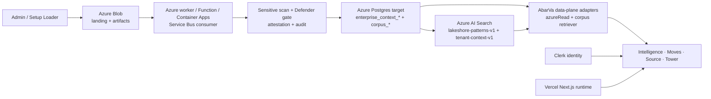

# Lakeshore Azure Substrate Readiness Report

Date: 2026-06-06  
Branch: `codex/lakeshore-azure-substrate-readiness`  
Base commit: `dc96cb624014ca36d4ba02a143433178f62b45ce`  
Scope: Lakeshore Holdings only

## Executive verdict

**HOLD for Azure-private production/cutover proof.**

Lakeshore has meaningful live substrate in the currently configured app database: 8,987 published corpus patterns, 8,987 `search_doc_id` values, 1,329 embedded enterprise context chunks, 2 Lakeshore Source events, 18 program attachments, 18 evidence rows, and artifact-backed Kyriba Source/Moves rows. The public app health endpoint is live.

But the Azure-private substrate is **not fully proven** because three hard evidence gaps remain:

1. `DATABASE_URL` currently resolves to `aws-1-us-east-2.pooler.supabase.com`, while the Azure Postgres URL `pg-abarva-context-lab-001.postgres.database.azure.com` failed local DNS resolution with `ENOTFOUND`.
2. Azure AI Search endpoint/service are present locally, but both query and admin/write credentials are missing locally and absent from the production Vercel env-name list. Direct Azure Search document count and semantic retrieval proof are therefore blocked.
3. All canonical Lakeshore Clerk personas are currently `banned=true`, so authenticated product-route, tenant-isolation, and live agent-answer proof cannot run through the product UI.

Do not call Lakeshore Azure substrate demo-ready until these three are closed with fresh live evidence.

## Confirmed live

| Area | Evidence | Status |
|---|---:|---|
| Production app health | `GET https://app.abarva.ai/api/health` returned `200` with `ok: true`, `postgres: true`, `direct_postgres: true`, `azure_graph: postgres` | Live |
| Current app DB connectivity | `DATABASE_URL` connected successfully | Live, but host is Supabase pooler |
| Lakeshore client row | 1 row: `Lakeshore Holdings`, `tenant_key=lakeshore-holdings`, `holding_group_role=l0_sponsor`, `aggregate_visibility_level=group_aggregate` | Live |
| Corpus rows | 8,987 total, 8,987 published | Live in current DB |
| Corpus search document mapping | 8,987 / 8,987 rows have `search_doc_id` | Live in current DB |
| Corpus content rows | 8,987 `corpus_pattern_content` rows | Live in current DB |
| Corpus versions | 8,987 `corpus_pattern_versions` rows | Live in current DB |
| Corpus graph relationships | 27,052 `corpus_pattern_relationships` rows | Live in current DB |
| Enterprise context chunks | 1,329 Lakeshore chunks, 1,329 embedded, dimension 1536 | Live in current DB |
| Source events | 2 Lakeshore events: `LSH-KYRIBA-TREASURY-2026`, `LSH-AMS-MODERNIZATION-2026` | Live in current DB |
| Source artifacts | 51 Lakeshore artifacts, 51 parsed, 51 `embedding_status=not_applicable` | Live in current DB |
| Program attachments | 18 Lakeshore program attachments | Live in current DB |
| Program evidence | 18 Lakeshore evidence rows | Live in current DB |
| Loader dry-run | `scripts/load-genome-wave.ts` accepted a one-row Lakeshore QA JSONL with zero writes | Passed |
| Tests | 4 focused suites passed: tenant isolation probes, holding-group policy, corpus Azure Search contract, corpus retrieval fallback | Passed |

## Work in progress

| Area | Current truth | Required next proof |
|---|---|---|
| Azure Postgres cutover | `ABARVA_AZURE_DATABASE_URL` exists locally but DNS resolution failed from this machine. App `DATABASE_URL` resolves to Supabase pooler. | Run from a network that can resolve/reach Azure Postgres, or update runtime `DATABASE_URL` to the intended Azure Postgres endpoint and prove counts there. |
| Azure AI Search | Endpoint/service/API version exist locally. Query/admin keys missing. Production env-name list does not include Azure Search vars. | Add `AZURE_SEARCH_QUERY_KEY` and `AZURE_SEARCH_ADMIN_KEY` or a managed-identity path, then prove `$count`, schema dimension, and Kyriba semantic query results. |
| Clerk identity | Lakeshore CFO/CIO/admin users exist but all are banned. | Unban/re-provision canonical Lakeshore personas, then rerun live app QA and tenant isolation. |
| Tenant-context Azure Search | Feature flag `retrieval_azure_search` is default off with an empty include list. | Decide whether Lakeshore tenant context should use Azure AI Search `tenant-context-v1`, then enable only after parity proof. |
| Production env alignment | Production env list includes `DATABASE_URL`, model keys, Clerk, object storage, and legacy Pinecone/Supabase/Neo4j vars; Azure Search vars are absent. | Align production envs to Azure-private target and remove/disable legacy vectors for Lakeshore runtime proof. |

## Blocked

| Blocker | Impact | Exact unblock |
|---|---|---|
| Azure Postgres DNS/local reachability failed for `pg-abarva-context-lab-001.postgres.database.azure.com` | Cannot prove Azure Postgres contains Lakeshore data from this runner. | Run checks from VPN/VNet/Bastion/Container Apps job or fix DNS/private endpoint exposure for the approved runner. |
| `DATABASE_URL` points to `aws-1-us-east-2.pooler.supabase.com` | Current live data proof is against compatibility-era DB, not Azure-private Postgres. | Update local/prod `DATABASE_URL` to intended Azure Postgres or explicitly document this as temporary compatibility mode. |
| Missing Azure Search query/write credentials | Cannot directly count `lakeshore-patterns-v1`, verify vector dimension, or run semantic Kyriba retrieval. | Add `AZURE_SEARCH_QUERY_KEY` for reads and `AZURE_SEARCH_ADMIN_KEY` for writes, or implement managed identity for the search client. |
| Lakeshore Clerk personas banned | Cannot prove live UI retrieval, tenant isolation, or agent answer behavior through authenticated product routes. | Unban/re-provision `cio@`, `cfo@`, and `admin@lakeshore-holdings.example.com`, then rerun QA. |
| Azure Search vars absent from Vercel production env list | Production runtime cannot use the env-driven Azure Search path. | Add `AZURE_SEARCH_ENDPOINT` or `AZURE_SEARCH_SERVICE_NAME`, `AZURE_SEARCH_API_VERSION`, `AZURE_SEARCH_QUERY_KEY`, and `LAKESHORE_CORPUS_SEARCH_INDEX`; add admin key only to worker/operator runtime if production writes are needed. |

## Azure services map



Current verified reality differs from the target map: the app DB proof reached a Supabase pooler host, not the Azure Postgres host, and Azure AI Search could not be queried because credentials are missing.

## Runtime/env matrix

| Variable | Purpose | Local presence | Production presence by name | Required for local | Required for Vercel | Required for Azure worker | Current finding |
|---|---|---:|---:|---:|---:|---:|---|
| `DATABASE_URL` | Primary app Postgres/data-plane URL | Present | Present | Yes | Yes | Yes unless worker has separate DB URL | Local host is `aws-1-us-east-2.pooler.supabase.com`, not Azure Postgres. |
| `ABARVA_AZURE_DATABASE_URL` | Candidate Azure Postgres URL | Present | Not listed | Yes for Azure proof | Optional unless adopted | Yes if worker uses Azure DB directly | DNS failed locally: `ENOTFOUND pg-abarva-context-lab-001.postgres.database.azure.com`. |
| `AZURE_SEARCH_ENDPOINT` | Azure AI Search endpoint | Present | Not listed | Yes | Yes | Yes | Local endpoint host: `srch-abarva-context-lab-eastus.search.windows.net`. |
| `AZURE_SEARCH_SERVICE_NAME` | Azure AI Search service-name fallback | Present | Not listed | Yes | Yes | Yes | Local service name present. |
| `LAKESHORE_CORPUS_SEARCH_INDEX` | Lakeshore corpus index override | Missing | Not listed | Optional | Recommended | Recommended | Defaults to `lakeshore-patterns-v1`. |
| `AZURE_SEARCH_API_VERSION` | Azure Search REST API version | Present | Not listed | Yes | Yes | Yes | Local value present; default in code is `2024-07-01`. |
| `AZURE_SEARCH_QUERY_KEY` | Azure Search read key | Missing | Not listed | Yes for direct proof | Yes for runtime query path | Optional if managed identity used | Blocks direct count/query proof. |
| `AZURE_SEARCH_ADMIN_KEY` | Azure Search write/admin key | Missing | Not listed | Yes for loader commit/search writes | No, unless app writes | Yes for corpus loader/operator writes unless managed identity used | Blocks commit to Azure Search. |
| `DATA_PLANE_OBJECT_STORE_ACCOUNT` | Azure Blob account | Missing locally | Present | Yes for local blob proof | Yes | Yes | Production name exists; local missing. |
| `DATA_PLANE_OBJECT_STORE_ACCOUNT_KEY` | Azure Blob shared key | Missing locally | Present | Yes if no managed identity | Yes if Vercel signs/downloads blobs | Avoid if worker can use managed identity | Production name exists; value not printed. |
| `DATA_PLANE_OBJECT_STORE_CONTAINER` | Shared Blob container override | Missing | Not listed | Optional | Optional | Optional | Code can use per-bucket containers if missing. |
| `OPENAI_API_KEY` | Embeddings and optional generation | Present | Present | Yes for local embedding | Yes if runtime uses OpenAI | Yes if worker embeds through OpenAI | Present; user preference is OpenAI direct for generation unless changed. |
| `ANTHROPIC_API_KEY` | Runtime answer model option | Present | Present | Optional | Optional/yes if Claude answers | No | Present. |
| `CLERK_SECRET_KEY` | Clerk server auth and sign-in token QA | Present | Present | Yes for live QA | Yes | No | Present, but Lakeshore users are banned. |
| `PINECONE_API_KEY` / `PINECONE_INDEX` | Legacy vector/runtime compatibility | Present locally | Present by name | No for Lakeshore target | Should not be used for Lakeshore target | No | Legacy presence must not count as Lakeshore vector proof. |
| `NEXT_PUBLIC_SUPABASE_URL` / `SUPABASE_SERVICE_ROLE_KEY` | Legacy compatibility | Present locally | Present by name | No for new runtime | Should not be used for new runtime | No | Legacy presence remains; no new runtime dependency should be introduced. |
| `NEO4J_URI` | Legacy graph compatibility | Present locally | Present by name | No | No | No | Graph feature flag defaults off; Postgres graph tables are current source of truth. |
| `SERVICE_BUS_NAMESPACE` / `SERVICE_BUS_FULLY_QUALIFIED_NAMESPACE` | Azure Service Bus worker | Not proven | Not listed in production app env | No | No unless app consumes | Yes | Worker cannot be called production-ready without this. |
| `SERVICE_BUS_QUEUE_NAME` | Ingestion queue | Not proven | Not listed | No | No unless app consumes | Yes | Defaults to `q-context-ingestion-events` in worker. |
| `DOCUMENT_INTELLIGENCE_ENDPOINT` / `DOCUMENT_INTELLIGENCE_API_KEY` | Azure Document Intelligence | Not checked locally | Present by name | Optional | Optional | Yes if parsing PDFs/docs in worker | Production names exist. |

## Data-plane counts

Counts below are from the currently configured `DATABASE_URL`; because that URL resolves to a Supabase pooler host, these are **current app DB counts**, not Azure Postgres proof.

| Category | Lakeshore count | Notes |
|---|---:|---|
| Clients | 1 | `Lakeshore Holdings`, L0 sponsor, aggregate visibility. |
| Corpus patterns | 8,987 | All published. |
| Corpus patterns with `search_doc_id` | 8,987 | 100% mapped in Postgres. |
| Corpus content rows | 8,987 | One content row per pattern. |
| Corpus versions | 8,987 | One version row per pattern. |
| Corpus relationships | 27,052 | Graph relationship table populated. |
| Corpus telemetry | 9,027 | Loader/audit telemetry rows. |
| Enterprise context chunks | 1,329 | 1,329 embedded, dimension 1536. |
| Enterprise context records | 0 for Lakeshore in `enterprise_context_records` | Lakeshore appears primarily in `data_inventory_*` + chunks, not records. |
| Data ingestion runs | 18 completed Lakeshore runs | Current proof path is CSV/context-loader backed. |
| Data inventory records | 1,843 total table rows | Prior audit says 1,329 Lakeshore records; table schema needs tenant attribution review because direct `tenant_key='lakeshore'` filter returned 0 in this run. |
| Source events | 2 | Kyriba and AMS. |
| Source artifacts | 51 | All parsed; `embedding_status=not_applicable`. |
| Source artifact chunks | 51 | Lakeshore scoped. |
| Source artifact facts | 51 | Lakeshore scoped. |
| Program attachments | 18 | `tenant_key=lakeshore-holdings`. |
| Program evidence rows | 18 | `tenant_key=lakeshore-holdings`. |
| Lakeshore engagements/Moves | 6 | Kyriba and Shared Data Platform have deliverables; four Moves have no deliverables. |
| Kyriba Move deliverables | 6 | In current DB. |
| Shared Data Platform deliverables | 6 | In current DB. |

### Lakeshore corpus by domain

| Domain | Patterns | With `search_doc_id` |
|---|---:|---:|
| D17 | 574 | 574 |
| D03 | 573 | 573 |
| D07 | 571 | 571 |
| D04 | 560 | 560 |
| D01 | 555 | 555 |
| D05 | 528 | 528 |
| D11 | 508 | 508 |
| D08 | 504 | 504 |
| D14 | 500 | 500 |
| D16 | 470 | 470 |
| D02 | 467 | 467 |
| D15 | 463 | 463 |
| D18 | 463 | 463 |
| D10 | 457 | 457 |
| D12 | 456 | 456 |
| D13 | 448 | 448 |
| D06 | 447 | 447 |
| D09 | 443 | 443 |

## Vector/search proof

| Proof item | Result | Evidence |
|---|---|---|
| Postgres `search_doc_id` mapping | Passed | 8,987 / 8,987 Lakeshore corpus rows have `search_doc_id`. |
| Azure AI Search endpoint configured locally | Partial | Endpoint host present: `srch-abarva-context-lab-eastus.search.windows.net`. |
| Azure AI Search direct document count | Blocked | Missing `AZURE_SEARCH_QUERY_KEY` or `AZURE_SEARCH_ADMIN_KEY`. |
| Azure AI Search semantic query | Blocked | Missing query/admin key. |
| Azure AI Search write/commit path | Blocked | Missing `AZURE_SEARCH_ADMIN_KEY`. |
| Expected embedding dimension | Code contract: 1536 | `scripts/load-genome-wave.ts` and index contract use 1536-dimensional embeddings. Direct index schema cannot be read without query/admin credentials. |
| Runtime fallback behavior | Confirmed by code/tests | `searchCorpus()` fuses Postgres and Azure hits; if Azure fails, it degrades to Postgres. This is useful resilience but not Azure Search proof. |
| Pinecone avoidance | Not fully clean | Lakeshore corpus path has Azure Search code, but legacy Pinecone env/scripts/retrievers still exist. Treat Pinecone as compatibility residue, not acceptable Lakeshore vector proof. |

Direct Azure Search probe result:

```json
{
  "endpointPresent": true,
  "endpointHost": "srch-abarva-context-lab-eastus.search.windows.net",
  "index": "lakeshore-patterns-v1",
  "apiVersion": "2024-07-01",
  "queryCredentialPresent": false,
  "writeCredentialPresent": false,
  "status": "blocked",
  "blocker": "AZURE_SEARCH_QUERY_KEY or AZURE_SEARCH_ADMIN_KEY missing; cannot prove direct Azure Search document count or semantic retrieval"
}
```

## Tenant isolation proof

| Layer | Evidence | Status |
|---|---|---|
| Static/client-key resolution | Focused tests passed | Passed: `tenant-isolation-probes`, `holding-group-policy`. |
| Source event DB scoping | Lakeshore has exactly 2 Source events under `client_key=lakeshore`; other tenants have separate client keys. | Passed at DB level. |
| Program attachment scoping | 18 Lakeshore attachments use `tenant_key=lakeshore-holdings`; other tenant attachments are separate. | Passed at DB level. |
| Enterprise chunk scoping | 1,329 Lakeshore chunks use `tenant_key=lakeshore`; other tenants are separate. | Passed at DB level. |
| Live authenticated UI isolation | Blocked | All canonical Lakeshore Clerk users are banned. |
| Cross-tenant adversarial prompt proof | Blocked | Requires authenticated live session. |
| L0/L1/L2 parent aggregate leakage | Not fully proven | Client row has L0 aggregate visibility, but live parent/child raw-contract access tests did not run because identity is blocked. |

Clerk persona state checked via Clerk backend, no secrets printed:

| Email | Found | Banned | Role |
|---|---:|---:|---|
| `cfo@lakeshore-holdings.example.com` | Yes | true | maestro |
| `cio@lakeshore-holdings.example.com` | Yes | true | maestro |
| `admin@lakeshore-holdings.example.com` | Yes | true | admin |

## Loader proof

| Loader path | Result | Notes |
|---|---|---|
| `scripts/load-genome-wave.ts` dry-run | Passed | One-row Lakeshore QA JSONL validated with zero writes. |
| Postgres commit path | Not run | Requires explicit approval and correct target DB. Current `DATABASE_URL` is not Azure Postgres. |
| Azure Search commit path | Blocked | Missing `AZURE_SEARCH_ADMIN_KEY`. |
| Existing context loader evidence | Partially live | 18 completed Lakeshore ingestion runs and 1,329 embedded chunks exist in current DB; setup/admin approval-ledger tables are still 0. |
| Blob artifact evidence | Prior release record says production Blob account `stlakeshorepilotlsh001` is configured and artifacts exist. Current local env lacks Blob account/key, so local Blob listing was not rerun. |

Dry-run output:

```json
{
  "ok": true,
  "mode": "dry-run",
  "result": {
    "patternsRead": 1,
    "patternsSelected": 1,
    "postgresUpserts": 0,
    "azureUploads": 0,
    "relationshipsInserted": 0,
    "relationshipsUnresolved": 0,
    "dryRun": true
  },
  "sampleIds": ["PAT-LSH-QA-99999"]
}
```

## App retrieval proof

| Proof | Result | Notes |
|---|---|---|
| Public health | Passed | `/api/health` returned 200. |
| Live app route QA | Blocked | Clerk ticket sign-in failed with `You have been banned` for Lakeshore personas. |
| Live `/api/intelligence/ask` Q&A | Blocked | Same Clerk persona blocker. |
| Source/Moves live browser proof | Blocked | Same Clerk persona blocker. |
| Source/Moves DB proof | Passed | Kyriba and AMS Source stages/artifacts are present; Kyriba has approved Strategy through BAFO and needs-review Executive Decision/Selection/Transition/Value. |
| CXO answer contract | Not live-proven this run | Cannot prove `My read / Why / Decision fork / What I would do next / Evidence gap` without authenticated live agent calls. |

## Retrieval paths used by modules

| Module | Runtime path | Current Lakeshore proof state |
|---|---|---|
| Intelligence / Sentinel | `/api/intelligence/ask`, `searchCorpus()`, tenant context broker, Lakeshore live loader | DB and code proof only; live ask blocked by Clerk. Azure Search not directly proven. |
| Moves / Nexus | Strategic Moves routes, program attachments, evidence rows, broker context | DB proof for Kyriba/Shared Data Platform artifacts; live UI blocked by Clerk. |
| Source | Source event routes, `source_artifacts`, `source_artifact_chunks`, `source_event_artifact_states` | DB proof strong; live UI blocked by Clerk. |
| Tower / Atlas | Tower value routes over Source/Move/value state | DB proof partial; live UI blocked by Clerk. |
| Context broker vector lane | Azure Postgres `enterprise_context_chunks` keyword/FTS path; optional Azure AI Search feature flag | Current chunks embedded in DB. Azure AI Search tenant-context flag default off. |
| Corpus retrieval lane | Postgres corpus search plus optional Azure AI Search via `queryCorpusSearch()` | Postgres corpus proof strong. Azure AI Search credentials missing. |

## Screenshots/evidence locations

No new screenshots were captured in this run because authenticated browser sign-in is blocked by Clerk persona bans.

Evidence created/updated in this branch:

- `docs/build/lakeshore-azure-substrate/LAKESHORE_AZURE_SUBSTRATE_READINESS_REPORT_2026-06-06.md`
- `docs/releases/records/2026-06-06-lakeshore-azure-substrate-readiness.md`

Useful pre-existing evidence referenced:

- `docs/build/lakeshore/LAKESHORE_LIVE_DATA_AUDIT_2026-06-05.md`
- `docs/releases/records/2026-06-05-lakeshore-live-data-artifact-audit.md`
- `docs/build/lakeshore-corpus/LOADER_CONTRACT_2026-06-04.md`

## Next concrete action

1. **Identity unblock:** Unban or re-provision the three canonical Lakeshore Clerk users. Then rerun:
   - `node scripts/lakeshore/app-demo-readiness-qa.mjs`
   - `node scripts/lakeshore/intelligence-live-answer-qa.mjs`
   - `node scripts/lakeshore/source-moves-retrieval-qa.mjs`
2. **Azure DB cutover proof:** From VPN/VNet/Bastion/Container Apps, connect to `ABARVA_AZURE_DATABASE_URL`; prove whether the 8,987 corpus rows, 1,329 chunks, Source events, Move artifacts, and evidence rows exist there. If yes, update runtime `DATABASE_URL` to Azure. If no, migrate via governed loader/replication and rerun counts.
3. **Azure Search proof:** Add `AZURE_SEARCH_QUERY_KEY`, `AZURE_SEARCH_ADMIN_KEY`, and `LAKESHORE_CORPUS_SEARCH_INDEX=lakeshore-patterns-v1` to the correct local/operator/production scopes. Then run direct `$count`, schema, and Kyriba semantic query checks.
4. **Production env cleanup decision:** Remove or quarantine legacy Pinecone/Supabase/Neo4j envs from Lakeshore runtime proof path, or document them as compatibility-only and prove no Lakeshore request uses them.
5. **Governed loader closure:** Once Azure DB/Search are reachable, run a controlled `--commit` for a tiny approved Lakeshore JSONL batch only after dry-run passes, then capture before/after Postgres and Azure Search counts.

## GO/HOLD

**HOLD.** Lakeshore has strong current-app data, but Azure-private substrate readiness is not proven until Azure Postgres, Azure AI Search, Clerk identity, live tenant isolation, and live agent retrieval all pass with artifacts.
