# Meridian/PHS Azure Private Data Plane Handoff

Date: 2026-06-05  
Lane: Architecture / Tech / Azure  
Tenant focus: Meridian Health System / PHS-style integrated payer-provider pilot  
Scope: infrastructure, Azure private data plane, secure ingestion, Blob landing, backend processing, credentials/env alignment, and production architecture.

## 1. Current Truth State

### Live or implemented now

| Area | Current truth |
|---|---|
| Admin context upload route | The route at `/api/admin/context-layer/csv-upload` accepts `.csv`, `.json`, `.jsonl`, `.yaml`, and `.yml` files after PR #3138. |
| Tenant boundary | The route calls `requireTenancy()`, requires `clientId`, rejects cross-tenant `clientId` mismatch with `403 forbidden_cross_tenant`, and canonicalizes the tenant key before persistence. |
| Operator attestation | Mandatory before bytes are processed. The route checks authority, data use, sensitive-data confirmation, attestation version, and acceptance. |
| Sensitive data guard | Runs before loader persistence. Quarantined uploads are rejected before indexing or chunk insertion. |
| Admin loader formats | The loader parses CSV, JSON, JSONL, and a simple YAML record shape into row-like records and writes pending tenant context chunks. |
| Meridian/PHS template registry | `datasets/meridian-health-synthetic-v1/17-upload-templates/template-catalog.json` has 26 templates, and all 26 are present in `src/lib/context-ingestion/template-registry.ts`. |
| Azure Blob helper | `src/lib/data-plane/objectStorage.ts` supports Azure Blob through connection string, account/key, or `DefaultAzureCredential`; it validates container names and rejects unsafe blob paths. |
| Azure landing-zone consumer | `src/lib/ingestion/azure-landing-zone-consumer.ts` validates Service Bus/Event Grid messages, gates on Defender for Storage metadata when present, downloads blobs, runs sensitive guard, parses documents, writes audit, and returns queue-settlement outcomes. |
| Azure worker wrapper | `src/scripts/azure-context-ingestion-worker.ts` can pull Service Bus messages with managed identity, normalize BlobCreated events, download Blob payloads, audit outcomes, and run an audit-only pipeline by default. |

### Not live or not proved yet

| Area | Current truth |
|---|---|
| Blob-first Admin bulk flow | Implemented in code through Admin bulk upload `stage_and_enqueue` mode. It stages files to Blob and queues canonical worker messages, but Azure private-network smoke is still required before calling it live. |
| Async chunk persistence | Not live by default. The worker default `INGESTION_PIPELINE_MODE` is `audit_only`; it estimates chunk count but does not write `enterprise_context_chunks` or embeddings. |
| Embedding handoff from async worker | Not proved. Direct Admin loader returns `pending_embed_job`, but Blob worker-to-embedding orchestration is not complete. |
| Full document upload through Admin route | Not live. The template registry advertises PDF, DOCX, XLSX, PPTX, Markdown, and ZIP exception paths, and the worker parser supports many document formats, but the Admin context route currently allows only CSV, JSON, JSONL, YAML, and YML. |
| Pilot ingestion ledger from worker | Implemented in code behind `INGESTION_PILOT_LEDGER_ENABLED=true`. The worker can now pass accepted/quarantined outcomes to the durable pilot ingestion ledger after writing `sensitive_upload_audit`. Azure private-network smoke is still required before calling it live. |
| Service Bus/Event Grid production wiring | Code exists, but live end-to-end evidence was not available in this audit. Do not claim live async ingestion until Service Bus -> Blob -> worker -> audit evidence is captured in Azure. |

### Blocked from local Mac

| Resource | What happened | Interpretation |
|---|---|---|
| Azure Postgres | Local DNS for `pg-abarva-context-lab-001.postgres.database.azure.com` returned `ENOTFOUND`. Azure CLI shows `publicNetworkAccess: Disabled` and a private DNS zone. | This is a private endpoint/VNet access issue, not a simple password issue. Local Mac cannot directly validate or load the private Postgres database unless on VPN/private runner/Bastion path. |
| Azure Key Vault | Secret listing failed with `ForbiddenByConnection` because public network access is disabled. | Secrets must be read from an approved private-network runtime or set manually by Anand in the relevant runtime. |
| Azure AI Search | Local API-key path returned unauthorized and RBAC path returned forbidden. Resource has public network disabled and local auth disabled. | Search validation must run from managed identity/private network, not from Mac with a local key. |

## 2. Production Model Decision

For production model generation, the current product preference is:

| Capability | Production decision |
|---|---|
| LLM generation and synthesis | Use direct OpenAI API through `OPENAI_API_KEY` unless Anand explicitly changes this. |
| Azure OpenAI | Optional only for embedding/corpus lanes where explicitly configured. Do not assume Azure OpenAI for model generation. |
| Azure AI Search | Optional retrieval acceleration/RAG index lane, accessed by managed identity/RBAC inside the private data plane. |
| Azure Postgres | Canonical tenant data plane for context records, chunks, audit, and retrieval tables. |
| Azure Blob | Canonical landing zone for governed bulk ingestion. |
| Azure Service Bus / Function / Container Apps | Canonical async processing lane for Blob-created files. |

## 3. Azure Architecture

```mermaid
flowchart LR
  A["Admin Setup UI"] --> B["Tenant Check<br/>clientId + clientKey"]
  B --> C["Operator Attestation<br/>authority + use + sensitivity"]
  C --> D["Local Browser Preflight<br/>format + template + manifest"]
  D --> E["Sensitive Guard<br/>no PHI/PII indexing before policy"]
  E --> F["Azure Blob Landing<br/>private container, sanitized path"]
  F --> G["Event Grid BlobCreated"]
  G --> H["Service Bus Queue<br/>q-context-ingestion-events"]
  H --> I["Azure Worker<br/>Function or Container Apps Job in VNet"]
  I --> J["Message Validation<br/>tenant + segment + sha256"]
  J --> K["Defender for Storage Gate<br/>retry/quarantine/allow"]
  K --> L["Blob Download<br/>managed identity"]
  L --> M["Sensitive Guard Again<br/>defense in depth"]
  M --> N["Parse and Normalize<br/>rows, docs, workbooks, JSON"]
  N --> O["Pilot Ingestion Ledger<br/>run, manifest, quarantine, approval"]
  O --> P["Tenant Context Persistence<br/>enterprise_context_chunks"]
  P --> Q["Embedding Handoff<br/>pending chunks -> vectors"]
  Q --> R["Runtime Retrieval<br/>Sentinel, Nexus, Source, Tower"]

  N -. "current worker default" .-> S["Audit Only<br/>does not commit chunks yet"]
```



## 4. Governed Bulk Ingestion Flow

This is the target PHS bulk path. It avoids seed side-load shortcuts.

1. Admin selects Meridian/PHS tenant in Setup/Admin.
2. Admin uploads a manifest plus files.
3. Manifest declares `templateId` for every file. This should be mandatory.
4. Manifest declares source system, data owner, record grain, field mapping, sensitivity declaration, parse instructions, and expected segment.
5. Route validates Clerk session and tenant boundary before reading or staging file content.
6. Operator attestation is mandatory and versioned.
7. Browser/client preflight checks extension, template compatibility, and obvious schema gaps.
8. Server sensitive guard runs before storage or indexing.
9. Server writes files to Azure Blob landing zone using sanitized path and non-sensitive metadata.
10. Blob metadata includes only safe routing fields: tenant key, segment key, template ID, upload ID, sha256, content type, classification, and manifest ID.
11. Event Grid sends BlobCreated to Service Bus.
12. Worker inside Azure private network validates canonical message shape.
13. Worker requires Defender for Storage scan metadata when configured.
14. Worker downloads Blob using managed identity.
15. Worker runs sensitive guard again.
16. Worker parses file according to template and manifest mapping.
17. Worker writes ingestion audit and pilot ledger rows.
18. Human review/approval gate promotes preview to commit.
19. Worker writes tenant-scoped chunks and ingestion run records.
20. Embedding worker embeds pending chunks.
21. Retrieval smoke proves Sentinel/Nexus can reach the new Meridian context with citations.

## 5. Environment Variable Checklist

Commands below check presence only. They must not print values.

| Variable | Purpose | Local needed | Vercel needed | Azure worker needed | Presence check command |
|---|---:|---:|---:|---:|---|
| `DATABASE_URL` | Primary Azure Postgres connection for app/runtime/worker | Yes, only if local can reach private DB | Yes, if Vercel runtime writes/reads DB | Yes | `node -e "console.log(Boolean(process.env.DATABASE_URL))"` |
| `ABARVA_AZURE_DATABASE_URL` | Alternate app-side Azure Postgres URL used by data-plane adapters | Yes, only if local can reach private DB | Yes, if used instead of `DATABASE_URL` | Optional | `node -e "console.log(Boolean(process.env.ABARVA_AZURE_DATABASE_URL))"` |
| `AZURE_LAB_DATABASE_URL` | Lab fallback used by some scripts/smokes | Optional | No | Optional | `node -e "console.log(Boolean(process.env.AZURE_LAB_DATABASE_URL))"` |
| `DATA_PLANE_OBJECT_STORE_CONNECTION_STRING` | Preferred Blob connection string alias | Optional | Yes, if Vercel writes Blob directly | No if managed identity is used | `node -e "console.log(Boolean(process.env.DATA_PLANE_OBJECT_STORE_CONNECTION_STRING))"` |
| `AZURE_OBJECT_STORAGE_CONNECTION_STRING` | Blob connection string compatibility alias | Optional | Optional | No if managed identity is used | `node -e "console.log(Boolean(process.env.AZURE_OBJECT_STORAGE_CONNECTION_STRING))"` |
| `AZURE_STORAGE_CONNECTION_STRING` | Blob connection string compatibility alias | Optional | Optional | No if managed identity is used | `node -e "console.log(Boolean(process.env.AZURE_STORAGE_CONNECTION_STRING))"` |
| `DATA_PLANE_OBJECT_STORE_ACCOUNT` | Preferred Blob storage account name | Optional | Yes if not using connection string | Yes | `node -e "console.log(Boolean(process.env.DATA_PLANE_OBJECT_STORE_ACCOUNT))"` |
| `AZURE_OBJECT_STORAGE_ACCOUNT_NAME` | Blob account compatibility alias | Optional | Optional | Optional | `node -e "console.log(Boolean(process.env.AZURE_OBJECT_STORAGE_ACCOUNT_NAME))"` |
| `AZURE_STORAGE_ACCOUNT_NAME` | Blob account compatibility alias | Optional | Optional | Optional | `node -e "console.log(Boolean(process.env.AZURE_STORAGE_ACCOUNT_NAME))"` |
| `DATA_PLANE_OBJECT_STORE_ACCOUNT_KEY` | Preferred Blob shared key alias | Optional | Optional | No, prefer managed identity | `node -e "console.log(Boolean(process.env.DATA_PLANE_OBJECT_STORE_ACCOUNT_KEY))"` |
| `AZURE_OBJECT_STORAGE_ACCOUNT_KEY` | Blob key compatibility alias | Optional | Optional | No, prefer managed identity | `node -e "console.log(Boolean(process.env.AZURE_OBJECT_STORAGE_ACCOUNT_KEY))"` |
| `AZURE_STORAGE_ACCOUNT_KEY` | Blob key compatibility alias | Optional | Optional | No, prefer managed identity | `node -e "console.log(Boolean(process.env.AZURE_STORAGE_ACCOUNT_KEY))"` |
| `DATA_PLANE_OBJECT_STORE_CONTAINER` | Shared Blob container alias | Optional | Yes if using shared landing container | Yes | `node -e "console.log(Boolean(process.env.DATA_PLANE_OBJECT_STORE_CONTAINER))"` |
| `AZURE_OBJECT_STORAGE_CONTAINER` | Shared Blob container compatibility alias | Optional | Optional | Optional | `node -e "console.log(Boolean(process.env.AZURE_OBJECT_STORAGE_CONTAINER))"` |
| `OPENAI_API_KEY` | Preferred generation and embedding fallback key | Yes for local generation/embedding | Yes for production generation | Optional unless worker embeds through OpenAI | `node -e "console.log(Boolean(process.env.OPENAI_API_KEY))"` |
| `AZURE_OPENAI_EMBEDDING_ENDPOINT` | Optional Azure OpenAI embedding endpoint | Optional | Optional | Optional | `node -e "console.log(Boolean(process.env.AZURE_OPENAI_EMBEDDING_ENDPOINT))"` |
| `AZURE_OPENAI_EMBEDDING_KEY` | Optional Azure OpenAI embedding key | Optional | Optional | Optional | `node -e "console.log(Boolean(process.env.AZURE_OPENAI_EMBEDDING_KEY))"` |
| `AZURE_OPENAI_EMBEDDING_DEPLOYMENT` | Optional embedding deployment name | Optional | Optional | Optional | `node -e "console.log(Boolean(process.env.AZURE_OPENAI_EMBEDDING_DEPLOYMENT))"` |
| `AZURE_OPENAI_API_VERSION` | Optional Azure OpenAI API version | Optional | Optional | Optional | `node -e "console.log(Boolean(process.env.AZURE_OPENAI_API_VERSION))"` |
| `AZURE_SEARCH_ENDPOINT` | Azure AI Search endpoint | Optional | Optional, only for Search retrieval | Yes if worker/indexer uses Search | `node -e "console.log(Boolean(process.env.AZURE_SEARCH_ENDPOINT))"` |
| `AZURE_SEARCH_SERVICE_NAME` | Azure AI Search service name | Optional | Optional | Yes if worker/indexer uses Search | `node -e "console.log(Boolean(process.env.AZURE_SEARCH_SERVICE_NAME))"` |
| `AZURE_SEARCH_ADMIN_KEY` | Search admin key for scripts; avoid in private production if RBAC is enabled | No | No | No, prefer managed identity/RBAC | `node -e "console.log(Boolean(process.env.AZURE_SEARCH_ADMIN_KEY))"` |
| `AZURE_SEARCH_QUERY_KEY` | Search query key compatibility path | No | Optional only if key auth is enabled | No, prefer managed identity/RBAC | `node -e "console.log(Boolean(process.env.AZURE_SEARCH_QUERY_KEY))"` |
| `AZURE_CLIENT_ID` | User-assigned managed identity client id | Optional | Optional | Yes if using user-assigned identity | `node -e "console.log(Boolean(process.env.AZURE_CLIENT_ID))"` |
| `SERVICE_BUS_FULLY_QUALIFIED_NAMESPACE` | Service Bus namespace FQDN | No | No | Yes | `node -e "console.log(Boolean(process.env.SERVICE_BUS_FULLY_QUALIFIED_NAMESPACE))"` |
| `SERVICE_BUS_NAMESPACE` | Service Bus namespace short name compatibility path | No | No | Yes if FQDN is not set | `node -e "console.log(Boolean(process.env.SERVICE_BUS_NAMESPACE))"` |
| `SERVICE_BUS_QUEUE_NAME` | Ingestion queue name, default `q-context-ingestion-events` | No | No | Optional | `node -e "console.log(Boolean(process.env.SERVICE_BUS_QUEUE_NAME))"` |
| `INGESTION_PIPELINE_MODE` | Worker pipeline mode; default is `audit_only` | Optional | No | Yes for cutover | `node -e "console.log(Boolean(process.env.INGESTION_PIPELINE_MODE))"` |
| `INGESTION_BROKER_REBUILD_COMMAND` | Optional command used when mode is `broker_command` | Optional | No | Required only for `broker_command` | `node -e "console.log(Boolean(process.env.INGESTION_BROKER_REBUILD_COMMAND))"` |
| `INGESTION_PILOT_LEDGER_ENABLED` | Enables durable pilot-ledger writes from the worker | Optional | No | Yes for pilot-ledger smoke | `node -e "console.log(Boolean(process.env.INGESTION_PILOT_LEDGER_ENABLED))"` |
| `INGESTION_SMOKE_RUN_ID` | Unique run id for the private worker smoke | Optional | No | Yes for smoke only | `node -e "console.log(Boolean(process.env.INGESTION_SMOKE_RUN_ID))"` |
| `INGESTION_SMOKE_TENANT_CLIENT_KEY` | Tenant key used by smoke messages | Optional | No | Yes for smoke only | `node -e "console.log(Boolean(process.env.INGESTION_SMOKE_TENANT_CLIENT_KEY))"` |
| `INGESTION_SMOKE_CLIENT_ID` | Client UUID/id used for pilot-ledger rows | Optional | No | Yes when ledger smoke is enabled | `node -e "console.log(Boolean(process.env.INGESTION_SMOKE_CLIENT_ID))"` |
| `INGESTION_SMOKE_UPLOADED_BY` | Synthetic/system uploader id for smoke ledger evidence | Optional | No | Yes when ledger smoke is enabled | `node -e "console.log(Boolean(process.env.INGESTION_SMOKE_UPLOADED_BY))"` |
| `INGESTION_SMOKE_STORAGE_ACCOUNT_NAME` | Blob storage account for smoke files | Optional | No | Yes for smoke only | `node -e "console.log(Boolean(process.env.INGESTION_SMOKE_STORAGE_ACCOUNT_NAME))"` |
| `INGESTION_SMOKE_CONTAINER_NAME` | Blob container for smoke files, default `context-drops` | Optional | No | Optional for smoke | `node -e "console.log(Boolean(process.env.INGESTION_SMOKE_CONTAINER_NAME))"` |

Observed local `.env.local` presence on 2026-06-05 without printing values:

| Present locally | Missing locally |
|---|---|
| `DATABASE_URL`, `ABARVA_AZURE_DATABASE_URL`, `AZURE_LAB_DATABASE_URL`, `AZURE_SEARCH_ENDPOINT`, `AZURE_SEARCH_SERVICE_NAME`, `OPENAI_API_KEY` | Blob envs, Service Bus envs, `AZURE_CLIENT_ID`, Azure OpenAI embedding envs, Search keys |

Because local private DNS is blocked, the presence of a DB URL on the Mac is not enough to prove connectivity.

## 6. Async Worker Readiness Matrix

| Capability | Current status | Evidence | Gap to production |
|---|---|---|---|
| Service Bus receive loop | Implemented | `src/scripts/azure-context-ingestion-worker.ts` uses `ServiceBusClient`, managed identity, and configurable queue name. | Deploy as Azure Function or Container Apps job and capture queue smoke evidence. |
| Event Grid BlobCreated normalization | Implemented | `src/lib/ingestion/event-grid-normalizer.ts` converts BlobCreated event plus blob metadata into canonical ingestion message. | Prove Event Grid subscription and metadata shape in Azure. |
| Canonical message validation | Implemented | `parseIngestionMessage()` validates schema, tenant key, segment key, storage block, and timestamp. | Add production smoke with malformed message dead-letter evidence. |
| Defender for Storage gate | Implemented in consumer | `defender-storage-scan-gate.ts` supports allow, retry, and quarantine. | Configure Defender for Storage on landing account and prove metadata/tags arrive before parsing. |
| Blob download through managed identity | Implemented | Worker creates `BlobServiceClient` with `DefaultAzureCredential`. | Assign Storage Blob Data Reader role to worker identity and prove download from private network. |
| Sensitive upload guard | Implemented | Consumer runs `evaluateSensitiveUpload()` before parse/pipeline. | Keep policy thresholds reviewed for PHS PHI/PII profile. |
| Document parser | Implemented for worker path | Supports PDF, DOCX, XLSX, PPTX, Markdown, JSON, and plain text; PDF can use Azure Document Intelligence when configured. | Admin route does not yet submit these formats through Blob path. |
| Audit write | Implemented | Worker writes `sensitive_upload_audit` if `DATABASE_URL` is set. | Prove table exists in private Postgres and write succeeds from Azure worker. |
| Pilot ingestion ledger | Implemented in code, not Azure-smoked | Consumer has optional `writePilotLedger` hook, durable ledger write plans exist, and the worker wrapper wires the durable writer when `INGESTION_PILOT_LEDGER_ENABLED=true`. | Run a private-network worker smoke proving `pilot_ingestion_upload_runs`, `pilot_ingestion_file_manifests`, and quarantine rows are written for admin-produced messages. |
| Chunk persistence | Not production-ready through worker | Worker default is `audit_only`. | Implement direct commit pipeline or proven `broker_command` path that writes tenant-scoped chunks after approval. |
| Embedding handoff | Not production-ready through worker | Direct loader returns pending embed job; worker does not start embed job. | Add queue/job handoff for pending chunks and verify retrieval. |
| Human approval before commit | Designed in ledger model | Pilot ledger has approval/commit tables and readiness helpers. | Wire worker/admin flow so Blob loads preview first, then commit after approval. |
| Rollback | Designed in ledger model | Pilot ledger has rollback request/commit item table concepts. | Prove rollback of a committed load by upload ID. |

## 7. Template and Loader Contract

### Confirmed

| Item | Result |
|---|---|
| Meridian/PHS catalog count | 26 templates. |
| Registry match | 26 of 26 catalog templates are present in `template-registry.ts`. |
| Current Admin loader supported extensions | `.csv`, `.json`, `.jsonl`, `.yaml`, `.yml`. |
| Current Admin route max file size | 5 MB. |
| Current direct persistence table | `enterprise_context_chunks` with `embedding_status = pending`. |
| Current ingestion audit row | `data_ingestion_runs` when write succeeds. |

### Recommendation

The bulk manifest should require explicit `templateId` per file. Filename inference is acceptable for single-file demos, but it is not strong enough for PHS production bulk loads because the same file type can represent many different healthcare dimensions.

Minimum manifest fields:

| Field | Required | Why |
|---|---|---|
| `templateId` | Yes | Pins the file to an approved context template. |
| `tenantClientKey` | Yes | Tenant scope check and routing. |
| `clientId` | Yes | RLS/audit alignment. |
| `segmentKey` | Yes | Maps upload to canonical retrieval segment. |
| `sourceSystem` | Yes | Human-auditable provenance. |
| `dataOwner` | Yes | Clarification and approval owner. |
| `declaredClassification` | Yes | Sensitive guard and policy handling. |
| `recordGrain` | Yes for structured files | Prevents row-level misinterpretation. |
| `fieldMapping` | Yes | Prevents schema drift and wrong-column ingestion. |
| `parseInstructions` | Yes | Tells parser what is authoritative and what to ignore. |
| `sha256` | Yes after upload | Idempotency and evidence chain. |

## 8. Security and Governance Findings

| Control | Current state | Production requirement |
|---|---|---|
| Tenant boundary before parsing | Present in current Admin route. | Preserve this in any Blob-first API. |
| Attestation mandatory | Present in current Admin route. | Store attestation version and acceptance in pilot ledger. |
| Sensitive/PHI/PII guard before persistence | Present in current Admin route and worker. | Run guard before Blob staging when possible and again before parsing/indexing in worker. |
| Defender malware scan | Present in worker when scan metadata is available. | Storage account must have Microsoft Defender for Storage enabled and metadata/tags must be included or queried before parse. |
| Blob metadata PHI leakage | Current helper allows arbitrary metadata. | Only allow safe routing metadata. Do not include patient names, MRNs, claim IDs, physician names, contract rates, diagnosis details, or raw filenames that reveal PHI. |
| Audit evidence | Direct loader writes ingestion run and chunks; worker writes sensitive audit. | Full Blob path must write upload run, file manifest, quarantine/approval/commit rows, and retrieval evidence. |
| Retrieval proof | Not part of worker today. | Every production load needs a post-commit retrieval smoke showing Sentinel/Nexus sees the new chunks for the right tenant only. |

## 9. Private Network Runner Plan

Local Mac is not the correct execution point for PHS private data-plane writes.

| Runner option | Use for | Recommendation |
|---|---|---|
| Admin UI in Vercel | User interaction, tenant auth, attestation, initial manifest capture | Use only if it can safely stage to Blob. Do not require Vercel to reach private Postgres for bulk processing. |
| Azure Function in VNet | Event-driven Blob/Service Bus processing | Preferred for production async ingestion if message volume is modest and event-driven. |
| Azure Container Apps job in VNet | Pull-based queue worker, batch parsing, longer processing | Preferred for heavier parsing, controlled retries, and operational debugging. |
| Bastion jump VM | Manual diagnostics and one-off smoke commands | Use for unblock, not steady-state product ingestion. |
| VPN/private runner | Local-like diagnostics with private DNS | Useful for engineering validation, not required for buyer workflow. |
| Direct Mac | Public docs and static validation only | Not valid for private Postgres/Search/Key Vault validation. |

Plain-English unblock plan for Anand:

1. Update Azure secrets manually in Key Vault/Vercel/worker settings without exposing values in chat or repo.
2. Choose the first private runner: Azure Container Apps job is the simplest for repeatable pilot smokes.
3. Grant the worker identity:
   - Storage Blob Data Reader on landing container.
   - Service Bus Data Receiver on ingestion queue.
   - Postgres network access and DB credentials.
   - Search RBAC only if Search index update is part of cutover.
4. Run worker in `audit_only` mode first and capture one clean file and one quarantine file.
5. Enable `INGESTION_PILOT_LEDGER_ENABLED=true` and run a private-network worker smoke proving durable pilot ledger rows.
6. Add commit pipeline for approved loads into `enterprise_context_chunks`.
7. Add pending chunk embedding job.
8. Run retrieval smoke as Meridian persona.

### Private worker smoke sequence

Run these commands from the Azure private runner, not from the local Mac. The runner must have private DNS/network access to Postgres/Blob/Service Bus and the managed identity/RBAC listed above.

1. Produce two synthetic blobs and queue two canonical worker messages:

```bash
export INGESTION_SMOKE_RUN_ID="phs-$(date +%Y%m%d%H%M%S)"
export INGESTION_SMOKE_TENANT_CLIENT_KEY="meridian-health"
export INGESTION_SMOKE_STORAGE_ACCOUNT_NAME="<storage-account-name>"
export INGESTION_SMOKE_CONTAINER_NAME="context-drops"
export INGESTION_SMOKE_CLIENT_ID="<meridian-client-id-from-clients-table>"
export INGESTION_SMOKE_UPLOADED_BY="azure-ingestion-smoke"
export INGESTION_SMOKE_VERIFY_PILOT_LEDGER="true"
export INGESTION_PILOT_LEDGER_ENABLED="true"
export INGESTION_PIPELINE_MODE="audit_only"
INGESTION_SMOKE_MODE="produce" npm run azure:ingestion:e2e-smoke
```

2. Run the worker once against the queue:

```bash
npx tsx src/scripts/azure-context-ingestion-worker.ts
```

3. Verify both the sensitive-upload audit and pilot-ingestion ledger rows:

```bash
INGESTION_SMOKE_MODE="verify" npm run azure:ingestion:e2e-smoke
```

Expected proof:

| Table/lane | Expected result |
|---|---|
| `sensitive_upload_audit` | One `allow` row for the safe file and one `quarantine` row for the sensitive file. |
| `pilot_ingestion_upload_runs` | Two audit-only upload runs, both commit-blocked. |
| `pilot_ingestion_file_manifests` | Two raw file manifests with `azure://.../smoke/<run-id>/...` blob URIs. |
| `pilot_ingestion_quarantine_cases` | One open quarantine case for the sensitive file. |

## 10. Production Cutover Checklist

| Step | Gate | Evidence |
|---|---|---|
| 1 | Blob landing container created and private | Azure resource evidence, no public access. |
| 2 | Object storage envs set | Presence checks only, no values printed. |
| 3 | Event Grid -> Service Bus subscription configured | Azure subscription evidence and queue message test. |
| 4 | Worker deployed in private network | Function/Container Apps deployment ID and managed identity assignment. |
| 5 | Worker has RBAC | Storage, Service Bus, Key Vault if used, and any Search roles assigned. |
| 6 | Postgres reachable from worker | DB connectivity smoke from inside VNet. |
| 7 | Defender scan gate proved | Clean file accepted; malicious/not-scanned test quarantined or retried. |
| 8 | Attestation and manifest stored | Pilot ledger upload run and file manifest rows. |
| 9 | Human approval gate active | Approved preview creates a commit decision. |
| 10 | Chunks persisted | `enterprise_context_chunks` count increases for Meridian only. |
| 11 | Embeddings complete | No zero vectors/NaN, pending count drains. |
| 12 | Retrieval proved | Sentinel/Nexus answer cites new Meridian chunk IDs. |
| 13 | Tenant isolation proved | Apex/SkyHarbor personas cannot retrieve Meridian upload. |
| 14 | Audit export created | Load evidence pack includes manifest, hashes, audit row IDs, protection decision, commit IDs, rollback handle. |

## 11. Rollback Plan

| Failure | Fastest safe rollback |
|---|---|
| Blob staging failure | Disable bulk upload feature flag or hide Blob-first action; leave existing Admin direct upload path untouched if it is still permitted for demo-only loads. |
| Worker processing failure | Stop worker job or disable Service Bus trigger; messages remain in queue/dead-letter for replay after fix. |
| Sensitive guard false positive | Keep file quarantined; require human review and policy update before reprocessing. |
| Wrong template mapping | Reject before commit; update manifest/mapping profile and reprocess. |
| Bad committed chunk load | Use upload ID/commit ID to delete committed chunks and mark rollback rows; re-run retrieval isolation smoke. |
| Embedding failure | Leave chunks pending, block retrieval promotion, fix embedding job, and replay pending chunks. |
| Tenant isolation failure | Stop ingestion immediately, disable retrieval promotion, and open incident review before any further pilot load. |

## 12. Exact Code Changes Needed

No runtime code change is required to create this handoff. The changes needed for production cutover are future implementation slices:

| Slice | Change | Tests/smokes required |
|---|---|---|
| A | Add Blob-first Admin bulk upload endpoint that stages manifest/files and emits safe metadata. | Tenancy, attestation, sensitive guard, metadata no-PHI unit tests. Implemented by PR #3139 for CSV/JSON/JSONL/YAML bulk files. |
| B | Wire direct Service Bus queue send after Blob staging. | Service Bus message shape tests and Azure smoke. Implemented in code by the follow-on `stage_and_enqueue` mode; Azure private-network smoke is still required before calling it live. |
| C | Pass `writePilotLedger` into worker wrapper. | Implemented in code behind `INGESTION_PILOT_LEDGER_ENABLED=true`; unit tests prove accepted/quarantined outcomes build durable ledger inputs. Azure private-network smoke remains required. |
| D | Implement approved-load commit pipeline into tenant context chunks. | Template mapping tests, chunk persistence tests, rollback tests. |
| E | Add embedding handoff from committed chunks. | Pending-to-embedded smoke and retrieval proof. |
| F | Add production runbook commands for Azure Container Apps job or Function. | Private-network smoke from worker runtime. |

## 13. Pilot-Ready Statement

Current state is strong enough to explain the architecture and prove the security model in code, but it is not yet enough to claim full Blob-first asynchronous PHS ingestion is live.

The honest pilot statement is:

> AbarVa has the Azure Blob helper, tenant-gated Admin loader, required attestation, sensitive upload guard, template registry, Azure Service Bus worker foundation, and code-level durable pilot ledger handoff in place. The remaining production cutover is to run the worker inside the private Azure data plane, prove pilot-ledger writes from Azure, then add approved commit/embedding plus retrieval and tenant-isolation evidence.
