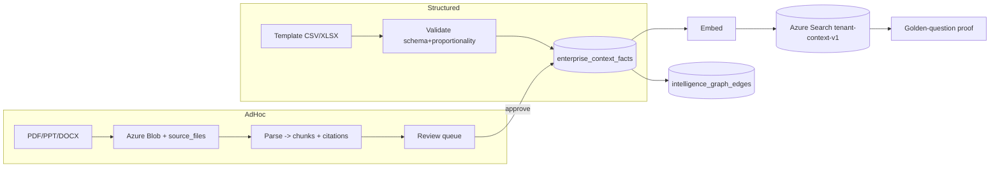

# Setup/Admin Loader — design for "perfect" context intake

**Goal:** make the Admin data loader the place where a client's context becomes
*real, proportional, deep, and answerable* — so that attaching it to Sentinel/Nexus
is downstream and nearly automatic. We perfect **intake** first; "training" the agents
is mostly a consequence of good intake.

**Why intake first.** The grounded audit proved the rest of the stack works: retrieval,
Anthropic synthesis, grounding guards, and no-fabrication all behave. The only weak
corner of the RAG triangle is the **data**. Highest leverage = the loader.

**The one guardrail.** "Perfect" is measured by **answerability**, not form aesthetics.
Every template ships a golden-question set; a dimension is *done* only when:
`load template → ask the golden questions → grounded, cited answers` (the retrieval-proof loop).

---

## 1. Anatomy of a dimension template (every dimension gets all 5)

1. **Schema** — the columns/fields (a `.template.csv` with header + worked example rows).
2. **How-to-fill page** — plain-language, field-by-field, with good/bad examples + the
   realism guidance for this dimension.
3. **Realism / proportionality** — reference ranges keyed to the tenant's **org profile**
   (see §3), so entries are plausible *and* internally consistent (e.g. exec count, IT
   budget %, team sizes, KPI targets all align to org size + industry).
4. **Validation** — schema (required/typed), cross-field, and proportionality checks at
   upload. Fail loud with specific messages; offer a "this looks low/high for an org your
   size" warning, not just a hard error.
5. **Output contract** — which `enterprise_context_*` fact types it produces, which graph
   edges, which CXO questions it answers, and the provenance/citation each row carries.

> The first fully-worked exemplar is **Leadership & Org** + **KPI register**
> (`templates/leadership-org/`, `templates/kpi-register/`). All other dimensions copy
> this anatomy.

## 2. The two intake lanes

**A. Structured lane (CSV/JSON/XLSX, schema-validated).** Commits to
`enterprise_context_records` → `enterprise_context_facts` on validation pass. Highest
trust; deterministic mapping; immediately citeable.

**B. Ad-hoc document lane (PDF/PPT/DOCX/XLSX narrative).** Upload → Azure Blob (lineage
in `enterprise_context_source_files`) → parse → `enterprise_context_chunks` with
**page/slide/sheet/cell citations** → candidate-fact extraction → **review-required
queue** (a human approves before facts commit). Per the AGENTS.md ingestion truth
standard, document-derived facts are **never auto-committed**; they enter review unless a
tested, template-specific parser proves deterministic mapping.

## 3. The proportionality engine (the realism backbone)

One **org profile** per tenant drives expected ranges everywhere, so an $11.2B health system
like Meridian never shows "2 executives" or a "$50K IT budget." Profile attributes (see
`org-profile.template.csv`): industry, sub-vertical (provider vs payer), annual revenue,
total headcount, # operating entities (hospitals / plans), staffed beds (provider) or
covered members (payer), IT budget %, fiscal year.

The engine produces, per dimension, an **expected band** and flags out-of-band entries:

| Dimension | Proportionality rule (anchor) |
|---|---|
| Leadership count | C-suite scales with revenue/entities (Meridian ~$11.2B → ≈14–20 system C-suite + per-entity CEO/CMO/CNO) |
| IT budget | ≈3–5% of revenue (Meridian: $340M = 3.0% of $11.2B); show $ and % |
| Security team | ≈ small % of IT FTE; scales with revenue + risk profile |
| Applications (CMDB) | hundreds–thousands for an Epic-core system |
| Vendor contracts | dozens–hundreds; top-N concentration |
| KPI counts per role | provider CFO ≈30, COO ≈30, CEO ≈15–20 (see metric catalog) |

> Anchors are *reference ranges to sanity-check input*, not hard limits — a client can
> override with a justification (kept as provenance).

## 4. Visible intake state machine (the user must SEE each state)

`uploaded → blob-staged → parsed → validated → committed (facts) → embedded → indexed →
retrieval-proven`. Never collapse these into "loaded." The UI shows where each file is and
what's left. "Available to the agent" = the last state (retrieval-proven), not the first.

## 5. Retrieval-proof loop (definition of done per dimension)

Each template ships ~10 golden questions (6 positive / 2 partial / 2 negative). After load:
run them headless via the real `askIntelligence` and grade: **recall@5 ≥ 0.90,
citation-support ≥ 0.95, completeness ≥ 0.85, hallucination = 0, tenant-leakage = 0**
(the §8.4 battery). A dimension reaches **L3 Answerable** only when these pass; **L4
Best-in-class** when benchmarked to function-pack depth + monitored nightly.

## 6. Rollout
Build the framework on the exemplar (Leadership/Org + KPIs) end-to-end → prove via the
loop → replicate the anatomy to the remaining ~22 dimensions. Do not mass-produce
templates before the exemplar passes the loop.
