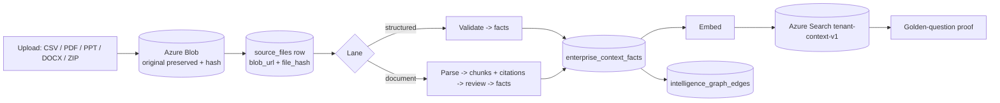

# Setup/Admin Loader — design for "perfect" context intake

**Goal:** make the Admin data loader the place where a client's context becomes
*real, proportional, deep, and answerable* — so that attaching it to Sentinel/Nexus
is downstream and nearly automatic. We perfect **intake** first; "training" the agents
is mostly a consequence of good intake.

**Why intake first.** The grounded audit proved the rest of the stack works: retrieval,
Anthropic synthesis, grounding guards, and no-fabrication all behave. The only weak
corner of the RAG triangle is the **data**. Highest leverage = the loader.

**The one guardrail.** "Perfect" is measured by **answerability**, not form aesthetics.
Every template ships a golden-question set; a dimension is *done* only when:
`load template → ask the golden questions → grounded, cited answers` (the retrieval-proof loop).

---

## 1. Anatomy of a dimension template (every dimension gets all 5)

1. **Schema** — the columns/fields (a `.template.csv` with header + worked example rows).
2. **How-to-fill page** — plain-language, field-by-field, with good/bad examples + the
   realism guidance for this dimension.
3. **Realism / proportionality** — reference ranges keyed to the tenant's **org profile**
   (see §3), so entries are plausible *and* internally consistent (e.g. exec count, IT
   budget %, team sizes, KPI targets all align to org size + industry).
4. **Validation** — schema (required/typed), cross-field, and proportionality checks at
   upload. Fail loud with specific messages; offer a "this looks low/high for an org your
   size" warning, not just a hard error.
5. **Output contract** — which `enterprise_context_*` fact types it produces, which graph
   edges, which CXO questions it answers, and the provenance/citation each row carries.

> The first fully-worked exemplar is **Leadership & Org** + **KPI register**
> (`templates/leadership-org/`, `templates/kpi-register/`). All other dimensions copy
> this anatomy.

## 2. GATE 0 — preserve the original in Blob FIRST (hard gate, both lanes)

**Every upload — structured *and* document, Admin page *and* bulk/zip — stages the
original file to Azure Blob BEFORE any parse/commit, and records a retrievable pointer.**
A fact may never exist without a preserved, hash-verified original behind it.

Acceptance criteria (all required, both lanes):
- Original bytes written to Azure Blob (governed container, tenant-partitioned path).
- `enterprise_context_source_files` row carries: **blob URI / object key** (durable, not a
  local path), **content `file_hash`** (sha256), byte size, filename, uploaded-by, ingested-at.
- The original is **re-downloadable** from the pointer and the hash re-verifies
  (parse/chunk/fact steps re-run from Blob, not from the request body).
- "Show me the source" for any fact resolves to the preserved original (file + page/row).

> **Schema requirement:** `enterprise_context_source_files` currently has `source_file`
> (name) + `file_hash` + free-text `source_path`/`evidence_pointer`, with **no enforced
> Blob pointer**. Add a required `blob_url` (or `object_key` + `container`) column and make
> `file_hash` NOT NULL on commit. `source_path` must be the Blob URI, never a local path.

## 3. The two intake lanes (both are Blob-first)

**A. Structured lane (CSV/JSON/XLSX).** Upload → **Blob (Gate 0)** → schema +
proportionality validate → commit `enterprise_context_records` → `enterprise_context_facts`.
Deterministic, immediately citeable — *but still preserved in Blob first.*

**B. Ad-hoc document lane (PDF/PPT/DOCX/XLSX narrative).** Upload → **Blob (Gate 0)** →
parse → `enterprise_context_chunks` with **page/slide/sheet/cell citations** →
candidate-fact extraction → **review-required queue** (human approves before facts commit).
Per the AGENTS.md truth standard, document-derived facts are **never auto-committed**.

## 4. The proportionality engine (the realism backbone)

One **org profile** per tenant drives expected ranges everywhere, so an $11.2B health system
like Meridian never shows "2 executives" or a "$50K IT budget." Profile attributes (see
`org-profile.template.csv`): industry, sub-vertical (provider vs payer), annual revenue,
total headcount, # operating entities (hospitals / plans), staffed beds (provider) or
covered members (payer), IT budget %, fiscal year.

The engine produces, per dimension, an **expected band** and flags out-of-band entries:

| Dimension | Proportionality rule (anchor) |
|---|---|
| Leadership count | C-suite scales with revenue/entities (Meridian ~$11.2B → ≈14–20 system C-suite + per-entity CEO/CMO/CNO) |
| IT budget | ≈3–5% of revenue (Meridian: $340M = 3.0% of $11.2B); show $ and % |
| Security team | ≈ small % of IT FTE; scales with revenue + risk profile |
| Applications (CMDB) | hundreds–thousands for an Epic-core system |
| Vendor contracts | dozens–hundreds; top-N concentration |
| KPI counts per role | provider CFO ≈30, COO ≈30, CEO ≈15–20 (see metric catalog) |

> Anchors are *reference ranges to sanity-check input*, not hard limits — a client can
> override with a justification (kept as provenance).

## 5. Visible intake state machine (the user must SEE each state)

`uploaded → blob-staged → parsed → validated → committed (facts) → embedded → indexed →
retrieval-proven`. Never collapse these into "loaded." The UI shows where each file is and
what's left. "Available to the agent" = the last state (retrieval-proven), not the first.

## 6. Retrieval-proof loop (definition of done per dimension)

Each template ships ~10 golden questions (6 positive / 2 partial / 2 negative). After load:
run them headless via the real `askIntelligence` and grade: **recall@5 ≥ 0.90,
citation-support ≥ 0.95, completeness ≥ 0.85, hallucination = 0, tenant-leakage = 0**
(the §8.4 battery). A dimension reaches **L3 Answerable** only when these pass; **L4
Best-in-class** when benchmarked to function-pack depth + monitored nightly.

## 7. Rollout
Build the framework on the exemplar (Leadership/Org + KPIs) end-to-end → prove via the
loop → replicate the anatomy to the remaining ~22 dimensions. Do not mass-produce
templates before the exemplar passes the loop.

## 8. Pressure-testing the Admin load page (must pass before "go")

The governed path is only real if the **Admin load UI** actually does Gate 0. Test matrix:

| Test | Expect |
|---|---|
| Upload a CSV via the Admin page | Original lands in Blob; `source_files.blob_url` + `file_hash` set; re-download verifies |
| Upload a **ZIP / multi-file** (manifest) | Each file preserved in Blob individually; manifest recorded; loose multi-file supported |
| Upload a PDF/PPTX/DOCX | Preserved in Blob; parsed to chunks with page/slide citations; facts enter **review queue** (not auto-committed) |
| Re-upload same file | Idempotent by hash; no duplicate originals; supersession recorded |
| Large file / many files | No timeout; streamed to Blob; backpressure handled |
| Malformed / oversized / wrong-type | Rejected with a specific message; nothing half-committed |
| Sensitive content | `sensitive-upload-guard` enforced; PHI handling per policy |
| Tenant scoping | File lands under the correct tenant partition; no cross-tenant path |
| "Show source" round-trip | A committed fact resolves to its preserved original (file + page/row) |
| Kill mid-load | No orphan facts without a preserved original; resumable/cleanly failed |

Definition of go-live for the Admin loader: **all rows pass** + the dimension's golden
questions answer grounded+cited (§5/§6). Capture evidence (blob URIs, hashes, screenshots).

## 9. Current state (2026-06-07) — preservation GAP to remediate

Verified on the live Azure DB: Meridian's 15 `enterprise_context_source_files` rows have
`file_hash = NULL`, `source_path` = a **dead local `/private/tmp/...` laptop path**, and
**no Blob pointer** — i.e. the data was generated locally and committed **outside** the
governed Blob-first path. The facts answer, but the **originals are not preserved/retrievable**.

Remediation:
1. Add `blob_url`/`object_key` (+ require `file_hash`) to `enterprise_context_source_files`.
2. Make the Admin load route (and the bulk/zip path) **stage to Blob first** (Gate 0) — the
   blob-first mechanism already exists in `src/lib/ingestion/azure-landing-zone-consumer.ts`;
   wire the Admin page to it (or replicate Gate 0 in the route).
3. **Re-ingest** the existing tenant files through the governed path so originals + hashes
   are preserved (source CSVs must be re-supplied — the `/tmp` copies are gone).
4. Pressure-test (§7) before declaring the loader pilot-ready.
