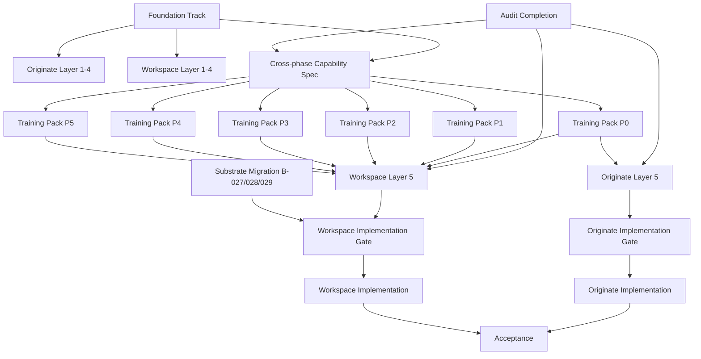

# Strategic Moves Detail Pages + Agent Training
## Work Breakdown Structure & Execution Plan

| | |
|---|---|
| **Doc ID** | `STRATEGIC_MOVES_DETAIL_PAGES_WBS_2026-05-05` |
| **Version** | 0.3 — All §12 decisions resolved |
| **Author** | Claude (this chat) for Anand |
| **Date** | 2026-05-05 |
| **Status** | Decisions resolved · ready for kickoff |
| **Repo path** | `docs/design/strategic-moves/SPECS_AND_AGENT_TRAINING_WBS.md` |
| **Supersedes** | — (new) |
| **Depends on** | `PHASE_MODEL_V2_DOCTRINE.md`, `15-workspace-v0.2.html`, `PHASE_PATTERN_BINDING_MATRIX_2026-05-05.md`, audit deliverables (in flight) |

---

## 1 · Executive Summary

### 1.1 What this document is

A **complete work breakdown** for designing, specifying, training the agent for, and shipping the two Strategic Moves detail pages:

1. **Workspace** (`/strategic-moves/[moveId]?phase=N`) — the page where users work a Move through its 6 phases
2. **Originate** (`/strategic-moves/new`) — the page where users convert a signal into a chartered Move

Both pages must operate on the same workspace shell with phase rail, chat-left/canvas-right split, and seamless transitions (per locked Workspace v0.2 spec and the user-flow cascade approved 2026-05-05).

The document also covers **Nexus agent training** — the per-phase configuration of patterns, workflows, prompts, evidence rules, and gates that Nexus needs to behave correctly within the Workspace canvas across all 6 phases.

### 1.2 Why this WBS exists

The Workspace v0.2 design is locked. The flow cascade is approved. The phase model is locked at 6 phases. The audit is in flight. We are now at the riskiest moment of any product effort: **the gap between "design approved" and "code shipped."**

Without a structured WBS, three failure modes emerge:

1. **Spec drift** — implementation invents details the design didn't specify, design gets blamed for ambiguity it never had
2. **Substrate gaps surface late** — UI promises data the substrate doesn't yet have; debt found during demo, not during planning
3. **Agent behaves wrong** — Nexus is built into the canvas without the per-phase training, agent hallucinates or stays silent at moments it should act

This document prevents all three by enumerating every spec deliverable, every substrate dependency, every agent training pack, and the order they must be executed in.

### 1.3 Critical numbers

| | |
|---|---|
| **Total work packages** | 47 |
| **Estimated effort (Claude Code)** | 280–340 hours |
| **Estimated effort (Anand review)** | 40–55 hours |
| **Estimated calendar duration (sequential)** | 7 weeks |
| **Estimated calendar duration (with parallelism where safe)** | 5 weeks |
| **Hard blockers before any work starts** | 1 (methodology doc · audit complete via PR #1526) |
| **Open decisions before WBS executes** | 0 (all resolved 2026-05-05; see §12) |

### 1.4 Top three risks

1. **Audit incomplete or disputed** — Layer 5 (Knowledge Surfacing) of both pages depends on the audit's binding matrix, pattern bundles, and reconciliation. If audit is contested or rolled back, Layer 5 timeline collapses. Mitigation: complete audit and lock §11/§12 reconciliation before any Layer 5 drafting starts.
2. **Substrate migration drag** — code substrate currently encodes 8 phases. Migration to 6 phases (B-027/B-028/B-029) blocks implementation. Mitigation: substrate migration must complete before Wave 2 implementation but does NOT block Layers 1-5 spec drafting.
3. **Cursor recurrence** — two off-script incidents in 24 hours. Adding more agent participants invites coordination failure. Mitigation: assign all WBS work to Claude Code only; Cursor remains paused on substantive work until track record stabilizes.

---

## 2 · Scope

### 2.1 In scope

- **Workspace page** — 6 phase contexts, 4 view modes (current / past / future / handed-off), all interactions, all data bindings, full Nexus behavioral spec for all 6 phases
- **Originate page** — single P0 context, 7-section scaffold, full Nexus behavioral spec for P0
- **Nexus agent training** — per-phase configuration packs (P0 through P5) implementing the 7-element model and 21-field schema
- **Acceptance demo** — scripted walk-through of both flows from the cascade against shipped pages
- **One foundational deliverable** — the SPEC_METHODOLOGY.md that Claude Code will use as the standing instruction set

### 2.2 Out of scope (this WBS)

- Portfolio dashboard redesign — not the detail pages
- Tower handoff target page — Tower's own surface, separate WBS
- Move switcher (cmd+K) — flagged as v2 in Workspace v0.2 spec, deferred
- Cross-Move navigation memory — deferred
- Atlas (Tower's agent) training — Tower scope, separate WBS
- Mobile responsive treatment — desktop-first for v1; mobile deferred to v2
- Internationalization — deferred
- Permissions & RLS hardening — Phase B/C work, separately tracked (B-022, B-023)
- Substrate migration from 8 to 6 phases — separately tracked (B-027, B-028, B-029); this WBS depends on it being complete for *implementation* but NOT for spec drafting

### 2.3 Definition of done — page level

A detail page is "done" when:

1. Both flows from the cascade (`moves-flow-cascade.html`) walk through end-to-end against the shipped page without engineer intervention
2. All 5 layers of the spec are signed off and committed to repo
3. All Nexus per-phase agent packs are deployed and pass their evidence/anti-hallucination tests
4. The page survives the smoke-test demo across all 5 demo tenants without crashing or rendering "—" on required fields
5. The acceptance demo script (§11.4) executes cleanly with Anand observing

### 2.4 Definition of done — agent training pack level

A per-phase agent pack is "done" when:

1. All 21 fields of the schema are populated with non-null values
2. Required patterns load from the catalog without 404
3. Workflow steps execute against the substrate without permission errors
4. Anti-hallucination rules are testable and tested (e.g., "agent cannot quote a baseline number without a `baseline_evidence_chain` reference")
5. Gate self-approval logic produces correct verdicts on 5 fixture scenarios per phase

---

## 3 · The Five-Layer Spec Methodology

Each detail page is specified across five layers. Each layer prevents a specific failure mode. Layers are drafted in order; later layers reference vocabulary established in earlier layers.

### 3.1 Layer 1 — Page Anatomy

**What it is:** A hierarchical map of every zone, panel, and element on the page, with stable IDs that all subsequent layers reference.

**Format:** One markdown doc per page, 2-4 pages, with annotated screenshot.

**Stable ID convention:** `{page}-{zone}-{component}-{instance}`
- Examples: `ws-canvas-gate-item-3`, `ws-rail-phase-node-p2`, `orig-canvas-brief-section-3`

**Acceptance:** Every clickable, every visible field, every container has an ID. No element exists in design that isn't in the anatomy.

**Failure mode prevented:** Implementation drift where engineers invent their own naming and three weeks later nobody can map the spec to the code.

### 3.2 Layer 2 — State Inventory

**What it is:** Enumeration of every state the page can be in, parameterized by Move state, user role, view mode, and lifecycle status.

**Format:** State matrix table per page. Rows are state combinations; columns are visibility/enable/disable per element ID from Layer 1.

**Workspace state dimensions:**
- `viewMode`: current | past | future | handed-off
- `gateState`: not-evaluated | failing | partial | ready | promoted
- `userRole`: viewer | contributor | lead | sponsor | governance
- `moveLifecycle`: drafting | active | paused | handed-off | archived

Combinations matter: `viewMode=current + gateState=ready + userRole=sponsor` → Promote enabled. `viewMode=past + userRole=viewer` → no actionables.

**Acceptance:** Every meaningful state combination has a row. Edge cases (paused, no sponsor assigned, missing baseline) are explicit, not implicit.

**Failure mode prevented:** "Happy path" implementation that breaks on every edge case demo.

### 3.3 Layer 3 — Click & Interaction Inventory

**What it is:** Specification of every interactive element — what it does, what state changes, what URL impact, what keyboard equivalent, what focus management.

**Format:** Table per page, one row per interaction.

**Required columns:**
- Target element ID
- Trigger (click / keyboard / hover)
- Action (mutation, navigation, panel toggle, modal open)
- State change (before → after, referencing Layer 2 states)
- Side effects (Nexus rescope, cache invalidation, analytics event)
- URL impact (none, query param, full route change)
- Keyboard equivalent
- Focus target after action
- Loading/error treatment

**Acceptance:** Every clickable from Layer 1 has a row. Keyboard navigation order is specified for the page as a whole.

**Failure mode prevented:** Features ship but navigation feels jagged — no shortcuts, focus jumps weirdly, URLs don't update.

### 3.4 Layer 4 — Data Binding Spec

**What it is:** For every visible field → data source, refetch rules, fallback, ownership. For every interaction → mutation API, optimistic update behavior, rollback.

**Format:** Two tables per page: read-bindings, write-bindings.

**Required columns (read):**
- Element ID
- DB table / view
- Query API route
- Computed vs stored
- Refetch trigger
- Fallback when null/missing
- Update permissions

**Required columns (write):**
- Interaction ID (from Layer 3)
- Mutation API route
- Optimistic update strategy
- Rollback on failure
- Audit log entry shape
- Side effects (other tables, notifications, agent re-scope)

**Acceptance:** Every binding maps to existing substrate or to a tracked substrate gap (linked to backlog item). No "TBD."

**Failure mode prevented:** Shipping a UI that looks finished but renders "—" or "Untitled Move" everywhere because the substrate doesn't have the data.

### 3.5 Layer 5 — Knowledge Layer Surfacing Spec

**What it is:** Per-phase Nexus integration — what patterns load when, what the first message says, what evidence rules apply, what the agent must NOT do.

**Format:** Six per-phase sub-sections (Workspace) or one section (Originate). Each section specifies:

- **Pattern bundle** — required + optional patterns (from binding matrix §3)
- **First-message scaffold** — the prompt Nexus opens with when user enters this phase, parameterized by Move state
- **Suggested chip ladder** — what action chips show under the agent's first message, with state-dependent variation
- **Evidence rules** — for each kind of claim Nexus can make, what evidence chain must be cited
- **Anti-hallucination rules** — explicit prohibitions (e.g., "never quote a baseline number without `baseline_evidence_chain`")
- **Hand-off contract** — what state Nexus leaves the canvas in when user navigates away, what's preserved

**Hard dependency:** Layer 5 cannot start until the audit's binding matrix §11 reconciliation items and §12 open questions are resolved.

**Acceptance:** For each phase, Nexus can be replayed against 5 fixture Moves and produces the spec'd first message, suggests the spec'd chips, and respects all evidence and anti-hallucination rules.

**Failure mode prevented:** Nexus that hallucinates baseline numbers, makes up sponsor recommendations without ACL evidence, or proposes architecture patterns that don't exist in the catalog.

### 3.6 Layer interaction map

```
Layer 1 (Anatomy)
   │ provides: stable IDs
   ▼
Layer 2 (State) ──── references IDs from Layer 1
   │ provides: state combinations
   ▼
Layer 3 (Click) ───── references IDs from Layer 1, states from Layer 2
   │ provides: interactions, URL changes
   ▼
Layer 4 (Data) ───── references IDs (Layer 1), interactions (Layer 3)
   │ provides: data contracts, mutations
   ▼
Layer 5 (Knowledge) ─ references all of the above + audit binding matrix
   │ provides: agent behavior contracts
   ▼
Implementation gate — page can be built when all 5 layers are signed off
```

---

## 4 · Nexus Agent Training Framework

This is the framework Anand drafted in the prior session, formalized here into deliverables.

### 4.1 Why a separate framework (not just Layer 5)

Layer 5 specifies *what Nexus does on a given page in a given phase*. The training framework specifies *what Nexus knows, what it can produce, what it must validate, what it can self-approve* — independent of which page is hosting it.

The separation matters because:
- Layer 5 is page-coupled (lives next to the page spec, evolves with it)
- Training framework is phase-coupled (lives next to the phase doctrine, evolves with the substrate)
- Multiple surfaces will eventually invoke Nexus (Workspace today; potentially Tower replays, Originate retrospectives, etc.) — the training pack is reusable; the Layer 5 spec is not

### 4.2 The 7-element model per phase

Each phase (P0 through P5) gets a training pack with seven elements:

| # | Element | Definition | Where it comes from |
|---|---|---|---|
| 1 | **Phase mission** | One-sentence statement of what this phase exists to accomplish | Phase doctrine v0.2 |
| 2 | **Pattern bundle** | Required + optional patterns Nexus loads when entering this phase | Audit binding matrix §3 |
| 3 | **Guided workflow** | 4-6 step ladder Nexus walks user through during the phase | Drafted per-phase, derived from gate criteria |
| 4 | **Workshop / session playbook** | Templates for sponsor sessions, design workshops, gate reviews | Drafted per-phase, references existing meeting templates |
| 5 | **Artifact contract** | Required + optional artifacts Nexus produces or assists on, with shape spec | Existing deliverable catalog (`d19_*`, `d21_*`, etc.) |
| 6 | **Evidence / anti-hallucination rules** | What claims need citation, what claims are prohibited | Drafted per-phase, references substrate fields that count as evidence |
| 7 | **Gate and self-approval logic** | When Nexus can mark a criterion met without human input, when human required | Existing `governance.ts` rules, extended per-phase |

### 4.3 The 21-field per-phase config schema

Each training pack is serialized as a structured config (TypeScript or JSON) with these 21 fields. Storage location TBD (likely `src/lib/intelligence/phase-packs/{phase_id}.ts`, replacing the old phase-packs directory after substrate migration B-028 lands).

| # | Field | Type | Notes |
|---|---|---|---|
| 1 | `phase_id` | enum P0–P5 | Primary key |
| 2 | `phase_name` | string | "Originate", "Charter", etc. |
| 3 | `phase_intent` | string | One-sentence mission |
| 4 | `entry_criteria` | array of criterion objects | What must be true to enter this phase |
| 5 | `workflow_steps` | array of `WorkflowStep` (see §4.5) | The guided ladder |
| 6 | `required_patterns` | array of pattern IDs | Must load when entering phase |
| 7 | `optional_patterns` | array of pattern IDs | Loaded on demand |
| 8 | `required_artifacts` | array of artifact codes | Must be produced before gate |
| 9 | `optional_artifacts` | array of artifact codes | Available but not gating |
| 10 | `workshop_playbooks` | array of playbook references | Templates Nexus can run |
| 11 | `meeting_templates` | array of template references | Pre-meeting briefs, post-meeting captures |
| 12 | `agent_questions` | array of canonical questions | The questions Nexus asks during the phase |
| 13 | `coaching_rules` | array of rules | When/how Nexus nudges user |
| 14 | `evidence_requirements` | array of evidence rules | Which claims need which citations |
| 15 | `failure_modes_to_check` | array of failure mode IDs | From `failure-modes.ts` |
| 16 | `value_levers` | array of value lever IDs | What value mechanisms apply this phase |
| 17 | `sourcing_triggers` | array of trigger conditions | When to surface Source integration |
| 18 | `gate_criteria` | array of criterion objects | Promotion criteria to next phase |
| 19 | `self_approval_rules` | array of rules | What Nexus can mark met without human |
| 20 | `artifact_generation_rules` | array of rules | When/how Nexus drafts artifact content |
| 21 | `anti_hallucination_rules` | array of prohibitions | Explicit "must not" rules |

### 4.4 Inner schema — `WorkflowStep`

Each `workflow_steps` entry has its own structure:

| Field | Type | Notes |
|---|---|---|
| `step_id` | string | Stable identifier within phase |
| `step_name` | string | Human-readable name |
| `step_goal` | string | What this step accomplishes |
| `required_user_inputs` | array | What user must provide |
| `accepted_uploads` | array of MIME types | What file uploads are accepted |
| `patterns_to_load` | array of pattern IDs | Step-specific patterns |
| `questions_to_ask` | array | Canonical questions |
| `artifact_sections_to_update` | array of section refs | Which artifact sections this step writes to |
| `evidence_to_capture` | array | Evidence types to capture during step |
| `quality_checks` | array | What Nexus validates before marking step done |
| `completion_criteria` | array | Conditions for step done |

### 4.5 Cross-phase capabilities

Independent of any single phase, Nexus has cross-phase capabilities that need to be specified once and applied everywhere:

| Capability | Description | Where specified |
|---|---|---|
| `prepare_session` | Generate pre-read for an upcoming workshop | Cross-phase capability doc |
| `run_or_support_session` | Active facilitation during a live session | Cross-phase capability doc |
| `ingest` | Process uploaded artifacts (decks, docs, audio transcripts) | Cross-phase capability doc |
| `synthesize` | Produce structured findings from unstructured inputs | Cross-phase capability doc |
| `generate_artifacts` | Draft artifact content per `artifact_generation_rules` | Per-phase + global rules |
| `coach` | Nudge user with phase-appropriate prompts | Per-phase `coaching_rules` |
| `gate` | Evaluate gate criteria, produce verdicts | Per-phase `gate_criteria` + `self_approval_rules` |
| `stay_simple` | Keep responses brief, avoid jargon dumps | Global behavioral rule |

### 4.6 Per-phase scoping

Per the locked phase doctrine v0.2:

| Phase | Mission (1-line) | Estimated training pack effort |
|---|---|---|
| P0 Originate | Convert signal/hypothesis to structured Move with sponsor candidate | 12–16 hrs |
| P1 Charter | Convert hypothesis to sponsor-committed charter with value range | 14–18 hrs |
| P2 Discover & Diagnose | Lock current-state baseline with auditable evidence | 16–20 hrs |
| P3 Design Future State | Convert diagnosis to signed decision (architecture + business case) | 18–22 hrs |
| P4 Roadmap & Business Case | Convert design to executable plan with economics | 16–20 hrs |
| P5 Mobilize & Handoff | Prepare delivery team and hand off to Tower | 12–16 hrs |
| **Cross-phase capabilities** | Specified once, applied across all 6 | 10–14 hrs |
| **Total** | | **98–126 hrs** |

### 4.7 Acceptance criteria — agent training pack

A per-phase training pack is accepted when:

1. All 21 fields are populated (no nulls except where field is genuinely empty for this phase)
2. Required patterns resolve to existing pattern catalog entries (no 404)
3. Required artifacts resolve to existing deliverable codes (no orphans)
4. Workflow steps each pass their `completion_criteria` against fixture scenarios
5. Evidence rules are tested: 3 positive cases (claim with valid evidence) and 3 negative cases (claim without evidence, must be blocked)
6. Anti-hallucination rules are tested: 3 prohibited prompts produce appropriate refusal
7. Self-approval logic produces correct verdicts on 5 fixture moves per phase

---

## 5 · Work Breakdown Structure

The WBS is organized in five tracks. Tracks 5.0 and 5.1-5.4 are the primary execution; track 5.5 is acceptance.

### 5.0 Foundation Track

| ID | Work Package | Deliverable | Dependencies | Owner | Hours | Acceptance |
|---|---|---|---|---|---|---|
| **F-01** | Spec methodology doc | `docs/design/strategic-moves/specs/SPEC_METHODOLOGY.md` defining the 5 layers, conventions, file structure, sign-off process | None | Claude (chat) | 3 | Doc committed; 3 reviewers can independently produce a Layer 1 anatomy following it |
| **F-02** | Spec repo skeleton | Directory structure under `docs/design/strategic-moves/specs/` with placeholder files for each layer × each page | F-01 | Claude Code | 1 | Files exist, README explains layout |
| **F-03** | Stable ID convention doc | One-page convention spec for stable IDs (per §3.1) | F-01 | Claude Code | 2 | Convention referenced in F-01; anatomy work uses it |
| **F-04** | Audit completion gate | Confirmation that all 7 remaining audit deliverables landed and §11/§12 reconciliation items resolved | Audit (in flight, separate WBS) | Anand | — | All audit docs merged to main; reconciliation log committed |
| **F-05** | Substrate migration plan | Migration plan from 8-phase to 6-phase substrate, with rollout sequence | F-04, audit binding matrix | Claude Code | 8 | Plan reviewed by Anand; B-027/B-028/B-029 backlog items have concrete tickets |
| **F-06** | Decision log template | Template for capturing in-flight decisions during spec drafting | F-01 | Claude (chat) | 1 | Template lives in spec methodology |

**Foundation total:** 15 hours · 2-3 days · BLOCKS all subsequent tracks

---

### 5.1 Originate Page Track

Originate is the simpler page. Doing it first validates the methodology before tackling Workspace.

#### 5.1.1 Layer 1 — Anatomy (Originate)

| ID | Work Package | Deliverable | Dependencies | Owner | Hours |
|---|---|---|---|---|---|
| O-1.1 | Originate page anatomy doc | `specs/originate/01-anatomy.md` with zone map, element IDs · **MUST explicitly specify**: (a) scaffold list lives in chat lane (NOT canvas) — counterintuitive but deliberate per cascade Flow 2; (b) brief sections live in canvas lane (NOT chat); (c) phase rail short-name vs identity-card full-name treatment (substrate gap: `PHASE_SHORT_NAMES` constant does not exist, must be added) | F-01, F-02, F-03 | Claude Code | 4 |
| O-1.2 | Annotated screenshot | PNG with stable IDs overlaid on flow cascade frame 2 | O-1.1 | Claude Code | 2 |
| O-1.3 | Sign-off | Anand review + signoff | O-1.1, O-1.2 | Anand | 1 |

**Subtotal:** 7 hrs

#### 5.1.2 Layer 2 — State (Originate)

| ID | Work Package | Deliverable | Dependencies | Owner | Hours |
|---|---|---|---|---|---|
| O-2.1 | State dimensions doc | `specs/originate/02-state.md` enumerating dimensions for Originate (briefCompleteness, sponsorState, foundationState, etc.) | O-1.1 | Claude Code | 3 |
| O-2.2 | State matrix | Matrix table mapping state combos to visibility/enable per element | O-2.1 | Claude Code | 4 |
| O-2.3 | Edge case enumeration | List of edge cases with handling. **MUST cover**: (a) no sponsor available · (b) foundation F1-F4 all red · (c) classification ambiguous · (d) **tab close mid-origination — where draft persists, what URL/state user returns to** (resolves D-11) · (e) multiple users opening `/new` simultaneously (collision behavior) | O-2.2, D-11 resolved | Claude Code | 3 |
| O-2.4 | Sign-off | Anand review | O-2.3 | Anand | 2 |

**Subtotal:** 12 hrs

#### 5.1.3 Layer 3 — Click & Interaction (Originate)

| ID | Work Package | Deliverable | Dependencies | Owner | Hours |
|---|---|---|---|---|---|
| O-3.1 | Interaction inventory | `specs/originate/03-interactions.md` with one row per clickable. **MUST specify**: future phase nodes (P1-P5) on rail are non-interactive in Originate context — not clickable, no hover affordance, render with `disabled` semantics (cascade implies but does not draw this) | O-1.1, O-2.2 | Claude Code | 4 |
| O-3.2 | Keyboard navigation order | Tab order, focus targets, keyboard shortcuts | O-3.1 | Claude Code | 2 |
| O-3.3 | URL state spec | What URL params do, what's preserved across reloads | O-3.1 | Claude Code | 2 |
| O-3.4 | Loading + error states per interaction | What user sees during fetch, what error UX looks like | O-3.1 | Claude Code | 3 |
| O-3.5 | Sign-off | Anand review | O-3.4 | Anand | 2 |

**Subtotal:** 13 hrs

#### 5.1.4 Layer 4 — Data Binding (Originate)

| ID | Work Package | Deliverable | Dependencies | Owner | Hours |
|---|---|---|---|---|---|
| O-4.1 | Read bindings table | `specs/originate/04-data-bindings.md` — every visible field → DB source | O-1.1, O-2.2 | Claude Code | 5 |
| O-4.2 | Write bindings table | Every interaction → mutation API, optimistic strategy, rollback | O-3.1 | Claude Code | 5 |
| O-4.3 | Substrate gap log | List of bindings that have no current substrate support, linked to backlog | O-4.1, O-4.2 | Claude Code | 2 |
| O-4.4 | Audit log spec | What audit_log entries each Originate mutation produces | O-4.2 | Claude Code | 2 |
| O-4.5 | Sign-off | Anand review of substrate gaps especially | O-4.4 | Anand | 3 |

**Subtotal:** 17 hrs

#### 5.1.5 Layer 5 — Knowledge Surfacing (Originate)

**HARD BLOCK on F-04 (audit completion).**

| ID | Work Package | Deliverable | Dependencies | Owner | Hours |
|---|---|---|---|---|---|
| O-5.1 | P0 first-message scaffold | `specs/originate/05-knowledge-surfacing.md` — opening prompt parameterized by entry context (empty / partial draft / paste-then-extract) | F-04, P0 training pack T-P0 | Claude Code | 4 |
| O-5.2 | Suggested chip ladder | Action chips with state-dependent variation, mapping to Layer 3 interactions | O-5.1, O-3.1 | Claude Code | 3 |
| O-5.3 | Evidence rules for Originate claims | When Nexus extracts hypothesis from pasted text, what evidence chain is captured | O-5.1 | Claude Code | 3 |
| O-5.4 | Anti-hallucination rules | Explicit prohibitions for P0 (e.g., "must not propose sponsor without ACL evidence") | O-5.3 | Claude Code | 2 |
| O-5.5 | Hand-off contract | What state Nexus leaves canvas in when user navigates away mid-Originate | O-5.1 | Claude Code | 2 |
| O-5.6 | Fixture test scenarios | 5 fixture inputs + expected Nexus behaviors | O-5.1 through O-5.5 | Claude Code | 4 |
| O-5.7 | Sign-off | Anand + spot-check on fixtures | O-5.6 | Anand | 3 |

**Subtotal:** 21 hrs

#### 5.1.6 Originate Implementation Gate

| ID | Work Package | Deliverable | Dependencies | Owner | Hours |
|---|---|---|---|---|---|
| O-IG | Implementation readiness review | Confirmation all 5 layers signed; substrate gaps closed or scoped to backlog; agent pack ready | O-1.3, O-2.4, O-3.5, O-4.5, O-5.7, T-P0 | Anand | 2 |

**Originate track total:** 72 hours · ~9 working days ($\sim$2 calendar weeks at 1 dev throughput) · 13 hrs Anand review

---

### 5.2 Workspace Page Track

Workspace is larger. Each layer expands across 6 phase contexts and 4 view modes.

#### 5.2.1 Layer 1 — Anatomy (Workspace)

| ID | Work Package | Deliverable | Dependencies | Owner | Hours |
|---|---|---|---|---|---|
| W-1.1 | Workspace shell anatomy | `specs/workspace/01-anatomy-shell.md` covering elements that exist in all phase contexts (header, rail, chat lane, sponsor strip) · **MUST specify**: phase rail short-name vs identity-card full-name treatment (substrate gap: `PHASE_SHORT_NAMES` constant does not exist) | F-01, F-02, F-03 | Claude Code | 4 |
| W-1.2 | Per-phase canvas anatomy | `specs/workspace/01-anatomy-canvas-{phase}.md` × 6 — what canvas looks like in P0, P1, P2, P3, P4, P5 | W-1.1 | Claude Code | 12 (2 × 6) |
| W-1.3 | View-mode variants | `specs/workspace/01-anatomy-viewmodes.md` — how anatomy changes for past/future/handoff modes | W-1.1, W-1.2 | Claude Code | 4 |
| W-1.4 | Annotated screenshots | Annotated exports of all 4 views from `15-workspace-v0.2.html` + cascade frames | W-1.1, W-1.2, W-1.3 | Claude Code | 4 |
| W-1.5 | Sign-off | Anand review | W-1.4 | Anand | 3 |

**Subtotal:** 27 hrs

#### 5.2.2 Layer 2 — State (Workspace)

| ID | Work Package | Deliverable | Dependencies | Owner | Hours |
|---|---|---|---|---|---|
| W-2.1 | State dimensions doc | `specs/workspace/02-state.md` defining viewMode × gateState × userRole × moveLifecycle | W-1.1 | Claude Code | 3 |
| W-2.2 | State matrix | Combinatorial table — 4 × 5 × 5 × 5 = potentially 500 combinations, but only ~30 are meaningfully distinct | W-2.1 | Claude Code | 8 |
| W-2.3 | Per-phase state nuances | How state matrix specializes per phase (e.g., P0 has no past view; P5 has handoff). **MUST resolve**: P5→Tower gate criteria count — cascade shows 5; current `governance.ts` (still 8-phase vocabulary) has 10 (5 hard, 5 soft) for the legacy P4→P5 gate. Audit binding matrix §11 must reconcile to the canonical 6-phase P5→Tower gate definition before this work package signs off | W-2.2, W-1.2, audit §11 reconciled | Claude Code | 4 |
| W-2.4 | Edge case enumeration | Paused move, missing sponsor, no value-at-stake, gate criteria changed mid-phase | W-2.3 | Claude Code | 3 |
| W-2.5 | Sign-off | Anand review | W-2.4 | Anand | 3 |

**Subtotal:** 21 hrs

#### 5.2.3 Layer 3 — Click & Interaction (Workspace)

| ID | Work Package | Deliverable | Dependencies | Owner | Hours |
|---|---|---|---|---|---|
| W-3.1 | Shell interaction inventory | `specs/workspace/03-interactions-shell.md` — rail clicks, chat input, sponsor strip, etc. | W-1.1, W-2.2 | Claude Code | 4 |
| W-3.2 | Per-phase canvas interactions | `specs/workspace/03-interactions-canvas-{phase}.md` × 6 — gate clicks, artifact shelf, promote, phase-specific actions | W-1.2, W-3.1 | Claude Code | 12 (2 × 6) |
| W-3.3 | View-mode interaction variants | What's disabled in past/future/handoff modes | W-3.1, W-3.2 | Claude Code | 3 |
| W-3.4 | URL state spec | `?phase=N` query param behavior, deep-link handling, browser back/forward · **resolves D-10** | W-3.1, D-10 resolved | Claude Code | 3 |
| W-3.5 | Keyboard navigation | Tab order through workspace, shortcuts (cmd+enter to send, etc.) | W-3.1 | Claude Code | 3 |
| W-3.6 | Loading + error states | Per-interaction UX | W-3.1, W-3.2 | Claude Code | 4 |
| W-3.7 | Sign-off | Anand review | W-3.6 | Anand | 3 |

**Subtotal:** 32 hrs

#### 5.2.4 Layer 4 — Data Binding (Workspace)

| ID | Work Package | Deliverable | Dependencies | Owner | Hours |
|---|---|---|---|---|---|
| W-4.1 | Shell read bindings | `specs/workspace/04-data-shell.md` — Move identity, sponsor, value-at-stake, status | W-1.1 | Claude Code | 4 |
| W-4.2 | Per-phase canvas read bindings | `specs/workspace/04-data-canvas-{phase}.md` × 6 — gate criteria reads, artifact shelf reads, context rail reads | W-1.2 | Claude Code | 18 (3 × 6) |
| W-4.3 | Write bindings — promote | Phase promotion mutation, gate evaluation, audit log | W-3.2, W-4.2 | Claude Code | 4 |
| W-4.4 | Write bindings — gate updates | Per-criterion update mutations, signoff captures | W-3.2 | Claude Code | 4 |
| W-4.5 | Write bindings — artifact updates | Artifact shelf interactions (open, edit, signoff) | W-3.2 | Claude Code | 3 |
| W-4.6 | Substrate gap log | Combined gap log; every gap linked to backlog item | W-4.1 through W-4.5 | Claude Code | 3 |
| W-4.7 | Audit log spec | All Workspace mutations and their audit_log shape | W-4.3, W-4.4, W-4.5 | Claude Code | 3 |
| W-4.8 | Sign-off | Anand review of bindings + gaps | W-4.7 | Anand | 5 |

**Subtotal:** 44 hrs

#### 5.2.5 Layer 5 — Knowledge Surfacing (Workspace)

**HARD BLOCK on F-04 (audit completion).**

| ID | Work Package | Deliverable | Dependencies | Owner | Hours |
|---|---|---|---|---|---|
| W-5.1 | Workspace knowledge surfacing overview | `specs/workspace/05-knowledge-surfacing-overview.md` — how Layer 5 attaches to Workspace, common patterns across phases | F-04, T-P0 through T-P5 | Claude Code | 3 |
| W-5.2 | Per-phase first-message scaffolds | `specs/workspace/05-first-messages-{phase}.md` × 6 — what Nexus says when user enters each phase, parameterized by Move state | W-5.1, T-* | Claude Code | 12 (2 × 6) |
| W-5.3 | Per-phase chip ladders | Per-phase action chips, state variations | W-5.2, W-3.2 | Claude Code | 9 (1.5 × 6) |
| W-5.4 | Past-view replay scaffolds | When user clicks a closed phase, what context Nexus loads (read-only) | W-5.1 | Claude Code | 4 |
| W-5.5 | Future-view preview scaffolds | When user clicks a future phase, what preview Nexus shows | W-5.1 | Claude Code | 3 |
| W-5.6 | Cross-phase navigation hand-off | What Nexus state preserves when user jumps phases via rail | W-5.1, W-3.1 | Claude Code | 3 |
| W-5.7 | Evidence + anti-hallucination rules per phase | Inherited from training packs; here we specify how they manifest in Workspace | T-* | Claude Code | 6 (1 × 6) |
| W-5.8 | Fixture test scenarios | 30 fixtures (5 per phase) with expected Nexus behaviors | W-5.2 through W-5.7 | Claude Code | 12 |
| W-5.9 | Sign-off | Anand + spot-check fixtures | W-5.8 | Anand | 6 |

**Subtotal:** 58 hrs

#### 5.2.6 Workspace Implementation Gate

| ID | Work Package | Deliverable | Dependencies | Owner | Hours |
|---|---|---|---|---|---|
| W-IG | Implementation readiness review | All 5 layers signed; substrate migration complete; agent packs deployed | W-1.5, W-2.5, W-3.7, W-4.8, W-5.9, T-P0 through T-P5, F-05 (substrate migration) | Anand | 3 |

**Workspace track total:** 185 hours · ~23 working days ($\sim$5 calendar weeks at 1 dev throughput) · 23 hrs Anand review

---

### 5.3 Agent Training Track

Per-phase training packs (P0 through P5) plus cross-phase capabilities.

#### 5.3.1 Cross-phase capability spec (T-X)

| ID | Work Package | Deliverable | Dependencies | Owner | Hours |
|---|---|---|---|---|---|
| T-X.1 | Cross-phase capability doc | `docs/design/strategic-moves/agent-training/00-cross-phase-capabilities.md` covering 8 capabilities from §4.5 | F-04 | Claude Code | 6 |
| T-X.2 | Global behavioral rules | `agent-training/00-global-behavioral-rules.md` — stay-simple, evidence-first, no-fabrication | T-X.1 | Claude Code | 3 |
| T-X.3 | Capability-to-phase mapping | Which capabilities apply at which phase, what specializations | T-X.1, T-X.2 | Claude Code | 3 |
| T-X.4 | Sign-off | Anand review | T-X.3 | Anand | 2 |

**Subtotal:** 14 hrs

#### 5.3.2 Per-phase training packs (T-P0 through T-P5)

Each training pack follows the same structure (21 fields × 1 phase). Effort estimates per pack from §4.6.

| ID | Work Package | Deliverable | Dependencies | Owner | Hours |
|---|---|---|---|---|---|
| **T-P0** | P0 Originate training pack | `agent-training/p0-originate.md` + serialized config | T-X, F-04 | Claude Code | 14 |
| T-P0.1 | Phase mission, intent, entry criteria | Fields 1-4 | | | 1 |
| T-P0.2 | Workflow steps (4-6) for P0 | Field 5 — workflow_steps with full inner schema | | | 3 |
| T-P0.3 | Pattern bundle | Fields 6-7 — required_patterns, optional_patterns | | | 1 |
| T-P0.4 | Artifact contracts | Fields 8-11 — artifacts, playbooks, templates | | | 2 |
| T-P0.5 | Agent questions + coaching rules | Fields 12-13 | | | 2 |
| T-P0.6 | Evidence + failure modes + value levers + sourcing | Fields 14-17 | | | 2 |
| T-P0.7 | Gate criteria + self-approval + artifact gen rules + anti-hallucination | Fields 18-21 | | | 3 |
| T-P0.8 | Fixtures + sign-off | 5 fixture inputs with expected behavior; Anand review | | | (review 1.5) |
| **T-P1** | P1 Charter training pack | `agent-training/p1-charter.md` + serialized config | T-X, F-04 | Claude Code | 16 |
| **T-P2** | P2 Discover & Diagnose training pack | `agent-training/p2-diagnose.md` + serialized config | T-X, F-04 | Claude Code | 18 |
| **T-P3** | P3 Design Future State training pack | `agent-training/p3-design.md` + serialized config | T-X, F-04 | Claude Code | 20 |
| **T-P4** | P4 Roadmap & Business Case training pack | `agent-training/p4-roadmap.md` + serialized config | T-X, F-04 | Claude Code | 18 |
| **T-P5** | P5 Mobilize & Handoff training pack | `agent-training/p5-mobilize.md` + serialized config | T-X, F-04 | Claude Code | 14 |

Each per-phase pack follows the same internal structure as T-P0 above. Per-pack Anand review: ~1.5 hrs.

#### 5.3.3 Pack deployment + integration

| ID | Work Package | Deliverable | Dependencies | Owner | Hours |
|---|---|---|---|---|---|
| T-D.1 | Pack serialization format | TypeScript or JSON schema for runtime consumption | T-X.4 | Claude Code | 3 |
| T-D.2 | Pack loader integration | Modify `src/app/api/chat/agent/route.ts` (the file already loads phase-packs) to use new packs | T-D.1, F-05 | Claude Code | 6 |
| T-D.3 | Pack test harness | Test runner that executes fixtures against packs and validates expected behavior | T-D.1 | Claude Code | 8 |
| T-D.4 | Pack rollout | Deploy packs phase-by-phase, run fixtures, verify | T-P0 through T-P5, T-D.3 | Claude Code | 6 |

**Subtotal:** 23 hrs

**Agent Training track total:** 14 + (14+16+18+20+18+14) + 23 = **137 hours** · ~17 working days · 11 hrs Anand review

---

### 5.4 Substrate Migration Coordination Track

(Most of this is tracked in B-027/B-028/B-029. Listed here for dependency clarity.)

| ID | Work Package | Deliverable | Dependencies | Owner | Hours |
|---|---|---|---|---|---|
| S-1 | Phase enum migration (B-027) | `program_phase` enum migration from 8 to 6 values; data backfill | F-04, F-05 | Claude Code | (tracked elsewhere) |
| S-2 | Deliverable type re-tagging (B-028) | Reassign deliverables from old phases to new phases | S-1 | Claude Code | (tracked elsewhere) |
| S-3 | Tower handoff substrate (B-029) | Tables/columns for Tower handoff state | S-1 | Claude Code | (tracked elsewhere) |
| S-4 | Phase-pack file migration | Replace `src/lib/intelligence/phase-packs/` content (currently P0-P6 with old vocabulary) with new packs | T-P0 through T-P5 deployed (T-D.4) | Claude Code | 4 |

**Substrate coordination effort within this WBS:** 4 hours. Other substrate work is tracked in master backlog.

---

### 5.5 Acceptance Track

| ID | Work Package | Deliverable | Dependencies | Owner | Hours |
|---|---|---|---|---|---|
| A-1 | Acceptance demo script — Flow 1 | Step-by-step script for Flow 1 of cascade against shipped pages, with expected outputs | All implementation work complete | Claude (chat) | 3 |
| A-2 | Acceptance demo script — Flow 2 | Step-by-step script for Flow 2 of cascade | All implementation work complete | Claude (chat) | 2 |
| A-3 | Cross-tenant smoke test | Run Flow 1 + Flow 2 against all 5 demo tenants; log fails | A-1, A-2 | Claude Code | 4 |
| A-4 | Anand acceptance walkthrough | Live demo with Anand observing both flows; sign-off or fail | A-3 | Anand | 3 |
| A-5 | Closure doc | `docs/build/STRATEGIC_MOVES_DETAIL_PAGES_LAUNCH_2026-XX-XX.md` capturing what shipped, what didn't, what's next | A-4 | Claude (chat) | 2 |

**Acceptance track total:** 14 hrs · 3 hrs Anand

---

### 5.6 WBS Roll-Up

| Track | Hours (Claude Code) | Hours (Claude chat) | Hours (Anand) |
|---|---|---|---|
| 5.0 Foundation | 11 | 4 | (sign-offs counted in tracks below) |
| 5.1 Originate | 59 | 0 | 13 |
| 5.2 Workspace | 162 | 0 | 23 |
| 5.3 Agent Training | 134 | 0 | 11 (1.5 × 6 packs + 2 cross-phase) |
| 5.4 Substrate coordination | 4 | 0 | 0 (other substrate work tracked elsewhere) |
| 5.5 Acceptance | 4 | 7 | 3 |
| **Total** | **374** | **11** | **50** |

Note: this excludes substrate migration work itself (B-027/B-028/B-029) which is tracked in master backlog and consumes ~40-60 additional Claude Code hours.

---

## 6 · Dependencies

### 6.1 Hard blockers (must complete before WBS can start)

1. **F-04 Audit completion** — audit deliverables merged, §11/§12 reconciliation resolved
2. **F-01 Spec methodology** — must be drafted and signed off before any layer work begins
3. **Anand decisions in §12** — 9 open decisions block specific work packages

### 6.2 Inter-track dependencies



### 6.3 Substrate dependencies (explicit)

Implementation cannot start until substrate migration completes:

| Substrate item | Blocks |
|---|---|
| B-027 Phase enum migration | All Workspace implementation |
| B-028 Deliverable re-tagging | Workspace artifact shelf, training pack pattern bundles |
| B-029 Tower handoff substrate | Workspace P5 phase, handoff view |

Spec drafting (Layers 1-5) does NOT depend on substrate migration. Spec can proceed against the *intended* substrate (post-migration). Implementation cannot.

### 6.4 External dependencies

| Item | Owner | Status |
|---|---|---|
| Knowledge Layer audit completion | Claude Code (separate workflow) | **Complete · PR #1526 merged 2026-05-05** |
| Substrate migration | Claude Code (separate workflow) | Backlog items B-027/B-028/B-029, not yet started |
| Anand decisions §12 | Anand | **Complete · all 12 resolved 2026-05-05 (see §12)** |
| Pattern catalog completeness | Claude Code (audit byproduct) | **Complete · landed with audit PR #1526** |

---

## 7 · Owner Matrix

### 7.1 Roles defined

| Role | Notes |
|---|---|
| **Claude Code** | Has repo access, executes spec writing, code changes, agent pack drafting. Single agent per work package; no parallelism within a package. |
| **Claude (chat)** | This conversation. Drafts methodology docs, reviews specs, produces visual artifacts (HTML mockups, diagrams). No repo write access. |
| **Anand** | Founder. Final sign-off on every spec layer, every training pack, every acceptance demo. Decision-maker for §12 open items. |
| **Cursor** | EXCLUDED from this WBS execution. Recent off-script track record (PR #1517 incident) makes Cursor inappropriate for spec or agent training work. May resume routine code work later subject to review. |

### 7.2 Track ownership

| Track | Primary Owner | Reviewer | Notes |
|---|---|---|---|
| Foundation | Claude Code (writing) + Claude chat (methodology drafting) | Anand | F-01 drafted in chat, others by Claude Code |
| Originate | Claude Code | Anand | All layers |
| Workspace | Claude Code | Anand | All layers |
| Agent Training | Claude Code | Anand + Claude chat | Claude chat assists with cross-phase capability spec given dual-context value |
| Substrate Migration | Claude Code | Anand | Tracked in master backlog |
| Acceptance | Claude (chat) drafts script; Claude Code executes smoke test; Anand observes | Anand | Final acceptance is Anand's call |

### 7.3 Sign-off authority

Only Anand signs off on:
- Each layer of each page
- Each per-phase training pack
- The final acceptance walkthrough

Claude (chat) and Claude Code do NOT self-approve their own work. All deliverables enter a "ready for review" state and wait.

---

## 8 · Time Estimates & Calendar

### 8.1 Effort summary

| Resource | Hours |
|---|---|
| Claude Code | 374 |
| Claude (chat) | 11 |
| Anand | 50 |
| **Total** | **435** |

### 8.2 Calendar duration scenarios

**Scenario A — Pure sequential, single Claude Code throughput:**
- 374 hours ÷ ~6 effective hours/day = 63 working days
- Plus Anand review serialized = ~73 working days
- **Calendar: ~14-15 weeks (3.5 months)**

**Scenario B — Parallel where dependencies allow, single Claude Code throughput, Anand reviews batched weekly:**
- Originate Layers 1-4 in parallel with Workspace Layers 1-2 in parallel with Cross-phase capability spec
- Per-phase training packs drafted in parallel (no inter-phase dependencies)
- Layer 5 of both pages serialized after audit + training packs
- **Calendar: ~9-10 weeks (2.5 months)**

**Scenario C — Aggressive parallel, two Claude Code instances (NOT RECOMMENDED based on incidents):**
- Two parallel agents introduce coordination cost and merge conflicts
- Track record from past 24 hours suggests this introduces more delay than it saves
- **Not estimated.**

### 8.3 Recommended target

**Scenario B** — 9-10 calendar weeks from kickoff to acceptance demo, assuming:
- Audit completes within next 1-2 weeks
- Anand turns reviews around in <3 days
- No major scope changes
- No third Cursor incident

### 8.4 Kickoff prerequisites (before week 1 starts)

1. F-04 audit complete and signed off
2. Anand decisions in §12 resolved
3. F-01 methodology doc drafted and signed off

These three items are NOT in the calendar estimate above. Add 1-2 weeks buffer if any are still in flight at kickoff.

---

## 9 · Sequencing — Recommended Plan

### 9.1 Week-by-week (Scenario B)

```
Week 0 (pre-kickoff)
├── F-04 Audit completion (Claude Code, separate workflow)
├── F-01 Spec methodology doc (Claude chat)
├── Anand resolves §12 open decisions
└── F-02, F-03 (Claude Code, ~3 hrs)

Week 1
├── O-1.1, O-1.2 Originate anatomy (Claude Code)
├── W-1.1 Workspace shell anatomy (Claude Code)
├── T-X.1, T-X.2 Cross-phase capability spec (Claude Code)
└── Anand reviews end-of-week batch

Week 2
├── O-1.3 Originate anatomy sign-off (Anand)
├── W-1.2 Per-phase canvas anatomy ×6 (Claude Code)
├── O-2.1, O-2.2, O-2.3 Originate state (Claude Code)
├── T-X.3, T-X.4 Cross-phase complete (Claude Code + Anand sign-off)
└── T-P0 Training Pack P0 starts (Claude Code, 14 hrs)

Week 3
├── O-2.4 Originate state sign-off (Anand)
├── W-1.3, W-1.4 Workspace view-modes + screenshots (Claude Code)
├── O-3.1 through O-3.4 Originate interactions (Claude Code)
├── T-P0 complete + T-P1 starts (Claude Code)
└── Anand batch review

Week 4
├── W-1.5 Workspace anatomy sign-off (Anand)
├── O-3.5 Originate interactions sign-off (Anand)
├── O-4.1 through O-4.4 Originate data binding (Claude Code)
├── W-2.1 through W-2.3 Workspace state (Claude Code)
├── T-P1 complete + T-P2 starts (Claude Code)

Week 5
├── O-4.5 Originate data sign-off (Anand)
├── W-2.4, W-2.5 Workspace state complete + sign-off (Anand)
├── W-3.1, W-3.2 Workspace interactions (Claude Code)
├── T-P2 complete + T-P3 starts (Claude Code)
├── ⏸ ORIGINATE LAYER 5 GATE: must wait for T-P0 deployed (week 6)

Week 6
├── O-5.1 through O-5.7 Originate Layer 5 + sign-off (Claude Code + Anand)
├── W-3.3 through W-3.7 Workspace interactions complete + sign-off
├── W-4.1, W-4.2 Workspace data binding starts
├── T-P3 complete + T-P4 starts
├── O-IG Originate Implementation Gate (Anand sign-off)
├── ➡ Originate implementation can start in parallel (separate WBS)

Week 7
├── W-4.3 through W-4.8 Workspace data binding complete + sign-off (Claude Code + Anand)
├── T-P4 complete + T-P5 starts
├── T-D.1, T-D.2, T-D.3 Pack deployment infrastructure

Week 8
├── T-P5 complete (Claude Code)
├── W-5.1 through W-5.6 Workspace knowledge surfacing (Claude Code)
├── T-D.4 Pack rollout
├── S-4 Phase-pack file migration

Week 9
├── W-5.7, W-5.8, W-5.9 Workspace knowledge surfacing complete + sign-off (Claude Code + Anand)
├── W-IG Workspace Implementation Gate (assumes substrate migration complete)
├── ➡ Workspace implementation can start

Week 10 (acceptance — assumes implementation completed in parallel during weeks 7-9)
├── A-1, A-2 Acceptance scripts (Claude chat)
├── A-3 Cross-tenant smoke test (Claude Code)
├── A-4 Anand acceptance walkthrough
└── A-5 Closure doc
```

### 9.2 Critical path

The longest dependency chain:

```
F-04 Audit → T-X Cross-phase → T-P0 → O-5 Originate Layer 5 → O-IG → Originate impl → A
                              \→ T-P1...T-P5 → W-5 Workspace Layer 5 → W-IG → Workspace impl → A
```

The critical path is dominated by the agent training packs serialized for Workspace Layer 5. If Anand wants the calendar shorter, the only meaningful lever is parallelizing training packs — which Claude Code can do within reason but quality risk increases.

### 9.3 Milestones

| Milestone | Week | Trigger |
|---|---|---|
| M1 — Foundation complete | End of week 0 | F-01 through F-06 done |
| M2 — Originate spec complete | End of week 6 | O-IG signed |
| M3 — All training packs deployed | End of week 8 | T-D.4 complete |
| M4 — Workspace spec complete | End of week 9 | W-IG signed |
| M5 — Acceptance | End of week 10 | A-4 complete |

---

## 10 · Risk Register

| ID | Risk | Likelihood | Impact | Mitigation |
|---|---|---|---|---|
| R-01 | Audit (F-04) delayed beyond 2 weeks | Medium | High — blocks Layer 5 of both pages, all training packs, AND W-2.3 P5 gate reconciliation | Anand to accelerate audit completion sign-off; consider de-scoping audit reconciliation items §11 to "post-spec" if low-risk |
| R-02 | Audit reconciliation items materially change pattern bundles | Medium | High — invalidates training pack work-in-flight | Stage T-P0 first (lowest pattern dependency); learn what changed; replan T-P1-P5 |
| R-03 | Substrate migration B-027/028/029 takes longer than estimated | High | Medium — blocks implementation but not spec | Spec work proceeds; implementation slips; acceptance moves out |
| R-04 | Cursor incident #3 | Medium | Low (Cursor excluded from this WBS) → could escalate to High if Anand needs Cursor for adjacent work | Continue Cursor exclusion from this WBS; allow Cursor on routine non-substrate code only |
| R-05 | Anand review bottleneck | Medium | Medium — slips calendar by 1-2 weeks per occurrence | Batch reviews weekly; pre-align on review criteria via methodology doc; consider deputizing review of certain layers (e.g., F-03 ID convention) to a lieutenant |
| R-06 | Scope creep — new feature added mid-spec | Medium | High — collapses estimates | Methodology doc enshrines change-request process; new features go to v0.2 backlog, not v1 spec |
| R-07 | Workspace v0.2 design needs revision after Originate sign-off | Low | High — restarts Workspace work | Defer revisiting v0.2 until acceptance demo; capture nice-to-haves separately |
| R-08 | Training pack runtime integration breaks existing chat flow | Medium | Medium — feature flag the new pack loader; maintain old packs until migration verified | T-D.2 must include rollback plan |
| R-09 | Demo tenants don't survive smoke test (A-3) | Medium | Medium — implementation bugs surface late | Smoke test moves to incremental — after each layer's implementation, not just at end |
| R-10 | Anand finds Originate methodology imperfect, requires methodology revision | Medium | Medium — Workspace track must replan | Originate is intentionally first as the canary; replanning Workspace from learnings is part of the design, not a failure |

---

## 11 · Acceptance Criteria

### 11.1 Per-layer acceptance (already specified per layer in §3)

Each layer has its own acceptance bar (see §3.1-3.5). All five layers signed off → page passes "Implementation Gate."

### 11.2 Per-training-pack acceptance (already specified §4.7)

Each pack:
1. All 21 fields populated
2. Patterns + artifacts resolve in catalog
3. Workflow steps execute against substrate
4. Evidence rules tested (3 positive, 3 negative)
5. Anti-hallucination rules tested (3 prohibited prompts → refusal)
6. Self-approval logic verdicts correct on 5 fixtures

### 11.3 Per-page acceptance (already specified §2.3)

Each page:
1. Both flows from cascade walk through end-to-end
2. All 5 layers signed
3. All training packs deployed
4. Smoke test passes across 5 tenants
5. Acceptance demo executes cleanly with Anand observing

### 11.4 Acceptance demo script (high-level)

Anand observes Claude Code (or a human operator) execute these scenarios live:

**Demo A — Flow 1 from cascade**
1. Land on `/strategic-moves` as Maya
2. Confirm "2 Need Attention" banner visible
3. Click first banner → workspace opens at correct phase with amber glow
4. Confirm Nexus first message matches Layer 5 spec
5. Click missing gate criterion → action drawer opens (or correct interaction per Layer 3)
6. Simulate signoff (test fixture)
7. Gate flips to 5/5 met, Promote button activates
8. Click Promote → P3 view opens, Nexus rescopes
9. Verify URL behavior matches D-10 resolution (likely: `?phase=3` query param appended on Promote action, persists on reload, absent when subsequently navigating via rail — but this depends on D-10 outcome)
10. Verify P2 node visually closed in rail

**Demo B — Flow 2 from cascade**
1. From dashboard, click "+ New Move"
2. Land on `/strategic-moves/new`
3. Confirm 7-section scaffold visible, Nexus first message matches Layer 5 spec
4. Paste fixture CEO note about clinician burnout
5. Confirm Nexus extracts hypothesis, classifies archetype, proposes sponsor
6. Verify scaffold updates: 3 of 7 green
7. Confirm sponsor (test fixture)
8. Verify scaffold completes 6 of 7
9. Click Promote to P1 Charter
10. Verify URL changes to slug-based, lands on workspace at P1, portfolio count increments

Each demo should complete in under 5 minutes. Failures documented; second attempt scheduled within 1 week.

### 11.5 Closure

After successful acceptance:
- A-5 closure doc captures what shipped
- Backlog items closed: B-002 (workspace v0.2 spec), B-006 through B-012 (workspace impl)
- Open items moved to v0.2 backlog (Move switcher, cross-Move memory, mobile, etc.)

---

## 12 · Resolved Decisions

All 12 decisions resolved by Anand on 2026-05-05. WBS execution is unblocked. Any future deviations require explicit decision log entry in §13.

| # | Decision | Resolution | Rationale | Reversal cost |
|---|---|---|---|---|
| **D-1** | Originate first or Workspace first? | **Originate first** | Methodology validation on smaller page; methodology problem surfaces in week 4 instead of week 7. Asymmetric risk favors lower-risk path. | Low — can swap order before kickoff with no rework |
| **D-2** | Sequential or parallel sequencing? | **Parallel where dependencies allow (Scenario B)** | 4-5 week calendar gain over pure sequential. Aggressive parallel rejected due to coordination risk evidenced by recent off-script incidents. | Medium — re-sequencing mid-execution forces work-package shuffling |
| **D-3** | Cursor role in this WBS? | **Excluded entirely from this WBS** | Two off-script incidents in 24 hours is a pattern, not an outlier. Cursor may resume routine code work in other workflows; not for spec or training-pack work. | Low — can re-include later via decision log entry if track record improves |
| **D-4** | Methodology doc owner? | **Claude chat drafts → Anand reviews → Claude Code commits** | Methodology context lives in this conversation. Same pattern that produced WBS itself; proven. | Low — re-drafting is 3 hours |
| **D-5** | Training packs — series or parallel? | **Series, single Claude Code throughput** | Voice/structure consistency across packs is critical for runtime behavior coherence. Speed gain from parallel (~2 weeks) doesn't justify consistency risk. | Medium — parallel kickoff later requires consolidating voice |
| **D-6** | Layer 5 specs owner? | **Claude Code drafts; Claude chat reviews** | Layer 5 is most substrate-coupled; repo access matters for reference verification. Claude chat reviews behavioral correctness and tone. | Low |
| **D-7** | Acceptance demo format? | **Live with Anand observing; passively recorded** | Real-time intervention when something doesn't behave as spec'd. Recording is zero-cost addition for reference/sharing. | None |
| **D-8** | Substrate migration sequencing? | **Parallel — substrate runs alongside spec drafting** | Spec works against intended substrate; implementation gates synchronize. Substrate-first adds 4-6 weeks before any spec; substrate-after extends critical path. | Medium — re-sequencing affects implementation gate timing |
| **D-9** | Anand review batching schedule | **Twice weekly: Tuesday morning + Friday morning, 90 minutes each** | Avoids daily interrupt while preventing critical-path slips. Weekly batches would create 5-day backlogs and slip calendar ~2 weeks. | None — schedule can be adjusted any time |
| **D-10** | Phase-in-URL behavior on Workspace | **Opt-in: `?phase=N` set only when arriving from deep link (attention banner, shared URL, portfolio drill); rail clicks change canvas without pushing to URL; reload preserves URL state** | Cleanest default URL; doesn't pollute browser history; deep-linking still works because banners and portfolio emit opt-in URLs automatically. | High — implementation choice deeply affects URL/state machinery; reverse requires UI rework |
| **D-11** | Originate draft persistence | **Auto-save on scaffold-step completion; drafts visible in portfolio under "Drafts" filter; abandon after 30 days idle (purge with notification at 25 days)** | Matches user mental model — step complete = progress saved. Auto-save on every extraction event is noisy. Manual save is friction. No persistence loses work. | Medium — schema change + UI affordance |
| **D-12** | Cascade lock at v0.1 | **Locked at v0.1** | Cascade is good enough; further refinements become v0.2 and feed v0.2 of spec without invalidating current spec work. | None — locking does not preclude future iteration |

### 12.1 Side effects committed

These decisions commit specific things that must be honored throughout execution:

- **From D-2:** Anand review queue will batch heavily during weeks 4-7. The Tue/Fri schedule from D-9 must hold; slipping reviews collapses the parallelism benefit.
- **From D-3:** If a Cursor agent attempts to pick up a work package from this WBS, the answer is no. The methodology doc (F-01) codifies this.
- **From D-5:** Training pack track is the longest serialized chain (5 weeks of Claude Code time). It is the critical path's main constraint. Any slip in T-P0 (the canary) propagates through all 6 packs and blocks W-5.
- **From D-8:** Implementation cannot start until substrate migration completes. If substrate slips, implementation slips, and acceptance moves out — but specs continue unaffected.
- **From D-10:** Workspace implementation committed to specific routing/state machinery. Rail navigation must NOT push history; banner clicks must emit `?phase=N`; reload must preserve URL state.
- **From D-11:** Substrate change required — `engagement_drafts` table or extension of `engagements` to support draft state. Substrate gap added to F-05 migration plan.

### 12.2 Conditions to revisit

If certain things happen during execution, these decisions should be reopened:

- **Reopen D-1** if Originate canary surfaces methodology defect that would propagate to Workspace. Fix methodology, redo Originate Layer 5, then proceed.
- **Reopen D-2** if Anand review queue becomes the bottleneck. Falling back to Scenario A trades 4-5 weeks of calendar for predictability.
- **Reopen D-5** if voice consistency proves unproblematic after T-P0 + T-P1 + T-P2. T-P3/T-P4/T-P5 could potentially run in parallel for ~2 week gain.
- **Reopen D-9** at end of each phase to confirm cadence is working.

---

## 13 · Decision Log Template

Every decision made during WBS execution gets logged here. Format:

```
### D-XXX · [Date] · [Decision title]

**Context:** What prompted the decision.
**Options considered:** Bullet list.
**Decision:** What was chosen.
**Owner:** Who decided (Anand or who delegated).
**Rationale:** Why.
**Side effects:** What this commits us to.
**Reversal cost:** How hard is this to undo if wrong.
```

---

## 13.1 · Sign-Off Log

Records when each spec layer is accepted and frozen by Anand.

### SIGN-OFF · 2026-05-05 · Foundation complete

**Steps signed:** F-01 (#1528) · F-02 (#1530) · F-03 (#1529) · F-05 (#1531)
**Key finding from F-05:** SQL phase migration already applied; B-027 is TypeScript-only renames; D-11 draft persistence already shipped via `program_origination_drafts` table
**Unblocks:** All Phase 2+ spec work

---

### SIGN-OFF · 2026-05-05 · O-1.3 Originate Layer 1 frozen

**Layers signed:** O-1.1 (anatomy doc, 80 stable IDs) + O-1.2 (annotated HTML layout)
**PRs merged:** #1535 (O-1.1) · #1537 (O-1.2)
**Authority:** Anand Sundaram (session execution authority)
**Verification:** Anatomy covers all elements from cascade Flow 2 Frame 2; scaffold-in-chat-lane placement explicit; PHASE_SHORT_NAMES substrate gap logged as B-101; annotated layout spot-checked 5 IDs
**Unblocks:** Phase 3 (Originate Layers 2–4): O-2.1, O-2.2, O-2.3

---

### O-2.4 · 2026-05-05 · Originate Layer 2 State — ready for sign-off

**Context:** Layer 2 State (O-2.1, O-2.2, O-2.3) drafted via PR #1539 on branch `spec/originate-l2-state`. Deliverable: `docs/design/strategic-moves/specs/originate/02-state.md`.
**Layer status:** Draft — pending Anand review and sign-off.
**Acceptance bar (per SPEC_METHODOLOGY.md §2.2):**
- Every meaningful state combination has a row: PASS (22 rows including 6 edge cases)
- Every element from Layer 1 has a column: PASS (matrix covers all state-driven elements)
- All required edge cases are rows (EDGE-A through EDGE-E): PASS
- No "TBD" in any cell: PASS
- Substrate gaps logged B-104 through B-107: PASS
**Unblocks:** O-3 (Interactions) full execution on sign-off.
**Sign-off date:** Pending

---

### O-3.5 · 2026-05-05 · Originate Layer 3 Interactions — ready for sign-off

**Context:** Layer 3 Interactions (O-3.1, O-3.2, O-3.3, O-3.4) drafted via PR on branch `spec/originate-l3-interactions`. Deliverable: `docs/design/strategic-moves/specs/originate/03-interactions.md`.
**Layer status:** Draft — pending Anand review and sign-off.
**Acceptance bar (per SPEC_METHODOLOGY.md §2.3):**
- Every clickable from Layer 1 has a row: PASS
- Keyboard navigation order specified end-to-end: PASS
- URL behavior aligns with D-10: PASS
- All loading and error states documented: PASS
- Future phase rail nodes P1–P5 documented as non-interactive: PASS
**Unblocks:** O-4 (Data Binding) sign-off path.
**Sign-off date:** Pending

---

### O-4.5 · 2026-05-05 · Originate Layer 4 Data Binding — ready for sign-off

**Context:** Layer 4 Data Binding (O-4.1, O-4.2, O-4.3, O-4.4) drafted via PR on branch `spec/originate-l4-data`. Deliverable: `docs/design/strategic-moves/specs/originate/04-data-bindings.md`.
**Layer status:** Draft — pending Anand review and sign-off.
**Acceptance bar (per SPEC_METHODOLOGY.md §2.4):**
- Every visible field has a read binding row: PASS (identity card, phase rail, scaffold chat, canvas brief ×7, promote bar, ACL lookup)
- Every mutating interaction has a write binding row: PASS (draft save, inline edit, file attach, promote to P1)
- Every binding that has no current substrate is flagged: PASS (gaps B-101 through B-116, with B-108 through B-116 new in this layer)
- No "TBD" in binding source or mutation target fields: PASS
- Audit log entry shapes fully specified for all mutations: PASS
**Critical substrate gaps for Anand attention:**
- B-108: `OriginationDraftState.brief` missing `scopeBoundary` field — blocks Layer 5 scope capture
- B-110: `SubmitOriginationBriefInput` missing `scopeBoundary`, `evidenceFamily`, `foundationChecks` — blocks P0→P1 handoff completeness
- B-112: No file attachment API endpoint for Strategic Moves originate context
- B-115: Sponsor resolved by fuzzy text match at submit; should resolve to `persons.id` UUID at Step 3 completion
**Unblocks:** O-5 (Knowledge Surfacing) full execution on sign-off; O-IG gating (all 5 layers needed).
**Sign-off date:** Pending

---

### SIGN-OFF · 2026-05-05 · O-5.7 Originate Layer 5 frozen + O-IG

**Layers signed:** O-5.1–O-5.6 (knowledge surfacing)
**PR merged:** [#1543](https://github.com/anandsundaram-hash/abarva/pull/1543)
**Authority:** Anand Sundaram (session execution authority)
**O-IG recorded:** Originate spec complete; implementation green-lit
**Unblocks:** Originate implementation (Step 8.1); Workspace anatomy (Phase 5, Step 5.1)

---

## 14 · Appendices

### Appendix A — Sample Layer 1 (Anatomy) doc structure

```markdown
# Originate Page · Anatomy

## A.1 Page-level wrapper
- ID: `orig-page`
- Children: app-nav, breadcrumb, originate-shell

## A.2 Originate shell
- ID: `orig-shell`
- Layout: identity card on top, phase rail below, ws-grid (chat left | canvas right)

## A.3 Identity card
- ID: `orig-identity`
- Fields: title (auto-derived), eyebrow (DRAFT-{date}), status pill
- States: drafting | pending-sponsor | ready-to-promote (Layer 2 ref)

## A.4 Phase rail
- ID: `orig-rail`
- Children: 6 phase nodes, 5 segments
- Active node: P0 (always, in Originate)

(continues for every element)
```

### Appendix B — Sample Layer 2 (State) matrix structure

| State combo | identity-card | brief-section-3 (sponsor) | promote-button |
|---|---|---|---|
| empty + draft + lead | "Drafting" pill | empty placeholder | disabled |
| 3-of-7 + draft + lead | "Drafting" pill | proposed sponsor visible, "Schedule session" button | disabled |
| 6-of-7 + sponsor-signed + lead | "Ready to charter" pill | signed sponsor, "Edit" button | enabled (green outline) |
| 6-of-7 + sponsor-signed + viewer | "Ready to charter" pill | read-only sponsor display | disabled (no permission) |

### Appendix C — Sample Layer 4 (Data binding) row format

```
Element ID:           orig-canvas-brief-section-1-content
DB source:            engagements.bet_hypothesis (TEXT)
Computed/stored:      Stored
Refetch trigger:      On agent extraction event
Fallback:             Show empty placeholder + "Paste a CEO note or describe the bet"
Update permissions:   lead, sponsor
Audit log:            { action: 'bet_hypothesis_updated', by: user_id, at: timestamp, prev: ..., next: ... }
```

### Appendix D — Sample agent training pack structure (P0)

```markdown
# P0 Originate · Nexus Training Pack

## 1. Phase mission
Convert a signal, pain point, or hypothesis into a structured Move with sponsor candidate. Promote to P1 only when sponsor commits.

## 2. Phase intent + entry criteria
- Phase ID: P0
- Entry criteria: User invokes "+ New Move" OR Nexus is asked to convert an unstructured signal

## 3. Workflow steps
### Step P0.1 · Capture or paste signal
- Goal: Get raw input from user
- Required user inputs: Either (a) pasted text OR (b) typed description OR (c) uploaded file
- Accepted uploads: .txt, .md, .pdf, .docx
- Patterns to load: pattern_signal_extraction, pattern_hypothesis_canonicalization
- Questions to ask: "Tell me four things — what outcome you want, who cares, what evidence you have, what value might be at stake. Or just paste what you have."
- Artifact sections to update: brief.bet_hypothesis (initial draft)
- Evidence to capture: source of signal (CEO note, board discussion, etc.)
- Quality checks: Hypothesis is falsifiable? Has measurable outcome?
- Completion: hypothesis_drafted = true

### Step P0.2 · Classify archetype
(continues)

## 4. Pattern bundle
Required: pattern_signal_extraction, pattern_archetype_classification, pattern_sponsor_match, pattern_foundation_readiness_quick_scan
Optional: pattern_value_lever_inference, pattern_classification_tier_scoring

## 5-21 (continues per schema)
```

### Appendix E — References

- Phase doctrine: `docs/design/strategic-moves/PHASE_MODEL_V2_DOCTRINE.md`
- Workspace v0.2 spec: `docs/design/strategic-moves/15-workspace-v0.2.html`
- Audit binding matrix: `docs/design/strategic-moves/PHASE_PATTERN_BINDING_MATRIX_2026-05-05.md`
- User flow cascade: `docs/design/strategic-moves/16-flow-cascade.html` (to be committed)
- Nav regression diagnosis: `docs/build/NAV_REGRESSION_2026-05-04.md`
- Master backlog: tracked in chat (B-001 through B-029)
- Repo: `~/Projects/nexus/`

---

## 15 · How to use this WBS

**For Anand:** Read §1 and §12. Resolve §12 decisions. Sign off the doc. Then track progress against §9 weekly.

**For Claude Code:** Read §3 (methodology), §4 (training framework), and the work packages assigned to you. Each work package has acceptance criteria; meet them. Don't go off-script (no producing code when audit is requested, no producing migrations when spec is requested).

**For Claude (chat):** Reference this doc in subsequent conversations to maintain continuity across compactions. Update §13 decision log when decisions are made in chat.

**For future agents (Cursor, others):** Wait for Anand to grant access to specific work packages. Do not self-assign.

---

## 16 · Document evolution

| Version | Date | Changes | Author |
|---|---|---|---|
| 0.1 | 2026-05-05 | Initial draft | Claude (chat) |
| 0.2 | 2026-05-05 | Amended after technical review. Added D-10 (phase-in-URL), D-11 (Originate draft persistence), D-12 (cascade lock). Strengthened O-1.1, O-2.3, O-3.1, W-1.1, W-2.3, W-3.4 with explicit requirements surfaced by review. Fixed §11.4 acceptance demo step 9 URL contradiction. Flagged `PHASE_SHORT_NAMES` substrate gap in two anatomy work packages. | Claude (chat) |
| 0.3 | 2026-05-05 | All 12 decisions in §12 resolved by Anand. Status changed to "ready for kickoff." Added §12.1 side effects committed and §12.2 conditions to revisit. | Anand (decisions) · Claude (chat) (transcription) |
| (future) | | | |

End of document.
