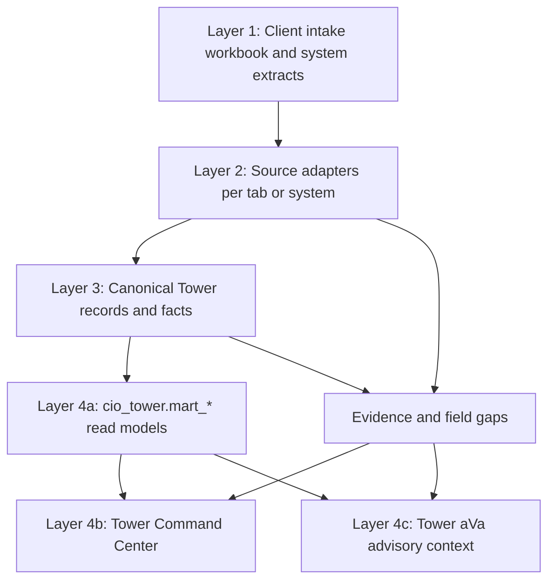

# Tower Data Model Pilot v1

## Status

`pilot-design`

This is the target Tower data model for pilot loading. It preserves the enterprise information architecture layers:

1. Client intake - source-owner shaped extracts.
2. Source adapters - one adapter per intake tab or source extract.
3. Canonical Tower records - governed facts and declared identities.
4. Product projections - Tower mart, dashboard, and aVa context.

Tower does not own source data. It projects governed facts for executive decisioning.

## Layered Flow

## Client Intake Tabs

The pilot workbook is `docs/templates/tower/client-intake/AbarVa_Tower_Client_Data_Intake_v1.xlsx`.

| Tab | Data owner | Load independence | Primary Tower use |
| --- | --- | --- | --- |
| 01 Initiative Registry | PMO / Transformation Office | Independent | Funded versus candidate initiatives, owners, funding state |
| 02 Tool Catalog | Enterprise Architecture / AI Office / Product Owner | Independent | Tool identity resolution, vendor/system/program crosswalk |
| 03 Application CMDB | CMDB / EA / Application Management | Independent | Application ownership, criticality, run cost, operational joins |
| 04 Vendor Contracts | Vendor Management / Procurement | Independent | Vendor exposure, renewal leverage, concentration |
| 05 Benefit Finance | Finance / Value Office | Independent | Promised, funded, finance-validated, claimable value |
| 06 Risk Governance | Risk / Security / AI Governance | Independent | Blocked decisions, risk posture, control gaps |
| 07 Evidence Source Map | Data Owner / Program Office | Independent | Evidence usability, source lineage, citation readiness |
| 10 Microsoft Copilot Usage | M365 / Workplace Technology | Independent | Copilot adoption and usage-supported value |
| 11 ServiceNow AI Usage | ServiceNow Platform Team | Independent | Now Assist and virtual agent usage/outcomes |
| 12 Developer AI Usage | Engineering Platform | Independent | Developer AI adoption, tool use, and cost |
| 13 DORA Delivery Metrics | Engineering Platform / DevOps | Independent | Delivery outcome movement |
| 14 ERP Workflow Outcomes | Workday / SAP / Business Systems | Independent | Business workflow outcome movement |
| 15 ITSM Application Monthly | ServiceNow / IT Operations | Independent | Application-level operational pressure |
| 16 ITSM Service Monthly | ServiceNow / IT Operations | Independent | Service-level operational pressure |
| 17 ITSM Problem Themes | ServiceNow / Problem Management | Independent | Recurring operational themes |
| 18 Spend Transactions | Finance / Procurement | Independent | Budget/spend reconciliation and spend attribution |

Missing tabs do not silently fail the pipeline. They produce explicit required-field and evidence gaps.

## Canonical Records

The current bridge contract is `CioTowerFactRow` in `src/lib/cio-tower/mart-projection/facts-schema.ts`. It should become the physical canonical Tower fact spine for pilot.

### Fact Spine

| Table / contract | Grain | Purpose |
| --- | --- | --- |
| `cio_tower.facts` / `CioTowerFactRow` | One atomic tenant fact per entity, measure, period, basis, and source | Source-of-truth fact spine for Tower projections |
| `tool_identity_crosswalk` | One declared tool/program/vendor/system identity mapping | Prevents name-based joins and duplicate AI initiatives |
| `source_fact_keys` | Source lineage list carried through facts and mart rows | Supports readback, audit, and aVa citations |
| `required_field_gaps` | One missing required field by mart record/source | Keeps gaps visible instead of turning missing data into zeros |

### Dimensions

| Dimension | Declared identity | Example source |
| --- | --- | --- |
| Tenant | `tenant_key` from `datasets/tenant-inputs/tenant-input-registry.json` | Tenant registry |
| Initiative / program | `initiative_id` or `program_code` | Initiative Registry, Benefit Finance |
| Tool | `tool_id` and declared aliases | Tool Catalog, usage exports |
| Application | `source_application_id` / canonical application id | Application CMDB |
| Vendor | `vendor_id` | Vendor Contracts, Spend Transactions |
| Business function/process | Client-authored label plus canonical mapping | Tool Catalog, ERP/ITSM extracts |
| Period | `period_start`, `period_end`, or FY period | All monthly/annual extracts |
| Evidence | `evidence_id` | Evidence Source Map |

### Facts

| Fact family | Measures |
| --- | --- |
| Enterprise budget | total IT budget, run budget, change budget |
| Program economics | approved funding, actual spend, AI-tagged spend |
| Value | promised value, usage-supported value, finance-validated value, claimable value |
| Usage | licensed users, active users, cases assisted, prompts, transactions |
| Delivery outcomes | deployment frequency, lead time, change failure rate, MTTR |
| Operational pressure | incidents, critical incidents, SLA breaches, availability |
| Governance | risk tier, blocked decision, control owner, due date |
| Evidence | source owner, freshness, evidence usability, restricted data flag |

## Tower Mart Tables

The current dashboard reads `loadTowerMartCommandView()` over:

| Mart table | Grain | Product use |
| --- | --- | --- |
| `cio_tower.mart_command_center` | One row per tenant/mart version | Executive headline, budget/value posture |
| `cio_tower.mart_value_funnel` | One row per value stage | Value Proof tab |
| `cio_tower.mart_program_decision_lanes` | One row per funded program | Decision Lanes tab and action routing |
| `cio_tower.mart_ai_portfolio` | One row per funded, embedded, usage, or candidate AI item | AI Portfolio matrix, table, filters |
| `cio_tower.mart_cxo_actions` | One row per recommended executive action | Recommended Actions tab |
| `cio_tower.mart_evidence_lineage` | One row per displayed fact/source | Evidence tab and audit |
| `cio_tower.mart_required_field_gaps` | One row per missing required field | Evidence gaps and blocker language |

## Pilot Invariants

- Identity must be declared, not inferred from filenames, folders, or labels.
- Active source input must resolve through `datasets/tenant-inputs/tenant-input-registry.json`.
- Product routes must not read client intake or adapter output directly.
- Tower dashboard and Tower aVa must consume the same governed mart/canonical context.
- Missing source data becomes a gap with owner, consequence, and next action.
- Realized value remains zero unless usage, KPI movement, and finance validation gates all pass.
- Spend attribution may be portfolio-only until the governed attribution source exists.

## Current Implementation Gap

The dashboard route reads `cio_tower.mart_*`. The Tower/aVa answer path still has older `measure_results` and V7 fallback behavior. Before pilot, aVa should be re-grounded on the same mart/canonical context as the Command Center and proven with signed-in browser tests.
