# SkyHarbor CTO Airline Demo Package

Date: 2026-06-30

## Status

| Phase | Status | Complete | Evidence |
| --- | --- | ---: | --- |
| 1. Foundational V6 data audit | Complete | 100% | `docs/intelligence-v6/SKYHARBOR_V6_CTO_DEMO_DESIGN_AUDIT_2026-06-30.md` |
| 2. Focused IROPS/CTO enrichment | Complete locally | 100% | `datasets/skyharbor-air-synthetic-v6` CTO enrichment rows |
| 3. Packet builder and answer contract | Complete locally | 100% | `src/lib/intelligence/skyharbor-cto-readiness.ts` |
| 4. Local question proof | Complete locally | 100% | `proof/skyharbor-v6-cto-readiness/README.md` reports 12/12 pass |
| 5. Live Claude/runtime wiring | Not proven in this slice | 0% | Requires product prompt-path wiring and trace capture |
| 6. Signed-in browser proof | Not proven in this slice | 0% | Requires production or signed-in local run |
| 7. CTO demo readiness | Ready for story walkthrough; not live-proof complete | 70% | Local packet proof is strong; live runtime proof remains open |

## Demo Thesis

AbarVa should not demo SkyHarbor as a generic airline chatbot. The demo should show a CTO how aVa turns messy airline transformation data into an operating decision:

**Fund IROPS readiness before autonomous scale.**

The reason is not that AI is unimportant. It is that the highest-value AI use case depends on certified operational data, model-risk gates, human-in-loop controls, and Finance-approved value before it can be defended as board-grade.

## Executive Story Spine

1. SkyHarbor has a valuable IROPS AI opportunity.
2. The limiting factor is not the model; it is the operating substrate.
3. aVa can separate what is loaded fact, what is AbarVa assessment, what is industry context, and what needs client signoff.
4. When facts are missing, aVa should ask for values or permission to use planning assumptions.
5. The CTO decision is therefore practical: fund the readiness gate, do not blindly scale autonomous recovery.

## 25-Minute Demo Flow

| Minute | Moment | What To Show | Why It Matters |
| ---: | --- | --- | --- |
| 0-3 | Open with the CTO decision | "Should we scale agentic IROPS or fund readiness first?" | Frames the demo as a decision, not a search box |
| 3-8 | Ask the main IROPS question | aVa gives point of view, known facts, missing evidence, and branch choices | Shows advisor behavior and honesty |
| 8-12 | Drill into systems and data | Known IROPS systems, data assets, freshness/lineage gaps | Shows the product understands the airline substrate |
| 12-16 | Drill into value and signoff | Directional value vs Finance-approved value | Avoids fake ROI and builds credibility |
| 16-20 | Show right-canvas visuals | Readiness matrix, value/readiness quadrant, evidence checklist | Uses the canvas for decision support, not repeated prose |
| 20-23 | Ask for next executive action | 90-day CTO plan and evidence owners | Converts insight into execution |
| 23-25 | Close with proof boundary | Local proof passed; live Claude/browser proof still required | Keeps claims honest |

## Core Demo Questions

Use these in order for a tight CTO conversation:

1. What is blocking agentic IROPS from scaling?
2. What should the CTO fund first for IROPS AI readiness?
3. What data must be certified before autonomous recovery decisions?
4. What systems does IROPS depend on?
5. What controls or model-risk gates block scale?
6. What value can we claim today, and what needs Finance signoff?
7. Is the IROPS AI case board-grade today?
8. What is the 90-day CTO action plan?

Keep these as backup drill-down questions:

9. Which AI investments should scale, hold, or stop?
10. Which vendors or platforms create the biggest operational dependency?
11. Where is the biggest evidence gap in the IROPS operating model?
12. What would you ask the CIO/CTO to provide next?

## Expected aVa Behavior

aVa should answer like a senior airline CTO advisor:

- Start with a point of view.
- Explain what it means operationally.
- Explain why it matters financially, operationally, or from a risk standpoint.
- Separate loaded evidence from assumptions and industry context.
- Avoid exact ROI unless Finance-approved values exist.
- End with useful branch choices when precision is missing.

Example branch behavior:

```text
I can make this more precise. Choose one:
1. Use planning assumptions
2. Enter missing values
3. Generate an evidence checklist
4. Continue readiness-only
5. Ask owner for evidence
```

Claude should own the answer and branch wording. The renderer should only display the branch choices. It should not rewrite the answer.

## Current Proof Example

Question:

```text
What is blocking agentic IROPS from scaling?
```

Current local prompt contract:

```text
You are aVa, a senior airline CTO advisor.
Answer with a point of view, what it means, why it matters, known evidence, missing assumptions, what would make it board-grade, and decision branches when precision is missing.
Do not invent exact ROI or board-grade value. Classify financial/value claims as loaded fact, calculated, assumption-led, industry context, or client-signoff-required.
Use the SkyHarbor V6 CTO readiness packet below. Keep branch choices in [DECISION_BRANCH] format so the renderer can display buttons without rewriting your answer.
```

Current local rendered answer excerpt:

```text
My point of view: SkyHarbor should fund IROPS readiness before autonomous scale.

What this means: treat IROPS AI as a readiness-and-control decision, not just a model deployment. The packet has 12 IROPS-critical systems, 16 data assets/integrations, 8 AI initiatives, 8 modernization programs, 12 risks/controls, all tied to V6 evidence rows.

Why it matters: IROPS value comes from faster recovery decisions across aircraft, crew, passenger reaccommodation, airport turns, maintenance constraints, customer communications, and disruption-cost avoidance.
```

Current local proof:

- 12 questions tested.
- 12 passed.
- No forbidden board-grade or exact-ROI claims detected.
- Branch choices are parsed separately from visible text.
- Proof is deterministic/local only, not live Claude.

## Right-Canvas Design

The left side should remain concise text. The right side should create decision leverage.

Recommended right-canvas tabs:

| Tab | Purpose | Grounding |
| --- | --- | --- |
| Decision | One-line recommendation, executive implication, decision required | Tenant evidence plus aVa synthesis |
| Visual | Value/readiness matrix, readiness gate chart, or 90-day roadmap | Tenant evidence by default; clearly labeled industry context if adjacent |
| Evidence | Human-readable proof items and missing evidence checklist | Tenant evidence |
| Assumptions | Planning assumptions, values needed, signoff owner | Explicit assumption/signoff boundary |

Avoid pre-answer debug tabs, source-signal counts, raw IDs, "patterns", and internal evidence labels unless the user explicitly opens proof.

## Data Flow To Explain To The CTO

```mermaid
flowchart LR
  A["Client source files: apps, data, programs, spend, risks, evidence"] --> B["V6 tenant templates"]
  B --> C["Validation and tenant-key checks"]
  C --> D["Azure/Postgres client data plane"]
  D --> E["Read models and decision graph"]
  E --> F["IROPS CTO readiness packet"]
  F --> G["Claude/aVa senior-advisor synthesis"]
  G --> H["Renderer displays answer, visuals, evidence, and branch choices"]
  H --> I["Executive selects assumption/value/evidence branch"]
```



What a real airline would need:

- Application inventory for OCC, crew, PSS/PNR, maintenance, loyalty, customer comms, and airport operations.
- Data asset inventory with owners, lineage, freshness SLAs, quality scores, and consumers.
- Integration inventory across flight status, crew legality, aircraft assignment, passenger recovery, and event store feeds.
- AI initiative register with owner, stage, model-risk tier, control owner, and adoption/value evidence.
- Program/spend data tied to systems, vendors, modernization work, and AI readiness.
- Incident, SLA, operational KPI, and disruption cost history.
- Finance-approved value baselines for board-grade claims.

## What Is Synthetic vs Realistic

The SkyHarbor demo is synthetic, but the structure is real-life-like:

- It mirrors airline domains: OCC/IROPS, crew, aircraft, PNR, reaccommodation, maintenance, loyalty, pricing, airport ops, and modernization.
- It includes systems, data assets, programs, AI initiatives, risks, spend rows, evidence sources, relationships, and industry-pattern context.
- It intentionally marks missing Finance-approved value, certified data freshness, model-risk signoff, and control evidence as gaps.

The product behavior should be:

```text
Advise now. Prove progressively. Upgrade to board-grade when evidence arrives.
```

## Differentiation Story

The product moat is not that aVa can write a polished answer. The moat is the reusable operating layer:

- client context is organized into a consistent V6 decision substrate;
- client facts, industry context, assumptions, and evidence gaps are separated;
- executive answers are generated from decision packets, not loose prompt stuffing;
- missing data becomes a guided executive branch instead of hallucinated certainty;
- the same method can be reused across airline, industrial, healthcare, and financial-services demos.

## Open Work To Make This Live-Proof Complete

1. Wire the SkyHarbor CTO readiness packet into the production Intelligence/aVa prompt path.
2. Invoke live Claude and capture model input, raw output, rendered output, branch choices, and right-canvas artifacts.
3. Render branch choices as UI buttons without rewriting Claude's prose.
4. Add right-canvas visual selection for IROPS readiness, value/readiness, and evidence checklist.
5. Run signed-in SkyHarbor browser proof.
6. Save screenshots and trace bundle.
7. Document production revision/digest only after ACA deployment is actually completed.

## Morgan Street Follow-On Lane

After the airline proof is complete, create a separate Morgan Street industrial demo lane:

- Theme: Shared Services Value Office.
- Focus: HR, Finance/Treasury, Legal, governance, and value realization.
- Demo behavior: same aVa answer contract, but with shared-services process redesign visuals and assumption branches.
- Do not mix Morgan Street proof with SkyHarbor airline proof.
