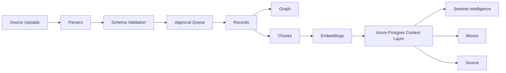

# SkyHarbor Context Layer Architecture

```mermaid
flowchart LR
  A["Source Uploads"] --> B["Parsers"]
  B --> C["Schema Validation"]
  C --> D["Approval Queue"]
  D --> E["Records"]
  E --> F["Graph"]
  E --> G["Chunks"]
  G --> H["Embeddings"]
  H --> I["Azure Postgres Context Layer"]
  I --> J["Sentinel Intelligence"]
  I --> K["Moves"]
  I --> L["Source"]
```
