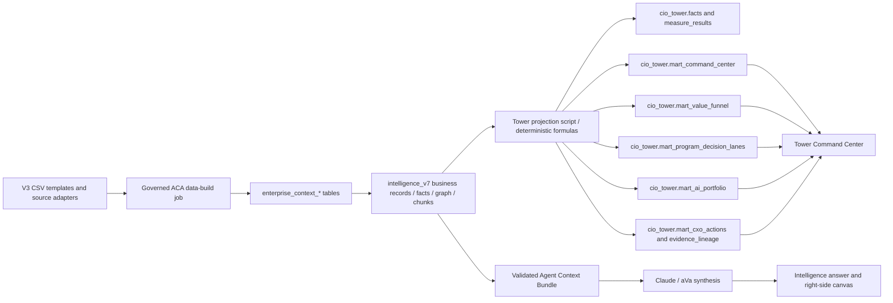

# Updated AbarVa V3 Data Model and Tower Lineage

Generated: 2026-07-18

Scope: Meridian / Healthcare Demo source templates, derived context artifacts, persistent Azure/Postgres layers, and Tower CIO/CFO mart projection. This report is source-artifact and schema based. It does not claim live Azure rows were refreshed unless a governed ACA data-build job writes and validates them.

## Executive Truth Split

- **New data exists in source/template artifacts:** yes. Meridian now has enriched budget, program, AI spend, AI value-realization, AI tool usage, interview, and operational KPI files.
- **Tower dry-run projection exists:** yes. The projection regenerates Tower mart CSV/proof artifacts from the Meridian V3 packet.
- **Azure/Postgres live refresh:** not proven by this report. Persistent target tables are identified below, but a governed ACA data-build job must write/validate them before Home, Tower, Intelligence, or aVa can claim live Azure-backed access.
- **Intelligence/aVa live retrieval:** not complete from this PR alone. It needs the loaded/indexed/agent-ready path, not just files or generated approved content.

## Layered Model

| Layer | Purpose | Physical objects | Status in this workstream |
|---|---|---|---|
| 0 Source templates | Client-fillable and source-adapter files | `datasets/tenant-inputs/meridian-health/standard-2026-07-v3/*.csv` | Updated locally in PR #5042; not automatically live data. |
| 1 Intake/evidence registry | Preserve source file, row, confidence, evidence boundary | `enterprise_context_source_files`, `enterprise_context_evidence`, `13_evidence_sources.csv` | Needs ACA data-build load for Azure persistence. |
| 2 Canonical records/facts | Normalize rows into governed objects | `enterprise_context_records`, `enterprise_context_facts`, `intelligence_v7.business_records`, `intelligence_v7.field_facts` where present | Target layer exists; Meridian refresh must write it. |
| 3 Relationship graph | Link programs, systems, vendors, KPIs, use cases, risks | `enterprise_context_relationships`, `intelligence_v7.graph_nodes`, `intelligence_v7.graph_edges` | Derived graph artifact exists; live graph refresh must be validated. |
| 4 Derived module context | Build Home/Tower/Moves/Intelligence-ready packets | `derived/*.json`, `approved-content/<module>/*.json`, `intelligence_v7.derived_intelligence_quality_reports` | Source artifacts generated; live module consumption varies by module. |
| 5 Tower CIO mart | Deterministic CIO/CFO dashboard read model | `cio_tower.mart_*`, plus `cio_tower.facts`, `measure_results` | Projection script exists and dry-run passes; Azure write not proven here. |
| 6 Runtime pages/agents | Render and answer from governed packets | Home, Intelligence, Tower, Moves, Source routes + aVa context broker | Home file reachability exists; Tower mart read path exists; Intelligence needs retrieval/indexing. |

## New Meridian Data and Insights Added

| New/updated file | Rows | What it adds | Why it matters to Tower/Intelligence |
|---|---:|---|---|
| `08_it_budget_spend_value.csv` | 298 | Curated IT budget, run/change, program spend, planned value, AI-tagged spend, finance attestation. | Primary Tower budget/value posture; prevents orphan programs and unsupported totals. |
| `09_programs_initiatives.csv` | 256 | Approved/active initiatives, owners, funding, planned value, AI tagging, Tower tracking status. | Lets Tower rank funded programs and aVa explain what to protect, fix, freeze, or stop. |
| `10_ai_automation_use_cases.csv` | 251 | AI opportunities and use cases with funding boundary, readiness, risk/control status, expected decision path. | Separates approved/embedded AI spend from candidate opportunities like AI Assist. |
| `13_evidence_sources.csv` | 508 | Evidence registry entries for source files, interviews, usage/value feeds, and adapters. | Enforces source-backed answers and screenshot/audit proof. |
| `14_metrics_outcomes.csv` | 257 | Baseline/target/actual KPI and finance validation fields used to block or allow value claims. | Prevents realized value claims without baseline/actual/finance evidence. |
| `SA02_IT_Finance_Budget_Spend_Extract.csv` | 70 | Finance extract rows with cost center, GL, run/change, vendor/system/program and AI tagging. | Source detail for budget traceability back to finance rows. |
| `SA04_Program_Portfolio_Extract.csv` | 14 | Portfolio source extract tying programs to funding, budget rows, AI spend, and owners. | Source detail for program funding and status traceability. |
| `SA08_AI_Benefits_Realization_Usage_Ledger.csv` | 8 | New AI benefits ledger connecting spend to promised benefit, usage, KPI, finance validation, and claim status. | Core of plan-vs-actual value realization for AI spend. |
| `SA09_AI_Tool_Usage_Feed.csv` | 8 | New tool/adoption feed for Copilot, ServiceNow, Workday/ERP, GitHub/Codex/code tools, and other AI tools. | Answers why Copilot/ServiceNow/ERP/code assistants are or are not working. |
| `SA10_AI_Value_Interview_Evidence.csv` | 8 | New interview evidence feed capturing working/not working, pressure, evidence requests, and follow-ups. | Adds CXO/IT pain, pressure, and context to Tower and Intelligence. |
| `SA11_AI_KPI_Operational_Outcome_Feed.csv` | 8 | New operational outcome feed tying AI use to KPI movement and finance validation. | Makes AI value measurable against operational outcomes. |

## Current Tower Projection Values From Source Artifacts

| Metric | Value | Source / rule |
|---|---:|---|
| Total IT budget FY26 | $650.0M | Sum/rollup from 08/SA02 through Tower projection |
| Run budget FY26 | $487.5M | Sum of run budget rows |
| Change budget FY26 | $162.5M | Sum of change budget rows |
| Approved program budget FY26 | $291.9M | Program/funding ties from 09/SA04 |
| AI-tagged spend FY26, non-additive | $53.7M | AI-tagged platform/program/governance spend inside the total budget |
| Promised value FY26 | $35.5M | SA08 promised benefit rows |
| Partial finance-validated value YTD | $3.8M | SA08/SA11 partial validation rows |
| Realized value allowed | $0.0M | Tower claim gate blocks realized value |
| Candidate AI opportunities | 242 | 10_ai_automation_use_cases candidate/discovery lens |
| Watch/pressure signals | 80 | Derived pressure/watch signals |

## Persistent Azure/Postgres Tables and Columns

### enterprise_context_sources
Definition: `supabase/migrations/20260514100000_enterprise_context_layer.sql`

Columns: `id`, `client_id`, `tenant_key`, `source_system`, `source_key`, `source_type`, `display_name`, `system_of_record`, `source_owner`, `steward_owner`, `sync_cadence`, `tenant_aliases`, `source_status`, `last_synced_at`, `last_validated_at`, `confidence`, `freshness_status`, `evidence_pointer`, `metadata`, `created_at`, `updated_at`

### enterprise_context_source_files
Definition: `supabase/migrations/20260514100000_enterprise_context_layer.sql`

Columns: `id`, `client_id`, `tenant_key`, `source_id`, `source_file_id`, `source_system`, `source_file`, `source_path`, `workbook_name`, `sheet_names`, `file_hash`, `row_count`, `imported_by`, `last_synced_at`, `last_validated_at`, `confidence`, `freshness_status`, `evidence_pointer`, `metadata`, `created_at`, `updated_at`

### enterprise_context_records
Definition: `supabase/migrations/20260514100000_enterprise_context_layer.sql`

Columns: `id`, `client_id`, `tenant_key`, `canonical_record_id`, `record_type`, `record_subtype`, `title`, `source_id`, `source_file_id`, `source_system`, `source_record_id`, `source_file`, `source_sheet`, `source_row_number`, `owner`, `steward_owner`, `last_synced_at`, `last_validated_at`, `confidence`, `freshness_status`, `evidence_pointer`, `lifecycle_state`, `superseded_by_record_id`, `payload_hash`, `payload`, `created_at`, `updated_at`

### enterprise_context_facts
Definition: `supabase/migrations/20260514100000_enterprise_context_layer.sql`

Columns: `id`, `client_id`, `tenant_key`, `record_id`, `fact_key`, `fact_type`, `fact_value`, `fact_text`, `source_system`, `source_record_id`, `source_file`, `source_sheet`, `source_row_number`, `owner`, `last_synced_at`, `last_validated_at`, `confidence`, `freshness_status`, `evidence_pointer`, `lifecycle_state`, `valid_from`, `valid_through`, `supersedes_fact_id`, `value_hash`, `created_at`, `updated_at`

### enterprise_context_relationships
Definition: `supabase/migrations/20260514100000_enterprise_context_layer.sql`

Columns: `id`, `client_id`, `tenant_key`, `relationship_key`, `relationship_type`, `from_record_id`, `to_record_id`, `from_external_id`, `to_external_id`, `source_system`, `source_record_id`, `source_file`, `source_sheet`, `source_row_number`, `owner`, `last_synced_at`, `last_validated_at`, `confidence`, `freshness_status`, `evidence_pointer`, `lifecycle_state`, `properties`, `created_at`, `updated_at`

### enterprise_context_evidence
Definition: `supabase/migrations/20260514100000_enterprise_context_layer.sql`

Columns: `id`, `client_id`, `tenant_key`, `evidence_key`, `evidence_type`, `record_id`, `fact_id`, `citation_label`, `citation_locator`, `evidence_pointer`, `source_system`, `source_record_id`, `source_file`, `source_sheet`, `source_row_number`, `owner`, `evidence_usable`, `excerpt`, `last_synced_at`, `last_validated_at`, `confidence`, `freshness_status`, `lifecycle_state`, `metadata`, `created_at`, `updated_at`

### enterprise_context_quality_issues
Definition: `supabase/migrations/20260514100000_enterprise_context_layer.sql`

Columns: `id`, `client_id`, `tenant_key`, `issue_key`, `issue_type`, `severity`, `status`, `affected_record_id`, `affected_fact_id`, `affected_relationship_id`, `source_system`, `source_record_id`, `source_file`, `source_sheet`, `source_row_number`, `owner`, `steward_owner`, `last_synced_at`, `last_validated_at`, `confidence`, `freshness_status`, `evidence_pointer`, `details`, `created_at`, `updated_at`

### enterprise_context_stewardship_tasks
Definition: `supabase/migrations/20260514100000_enterprise_context_layer.sql`

Columns: `id`, `client_id`, `tenant_key`, `task_key`, `issue_id`, `task_type`, `title`, `status`, `priority`, `assigned_owner`, `source_system`, `source_record_id`, `source_file`, `source_sheet`, `source_row_number`, `owner`, `due_date`, `last_synced_at`, `last_validated_at`, `confidence`, `freshness_status`, `evidence_pointer`, `details`, `created_at`, `updated_at`

### enterprise_context_snapshots
Definition: `supabase/migrations/20260514100000_enterprise_context_layer.sql`

Columns: `id`, `client_id`, `tenant_key`, `snapshot_key`, `snapshot_type`, `source_system`, `source_record_id`, `source_file`, `source_sheet`, `source_row_number`, `owner`, `last_synced_at`, `last_validated_at`, `confidence`, `freshness_status`, `evidence_pointer`, `snapshot_payload`, `diff_summary`, `created_at`, `updated_at`

### enterprise_context_template_runs
Definition: `supabase/migrations/20260514100000_enterprise_context_layer.sql`

Columns: `id`, `client_id`, `tenant_key`, `run_key`, `run_type`, `status`, `source_system`, `source_record_id`, `source_file`, `source_sheet`, `source_row_number`, `owner`, `last_synced_at`, `last_validated_at`, `confidence`, `freshness_status`, `evidence_pointer`, `source_root`, `workbook_count`, `records_seen`, `records_loaded`, `quality_issues_created`, `summary`, `error_payload`, `started_at`, `completed_at`, `created_at`, `updated_at`

### enterprise_context_chunk_queue
Definition: `supabase/migrations/20260514100000_enterprise_context_layer.sql`

Columns: `id`, `client_id`, `tenant_key`, `queue_key`, `chunk_id`, `record_id`, `fact_id`, `evidence_id`, `operation`, `status`, `source_system`, `source_record_id`, `source_file`, `source_sheet`, `source_row_number`, `owner`, `last_synced_at`, `last_validated_at`, `confidence`, `freshness_status`, `evidence_pointer`, `payload`, `error_message`, `created_at`, `updated_at`

### intelligence_v7.active_tenant_contract_versions
Definition: `supabase/migrations/20260709203000_intelligence_v7_moat_foundation.sql`

Columns: `tenant_key`, `active_contract_version`, `candidate_contract_version`, `rollback_contract_version`, `promotion_status`, `promoted_by`, `promoted_at`, `proof_bundle_uri`, `promotion_notes`, `metadata`, `created_at`, `updated_at`

### intelligence_v7.tenant_contract_promotion_events
Definition: `supabase/migrations/20260709203000_intelligence_v7_moat_foundation.sql`

Columns: `event_key`, `tenant_key`, `from_contract_version`, `to_contract_version`, `event_type`, `promotion_status`, `actor`, `reason`, `proof_bundle_uri`, `validation_summary`, `created_at`

### intelligence_v7.module_readiness_scores
Definition: `supabase/migrations/20260709203000_intelligence_v7_moat_foundation.sql`

Columns: `readiness_key`, `tenant_key`, `contract_version`, `module_key`, `readiness_status`, `readiness_score`, `required_dimensions`, `present_dimensions`, `missing_dimensions`, `source_coverage_score`, `fact_coverage_score`, `relationship_coverage_score`, `retrieval_coverage_score`, `unsupported_claim_risk`, `blockers`, `proof_refs`, `metadata`, `computed_at`, `updated_at`

### intelligence_v7.derived_intelligence_quality_reports
Definition: `supabase/migrations/20260709203000_intelligence_v7_moat_foundation.sql`

Columns: `report_key`, `tenant_key`, `contract_version`, `derived_ref`, `module_key`, `gate_status`, `confidence`, `source_fact_refs`, `graph_relationship_refs`, `assumptions`, `evidence_gaps`, `not_allowed_claims`, `derivation_reason`, `blocked_reasons`, `created_at`

### intelligence_v7.existing_tenant_upgrade_snapshots
Definition: `supabase/migrations/20260709203000_intelligence_v7_moat_foundation.sql`

Columns: `snapshot_key`, `tenant_key`, `source_contract_version`, `target_contract_version`, `snapshot_status`, `loaded_source_files`, `current_answer_behavior`, `mapping_report`, `quality_report`, `before_after_report`, `proof_matrix`, `created_by`, `created_at`, `updated_at`

### cio_tower.source_registry
Definition: `supabase/migrations/20260628202000_cio_tower_schema_v1.sql`

Columns: `source_key`, `tenant_key`, `source_system`, `source_file`, `source_kind`, `source_version`, `upload_run_id`, `loaded_at`, `freshness_date`, `trust_tier`, `row_count`, `checksum`, `metadata`

### cio_tower.entities
Definition: `supabase/migrations/20260628202000_cio_tower_schema_v1.sql`

Columns: `entity_key`, `tenant_key`, `entity_type`, `display_name`, `parent_entity_key`, `source_key`, `source_row`, `attributes`, `created_at`, `updated_at`

### cio_tower.facts
Definition: `supabase/migrations/20260628202000_cio_tower_schema_v1.sql`

Columns: `fact_key`, `tenant_key`, `entity_key`, `entity_type`, `measure`, `scope`, `view`, `amount_type`, `basis`, `period`, `value_numeric`, `value_text`, `value_date`, `value_bool`, `unit`, `value_source`, `confidence`, `source_key`, `source_row`, `formula_key`, `formula_version`, `is_rollup_of`, `component_of`, `superseded_by`, `valid_from`, `valid_to`, `attributes`, `created_at`

### cio_tower.relationships
Definition: `supabase/migrations/20260628202000_cio_tower_schema_v1.sql`

Columns: `relationship_key`, `tenant_key`, `from_entity_key`, `to_entity_key`, `relationship_type`, `confidence`, `source_key`, `source_row`, `attributes`, `created_at`

### cio_tower.measures
Definition: `supabase/migrations/20260628202000_cio_tower_schema_v1.sql`

Columns: `measure_key`, `label`, `description`, `default_scope`, `grain_filter`, `group_by`, `aggregation`, `numerator_filter`, `denominator_filter`, `reconciles_to_measure_key`, `honesty_rule`, `artifact_default`, `formula`, `formula_version`, `active`, `created_at`, `updated_at`

### cio_tower.question_contracts
Definition: `supabase/migrations/20260628202000_cio_tower_schema_v1.sql`

Columns: `contract_key`, `surface`, `intent`, `question_family`, `measure_key`, `default_scope`, `dimensions`, `filters_schema`, `required_fields`, `artifact_type`, `outside_scope_rule`, `prompt_policy_key`, `visible_answer_contract`, `examples`, `active`, `created_at`

### cio_tower.measure_results
Definition: `supabase/migrations/20260628202000_cio_tower_schema_v1.sql`

Columns: `result_key`, `tenant_key`, `measure_key`, `scope`, `period`, `basis`, `dimensions`, `value_numeric`, `value_json`, `source_fact_keys`, `formula_version`, `computed_at`

### cio_tower.prompt_packages
Definition: `supabase/migrations/20260628202000_cio_tower_schema_v1.sql`

Columns: `prompt_package_key`, `tenant_key`, `surface`, `user_question`, `contract_key`, `measure_key`, `deterministic_packet`, `prompt_text`, `prompt_hash`, `model_name`, `created_at`

### cio_tower.answer_traces
Definition: `supabase/migrations/20260628202000_cio_tower_schema_v1.sql`

Columns: `trace_key`, `tenant_key`, `surface`, `user_question`, `contract_key`, `measure_key`, `prompt_package_key`, `raw_model_response`, `rendered_response`, `artifacts`, `validation_status`, `validation_errors`, `latency_ms`, `model_name`, `created_at`

### cio_tower.validation_runs
Definition: `supabase/migrations/20260628202000_cio_tower_schema_v1.sql`

Columns: `validation_run_key`, `run_type`, `tenant_key`, `started_at`, `finished_at`, `status`, `summary`

### cio_tower.validation_results
Definition: `supabase/migrations/20260628202000_cio_tower_schema_v1.sql`

Columns: `validation_result_key`, `validation_run_key`, `tenant_key`, `check_key`, `question`, `expected`, `actual`, `status`, `notes`, `created_at`

### cio_tower.mart_command_center
Definition: `supabase/migrations/20260717164000_cio_tower_command_mart_v1.sql`

Columns: `command_center_key`, `tenant_key`, `tenant_name`, `mart_version`, `source_standard`, `formula_version`, `source_run_id`, `total_it_budget_fy26`, `run_budget_fy26`, `change_budget_fy26`, `approved_program_budget_fy26`, `ai_tagged_spend_fy26_non_additive`, `promised_value_fy26`, `partial_finance_validated_value_ytd`, `realized_value_ytd_allowed`, `candidate_ai_opportunities`, `watch_pressure_signals`, `run_ratio`, `change_ratio`, `finance_validation_ratio`, `decision_question`, `executive_summary`, `source_fact_keys`, `source_files`, `created_at`, `updated_at`

### cio_tower.mart_value_funnel
Definition: `supabase/migrations/20260717164000_cio_tower_command_mart_v1.sql`

Columns: `funnel_key`, `tenant_key`, `sequence`, `stage_key`, `stage_label`, `value_numeric`, `denominator_stage_key`, `conversion_ratio`, `claim_status`, `caveat`, `source_fact_keys`, `source_file`, `source_row`, `formula_version`, `updated_at`

### cio_tower.mart_program_decision_lanes
Definition: `supabase/migrations/20260717164000_cio_tower_command_mart_v1.sql`

Columns: `lane_key`, `tenant_key`, `program_code`, `program_name`, `owner_role`, `finance_owner_role`, `decision_lane`, `decision_rationale`, `approved_funding_usd`, `ai_tagged_spend_usd`, `promised_value_usd`, `finance_validated_value_usd`, `usage_metric`, `usage_actual`, `adoption_rate_pct`, `value_claim_status`, `tower_claim_allowed`, `required_gates`, `caveat`, `evidence_ids`, `source_fact_keys`, `source_file`, `source_row`, `formula_version`, `updated_at`

### cio_tower.mart_ai_portfolio
Definition: `supabase/migrations/20260717164000_cio_tower_command_mart_v1.sql`

Columns: `ai_portfolio_key`, `tenant_key`, `item_name`, `item_kind`, `vendor_name`, `system_name`, `ai_spend_type`, `ai_spend_category`, `funding_status`, `decision_lane`, `approved_funding_usd`, `ai_tagged_spend_usd`, `promised_value_usd`, `finance_validated_value_usd`, `usage_metric`, `usage_actual`, `adoption_rate_pct`, `value_score`, `readiness_score`, `risk_score`, `platform_embedded_ai_flag`, `duplicate_risk`, `value_claim_status`, `tower_claim_allowed`, `caveat`, `evidence_ids`, `source_fact_keys`, `source_file`, `source_row`, `formula_version`, `updated_at`

### cio_tower.mart_cxo_actions
Definition: `supabase/migrations/20260717164000_cio_tower_command_mart_v1.sql`

Columns: `action_key`, `tenant_key`, `sequence`, `action_lane`, `title`, `action_body`, `owner_hint`, `module_handoff`, `evidence_ids`, `source_fact_keys`, `formula_version`, `updated_at`

### cio_tower.mart_evidence_lineage
Definition: `supabase/migrations/20260717164000_cio_tower_command_mart_v1.sql`

Columns: `lineage_key`, `tenant_key`, `surface_section`, `displayed_fact`, `displayed_value_text`, `displayed_value_numeric`, `source_file`, `source_row`, `source_system`, `source_fact_keys`, `formula_version`, `caveat`, `updated_at`

### cio_tower.mart_required_field_gaps
Definition: `supabase/migrations/20260717164000_cio_tower_command_mart_v1.sql`

Columns: `gap_key`, `tenant_key`, `mart_table`, `mart_record_key`, `required_field`, `source_template`, `source_record_id`, `severity`, `owner_hint`, `remediation_action`, `blocking`, `formula_version`, `created_at`

### intelligence_v7.current_business_records
Definition: `supabase/migrations/20260709203000_intelligence_v7_moat_foundation.sql`

Columns: `view over business_records filtered by active_tenant_contract_versions.active_contract_version`

### intelligence_v7.current_tenant_pack_runs
Definition: `supabase/migrations/20260709203000_intelligence_v7_moat_foundation.sql`

Columns: `view over tenant_pack_runs filtered by active tenant contract version`

## Source Template Columns

### 00_enterprise_profile.csv (2 rows)
`tenant_key`, `record_id`, `entity_id`, `business_name`, `context_item`, `dimension`, `evidence_id`, `active_candidate_status`, `confidence`, `source_type`, `source_basis`, `synthetic_data_flag`, `evidence_boundary`, `module_usage_notes`, `industry`, `tenant_archetype`, `summary`, `sub_industry`, `headquarters`, `revenue_usd`, `employee_count`, `business_model`, `business_segments`, `operating_regions`, `leadership_roles`, `strategic_priorities`, `mission_statement`, `vision_statement`, `source_file`, `source_date`

### 01_business_functions.csv (228 rows)
`tenant_key`, `record_id`, `entity_id`, `business_name`, `context_item`, `dimension`, `evidence_id`, `active_candidate_status`, `confidence`, `source_type`, `source_basis`, `synthetic_data_flag`, `evidence_boundary`, `module_usage_notes`, `owner_role`, `operating_model`, `metrics_or_kpis`, `processes`, `use_case`, `data_domain`, `systems`, `value_hypothesis`, `evidence_needed`, `risk_or_gap`, `affected_systems`, `metric_boundary`, `forbidden_claims`, `legacy_row_flag`, `source_row_status`, `migration_action`, `additive_status`, `amount_basis`, `finance_attestation_status`, `funding_status`, `approved_funding_usd`, `realized_value_usd`, `tower_claim_allowed`, `evidence_type`, `evidence_location`, `evidence_owner`, `caveat`

### 02_org_ownership.csv (228 rows)
`tenant_key`, `record_id`, `entity_id`, `business_name`, `context_item`, `dimension`, `evidence_id`, `active_candidate_status`, `confidence`, `source_type`, `source_basis`, `synthetic_data_flag`, `evidence_boundary`, `module_usage_notes`, `owner_role`, `operating_model`, `metrics_or_kpis`, `processes`, `use_case`, `data_domain`, `systems`, `value_hypothesis`, `evidence_needed`, `risk_or_gap`, `affected_systems`, `metric_boundary`, `forbidden_claims`, `legacy_row_flag`, `source_row_status`, `migration_action`, `additive_status`, `amount_basis`, `finance_attestation_status`, `funding_status`, `approved_funding_usd`, `realized_value_usd`, `tower_claim_allowed`, `evidence_type`, `evidence_location`, `evidence_owner`, `caveat`

### 03_workforce_roles.csv (221 rows)
`tenant_key`, `record_id`, `entity_id`, `business_name`, `context_item`, `dimension`, `evidence_id`, `active_candidate_status`, `confidence`, `source_type`, `source_adapter_id`, `source_adapter_name`, `source_basis`, `synthetic_data_flag`, `evidence_boundary`, `module_usage_notes`, `interview_id`, `interview_group`, `priority_theme`, `decision_supported`, `evidence_needed`, `system_or_vendor_mentioned`, `data_domain_mentioned`, `key_initiative`, `known_challenge`, `use_case`, `data_domain`, `systems`, `value_hypothesis`, `risk_or_gap`, `affected_systems`, `metric_boundary`, `forbidden_claims`, `legacy_row_flag`, `source_row_status`, `migration_action`, `additive_status`, `amount_basis`, `finance_attestation_status`, `funding_status`, `approved_funding_usd`, `realized_value_usd`, `tower_claim_allowed`, `evidence_type`, `evidence_location`, `evidence_owner`, `caveat`

### 04_applications_systems.csv (241 rows)
`tenant_key`, `record_id`, `entity_id`, `business_name`, `context_item`, `dimension`, `evidence_id`, `active_candidate_status`, `confidence`, `source_type`, `source_basis`, `synthetic_data_flag`, `evidence_boundary`, `module_usage_notes`, `capability`, `owner`, `criticality`, `lifecycle_status`, `vendor_id`, `integrations`, `data_dependencies`, `use_case`, `data_domain`, `systems`, `value_hypothesis`, `evidence_needed`, `risk_or_gap`, `affected_systems`, `metric_boundary`, `forbidden_claims`, `legacy_row_flag`, `source_row_status`, `migration_action`, `additive_status`, `amount_basis`, `finance_attestation_status`, `funding_status`, `approved_funding_usd`, `realized_value_usd`, `tower_claim_allowed`, `evidence_type`, `evidence_location`, `evidence_owner`, `caveat`

### 05_data_assets_integrations.csv (242 rows)
`tenant_key`, `record_id`, `entity_id`, `business_name`, `context_item`, `dimension`, `evidence_id`, `active_candidate_status`, `confidence`, `source_type`, `source_basis`, `synthetic_data_flag`, `evidence_boundary`, `module_usage_notes`, `use_case`, `data_domain`, `systems`, `value_hypothesis`, `evidence_needed`, `risk_or_gap`, `affected_systems`, `metric_boundary`, `forbidden_claims`, `legacy_row_flag`, `source_row_status`, `migration_action`, `additive_status`, `amount_basis`, `finance_attestation_status`, `funding_status`, `approved_funding_usd`, `realized_value_usd`, `tower_claim_allowed`, `evidence_type`, `evidence_location`, `evidence_owner`, `caveat`

### 06_infrastructure_platforms.csv (15 rows)
`tenant_key`, `record_id`, `entity_id`, `business_name`, `context_item`, `dimension`, `evidence_id`, `active_candidate_status`, `confidence`, `source_type`, `source_basis`, `synthetic_data_flag`, `evidence_boundary`, `module_usage_notes`, `capability`, `owner`, `criticality`, `lifecycle_status`, `vendor_id`, `integrations`, `data_dependencies`

### 07_vendors_contracts.csv (231 rows)
`tenant_key`, `record_id`, `entity_id`, `business_name`, `context_item`, `dimension`, `evidence_id`, `active_candidate_status`, `confidence`, `source_type`, `source_basis`, `synthetic_data_flag`, `evidence_boundary`, `module_usage_notes`, `vendor_id`, `service`, `owning_function`, `linked_systems`, `contract_risk`, `pricing_basis`, `vendor_category`, `ai_capability`, `annual_contract_value_usd`, `linked_budget_record_ids`, `linked_program_code`, `ai_spend_flag`, `use_case`, `data_domain`, `systems`, `value_hypothesis`, `evidence_needed`, `risk_or_gap`, `affected_systems`, `metric_boundary`, `forbidden_claims`, `legacy_row_flag`, `source_row_status`, `migration_action`, `additive_status`, `amount_basis`, `finance_attestation_status`, `funding_status`, `approved_funding_usd`, `realized_value_usd`, `tower_claim_allowed`, `evidence_type`, `evidence_location`, `evidence_owner`, `caveat`

### 08_it_budget_spend_value.csv (298 rows)
`tenant_key`, `record_id`, `entity_id`, `business_name`, `context_item`, `dimension`, `evidence_id`, `active_candidate_status`, `confidence`, `source_type`, `source_basis`, `synthetic_data_flag`, `evidence_boundary`, `module_usage_notes`, `value_hypothesis`, `amount_usd`, `realized_value_usd`, `value_boundary`, `legacy_row_flag`, `source_row_status`, `migration_action`, `financial_fact_type`, `fiscal_year`, `time_period`, `budget_amount_usd`, `approved_budget_usd`, `actual_spend_ytd_usd`, `forecast_spend_usd`, `run_budget_usd`, `change_budget_usd`, `planned_value_usd`, `target_value_usd`, `amount_basis`, `gross_or_net`, `additive_status`, `duplicate_risk`, `budget_row_level`, `finance_attestation_status`, `program_code`, `initiative_id`, `linked_budget_record_ids`, `linked_sa02_records`, `ai_spend_flag`, `ai_spend_type`, `ai_spend_category`, `ai_tagged_budget_usd`, `platform_embedded_ai_flag`, `vendor_name`, `system_name`, `source_adapter_reference`, `tower_usage`, `tower_hero_eligible`, `caveat`, `use_case`, `data_domain`, `systems`, `evidence_needed`, `risk_or_gap`, `affected_systems`, `metric_boundary`, `forbidden_claims`, `funding_status`, `approved_funding_usd`, `tower_claim_allowed`, `evidence_type`, `evidence_location`, `evidence_owner`

### 09_programs_initiatives.csv (256 rows)
`tenant_key`, `record_id`, `entity_id`, `business_name`, `context_item`, `dimension`, `evidence_id`, `active_candidate_status`, `confidence`, `source_type`, `source_basis`, `synthetic_data_flag`, `evidence_boundary`, `module_usage_notes`, `use_case`, `data_domain`, `systems`, `value_hypothesis`, `evidence_needed`, `legacy_row_flag`, `source_row_status`, `migration_action`, `initiative_status`, `funding_status`, `approved_funding_usd`, `requested_funding_usd`, `forecast_spend_usd`, `actual_spend_ytd_usd`, `planned_value_usd`, `target_value_usd`, `realized_value_usd`, `value_claim_status`, `executive_owner`, `finance_owner`, `tower_measurement_ready`, `program_code`, `initiative_id`, `linked_budget_record_ids`, `linked_sa02_records`, `ai_spend_flag`, `ai_spend_type`, `ai_spend_category`, `additive_status`, `duplicate_risk`, `caveat`, `linked_ai_spend_ids`, `ai_tagged_approved_funding_usd`, `risk_or_gap`, `affected_systems`, `metric_boundary`, `forbidden_claims`, `amount_basis`, `finance_attestation_status`, `tower_claim_allowed`, `evidence_type`, `evidence_location`, `evidence_owner`

### 10_ai_automation_use_cases.csv (251 rows)
`tenant_key`, `record_id`, `entity_id`, `business_name`, `context_item`, `dimension`, `evidence_id`, `active_candidate_status`, `confidence`, `source_type`, `source_basis`, `synthetic_data_flag`, `evidence_boundary`, `module_usage_notes`, `use_case`, `data_domain`, `systems`, `value_hypothesis`, `evidence_needed`, `legacy_row_flag`, `source_row_status`, `migration_action`, `use_case_status`, `related_move`, `business_problem`, `affected_process`, `required_data_domains`, `readiness_status`, `funding_status`, `approved_funding_usd`, `measurement_status`, `risk_control_status`, `tower_tracking_status`, `expected_decision_path`, `linked_program_code`, `linked_initiative_id`, `linked_budget_record_ids`, `embedded_platform_source`, `ai_spend_flag`, `ai_spend_type`, `ai_spend_category`, `caveat`, `risk_or_gap`, `affected_systems`, `metric_boundary`, `forbidden_claims`, `additive_status`, `amount_basis`, `finance_attestation_status`, `realized_value_usd`, `tower_claim_allowed`, `evidence_type`, `evidence_location`, `evidence_owner`

### 11_risks_controls.csv (249 rows)
`tenant_key`, `record_id`, `entity_id`, `business_name`, `context_item`, `dimension`, `evidence_id`, `active_candidate_status`, `confidence`, `source_type`, `source_basis`, `synthetic_data_flag`, `evidence_boundary`, `module_usage_notes`, `use_case`, `risk_or_gap`, `affected_systems`, `metric_boundary`, `forbidden_claims`, `data_domain`, `systems`, `value_hypothesis`, `evidence_needed`, `legacy_row_flag`, `source_row_status`, `migration_action`, `additive_status`, `amount_basis`, `finance_attestation_status`, `funding_status`, `approved_funding_usd`, `realized_value_usd`, `tower_claim_allowed`, `evidence_type`, `evidence_location`, `evidence_owner`, `caveat`

### 12_relationships.csv (298 rows)
`tenant_key`, `record_id`, `entity_id`, `business_name`, `context_item`, `dimension`, `evidence_id`, `active_candidate_status`, `confidence`, `source_type`, `source_basis`, `synthetic_data_flag`, `evidence_boundary`, `module_usage_notes`, `use_case`, `risk_or_gap`, `affected_systems`, `metric_boundary`, `forbidden_claims`, `relationship_type`, `from_object_type`, `from_object_id`, `to_object_type`, `to_object_id`, `relationship_strength`, `caveat`, `data_domain`, `systems`, `value_hypothesis`, `evidence_needed`, `legacy_row_flag`, `source_row_status`, `migration_action`, `additive_status`, `amount_basis`, `finance_attestation_status`, `funding_status`, `approved_funding_usd`, `realized_value_usd`, `tower_claim_allowed`, `evidence_type`, `evidence_location`, `evidence_owner`

### 13_evidence_sources.csv (508 rows)
`tenant_key`, `record_id`, `entity_id`, `business_name`, `context_item`, `dimension`, `evidence_id`, `active_candidate_status`, `confidence`, `source_type`, `source_basis`, `synthetic_data_flag`, `evidence_boundary`, `module_usage_notes`, `evidence_type`, `evidence_location`, `evidence_owner`, `use_case`, `data_domain`, `systems`, `value_hypothesis`, `evidence_needed`, `risk_or_gap`, `affected_systems`, `metric_boundary`, `forbidden_claims`, `legacy_row_flag`, `source_row_status`, `migration_action`, `additive_status`, `amount_basis`, `finance_attestation_status`, `funding_status`, `approved_funding_usd`, `realized_value_usd`, `tower_claim_allowed`, `caveat`

### 14_metrics_outcomes.csv (257 rows)
`tenant_key`, `record_id`, `entity_id`, `business_name`, `context_item`, `dimension`, `evidence_id`, `active_candidate_status`, `confidence`, `source_type`, `source_basis`, `synthetic_data_flag`, `evidence_boundary`, `module_usage_notes`, `use_case`, `risk_or_gap`, `affected_systems`, `metric_boundary`, `forbidden_claims`, `baseline_available`, `actual_available`, `tower_claim_allowed`, `measurement_owner`, `measurement_cadence`, `source_system`, `benefit_id`, `linked_program_code`, `linked_use_case_id`, `baseline_value`, `target_value`, `actual_value`, `finance_validated_value_usd`, `value_claim_status`, `caveat`, `data_domain`, `systems`, `value_hypothesis`, `evidence_needed`, `legacy_row_flag`, `source_row_status`, `migration_action`, `additive_status`, `amount_basis`, `finance_attestation_status`, `funding_status`, `approved_funding_usd`, `realized_value_usd`, `evidence_type`, `evidence_location`, `evidence_owner`

### 15_industry_context_patterns.csv (7 rows)
`tenant_key`, `record_id`, `entity_id`, `business_name`, `context_item`, `dimension`, `evidence_id`, `active_candidate_status`, `confidence`, `source_type`, `source_basis`, `synthetic_data_flag`, `evidence_boundary`, `module_usage_notes`, `industry_context`, `signals`, `module_next_actions`

### 16_expert_lenses.csv (7 rows)
`tenant_key`, `record_id`, `entity_id`, `business_name`, `context_item`, `dimension`, `evidence_id`, `active_candidate_status`, `confidence`, `source_type`, `source_basis`, `synthetic_data_flag`, `evidence_boundary`, `module_usage_notes`, `industry_context`, `signals`, `module_next_actions`

### 17_managed_services_scope.csv (228 rows)
`tenant_key`, `record_id`, `entity_id`, `business_name`, `context_item`, `dimension`, `evidence_id`, `active_candidate_status`, `confidence`, `source_type`, `source_basis`, `synthetic_data_flag`, `evidence_boundary`, `module_usage_notes`, `vendor_id`, `service`, `owning_function`, `linked_systems`, `contract_risk`, `pricing_basis`, `annual_contract_value_usd`, `run_spend_usd`, `change_order_spend_usd`, `invoice_amount_ytd_usd`, `service_credit_ytd_usd`, `vendor_name`, `service_tower`, `contract_id`, `fiscal_year`, `linked_budget_record_ids`, `linked_sa02_records`, `ai_spend_flag`, `tower_usage`, `caveat`, `use_case`, `data_domain`, `systems`, `value_hypothesis`, `evidence_needed`, `risk_or_gap`, `affected_systems`, `metric_boundary`, `forbidden_claims`, `legacy_row_flag`, `source_row_status`, `migration_action`, `additive_status`, `amount_basis`, `finance_attestation_status`, `funding_status`, `approved_funding_usd`, `realized_value_usd`, `tower_claim_allowed`, `evidence_type`, `evidence_location`, `evidence_owner`

### 18_operational_process_evidence.csv (228 rows)
`tenant_key`, `record_id`, `entity_id`, `business_name`, `context_item`, `dimension`, `evidence_id`, `active_candidate_status`, `confidence`, `source_type`, `source_basis`, `synthetic_data_flag`, `evidence_boundary`, `module_usage_notes`, `industry_context`, `signals`, `module_next_actions`, `use_case`, `data_domain`, `systems`, `value_hypothesis`, `evidence_needed`, `risk_or_gap`, `affected_systems`, `metric_boundary`, `forbidden_claims`, `legacy_row_flag`, `source_row_status`, `migration_action`, `additive_status`, `amount_basis`, `finance_attestation_status`, `funding_status`, `approved_funding_usd`, `realized_value_usd`, `tower_claim_allowed`, `evidence_type`, `evidence_location`, `evidence_owner`, `caveat`

### SA02_IT_Finance_Budget_Spend_Extract.csv (70 rows)
`tenant_key`, `source_record_id`, `fiscal_year`, `period`, `source_system`, `cost_center`, `account_gl_code`, `spend_category`, `it_tower_category`, `business_unit`, `program_code`, `initiative_id`, `vendor_name`, `system_name`, `run_change_flag`, `budget_amount_usd`, `actual_spend_usd`, `forecast_spend_usd`, `committed_spend_usd`, `invoice_amount_usd`, `variance_usd`, `ai_spend_flag`, `ai_spend_type`, `ai_spend_category`, `platform_embedded_ai_flag`, `finance_owner`, `evidence_id`, `confidence`, `active_candidate_status`, `notes`

### SA04_Program_Portfolio_Extract.csv (14 rows)
`tenant_key`, `source_record_id`, `program_code`, `initiative_id`, `program_name`, `initiative_status`, `funding_status`, `approved_funding_usd`, `requested_funding_usd`, `linked_budget_record_ids`, `linked_sa02_records`, `linked_ai_spend_ids`, `ai_tagged_approved_funding_usd`, `ai_spend_flag`, `ai_spend_type`, `ai_spend_category`, `platform_embedded_ai_flag`, `executive_owner`, `finance_owner`, `tower_tracking_status`, `evidence_id`, `active_candidate_status`, `notes`

### SA08_AI_Benefits_Realization_Usage_Ledger.csv (8 rows)
`tenant_key`, `source_record_id`, `ai_program_id`, `program_name`, `ai_use_case_id`, `vendor_name`, `tool_name`, `business_function`, `process_area`, `promised_benefit_type`, `promised_value_usd`, `funded_spend_usd`, `actual_spend_ytd_usd`, `baseline_metric`, `baseline_value`, `target_metric`, `target_value`, `usage_metric`, `usage_target`, `usage_actual`, `adoption_rate_pct`, `enabled_users`, `active_users`, `usage_rate_pct`, `operational_kpi`, `kpi_baseline`, `kpi_actual`, `finance_validated_value_usd`, `finance_validation_status`, `value_claim_status`, `evidence_id`, `source_extract`, `refresh_cadence`, `tower_claim_allowed`, `caveat`, `evidence_type`, `evidence_owner`, `evidence_source_system`, `evidence_extract_date`, `evidence_period_start`, `evidence_period_end`, `evidence_refresh_cadence`, `evidence_freshness_status`, `owner_attestation_status`, `duplicate_risk`, `additive_status`, `realized_value_allowed`, `decision_action`

### SA09_AI_Tool_Usage_Feed.csv (8 rows)
`tenant_key`, `source_record_id`, `ai_program_id`, `ai_use_case_id`, `vendor_name`, `tool_name`, `tool_category`, `business_function`, `process_area`, `usage_period_start`, `usage_period_end`, `licensed_users`, `enabled_users`, `active_users`, `power_users`, `usage_events`, `usage_rate_pct`, `adoption_target_pct`, `adoption_gap_pct`, `baseline_metric_name`, `baseline_metric_value`, `target_metric_value`, `actual_metric_value`, `metric_unit`, `promised_value_usd`, `finance_validated_value_usd`, `value_claim_status`, `evidence_id`, `source_system`, `extract_date`, `business_owner`, `it_owner`, `finance_validator`, `confidence`, `notes`

### SA10_AI_Value_Interview_Evidence.csv (8 rows)
`tenant_key`, `source_record_id`, `ai_program_id`, `ai_use_case_id`, `stakeholder_role`, `interview_track`, `question`, `answer_summary`, `what_is_working`, `what_is_not_working`, `current_baseline`, `target_or_promise`, `evidence_request`, `follow_up_artifact_needed`, `decision_pressure`, `named_owner`, `confidence`, `evidence_id`

### SA11_AI_KPI_Operational_Outcome_Feed.csv (8 rows)
`tenant_key`, `source_record_id`, `ai_program_id`, `ai_use_case_id`, `business_function`, `process_area`, `kpi_name`, `kpi_definition`, `baseline_value`, `target_value`, `actual_value`, `metric_unit`, `measurement_period_start`, `measurement_period_end`, `measurement_owner`, `source_system`, `usage_record_ids`, `benefit_record_ids`, `finance_validated_value_usd`, `value_claim_status`, `tower_claim_allowed`, `evidence_id`, `caveat`

## Source-to-Target Mapping

Detailed CSV: `reports/ai-value-realization-day1/source-to-target-layer-mapping.csv`.

| Source | Target persistent layer | Tower/Intelligence usage | Guardrail |
|---|---|---|---|
| `00_enterprise_profile.csv` | enterprise_context_records/facts/evidence; intelligence_v7.business_records/field_facts/chunks when loaded | Home executive brief and profile cards; Tower profile context; Intelligence tenant frame | Must retain evidence_id/confidence boundary; fabricated profile fields must be assumption-tagged or sourced. |
| `01_business_functions.csv` | enterprise_context_records/facts | Home function explorer; Intelligence functional context; Tower owner/function rollups | Needs named owners and portfolio/function depth for CXO credibility. |
| `02_org_ownership.csv` | enterprise_context_records/facts/relationships | Home relationships; Moves gate owners; Tower action owners | Executive role rows should be robust, not thin placeholders. |
| `03_workforce_roles.csv` | enterprise_context_records/facts | Home personas; Intelligence operating impact; Tower usage-readiness context | Useful for AI adoption and value-realization denominator logic. |
| `04_applications_systems.csv` | enterprise_context_records/facts/relationships | Home app inventory; Intelligence system context; Tower system/vendor exposure | Must include healthcare/payer/provider systems with enough depth. |
| `05_data_assets_integrations.csv` | enterprise_context_records/facts/relationships | Home data explorer; Intelligence evidence boundary; Moves/Tower readiness gates | Critical for why AI cannot scale yet and Copilot/agent value proof. |
| `06_infrastructure_platforms.csv` | enterprise_context_records/facts | Home infra context; Tower platform/change investment lens | Current thin rows should be expanded or clearly marked target-state. |
| `07_vendors_contracts.csv` | enterprise_context_records/facts; cio_tower.facts(view=vendor_contract) | Tower vendor/spend leverage; Source handoff; Intelligence vendor exposure | Contract values must reconcile to budget/source adapters. |
| `08_it_budget_spend_value.csv` | enterprise_context_records/facts; cio_tower.facts(view=it_budget/initiative_budget); cio_tower.measure_results | Tower budget, run/change, AI spend, value funnel; Intelligence budget context | Primary Tower budget file. Rows must tie to programs/SA02; realized value blocked unless value claim gate passes. |
| `09_programs_initiatives.csv` | enterprise_context_records/facts/entities; cio_tower.entities/facts | Tower program lanes and recommended actions; Moves opportunity shaping; Intelligence portfolio advice | Approved/active programs must tie to 08 or SA02. |
| `10_ai_automation_use_cases.csv` | enterprise_context_records/facts/entities; cio_tower.facts/entities | Tower AI portfolio; Intelligence AI recommendations; Moves candidate opportunities | Candidate AI Assist remains not approved unless source row says otherwise. |
| `11_risks_controls.csv` | enterprise_context_records/facts/quality_issues | Home gaps; Intelligence caveats; Tower decision gates; Moves remediation | Must convert raw gaps into executive blocker themes. |
| `12_relationships.csv` | enterprise_context_relationships; intelligence_v7.graph_edges | Home relationship tab; Intelligence grounding; Tower lineage; Moves dependencies | Relationship graph explains dependencies but does not calculate spend/value. |
| `13_evidence_sources.csv` | enterprise_context_evidence; enterprise_context_source_files; cio_tower.source_registry | All modules; aVa citations; Tower evidence tab | Every displayed fact should trace here plus source row/file. |
| `14_metrics_outcomes.csv` | enterprise_context_records/facts; cio_tower.facts(view=metric/value) | Tower value proof and claim gate; Intelligence what-is-working answers | No realized/proven language unless actuals and finance validation pass. |
| `15_industry_context_patterns.csv` | enterprise_context_records/facts or approved-content only | Intelligence industry tabs; Home industry boundary | Must be labelled industry context, not tenant evidence. |
| `16_expert_lenses.csv` | enterprise_context_records/facts or approved-content | Intelligence/Tower narrative shaping | Claude may synthesize voice, but facts remain deterministic. |
| `17_managed_services_scope.csv` | enterprise_context_records/facts; cio_tower.facts | Tower run spend pressure; Source sourcing handoff | Should connect run budget, vendor contracts, SLA evidence. |
| `18_operational_process_evidence.csv` | enterprise_context_records/facts; cio_tower.facts | Tower pressure signals; Intelligence what-is-not-working; Moves value hypothesis | Needs process-level pain and evidence, not generic statements. |
| `SA02_IT_Finance_Budget_Spend_Extract.csv` | enterprise_context_records/facts; cio_tower.facts(source_detail) | Tower source-backed budget proof; reconciliation to 08 | Feeds 08 and Tower; should never be bypassed by hand-entered totals. |
| `SA04_Program_Portfolio_Extract.csv` | enterprise_context_records/facts; cio_tower.facts/entities | Tower program lanes; Moves program creation/readiness | All active programs need budget ties. |
| `SA08_AI_Benefits_Realization_Usage_Ledger.csv` | enterprise_context_records/facts; cio_tower.facts(view=value_proof) | Tower value proof funnel; Intelligence AI value answers | New Day-1 layer. Realized value blocked unless full usage/KPI/finance chain passes. |
| `SA09_AI_Tool_Usage_Feed.csv` | enterprise_context_records/facts; cio_tower.facts(view=usage) | Tower adoption and why-value-is-not-showing views; Intelligence diagnostics | Day-1 template now; future API connectors later. |
| `SA10_AI_Value_Interview_Evidence.csv` | enterprise_context_records/facts/evidence; derived/interview-insights.json | Home insights, Intelligence advisory context, Moves gates, Tower action narrative | Must remain evidence-grade context, not funding/realized value. |
| `SA11_AI_KPI_Operational_Outcome_Feed.csv` | enterprise_context_records/facts; cio_tower.facts(view=outcome) | Tower KPI proof, value claim gate, Intelligence outcome answers | Needed for Copilot/ServiceNow/ERP agent value proof. |

## Tower CIO Flow

## Tower Views To Build From The New Insights

1. **AI Value Control Room:** total AI-tagged spend, approved vs embedded vs candidate, promised value, partial finance validation, realized value blocked.
2. **Value Proof Funnel:** funded spend -> promised benefit -> usage evidence -> KPI movement -> finance validation -> claimable value.
3. **Usage vs Promise:** Copilot, ServiceNow AI, Workday/ERP agents, GitHub/Codex/code tools, contact center AI; show adoption, active usage, KPI movement, finance validation.
4. **Portfolio Decision Lanes:** protect/scale, fix evidence, freeze, stop. Lanes come from spend ties, usage evidence, KPI evidence, value claim status, and interview pressure.
5. **AI Tool Evidence Diagnostics:** by vendor/tool: license base, enabled users, active users, usage rate, baseline, target, actual, value claim status, evidence owner.
6. **Executive Pressure Map:** CIO/CFO/COO/CHRO/CDAO/CISO interview insights converted into what is working, what is not, what evidence is missing, who owns the next gate.

## Required Next Load To Make It Live

1. Run governed ACA data-build job for the Meridian V3 packet and generated SA08-SA11 files.
2. Load/refresh `enterprise_context_*` and `intelligence_v7.*` tables with row-level source/evidence lineage.
3. Run Tower projection with write approval into `cio_tower.facts`, `measure_results`, and `cio_tower.mart_*`.
4. Validate every displayed Home/Tower/Intelligence fact against `source_file + source_row + evidence_id`.
5. Mark objects `agent_ready` only after retrieval/index/citation proof passes.

## Files Produced

- `reports/ai-value-realization-day1/source-to-target-layer-mapping.csv`
- `reports/ai-value-realization-day1/data-model-table-columns.csv`
- `reports/ai-value-realization-day1/updated-data-model-and-tower-lineage.md`