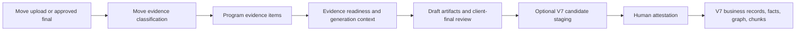

# Moves Upload, Evidence, and V7 Integration Audit

Date: 2026-07-04

Scope: Audit plus targeted local fixes for the Lakeshore Shared Services legal-contract-intake demo path. This is not a full V7 promotion implementation and not a signed-in browser proof.

## Executive Read

Moves has two upload concepts that must stay separate:

1. **Phase evidence uploads**: files uploaded against a Move phase so aVa can inspect them, cite them, improve artifact generation, and show what evidence is still missing.
2. **Client-final deliverables**: reviewed final documents uploaded against generated artifacts, compared with the AbarVa draft, approved, and then carried into the next phase.

The audit found the right overall shape, but one demo-critical gap: the workspace upload path stored files and started background chunking, but did not synchronously record phase-aware evidence for the readiness model. That meant a user could upload the right P2/P3/P4 files and still not get a clear "what AbarVa found / where this will be used" signal.

That gap is now patched locally. Uploads are classified into Move evidence metadata, recorded as `program_evidence_items`, and surfaced in the phase UI with client-facing "found" and "used in" text.

## Primary Demo Path

**Tenant/demo:** Lakeshore Holdings / Industrial Demo
**Move:** Shared Services - Legal Contract Intake and Obligation Control
**Journey:** P2 -> P3 -> P4 -> P5/Tower preview

Client-facing phase vocabulary for the demo:

| Phase | Client-facing purpose |
| --- | --- |
| P2 | Understand Current State |
| P3 | Choose the Approach |
| P4 | Build the Plan |
| P5 | Prepare to Execute |
| Tower | Track Outcomes |

The underlying product still has canonical internal phase labels in some shared phase utilities. This slice does not rename the global phase model; it makes the upload/evidence path and client-final review path understandable for the demo.

## Runtime Paths Reviewed

| Area | File | Current behavior after this slice |
| --- | --- | --- |
| Workspace phase upload | `src/app/api/programs/workspace/[moveId]/upload/route.ts` | Auth-gates, tenant-gates, stores attachment, synchronously extracts evidence, classifies evidence by phase/file intent, records `program_evidence_items`, then starts background chunking. |
| Program attachment upload | `src/app/api/programs/[id]/attachments/upload/route.ts` | Auth-gates, tenant-gates, stores attachment, extracts evidence, adds Move phase metadata, records evidence, and returns what-found/where-used metadata. |
| Evidence classifier | `src/lib/programs/uploaded-move-evidence-classification.ts` | Maps realistic P2/P3/P4/P5 file names and content to Move evidence type, source type, readiness slots, artifact consumers, what-found, and where-used metadata. |
| Evidence readiness | `src/lib/programs/evidence-readiness/*` | Reads structured evidence metadata from `program_evidence_items`, scores covered/missing slots, and feeds generation context. |
| Phase workspace UI | `src/components/strategic-moves/StrategicMovePhaseClient.tsx` | Shows phase-specific "What to upload" guidance and displays upload chips with what AbarVa found and where evidence will be used. |
| Generate phase package | `src/app/api/v1/programs/[programId]/generate/route.ts` | Pulls evidence readiness items and preferred prior approved artifact versions into generation context. Existing path already prefers approved client-final versions. |
| Client-final UI/API | `src/components/strategic-moves/ClientFinalArtifactActions.tsx`, `src/app/api/programs/[id]/deliverables/[deliverableId]/client-final/route.ts` | Browser-proven in prior slice for draft -> upload final -> what changed -> approve final. This audit confirms it remains the right control state for reviewed deliverables. |

## Defects Found And Fixed

| Finding | Impact | Fix |
| --- | --- | --- |
| Workspace upload did not synchronously record phase evidence | Uploaded demo files could be stored but not reliably influence evidence readiness or artifact generation. | Added synchronous `extractProgramEvidenceFromUploadBuffer` + `recordProgramEvidence` path to workspace upload. |
| Upload evidence lacked Move-specific business meaning | Readiness could see a generic uploaded artifact but not know whether it supported P2 baseline, P3 approach, P4 business case, or P5 handoff. | Added phase-aware classifier and structured metadata: `source_type`, `evidence_type`, `slot_ids`, `artifact_consumers`, `what_found`, `where_used`, `citation`. |
| UI did not tell users what to upload by phase | Client SMEs would not know whether to provide logs, baseline files, decision matrices, business case models, or final reviewed docs. | Added `What to upload` guidance for P2/P3/P4/P5. |
| Upload completion feedback was too thin | User saw "uploaded" but not whether AbarVa learned anything useful. | Attachment chips now show brief "found" and "used in" text when evidence was captured. |

## Lakeshore Demo File Applicability

| Phase | Files to upload | What AbarVa should learn | Where it should affect the product |
| --- | --- | --- | --- |
| P2 Understand Current State | Contract Request Log.csv, Legal Work Queue Extract.csv, Contract Review Cycle Times.xlsx, Missing Intake Fields Analysis.xlsx, Systems and Data Sources.xlsx, P2 workshop notes/final view DOCX | volume, aging, cycle time, missing fields, systems, handoffs, root causes | P2 diagnosis, readiness slots, P3 approach framing, P4 value baseline |
| P3 Choose the Approach | Solution Options Decision Matrix.xlsx, Human and AI Work Split.xlsx, P3 workshop notes/final solution DOCX | options compared, selected approach, rejected options, human/AI/control split | P3 solution approach, architecture framing, P4 roadmap planning |
| P4 Build the Plan | Business Case Model.xlsx, Roadmap Workstreams.xlsx, Tower Metric Definitions.xlsx, P4 finance notes/final plan DOCX | value assumptions, roadmap, owners, dependencies, metrics, finance caveats | P4 roadmap/business case, P5 handoff, Tower tracking preview |
| P5 Prepare to Execute | RACI/owner matrix, launch readiness, training/change plan, execution handoff | named owners, open decisions, acceptance criteria, readiness risks | P5 handoff package, Tower acceptance |

## V7 Boundary

This slice deliberately does **not** let a Move upload mutate V7 directly.

Correct trust model:

Demo-safe wording:

> These files support the Move first. AbarVa can later promote approved facts into the V7 intelligence substrate through a governed review path.

Do not say:

> Uploading this file updates V7 automatically.

## Validation Run

Passed:

- `npx jest src/lib/programs/__tests__/uploaded-move-evidence-classification.test.ts src/components/strategic-moves/__tests__/StrategicMovePhaseUploadGuidance.test.tsx --runInBand`
- Result: 2 suites passed, 7 tests passed.
- `npx eslint 'src/app/api/programs/workspace/[moveId]/upload/route.ts' 'src/app/api/programs/[id]/attachments/upload/route.ts' src/lib/programs/uploaded-move-evidence-classification.ts src/components/strategic-moves/StrategicMovePhaseClient.tsx src/lib/programs/__tests__/uploaded-move-evidence-classification.test.ts src/components/strategic-moves/__tests__/StrategicMovePhaseUploadGuidance.test.tsx`
- Result: passed.
- `NODE_OPTIONS=--max-old-space-size=8192 npx tsc --noEmit`
- Result: passed.
- `git diff --check`
- Result: passed.
- `npm run release:check`
- Result: passed.

Blocked:

- `npx jest src/lib/programs/__tests__/evidence-ingestion.test.ts --runInBand`
- Reason: this local dependency folder is missing `@azure-rest/ai-document-intelligence`, although the package is listed in `package.json` / `package-lock.json`. This is a local dependency setup issue, not a Moves evidence-classifier failure.

Warnings observed:

- Jest reported pre-existing duplicate manual mocks for `mdast-util-gfm`, `mdast-util-from-markdown`, and `micromark-extension-gfm`.
- Node reported a pre-existing `--localstorage-file` warning.

Not run:

- Signed-in browser proof on `app.abarva.ai`.
- Azure deploy.
- V7 candidate promotion job.
- End-to-end upload of every DOCX/XLSX/CSV fixture through the live product.

## Exact Files Reviewed Or Changed

Reviewed:

- `src/lib/programs/evidence-readiness/types.ts`
- `src/lib/programs/evidence-readiness/slots.ts`
- `src/components/strategic-moves/EvidenceReadinessPanel.tsx`
- `src/app/api/programs/workspace/[moveId]/evidence-readiness/route.ts`
- `src/app/api/v1/programs/[programId]/generate/route.ts`
- `src/components/strategic-moves/ClientFinalArtifactActions.tsx`
- `src/components/strategic-moves/PhaseDocumentsPanel.tsx`

Changed:

- `src/app/api/programs/workspace/[moveId]/upload/route.ts`
- `src/app/api/programs/[id]/attachments/upload/route.ts`
- `src/lib/programs/uploaded-move-evidence-classification.ts`
- `src/components/strategic-moves/StrategicMovePhaseClient.tsx`
- `src/lib/programs/__tests__/uploaded-move-evidence-classification.test.ts`
- `src/components/strategic-moves/__tests__/StrategicMovePhaseUploadGuidance.test.tsx`

## Non-Claims

- This does not prove live behavior on `app.abarva.ai`.
- This does not prove all P2-P6 variants.
- This does not prove export behavior.
- This does not prove automatic V7 promotion.
- This does not prove spreadsheet/PDF/PPTX semantic diff completeness.
- This does not claim that the global phase-label doctrine was renamed.
